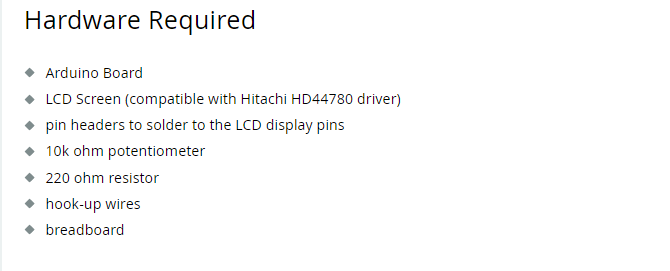

To write a article for the Arduino Documentation website, you should follow these guidelines:

# Structure

|Section|Rules|Description|Example|
|-------|-----|-----------|-------|
|**Frontmatter**|You must fill in title, description and author. The others are voluntary.|Here is where you add the metadata of your article. This is including the author, title of tutorial, compatible libraries, compatible hardware etc.||
|**Introduction**|This is an h2 heading.    You are not allowed to change the name of the heading.|The Introduction should be a maximum of three sentences long and be well descriptive of what the reader can expect of the article.||
|**Hardware & Software Needed**|This is an h2 heading.    You can modify the heading if your article only requires one of the two, either Hardware or Software.|Here you set the hardware and software you need to continue your tutorial. You are more than welcome to link the Arduino based software and hardware to the respective store or downloads page.||
|**Circuit/Schematic**|This is an h2 heading.    You are not allowed to change the name of the heading.|Here you add the circuits and/or schematics of your tutorial.|    |