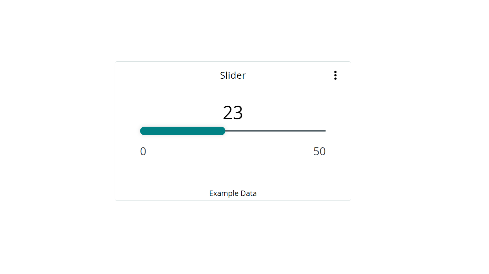
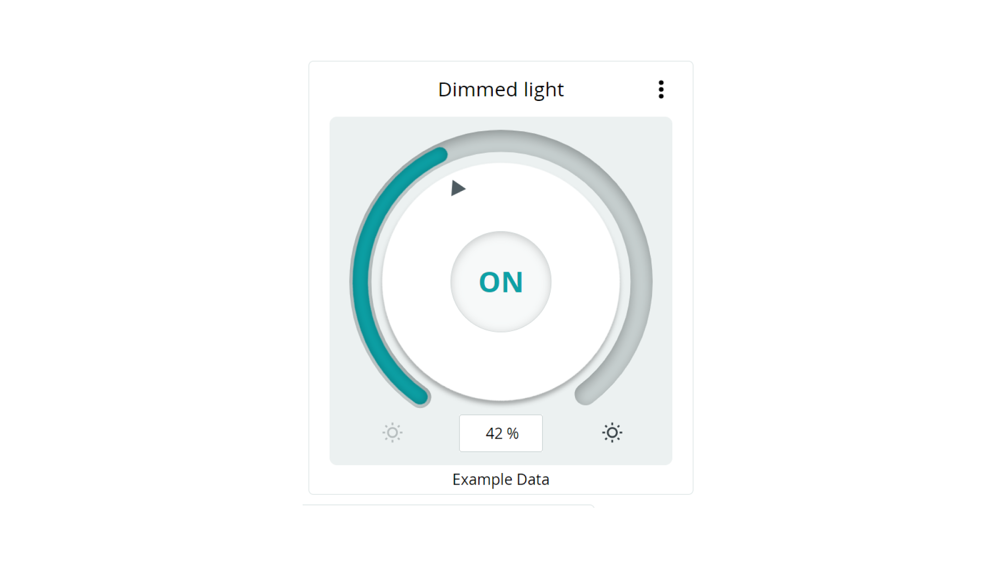

## Overview

Dashboards in the [Arduino Cloud](https://cloud.arduino.cc/home/) are used to easily monitor & control your Arduino board from a web interface. In this article, we will take a look at what a dashboard is, what widgets are, and learn how they interface with an Arduino board.

***If you are new to the Arduino Cloud, make sure you read the [Getting Started with the Arduino Cloud](/arduino-cloud/getting-started/iot-cloud-getting-started) article.***

### What is a Dashboard?


A dashboard consist of one or several **widgets** that are linked with your cloud variables. You can for example, set up a switch to turn on/off a light, a gauge that displays temperature, or a chart that shows data over time. 

Dashboards are not tied to one Thing, or one device, and it can be used to control and monitor several devices simultaneously. For example, you can have 10 devices monitoring temperature in different parts of the world, and the data displayed in one single dashboard. 

***Deleting dashboards / widgets does not impact the functionality of your Thing & device. This means that you can safely edit your dashboards & widgets while your device is streaming data.*** 

### What is a Widget?

Widgets are the building blocks of your dashboard, and can be used to either visualize data or to interact with your board. Widgets are linked to a single cloud variable, and as that variable updates, the widget will as well.

There are many different widgets available that fits different types of uses, such as:
- **Gauge** - displaying data in a "gauge" style.
- **Switch** - for switching a boolean, i.e. turning something on/off.
- **Map** - display the location of your Thing.
- **Messenger** - to display or send strings to your board.

Full list of widgets and how to use them are available in the [List of Widgets](#list-of-widgets) .

### Downloading Historical Data

Data that is streamed to a widget is also available for download. The data retention rate depends on your Arduino Cloud plan. For example, an **entry plan** has a data retention of 15 days. You can download it as an `.csv` file that can easily be used with Excel, Google Sheets etc. 

***Learn more about downloading data in the [Historical Data on the Arduino IoT Cloud](/arduino-cloud/features/iot-cloud-historical-data) tutorial.***


### Sharing Dashboards

It is possible to share your live dashboards with external people. To do so, please refer to the guide in the link below:

- [Sharing Dashboards in the Arduino IoT Cloud](/cloud/iot-cloud/tutorials/sharing-dashboards)

## List of Widgets

Below you will find a list of available widgets, and examples on how they are linked to a variable used in a sketch.

### Switch


The switch widget is great for simply turning something ON or OFF.

Can be linked with a **boolean** variable.

An example of how it is used in a sketch:

```arduino
if(switchVariable == true){
    digitalWrite(ledPin, HIGH);
}

else{
    digitalWrite(ledPin, LOW);
}
```

### Push Button


The push button widget is a virtual version of a push button. While pushed down, something is activated, and when released, it is de-activated.

Can be linked with a **boolean** variable.

An example of how it is used in a sketch:

```arduino
while(pushbuttonVariable == true){
    counter++
    delay(10);
}
```

### Slider



The slider widget can be used to adjust a value range. Great for changing the intensity of light, or the speed of a motor.

Can be linked with multiple variables, including **integers & floats.**

An example of how it is used in a sketch:

```arduino
analogWrite(ledPin, sliderVariable);
```

### Stepper


Similar to the slider, the stepper widget increases or decreases a variable by increments of 1. It can be used to switch between different modes.

Can be linked with multiple variables, including **integers & floats.**

An example of how it is used in a sketch:

```arduino
if(stepperVariable == 10){
    activateThisFunction();    
}

//activate another function
else if(stepperVariable == 11){
    activateAnotherFunction();
}

//or simply print out the updated value
Serial.println(stepperVariable);
```

### Time Picker


The time picker widget is used to represent and set a time and/or a date.

Can be linked with a **CloudTime** variable.

An example of how it is used in a sketch:

```
CloudTimeVariable = ArduinoCloud.getLocalTime();
```

In this example, the variable named `CloudTimeVariable` is populated with `ArduinoCloud.getLocalTime()` which returns the Unix time stamp (in seconds) of the local time zone.

### Messenger


The messenger widget can be used to send and receive strings through the messenger window.

Can be linked with a **String** variable.

An example of how it is used in a sketch:

```arduino
stringVariable = "This is a string";
```

It is possible to clear the messenger widget window directly from the sketch, by using:

```arduino
stringVariable = PropertyActions::CLEAR;
```

***For ArduinoIoTCloud library versions below `1.7`, you can use `stringVariable = "\x1b";` to clear the widget window.*** 

### Color


The color widget is great for selecting an exact color for an RGB light.

Can be linked with a **Color** variable.

An example of how it is used in a sketch:

```arduino
uint8_t r, g, b;
rgbVariable.getValue().getRGB(r, g, b);
```

### Dimmed Light



The dimmed light widget is great for changing the intensity of a light, and to be able to turn it ON and OFF as well.

Can be linked with a **Dimmed Light** variable.

An example of how it is used in a sketch:

```arduino
  //retrieve and map brightness value from cloud
  uint8_t brightness = map(dimmedVariable.getBrightness(), 0, 100, 0, 255);

  //then check if switch is on/off 
  if (dimmedVariable.getSwitch()) {
    analogWrite(6, brightness); //write brightness value to pin 6    
  }
  else{
    analogWrite(6, LOW); //turn off lamp completely
  }
```

### Colored light


The colored light widget is designed to set the color for a lamp, and can turn it ON and OFF as well.

Can be linked with a **Colored Light** variable.

An example of how it is used in a sketch:

```arduino
uint8_t r, g, b;
rgbVariable.getValue().getRGB(r, g, b);
```

### Value


The value widget is a simple one. It only reads, or writes values without any additional functionalities.

Can be linked with many different variables.

An example of how it is used in a sketch:

```arduino
valueVariable = analogRead(A0);
```

### Status


The status widget is great for checking the state of something: green is positive, red is negative!

Can be linked to a **boolean** variable.

An example of how it is used in a sketch:

```arduino
statusVariable = true;
//or
statusVariable = false;
```

### Gauge


The gauge widget is the go-to for any measurements that fit in a half circle. A great widget for building organized, professional dashboards.

Can be linked with multiple variables, including **integers & floats.**

An example of how it is used in a sketch:

```arduino
gaugeVariable = analogRead(A0);
```

### Percentage


Much like the gauge widget, the percentage widget displays percentage in a more visual way.

Can be linked with multiple variables, including **integers & floats.**

An example of how it is used in a sketch:

```arduino
percentageVariable = analogRead(A0);
```

### LED


The LED widget is a virtual LED that can signal the status of something. Can either be set to ON or OFF.

Can be linked with a **boolean** variable.

An example of how it is used in a sketch:

```arduino
ledVariable = true;
//or
ledVariable = false;
```

### Map


The map widget is a tool for keeping track on the location of your projects. This is a great tool for any project involving GPS, or to get an overview of where your Thing, or multiple Things are operating.

Can be linked with the **Location** variable.

An example of how it is used in a sketch:

```arduino
locationVariable = Location(51.5074, 0.1278);
```

### Chart


The chart widget is great for data analytics. It is used to track real time data, as well as tracking historical data. This widget can for example be used to track temperature changes, energy consumption and other sensor values. A chart widget can only be linked to one variable at a time.

An example of how it is used in a sketch:

```arduino
locationChart = analogRead(A0);
```