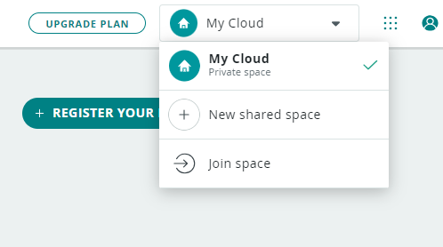
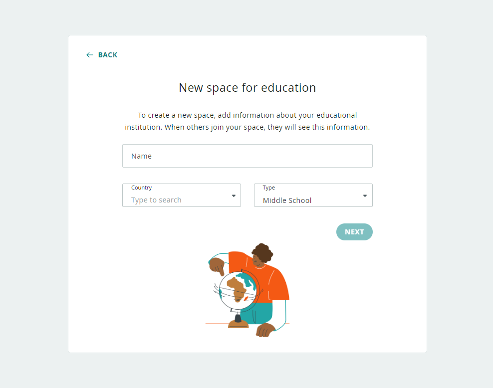
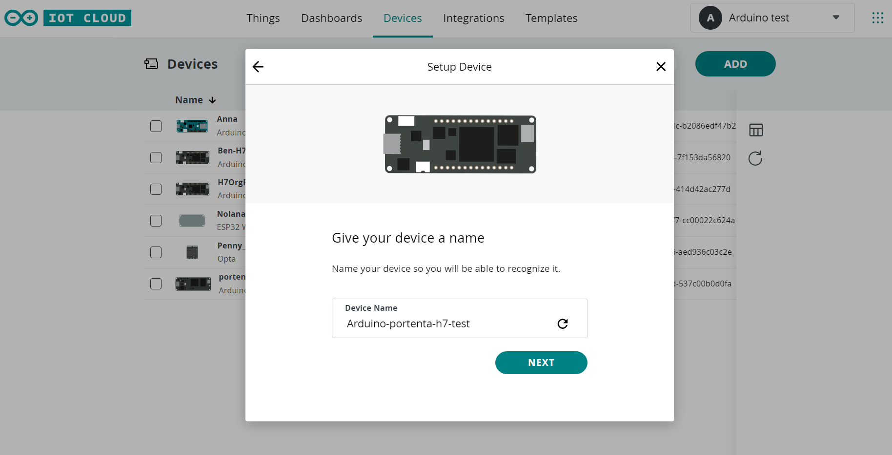
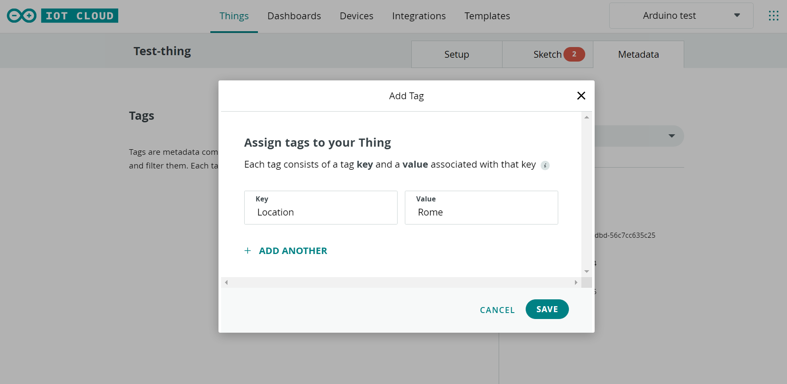
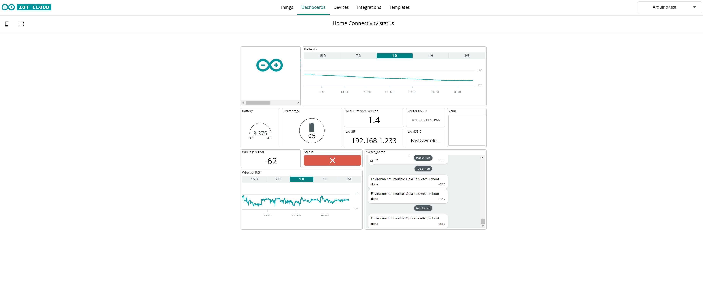
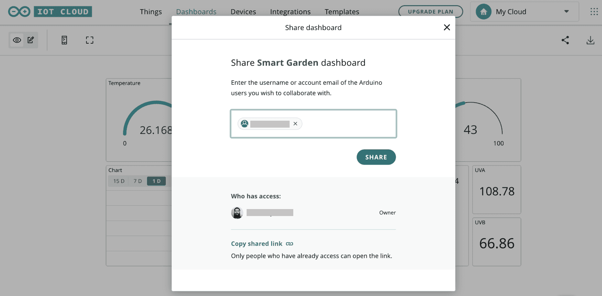
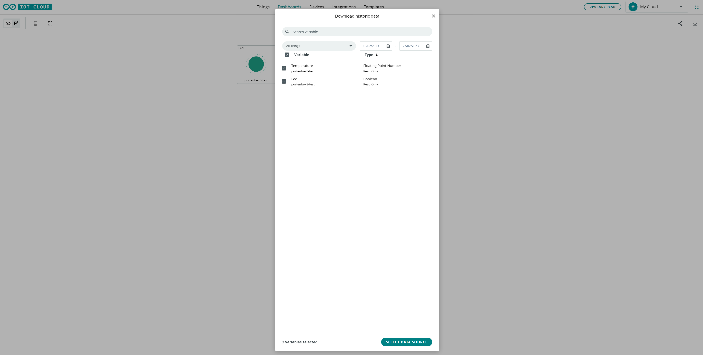
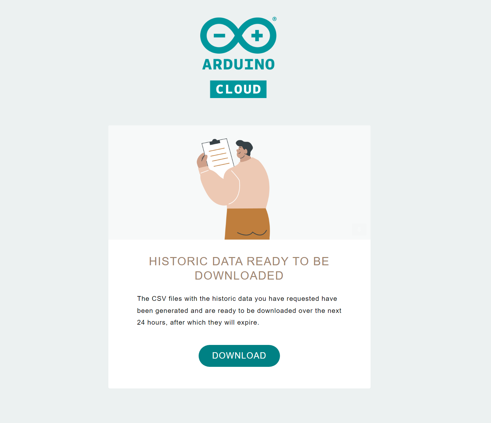

## Introduction

The [Arduino Cloud for Schools](https://cloud.arduino.cc/schools/) is a tool that provides an online space for teachers and students to:

* Work simultaneously on IoT projects
* Share sketches and dashboards with your classmates
* Add and manage students' access to online Arduino courses

In this article, you will get a general overview of the major features of the Arduino Cloud for Education.

## Required Software

* [Arduino Cloud ](https://cloud.arduino.cc/plans#school)

## How to create an account

In order to get started with Arduino Cloud, you need to [have an Arduino account](https://auth.arduino.cc/login.). An **Arduino account gives you full access to all Arduino websites, apps, and services**.

If you do not have an account yet, feel free to create a new one. You can follow [this tutorial](https://support.arduino.cc/hc/en-us/articles/360016724040-Create-an-Arduino-account) for a step by step explanation on how to do it.

The Arduino Cloud for Schools plan consists of **two main subscriptions**:

* **Free Plan** - 
* **School Plan** - 

## Free Plan

### Features

* Access to free [online courses](https://cloud.arduino.cc/home/courses) content
* Manage your Space, add/remove students and share courses

### Access to free online courses content

Once you've logged in, you are free to check out our free content in`Arduino Cloud > home > Courses`or click [here](https://cloud.arduino.cc/home/courses). 

 In this section you get access to several free online courses, for different ages groups and topics.

***With a School Plan you unlock access to extra online courses***

## Manage Your Spaces

In your Arduino Cloud free plan comes with two **spaces** by default:

* **My Cloud**. My Cloud is an *automatically* created private space once joined Arduino Cloud. You can use this space for personal projects you do not want to share with all your class. This space is free and includes **two Things**, unlimited dashboards, 100MB of Sketch storage, 1 day data retention by default.

* **New shared space**. A *Shared Space* is a space you can use with all your students. There is no limit in the number of members, who can all access the resources within its space.
* **Join Space** - copy paste here the space code that another admin or teacher shared with you to join their space.

### Create a shared space

Open the top-right space selection menu and click on *New shared space*.

Then you will be asked which type of Shared Space you want to create (i.e. For Business or For Education). Click on the type of your interest and **proceed with purchasing** a new plan.

Fill in additional information.

Congratulations! Now you own a Shared Space linked to your Arduino account.

### Switch Between Spaces

You can switch to other Shared Spaces at any time using the corresponding menu, which you can find at the top right-hand corner, and click on it.

## 

### Change Shared Space Settings

To change the current settings of your Shared Space, navigate to the **General Settings** tab using the sidebar.

### Invite Members Into Your Space

To add more members to your Shared Space, use the sidebar to navigate to the **Members** item under **Your space** group.

There you will find the complete list of all members who have access to your Shared Space, as well as the current role of each member.

#### Role types

There are [three role types](https://cloud.arduino.cc/home/roles-permissions) in Arduino Cloud for Schools: 

* Admin
* Teacher
* Students

By default the member who has activated the plan and created the workspace is set as *Admin*. It is possible to have multiple Admins with same permissions. The admin has full control of the rights/permissions each user has in the Shared Space:

The list of supported roles and corresponding permissions can be found here:

https://cloud.arduino.cc/home/roles-permissions

Important to remember are **Student role limitations:**

* They are not allowed to add new remembers to your School organization
* They are not allowed to assign members roles
* They are not allowed to view the Plan Management and Payment information

#### Add A New Member

To add a new member, click on **Add member** in the top right-hand corner.

The following page will appear to allow you to send an email invitation to all the members you would like to join your Space.

Type the email addresses of all your team and define which role they will cover in your Space based on the available options. Click on **Invite**.  
The users you added will get the invitation by email with a link to join your Shared Space. You are now ready to start working all together on your Arduino Cloud projects.

## Device Management

The Arduino Cloud for Business allows for device management with Over-The-Air updates, secure provisioning to connect boards leveraging their secure element, and easy verification of their status (connected, not connected) and maintenance.

### Compatible Hardware

The Arduino Cloud for Business is compatible with multiple Arduino boards or devices based on the ESP32 / ESP8266 microcontrollers. The Arduino Cloud currently supports devices connected via Wi-Fi®, Ethernet, LoRaWAN® (via The Things Network), and cellular connectivity.

To check the full list of compatible Hardware, have a look at [this tutorial](https://docs.arduino.cc/arduino-cloud/getting-started/iot-cloud-getting-started).

### Device Provisioning

Arduino Cloud allows you to securely provision your devices through two different tools:

* **Arduino IoT Cloud.** Arduino IoT Cloud is an App integrated into your Arduino Cloud Space, guaranteeing straightforward provisioning of Arduino or other Cloud-compatible devices. It is provided with a dedicated User Interface which will guide you step-by-step during the onboarding process. This is a great choice in case you need to provision a few devices or you are not an advanced user.
* **Arduino Cloud CLI.** As explained in [this section](#arduino-cloud-cli), Arduino has developed a command line tool enabling the access of all Arduino IoT Cloud features from a terminal window. Arduino Cloud CLI is the right choice when you need to provision multiple devices at the same time and you are an advanced user.

#### Device Provisioning With Arduino IoT Cloud

If your device is compatible with Arduino Cloud, you can start provisioning it into your Shared Space by connecting it to your computer through a USB cable.

In addition, Arduino IoT Cloud requires your computer to have the [Arduino Create Agent installed](https://create.arduino.cc/getting-started/plugin/welcome).

When you are all set up correctly, you can click on **Arduino IoT Cloud** button in your Shared Space.

Go to the **Devices** tab, click on **Add** and decide which type of device you would like to onboard. In this case, a Portenta H7 board will be used.

The agent will start looking for your board. When your board has been found, the following screen will appear. Click on **Configure**.

Select a board name to be able to correctly identify your device and click on **Next**.  

Define the connection type you want to use with your board and click on **Next.** The agent will start securely provisioning your device by leveraging the secure element embedded in your board. This way, your security keys will be stored in the secure element and full data encryption will be guaranteed during data exchanges between Arduino devices and the Cloud.

***If you want to learn more about security in Arduino Cloud, please check the [dedicated documentation](https://docs.arduino.cc/arduino-cloud/features/security-considerations).***

If the onboarding proceeds as expected, the following page will appear confirming that your device has been successfully provisioned in Arduino Cloud.

You can now check its status under the Devices section. This section displays the name, status, and linked Things for each of the configured devices. Clicking on the device allows for renaming it, as well as accessing more information about the device, such as its ID number, type, FQBN, serial number, firmware version, linked Thing, latest activity, and the date when the device was added.

The device status indicates whether it is connected to the Arduino IoT Cloud (online), or not connected (offline).

#### Device Provisioning With Arduino Cloud CLI

If you need to provision more than one device at a time or you prefer to work through your terminal window, we have the right tool for you: [Arduino Cloud CLI](https://github.com/arduino/arduino-cloud-cli).

To proceed with the onboarding, check [this tutorial](https://docs.arduino.cc/arduino-cloud/getting-started/arduino-cloud-cli). It will explain to you all the required steps to provision your board through your terminal.

### Assign A Thing To Your Device

As already said, once a device is successfully configured, it appears in the "Devices" list and can be used to create a Thing, or can be linked to an existing Thing.

To use your devices in IoT Cloud, you need to associate a Thing with each of them. A Thing is the digital twin of your device, holding the configuration of some variables and other settings, as well as the history of the data collected for those variables.

To create a Thing, click on **Create Thing** next to the device of your interest, and your Thing will be automatically created for you. At this point, you can start updating it.

***If you want to understand how to work with your Things, check the dedicated documentation available [here](https://docs.arduino.cc/arduino-cloud/getting-started/iot-cloud-getting-started#3-creating-a-thing).***

***Do you want to learn more about the different types of Variables and their features? Have a look at [this tutorial](https://docs.arduino.cc/arduino-cloud/getting-started/cloud-variables).***

### Device Programming

It is now time to start uploading sketches on your devices.

The Arduino Cloud has a feature capable of creating some pre-built sections of the sketch related to a Thing, including some libraries necessary to interact with the cloud variables, as well as directly populating and updating the sketch once the new cloud variables are created and defined.

The sketch related to the thing is visible from the tab "Sketch" next to the "Setup" view, where the Thing's list of cloud variables is shown.

From this sketch view, by clicking the "Open full editor button", it is fast and smooth to access the Arduino Cloud integrated [Web Editor](https://docs.arduino.cc/learn/starting-guide/the-arduino-web-editor), which allows you to program your boards from any browser and use the latest Arduino IDE features and libraries without having to install any software locally.

Otherwise, to open the Web Editor to directly retrieve your sketches, go to Arduino Cloud Home and click on the [Web Editor](https://create.arduino.cc/editor) button.

***To get started with the Web Editor, check the dedicated tutorial at [this link](https://docs.arduino.cc/arduino-cloud/getting-started/getting-started-web-editor). However, if you have already developed your sketch and you would like to import it into the Web Editor, see the corresponding documentation [here](https://docs.arduino.cc/arduino-cloud/tutorials/import-your-sketchbook-and-libraries-to-the-web-editor)***

All the created sketches are individual and owned by the user that created them. Other members of the Shared Space can access your sketch in their Web Editor only if you share it with them. If you would like to do so, have a look at [this tutorial](https://docs.arduino.cc/arduino-cloud/tutorials/share-your-sketches) on how to do it.

Keep in mind that your sketch may contain some sensitive data that you do not want to share with other members, like Wi-Fi® credentials or API keys. If this is the case, check [this tutorial](https://docs.arduino.cc/arduino-cloud/tutorials/store-your-sensitive-data-safely-when-sharing) to learn how to share sketches without sharing sensitive data.

### OTA Updates

Arduino Cloud for Business integrates an amazing feature: Over-The-Air updates. This feature allows you to upload sketches wirelessly to your Arduino boards. This way, as soon as you have a compatible board connected to a Wi-Fi®/Ethernet network and configured to work with OTA, you will not need to physically connect the board to your computer to upload new sketches to it; instead, everything will work Over-The-Air, even from remote.

***Are you interested in learning how to perform an OTA update? Check [this tutorial](https://docs.arduino.cc/arduino-cloud/features/ota-getting-started#how-does-it-work). If you prefer to use the Arduino Cloud CLI instead, go to [this link](https://docs.arduino.cc/arduino-cloud/getting-started/arduino-cloud-cli#ota-over-the-air).***

## Fleet Management

Now it is time for you to start managing your fleet of devices/Things. The Arduino Cloud for Business fleet management features allow you to filter your devices/Things by status, add tags to more efficiently identify your projects, search between boards, and list and order them.

Get started with this awesome feature by going to **Things** or **Devices** tab in [Arduino IoT Cloud](https://create.arduino.cc/iot/devices) and start searching and filtering among your Things/devices.

If you want to create your tag, which you can use as a filtering option, go to **Things** tab, click on the Thing you would like to tag and go to the Metadata tab as shown in the figure below.

.

Click on **Add**. You will be asked to customize your tag through two fields:

* **Key**. The Key is the filter name which you will see among the list of available filtering options. E.g. Location.
* **Value**. The Value corresponds to the specific value your tag has for that specific Thing. E.g. Rome.

You can add an unlimited number of tags to each Thing.

At this point, you can go back to the Things tab and start filtering your Things according to the new tag you have just created.

## Dashboards

***If you want to learn more on how to customize your dashboard and leverage the wide widget portfolio, check the dedicated documentation available at [this link](https://docs.arduino.cc/arduino-cloud/getting-started/dashboard-widgets).***

### Sharing Dashboards

You can check [this tutorial](https://docs.arduino.cc/arduino-cloud/features/sharing-dashboards) 

### Data Export

Arduino Cloud for Business allows any user to download historical data from Arduino IoT Cloud Things and Variables. The data are downloaded in **.csv** format to be ready for further evaluation or manipulation.

The Arduino Cloud for Business plan includes 1-year of data retention by default; this means that your data will be available and downloadable from your Arduino Cloud account for 1 year.

To start exporting your data locally, navigate into one of your dashboards on the [Arduino IoT Cloud](https://create.arduino.cc/iot/dashboards). While inside a dashboard, press the Download icon in the upper right corner. This will open a new window that will allow you to select which historical data you would like to download.

From here you can select all the variables you want to download by checking the boxes as well as the time frame you are interested in.

When you have selected the data, click on the **Select Data Source** button.

At this point, click on **Get data** to receive your data by email.

You will get an email like the one below with a link allowing you to download all your data.

You are now ready to monitor and manipulate all your Cloud data.

## Arduino Cloud API

Some of

Use Arduino IoT Cloud back-end to control Things and devices via Arduino rest APIs in [Javascript](https://www.npmjs.com/package/@arduino/arduino-iot-client), [Python](https://pypi.org/project/arduino-iot-client/), or [Go](https://github.com/arduino/iot-client-go). With Arduino rest APIs, you will be able to manage up to 10 requests per second, guaranteeing stable data sharing.

Leveraging the APIs, you can interact with any element of the Cloud: data, devices, dashboards, and web properties. At the same time, APIs allow you to add power to the script, create complex scenarios or send and receive data from your custom service, 3rd party solution, or mobile application.

To use the APIs, you need to create an API Key Token in the API Keys section of your Space.

If you want to start creating your own API Keys Token, take a look at [this tutorial](https://docs.arduino.cc/arduino-cloud/getting-started/arduino-iot-api) and [this documentation](https://www.arduino.cc/reference/en/iot/api/).

## IoT Cloud App

Monitor your dashboards anywhere, anytime, and use your dashboards on the go with the free IoT Remote App.

To start exploring it, you will need to download it from either [Google Play Store](https://play.google.com/store/apps/details?id=cc.arduino.cloudiot&hl=en&gl=US) or the [Apple App Store](https://apps.apple.com/us/app/arduino-iot-cloud-remote/id1514358431) depending on your device.

***Do you want to get started with IoT Remote App? Read [this tutorial](https://docs.arduino.cc/arduino-cloud/tutorials/iot-remote-phone-sensors#phone-setup).***

### Machine Learning Tools Enterprise

Build and train professional-grade predictive models with just a few lines of code through this dedicated add-on, powered by [Edge Impulse®](https://www.edgeimpulse.com/). Deploy premade models out of the box to quickly develop your machine learning projects, starting from object detection, and machine vision to audio segmentation.

***If you are interested in learning more about this add-on, have a look at [this documentation](https://cloud.arduino.cc/machine-learning-tools). Otherwise, we have plenty of tutorials already using Machine Learning Tools. Check if your device is compatible with it in the board documentation available [here](https://docs.arduino.cc/).***

### Junior Account

School Plan is not available for minor users. If your students are **under the age of 14** need parental consent to sign up for an Arduino account. We recommend to read [this tutorial](https://support.arduino.cc/hc/en-us/articles/360022234360) to learn how to manage a Junior account. However, Arduino provides [several solutions for middle school](https://www.arduino.cc/education/middle-school/) students.

## Additional Tutorials

You can find more tutorials on the [Arduino IoT Cloud documentation page](https://docs.arduino.cc/arduino-cloud/).

## Support

S

