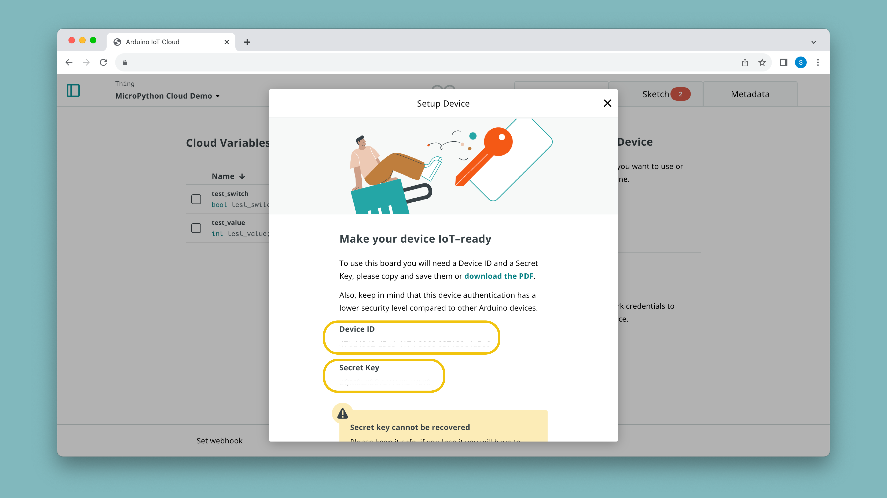
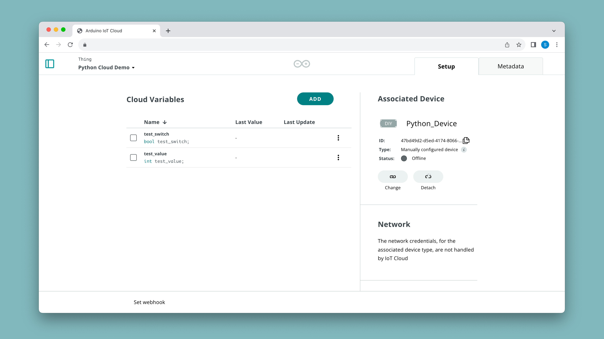
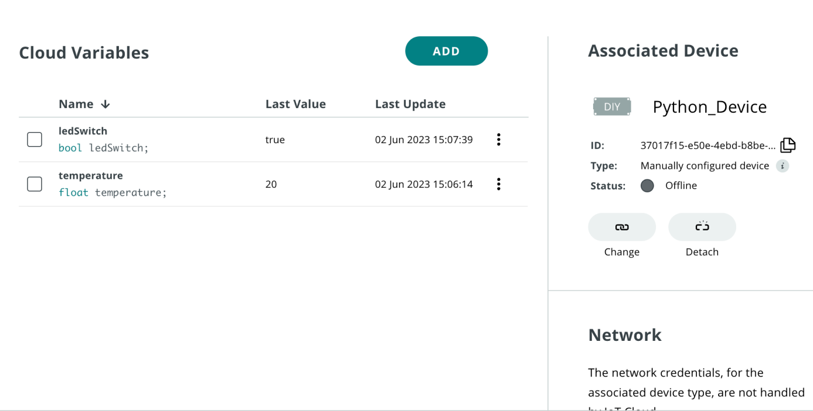

***It is recommended to have some experience with the Python environment before reading this guide. However, installation and setup is covered in the [Python Setup](#python-setup) section.***

The [Arduino IoT Cloud Python Client](https://pypi.org/project/arduino-iot-cloud/) is a library that allows you to interact with the Arduino Cloud via MQTT. It supports basic authentication using the **device ID** as well as **secret key** that is obtained from the Arduino Cloud when configuring a manual device.


## Overview

In this guide we will:
- Configure a manual device in the Arduino Cloud,
- install the Arduino IoT Cloud Python library,
- write a Python script that connects to the Arduino Cloud. 

## Requirements

To follow this guide, make sure to have:

- An [Arduino account](https://login.arduino.cc/login),
- a version of [Python](https://www.python.org/downloads/) installed,
- [pip](https://packaging.python.org/en/latest/tutorials/installing-packages/) package manager installed,
- [Arduino IoT Python Client](https://pypi.org/project/arduino-iot-client/) installed.
- A code editor (we recommend [VSCode](https://code.visualstudio.com/) with the Python extension installed).

***The experience with Python and the pip package manager varies depending on your computer and operating system. Python needs to be in your PATH to use the Arduino IoT Cloud Python client.***

## Cloud Setup

To begin with, we need to create a manual device, and create a new [Thing](/arduino-cloud/cloud-interface/things). Navigate to the [Arduino Cloud](https://app.arduino.cc/) and to the **"Things"** tab.

### Thing & Device Configuration

1. Create a new Thing, by clicking on the **"Create Thing"** button.
2. Click on the **"Select Device"** in the **"Associated Devices"** section of your Thing.
3. Click on **"Set Up New Device"**, and select the bottom category (**"Manual Device"**). Click continue in the next window, and choose a name for your device.
4. Finally, you will see a new **Device ID** and a **Secret Key** generate. You can download them as a PDF. Make sure to save it as you cannot access your Secret Key again.



- Learn more about Things in the [Things documentation](/arduino-cloud/cloud-interface/things)
- Learn more about Devices in the [Devices documentation](/arduino-cloud/hardware/devices)

### Create Variables

Next step is to create some cloud variables, which we will later interact with via a Python script.

1. While in Thing configuration, click on **"Add Variable"** which will open a new window.
2. Name your variable `test_switch` and select it to be of an `boolean` type.
3. Click on **"Add Variable"** at the bottom of the window.
4. Create another variable, name it `test_value` and select it to be `int` type.

You should now have **two variables**, `test_switch` and `test_value`. It is important that they are named exactly like this, as we will be using them in the example script of this guide.



- Learn more about how variables work in the [Variables documentation](/arduino-cloud/cloud-interface/variables)

***Variables that we create here can also be synchronized with variables running on any other device in the platform. This makes it possible to link an Arduino boards with a Python or JavaScript project without writing any connection code!*** 

## Python Setup

Before continuing, make sure you have a version of [Python](https://www.python.org/downloads/) installed. You can check this by opening a terminal and running:

```
python --version
python3 --version
```

### Install Packages

To install the Arduino IoT Cloud Python client, run the following command:

```
pip install arduino-iot-cloud
```

You will also need to install the [swig](https://pypi.org/project/swig/) package.

```
pip install swig
```

To test out to see if your installation worked correctly, start the Python interpreter in your terminal by typing `python`, once running, test out this command:

```python
from arduino_iot_cloud import ArduinoCloudClient
```

If you don't receive any import error, it means it is accessible and we can move on to testing out the example script.

### Example Script

The script below creates a client that connects to the Arduino Cloud and synchronizes the variable values. Make sure to enter your device credentials (see [Cloud Setup](#cloud-setup)) in the `DEVICE_ID` and `SECRET_KEY` variables.

Create a python file, and name it something appropriate, such as `cloud_first_test.py`, and copy the contents of the code snippet below into it.

```python
import time
import logging

import sys
sys.path.append("lib")

from arduino_iot_cloud import ArduinoCloudClient

DEVICE_ID = b"YOUR_DEVICE_ID"
SECRET_KEY = b"YOUR_SECRET_KEY"

def logging_func():
    logging.basicConfig(
        datefmt="%H:%M:%S",
        format="%(asctime)s.%(msecs)03d %(message)s",
        level=logging.INFO,
    )   

# This function is executed each time the "ledSwitch" variable changes 
def on_switch_changed(client, value):
    print("Switch Pressed! Status is: ", value)

if __name__ == "__main__":

    logging_func()
    client = ArduinoCloudClient(device_id=DEVICE_ID, username=DEVICE_ID, password=SECRET_KEY)

    client.register("temperature")  
    client["temperature"] = 20
    client.register("ledSwitch", value=None, on_write=on_switch_changed)
    
    client.start()
```

- The script uses the `client.register()` to configure the variables. 
- The `test_value` we simply set a static value of `20`.
- For the `test_switch` variable, we create a callback function that is triggered any time the value is updated. This can be controlled from a dashboard in the Arduino Cloud.

To run this script, use the following command (or the "Run" button in VSCode):

```python
python cloud_first_test.py
```

After running the script, you should see in the terminal that we first attempt to connect to the Arduino Cloud. Once connected, we push the variable update for `test_value`. You should now see this value updated in the Thing interface in the Arduino Cloud.



You can test out the `test_switch` variable by creating a dashboard in the Arduino Cloud with a switch widget linked to the variable. 

When flicking the switch, you should see the following command being printed in the terminal:

```
Switch Pressed! Status is <state>
```

For creating dashboards and linking variables, check out the [Dashboard & Widgets documentation](/arduino-cloud/cloud-interface/dashboard-widgets).

### Troubleshooting

- `command not found: python` - encountering this error when running a script indicates that the terminal can't access Python. You can try running `python3`, as some versions of Python requires this.
- `Connection failed 5, retrying after 1.0s` - this error is likely due to an invalid **device ID** or **secret key**.
- `ModuleNotFoundError: No module named '_m2crypto'` - likely if you are running an older version of the library. Try updating the library.
