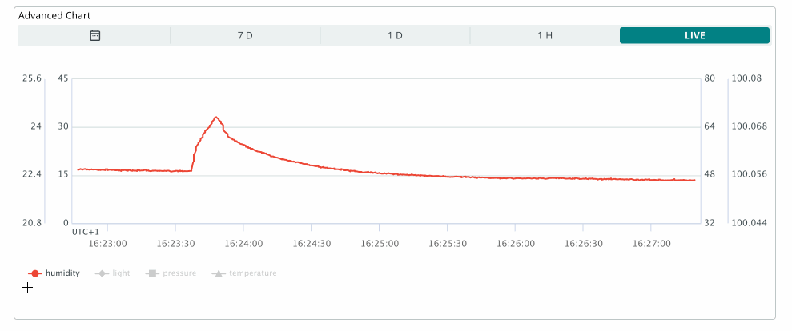

## Overview

The **advanced chart widget** is used to display the data from several IoT Cloud variables in a single chart. You can track the data in both real time, or select from a specific time period.

This widget can very easily be added onto existing projects (if you are already tracking data), and is particularly interesting to use in projects such as:
- Weather station
- Environmental data
- Energy consumption
- Various science projects where data comparison is needed

What is particularly interesting is that this new widget can use variables from **multiple things.** So you can monitor data from various devices and plot it all in one place. 

For example, you could set up a series of sensors around a city, and measure the CO2 emissions from your phone or laptop! 

## Hardware & Software Needed

- [Arduino IoT Cloud](https://create.arduino.cc/iot/).
- Cloud compatible boards, [see full list](https://docs.arduino.cc/arduino-cloud/getting-started/iot-cloud-getting-started#compatible-hardware).

***In this tutorial, we use the [MKR WiFi 1010]() and [MKR ENV Shield]() for environmental values. This is not a requirement, you can use any board for this tutorial.***

## Setup & Configuration

To use the advanced widget, you will need to set up a Thing and some variables that you want to track. We choose to set up and track:
- `temperature`
- `humidity`
- `pressure`
- `light`

***If you are unfamiliar with how to set up a Thing and variables, head on over to the [Getting Started with the Arduino IoT Cloud](/arduino-cloud/getting-started/iot-cloud-getting-started) article.***

**1.** Head on over to the **"Dashboards"** in the Arduino IoT Cloud, and create a new dashboard (or use an existing dashboard).

**2.** Add a new **"Advanced Chart Widget"**, selecting it from the list of available widgets. 

**3.** Link the variables you want to compare. In this case, we are using `temperature`, `humidity`, `pressure` and `light`.

>You can use up to a maximum of 5 variables.

**4.** After selection, your variables will appear in the right panel, with a number of configuration options. You can for example choose how each data point will be represented (line, spline, spline area, line area and bar). 

**5.** Click on **"Done"** when finished selecting the variables. If your board is connected and is sending data to the cloud, you will see the widget's data update frequently.

## Usage

With the widget set up, let's explore some cool features.

### Toggle Variables

You can enable or disable to variables you want to display by simply clicking the name of the variable.

