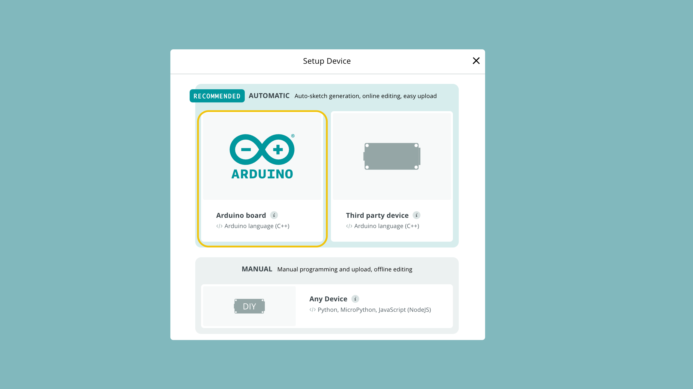

A number of official Arduino boards supports connection to the Arduino Cloud via Wi-Fi®. Some boards also have an onboard crypto chip that stores the credentials automatically when configuring the device.

There are currently two ways of configuring a Wi-Fi® board:
- By configuring an onboard crypto chip (available for a number of official Arduino boards only),
- through a Secret Key / API key (ESP32/ESP8266 based boards\*)

***\*Note that the [UNO R4 WiFi](https://store.arduino.cc/products/uno-r4-wifi) and [Nano ESP32](https://store.arduino.cc/products/nano-esp32) boards uses this method.***

## Supported Boards

Connection via Wi-Fi® is an easy alternative, and your credentials can safely be entered during the configuration of a project. This type of connection is most suitable for low-range projects, where you connect your board to the cloud via your home/work/school network router.

### Crypto Chip Boards

The following boards connect to the Arduino Cloud via Wi-Fi®, using the onboard encryption:

- [MKR WiFi 1010](https://store.arduino.cc/arduino-mkr-wifi-1010)
- [Nano RP2040 Connect](https://store.arduino.cc/nano-rp2040-connect)
- [Nano 33 IoT](https://store.arduino.cc/arduino-nano-33-iot)
- [GIGA R1 WiFi](https://store.arduino.cc/products/giga-r1-wifi)
- [Portenta H7](https://store.arduino.cc/portenta-h7)
- [Portenta H7 Lite Connected](https://store.arduino.cc/products/portenta-h7-lite-connected)
- [Portenta Machine Control](https://store.arduino.cc/products/arduino-portenta-machine-control)
- [Nicla Vision](https://store.arduino.cc/products/nicla-vision)
- [Opta](https://docs.arduino.cc/hardware/opta).

### ESP32 / ESP8266

The following official boards connect to the Arduino Cloud via a Secret Key / API key:

- [UNO R4 WiFi](https://store.arduino.cc/products/uno-r4-wifi)
- [Nano ESP32](https://store.arduino.cc/products/nano-esp32)

A large number of third party boards are also supported, which you will see during the configuration.

## Configure a Wi-Fi® Board

To configure a Wi-Fi® board, follow the steps below:

**1.** Connect your board to your computer.

**2.** Go to [Arduino Cloud](app.arduino.cc), and navigate to the **"Devices"** section. Click on the **"Add Device"** button and then select the **"Arduino Board"**. After a while, your board will be visible, and you can click on the **"Configure"** button.

**3.** Allow some time for the configuration, as a sketch is being uploaded to your board as well as a configuration of your crypto chip is ongoing. 

***Please note: ESP32 & ESP8266 based boards does not have a crypto chip, and the configuration will be instant. Instead, you will receive a `Device ID` and `Secret Key`, that you can either download as a PDF or manually save. This will be needed. later on, so make sure to save the information.***

Your board is now configured and ready to be used in the Arduino Cloud. 

To get started, check out the official [Getting Started (Arduino / C++)](/arduino-cloud/guides/arduino-c) guide. This will guide you to successfully send data between your board and Arduino Cloud.

## Supported Frequencies

All official Arduino boards currently only supports the 2.4GHz frequency band for transmitting data.