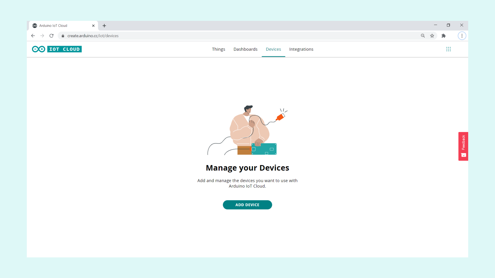
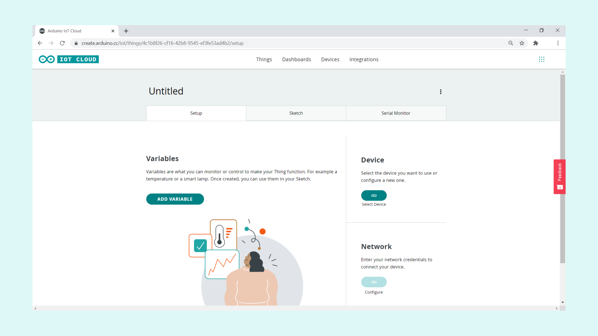

## Introduction

In this tutorial, we will combine the functionality of the [MKR WiFi 1010](https://store.arduino.cc/mkr-wifi-1010) and the [MKR ENV Shield](https://store.arduino.cc/arduino-mkr-env-shield). The shield, mounted on top of the board, will record environmental data, such as temperature, humidity, pressure and illuminance. This data will be synced with the [Arduino IoT Cloud](https://create.arduino.cc/iot/), a service that allows us to remotely control and monitor our devices. 

This means that whenever we read data on the board, it will also be visible in the cloud dashboard, where we can create different ways of visualizing the data.

>**Note:** Newer versions of the MKR ENV Shield does not have the UV sensor component. You can read more about the different versions in [this Arduino Help Center article](https://support.arduino.cc/hc/en-us/articles/360019197540-Different-MKR-ENV-Shield-versions).

## Goals

The goals of this project are:

- Configure the Arduino IoT Cloud.
- Create a program to read the sensors on the MKR ENV shield.
- Read the data live in the Cloud dashboard.

## Hardware & Software needed

- [Arduino IoT Cloud](https://create.arduino.cc/iot/).
- [Arduino MKR WiFi 1010](https://store.arduino.cc/mkr-wifi-1010).
- [Arduino MKR ENV Shield](https://store.arduino.cc/arduino-mkr-env-shield).
- [Arduino_MKRENV](https://www.arduino.cc/en/Reference/ArduinoMKRENV) library.

## Circuit


## Configuring the IoT Cloud

The first step in this tutorial is to navigate to the [Arduino IoT Cloud](https://create.arduino.cc/iot/). If you are not logged in, or do not have an account, you will be re-directed to the login page. Here you can create a new account or log in to an existing one.

### Configure a new device

Once we are in the Arduino IoT Cloud, we will need to click on the **"Devices"** tab. This will open a new page which will ask you to add a new device. Click on the **"Add device"** button.



You will now have an option of either configuring a new Arduino device, or a third party device. Select the **"Set up an Arduino device** option.


At this point, you will need to connect your cloud compatible board to your computer. You will also need to have installed the Create plugin. If if it is not installed, the set up wizard will ask you to install it. Your device should now show up, and you will need to click on the **"Configure"**
button. 


You will now be asked to name your device. In this case, a name was randomly generated, which is **Phil**. Click on **"Next"** to proceed.


After clicking on next, the board will start to configure. This process may take a few minutes. 


Once it is done, we will be directed to the devices page, where we can see our device. Congratulations, you have just made your first device IoT ready!


### Creating a Thing and linking your device

After our device is configured, we can move on to the next step: creating our very first Thing. Click on the **"Things"** tab. You should now see a button that says **"Create thing"**, which we will need to click.


We will now see an interface with multiple options. This is your Thing configuration overview. Here we can select what network we are connecting to, what device we are using and create variables that we want to sync.



Let's start by linking our freshly configured device, by clicking on the **"Select Device"** button to the right. This will open up a window, where we can **"Associate"** the board with this Thing.


### Creating variables

Now, we can continue to create variables for our Thing. These variables will be synced with the cloud, as long as the board is connected to Internet and the cloud. 

To create variables, simply click on the **"Add variable"** button. This will open up a new window.


Here, we will name our variable `temperature` and choose the data type `float`. Click **"Add variable"** at the bottom to add it.


Now, we need to add the rest of the variables in a very similar fashion, but changing the name. The variables that we need to add can be seen in the table below:

| Name        | Data type |
| ----------- | --------- |
| humidity    | float     |
| illuminance | float     |
| pressure    | float     |
| **uva**\*       | float     |
| **uvb**\*       | float     |
| **uvIndex**\*   | float     |

>**Note:** the `uva`, `uvb` and `uvIndex` variables will only work with the MKR ENV Shield v1. Newer versions does not have the UV sensor. If you have a newer version, do not add these variables. You can read more about the different versions in the this [Arduino Help Center article](https://support.arduino.cc/hc/en-us/articles/360019197540-Different-MKR-ENV-Shield-versions).

When we have added these, the variable list will look something like this:


Now as a final part of the configuration, we just need to add our network details. Click on the button in the **Network** section, and enter your credentials to your Wi-Fi network.


## Creating the program

Now, the final thing needed is the actual program that will run on the MKR 1010 board. We can edit the program directly in the Arduino IoT Cloud, by clicking on the **"Sketch"** tab. This will open up the built-in editor, where we can write the program directly.


For the program, we will need to include the **Arduino_MKRENV** library, which is used to read all the sensors. Below is the code that will allow us to do so, and you can see that the variables in the code is identical to the ones we just created.

Copy and paste the code below, and upload the program to the board, by clicking the upload button at the top of the editor.

>**Note:** Newer versions of the MKR ENV Shield does not have the UV sensor component. You will need to remove the `ENV.readUVA()`, `ENV.readUVB()` and `ENV.readUVIndex()` functions in the program if you have a newer version.

```arduino
#include "thingProperties.h"
#include <Arduino_MKRENV.h>

void setup() {
  // Initialize serial and wait for port to open:
  Serial.begin(9600);
  
  while(!Serial);
  // This delay gives the chance to wait for a Serial Monitor without blocking if none is found
  delay(1500); 

  // Defined in thingProperties.h
  initProperties();

  // Connect to Arduino IoT Cloud
  ArduinoCloud.begin(ArduinoIoTPreferredConnection);
  
  /*
     The following function allows you to obtain more information
     related to the state of network and IoT Cloud connection and errors
     the higher number the more granular information you’ll get.
     The default is 0 (only errors).
     Maximum is 4
 */
  setDebugMessageLevel(2);
  ArduinoCloud.printDebugInfo();
  
    if (!ENV.begin()) {
    Serial.println("Failed to initialize MKR ENV shield!");
    while (1);
  }
  
}

void loop() {
  ArduinoCloud.update();
  // Your code here 
  temperature = ENV.readTemperature();
  humidity    = ENV.readHumidity();
  pressure    = ENV.readPressure();
  illuminance = ENV.readIlluminance();
  uva         = ENV.readUVA(); //comment out if using a newer version of the ENV shield
  uvb         = ENV.readUVB(); //comment out if using a newer version of the ENV shield
  uvIndex     = ENV.readUVIndex(); //comment out if using a newer version of the ENV shield
}
```

Once the code has been uploaded, open the Serial Monitor (tab next to sketch) to initialize the program. If everything went well, it should like the image below:


The most important thing is that the two following commands are printed:

```
Connected to "Network"
Connect to the Arduino IoT Cloud
```
### Over the Air Uploads

Did you know that the Arduino IoT Cloud supports over the air uploads? When you've uploaded a sketch to your board once, it will become available for you to upload a new sketch to the board without connecting it to your computer!

***Over the Air uploads requires an Entry plan to the Arduino IoT Cloud***

To use this feature, make sure the board has power. If your project is already sitting somewhere in your house, as long as it's powered on, you should be able to upload to it. navigate to the Things sketch tab in the Arduino IoT Cloud interface, and you should see it being discovered just as if it was connected via USB.

## Building a dashboard

Once we have confirmed that the board is connected to the cloud, the last step is to build the dashboard that we can monitor the environmental data in. Click on the **"Dashboards"** tab, which will take you to the dashboards page. Here, we need to click on the **"Build Dashboard"** button.


We will now see an empty dashboard, where we are now going to create something called **widgets**. Widgets are the visual representation of our variables. There's two ways of creating widgets: either we add them one by one, and link them manually, or we can add and link **them all at once**. To save some time, let's do that! 

Simply click on the **"Add"** button, and a dropdown menu will appear. Here we will click on **"Things"**, and select the Thing that appears here. 


In this case, we changed the name to **Environmental Data**, but whatever you name your thing will appear here. By clicking on it, it gives you a list of variables with a checkpoint, and we can simply click **"Create widgets"**


All new widgets will now appear here, and when the board is connected to the cload, it will continue to update these values. 


Congratulations! You can now view your real time data directly in the dashboard.

## Conclusion

In this tutorial, we demonstrated simply how a MKR WiFi 1010, a MKR ENV Shield and the Arduino IoT Cloud is used to create a simple IoT application. This, without having to connect a single wire, or create a difficult program: the cloud takes care of all of that. 

You can now start thinking about how this application might work in real life. There are a lot of different things you can add to it, such as wind sensors (anemometers), rain sensors, CO2 sensors and much more. With some easy connections, you can build anything you want to, connect it to the cloud and view all the data live from anywhere in the world!

### More tutorials

You can find more tutorials in the [Arduino IoT Cloud documentation page](/arduino-cloud/).
