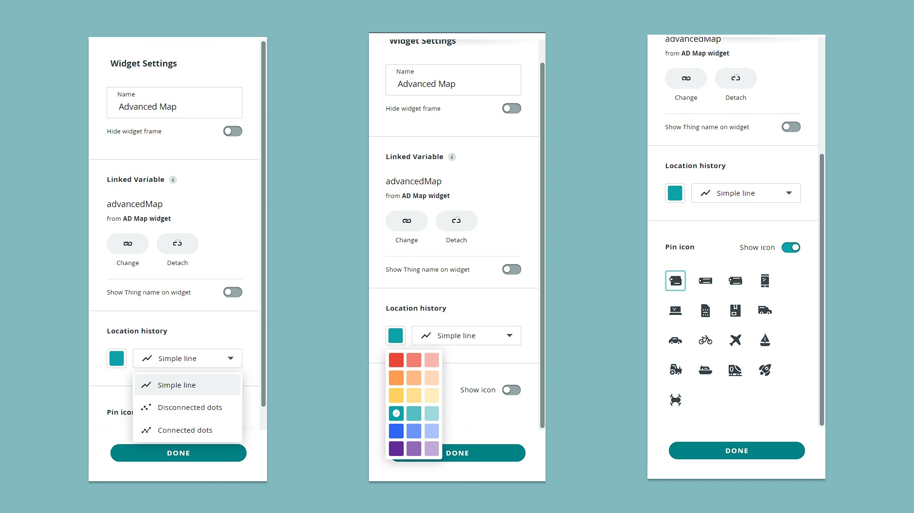

The **advanced map widget** is used to track the location of a cloud Thing and draw a path between the different logged points. You can track the data in both real time, select from a specific time period while selecting the variables you want to display.


This widget can be added onto existing projects (if you are already tracking location), and is particularly interesting to use in projects such as:
- Weather stations,
- Environmental data stations,
- Various science projects where location tracking is needed.

This widget can use variables from **different Things**, so you can monitor data from various devices and plot it all in one place. 

For example, you could set up a series of sensors around a city, and measure the CO2 emissions from your phone or laptop in a single chart!

## Hardware & Software Needed

- [Arduino Cloud](https://app.arduino.cc/).
- Cloud compatible boards, [see full list](https://docs.arduino.cc/arduino-cloud/guides/overview#compatible-hardware).

## Setup & Configuration

To use the advanced map widget, you will need to set up a Thing and a variable that you want to track. This variable needs to be a `location` type.

***If you are unfamiliar with how to set up a Thing and variables, head on over to the [Getting Started with the Arduino Cloud](/arduino-cloud/guides/overview) article.***

**1.** Head on over to the **"Dashboards"** in the Arduino Cloud, and create a new dashboard (or use an existing dashboard).

**2.** Add a new **"Advanced Map Widget"**, selecting it from the list of available widgets. 

**3.** Link the location variable you want to track.


**4.** After selection, your variables will appear in the right panel, with a number of configuration options. You can for example choose how the track between logged locations will be represented (line, spline, spline area, line area and bar). You can also change the icon of the pin on the map.



**5.** Click on **"Done"** when finished selecting the variable. If your board is connected and is sending data to the Cloud, you will see the widget's location data update frequently.

## Example Code

The sketch of your project does not require much complexity. In your automatically generated code, simply add the location tracking code inside of the loop.  :

```arduino

```

## Usage

With the widget set up, let's explore some of its features. 

### Value Tracking

Hover over a line to see what the value of a variable was in a specific point in time. In this case, we choose to check only the temperature and the humidity.


### Specific Time Period

To see a specific time period, click on the calendar icon, where you can select the starting & end time & date.


As an example, the widget below shows the illuminance (LUX) recorded via the **MKR ENV Shield**, the `light` variable.

Here, we can see that sunset occurred around 18.00 (6PM), and sunrise sometime around 07.00 (7AM).


## Limitations

The following variables are not supported in the advanced chart widget.

- 

## Summary

The advanced chart widget can be used for **any** project that includes location tracking. It is perfect for scientific projects when monitoring the location of the cloud Thing over time is needed.