## Introduction

A Shared space is a virtual classroom environment where you can optimize classwork, keep track of student’s progress, boost learning and connect with peers and students seamlessly. It's an easy way to keep track of all your students' recent activities on their programming, electronics and IoT projects and monitor their project progress. 

In this article, we're spilling the beans on all the necessary tips and tricks you could do with a shared space and how to set it up for your classroom. Let's get started! 

***Note: In order to get started with Arduino Cloud, you need to [have an Arduino account](https://login.arduino.cc/login). If you do not have an account yet, feel free to create a new one. You can follow [this tutorial](https://support.arduino.cc/hc/en-us/articles/360016724040-Create-an-Arduino-account) for a step-by-step explanation on how to do it.***

## What you will learn 

- Shared spaces and its benefits 
- Creating Shared Spaces 
- Adding members to a Shared Space 
- Managing a Shared Space 

## Benefits of Shared Spaces

Shared spaces were created primarily for an educational audience where collaboration, access to learning materials and efficient class management are of high importance. Here’s how shared spaces can improve your teaching experience of hands-on projects using Arduino tools.

### Sharing Learning Materials with your space members 

Once you've created a space and added members, all of them will have access to the learning materials available on https://app.arduino.cc/courses 

Here, you get access to several free online courses, for different age groups and topics. This library of courses gets widened and extended regularly with new releases.

### Collaborate on Sketches & IoT Projects

Cultivate an environment of shared exploration and mutual learning by actively promoting collaboration within your classroom. Encourage students to engage with one another, exchange ideas, and collaborate on projects by leveraging the use of [shared Sketches](https://docs.arduino.cc/arduino-cloud/cloud-editor/share-your-sketches) and [IoT Dashboards](https://docs.arduino.cc/arduino-cloud/cloud-interface/dashboard-widgets/#sharing-dashboards). 

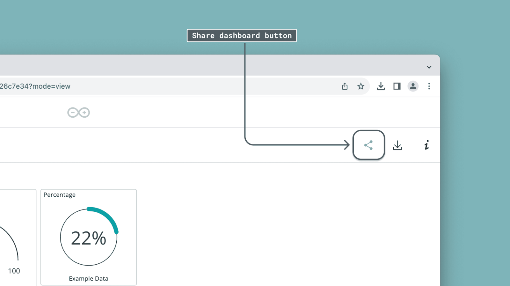 

By emphasizing teamwork and communication, you create a space where collective intelligence thrives, enhancing the educational experience for everyone involved. 

### Keep tabs on all the activities

Quickly find all the recent sketch files and IoT Dashboards worked by your students right from the Shared Spaces dashboard manage your efficiently without unnecessary clicks or complex steps.

In the next sections we will take you through setting up a Shared space for your classroom and your students. Let's jump in and see what awesome things we can create together! 

## Create a Shared Space 

Creating a shared space is simple and straightforward, however it requires you to have an Arduino account before you can get started. If you haven't created any in the past, [create one](https://support.arduino.cc/hc/en-us/articles/360016724040-Create-an-Arduino-account) now! 

### Login to your Private Space

Login to https://app.arduino.cc/ with your Arduino account by default, any new user who has recently created an Arduino account starts their journey with their Private Space.

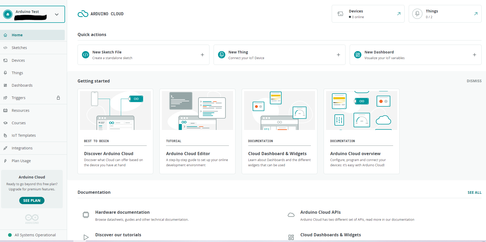

***Note: a Private Space is an automatically created once joined Arduino Cloud. You can use this space for personal projects you do not want to share with all your class.*** 

### Create a Shared Space for your classroom 

Now that you have a private space let's get you started. In order to create a shared space go to [this link](https://app.arduino.cc/space?spaceType="edu").

Then you will be asked which type of Shared Space you want to create (i.e. For Business or For Education). Click on **For Education** and proceed with creating an online space to share with your students or other colleagues.

Fill in additional information such as the name of your School, Country and Grade. 

Congratulations! Now you own a Shared Space linked to your Arduino account. In the next section we will show you how to add members into your space and make it lively. 

## Adding members to a Shared Space

In this section we will show you how to add students, teachers and Administrators to your shared space and manage them effectively. 

### Inviting members to a shared space

Let’s begin by inviting members to your space. You can add more members to your Shared Space by clicking on the **Invite Members** button. 

Once inside the Cloud homepage, from the card on the right top corner, you will find the **complete list of all members** who have access to your Shared Space, as well as the **current role** of each member. Let’s go ahead and Click on **Add Members:**

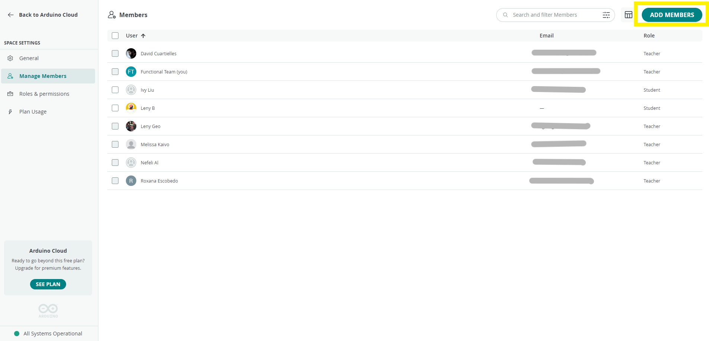

You can add members in **three possible ways**:

1. Email Invites
2. Sharing an invite link 
3. Sharing an invite Code (Only for Minors) 

### Sending Members Email invites 

Email invites are usually sent once you have entered the email ID of the intended user. Type the **email addresses** of each user followed by a space. 

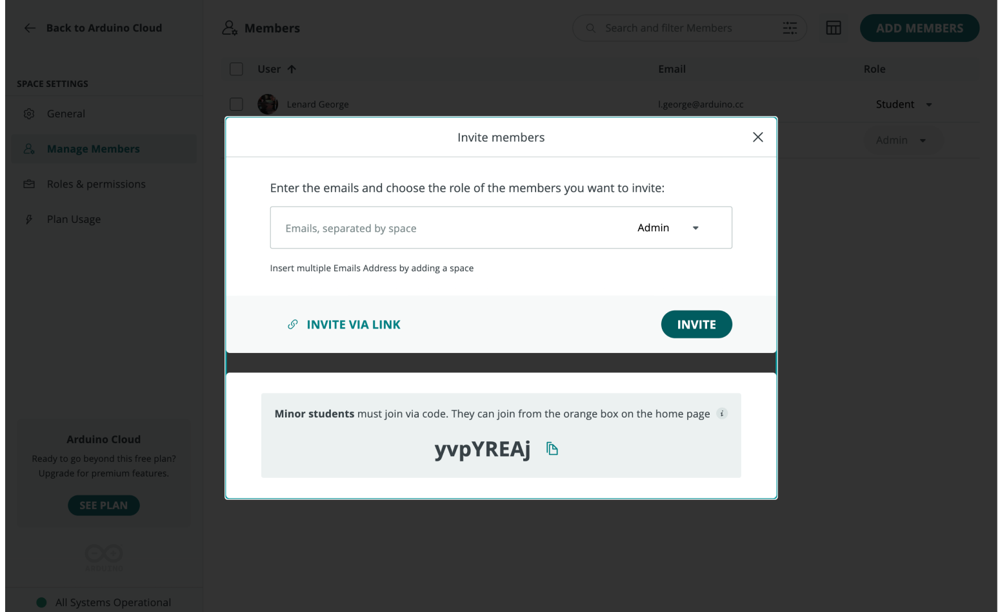

Define which **role** they will cover in your Space based on the available options.  There are three role types in Arduino Cloud for Schools:
- Admin
- Teacher
- Students

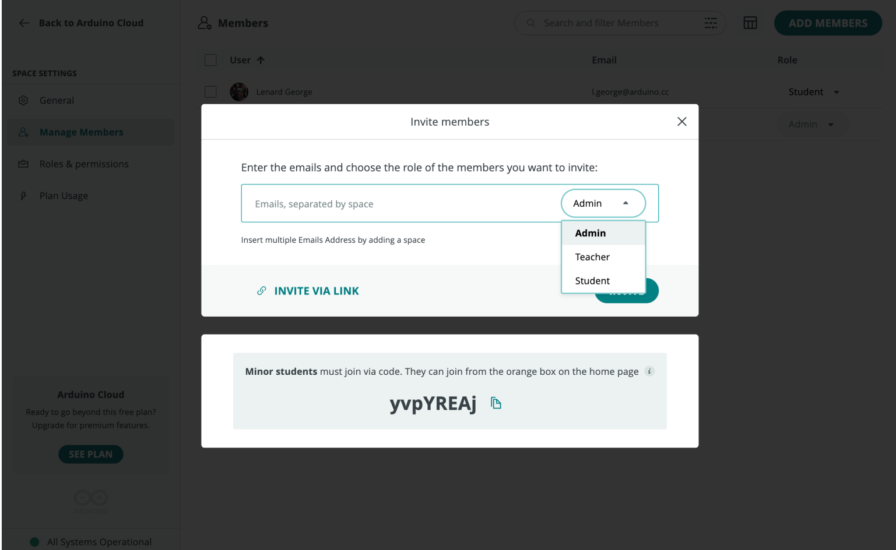

***Note: by default the member who has activated the plan and created the class-space is set as Admin. It is possible to have multiple Admins with same permissions. The admin has full control of the rights/permissions each user has in a Shared Space.***

The list of supported roles and corresponding permissions can be found here: https://cloud.arduino.cc/home/roles-permissions

Once you have added the list of members and assigned their roles. Click on **Invite**. 

The users you added will receive an invitation by email with a link to join your Shared Space.

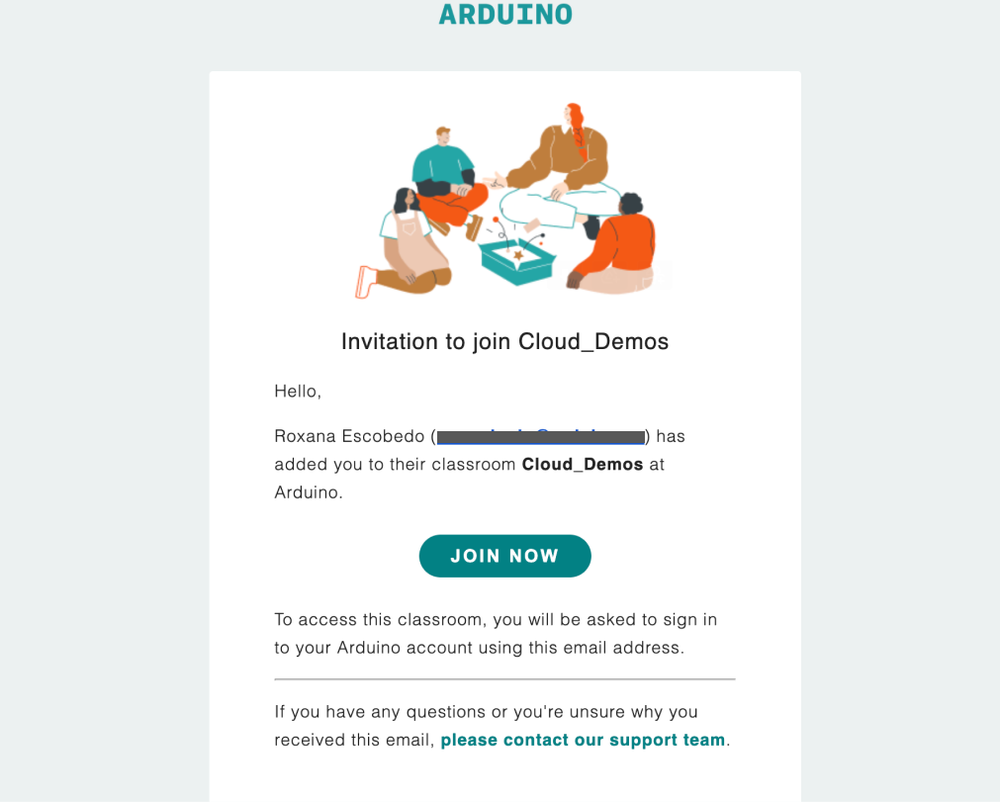

### Sharing an invite link with Students 

If you don’t have the option of emailing your students you can invite your students to the Space by manually sending them an **Invite URL.** 

Click on the **Invite via Link** option from the invite pop up

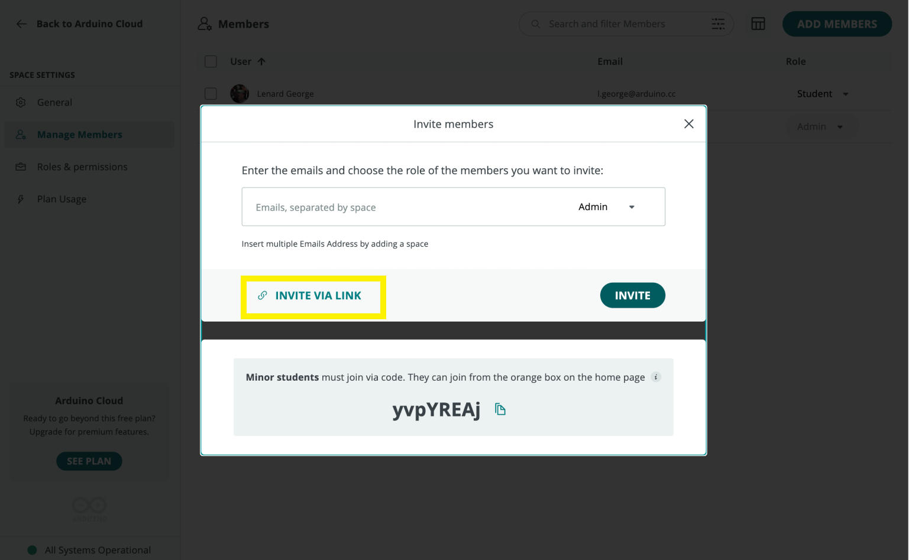

**Copy paste the link** and share it with the whole class.

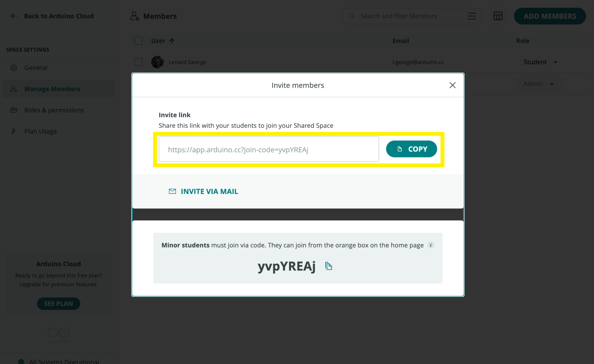

The users you added will receive an invitation by email with a link to join your Shared Space.

### Sharing an invite code with Minors 

As minors have restricted access to content and tools they have a slightly different way of joining a shared space. It is mandatory that you ensure that you have [created a Junior Arduino account](https://support.arduino.cc/hc/en-us/articles/360022234360-Create-an-Arduino-account-for-juniors) for them before you proceed. 

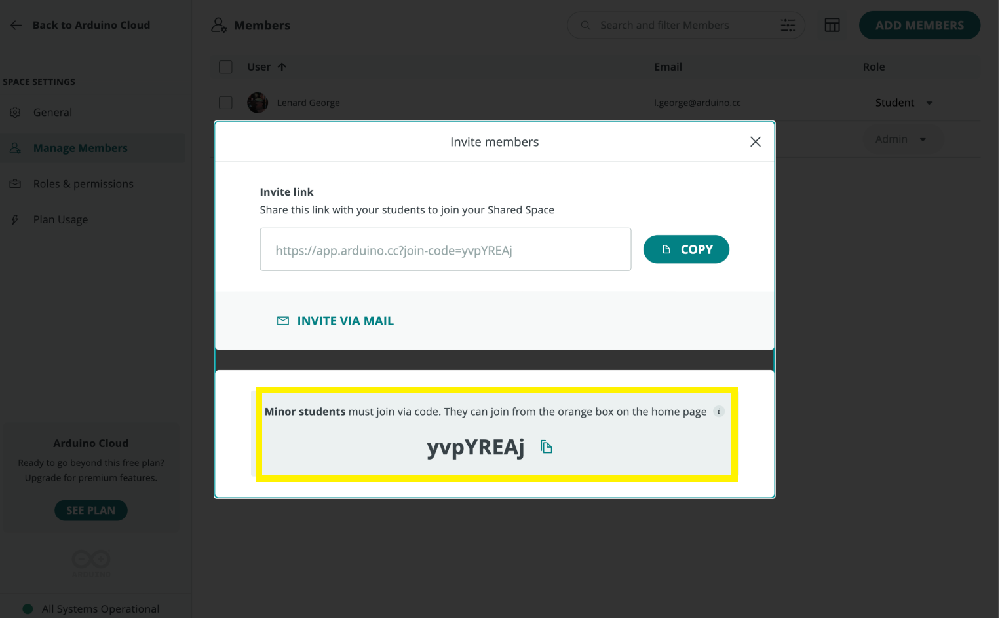

Ask your students to log into their Junior Account and click on the **Join Space** from the orange box on the right.

Enter the space code that you have shared with them admin or teacher shared with you to join their space.

Once they click Join, they will then be added to your Shared Space and be visible inside your members list. 

***There is no limitation on the number of members you can add into a Shared Space.***

## Space Settings 

In space settings, you can configure everything from the logo of your space to adding and removing members. If you have a free plan you can also track the usage of the Cloud tools and choose to upgrade to a School plan. 

To change the current settings of your Shared Space, navigate to the **Space Settings** tab using the sidebar.

### Change space name and logo

If you would like to change the name of your space and have a custom logo, you can do that by going to `Space settings > General Settings`

### Managing members & roles 

You can also change the role of a certain member or remove them from the **Manage Members** section. 

If you would like to change the role, you do this by first selecting on the Roles dropdown for a certain member. 

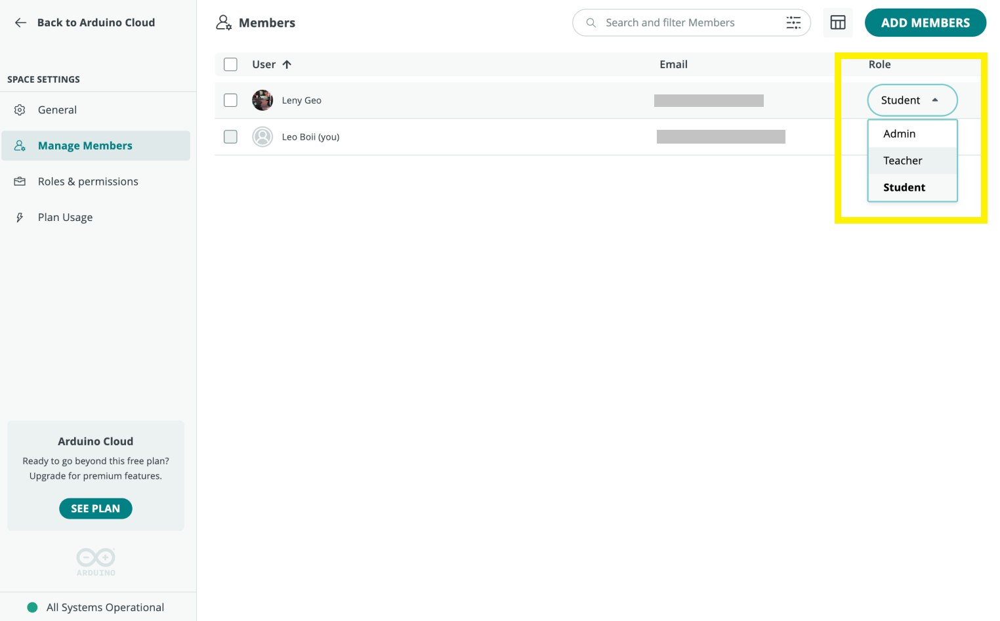

You can also remove an individual member or a group by **selecting their row** and deleting them 

### Switch Between Spaces

If you are a part of more than 1 shared space, you can switch to other Shared Spaces at any time using the corresponding menu, which you can find at the top left-corner, and click on it. 

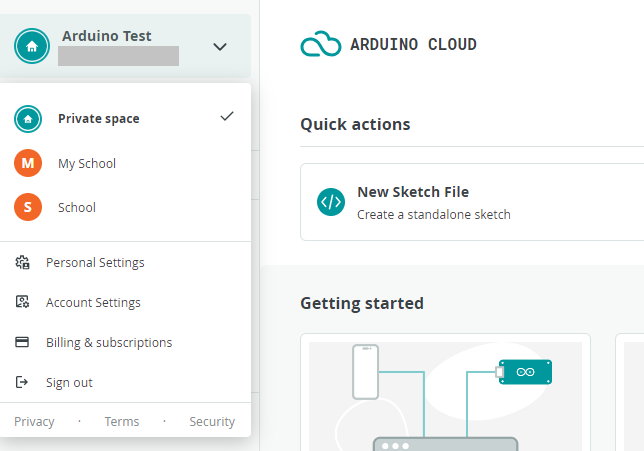

If you have more than three spaces, there will be pop up listing out all the shared spaces that you are a part of.

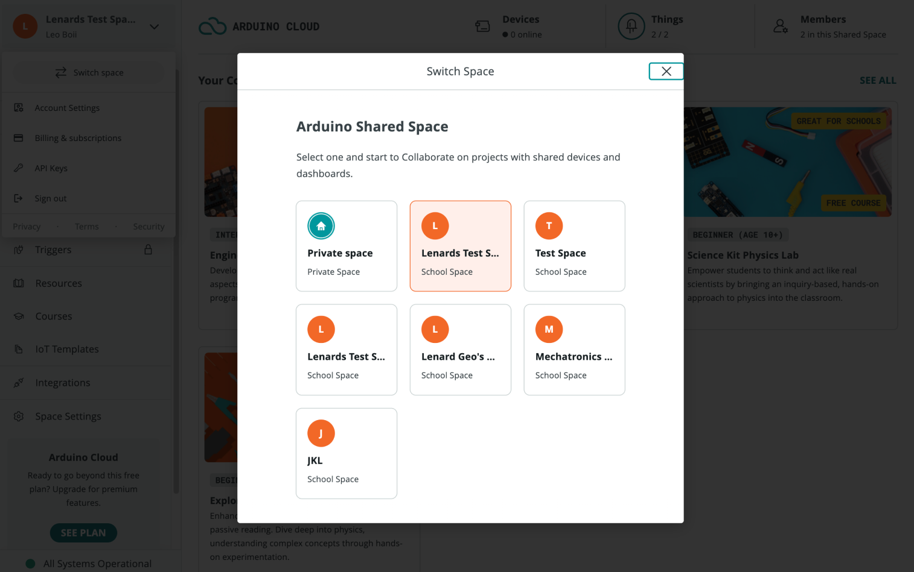

***Note: with a Free Plan or School Plan there are no limitations in the number of shared spaces you can have.***

### Keep track on plan usage

From this menu, `Plan Settings > Plan Usage`, you can check your plan's limit and quota or upgrade it to a School Plan if needed. 

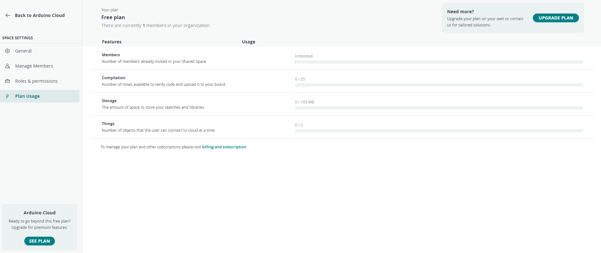

## Do you still need help?

For more troubleshooting articles, we recommend these from our Help Center:

* [Add members to a space](https://support.arduino.cc/hc/en-us/articles/360011787820-Add-members-to-a-space)
* [Roles and permissions in shared spaces](https://support.arduino.cc/hc/en-us/articles/4405753330706-Roles-and-permissions-in-shared-spaces)
* [Access and share course content](https://support.arduino.cc/hc/en-us/articles/360021587259-Access-and-share-course-content)

