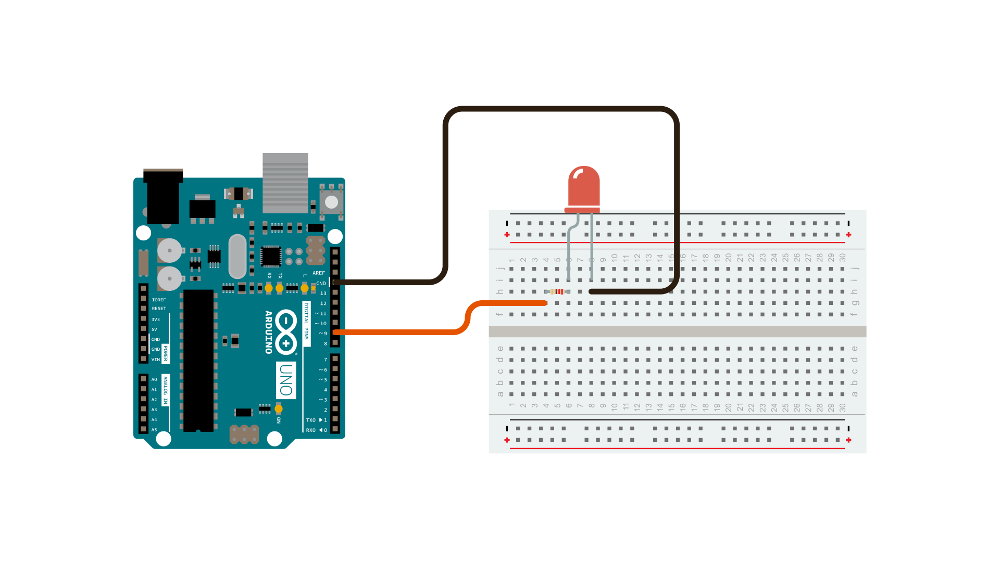
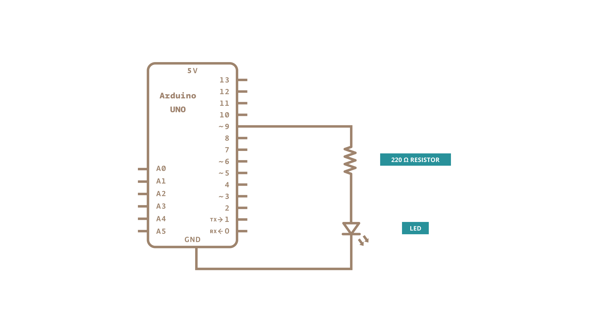

This example demonstrates the use of the [analogWrite()](https://www.arduino.cc/en/Reference/AnalogWrite) function in fading an LED off and on. AnalogWrite uses [pulse width modulation (PWM)](/learn/microcontrollers/analog-output), turning a digital pin on and off very quickly with different ratio between on and off, to create a fading effect.

### Hardware Required

- Arduino board

- LED

- 220 ohm resistor

- hook-up wires

- breadboard

### Circuit

Connect the **anode** (the longer, positive leg) of your LED to digital output pin 9 on your board through a 220 ohm resistor. Connect the **cathode** (the shorter, negative leg) directly to ground.

### Schematic

### Code

After declaring pin 9 to be your `ledPin`, there is nothing to do in the `setup()` function of your code.

The `analogWrite()` function that you will be using in the main loop of your code requires two arguments: One telling the function which pin to write to, and one indicating what [PWM](/learn/microcontrollers/analog-output) value to write.

In order to fade your LED off and on, gradually increase your PWM value from 0 (all the way off) to 255 (all the way on), and then back to 0 once again to complete the cycle.  In the sketch below, the PWM value is set using a variable called `brightness`.  Each time through the loop, it increases by the value of the variable `fadeAmount`.

If `brightness` is at either extreme of its value (either 0 or 255), then `fadeAmount` is changed to its negative. In other words, if `fadeAmount` is 5, then it is set to -5. If it's -5, then it's set to 5. The next time through the loop, this change causes `brightness` to change direction as well.

`analogWrite()` can change the PWM value very fast, so the delay at the end of the sketch controls the speed of the fade.  Try changing the value of the delay and see how it changes the fading effect.

<iframe src='https://create.arduino.cc/example/builtin/01.Basics%5CFade/Fade/preview?embed&snippet' style='height:510px;width:100%;margin:10px 0' frameborder='0'></iframe>

### Learn more

You can find more basic tutorials in the [built-in examples](/built-in-examples) section.

You can also explore the [language reference](https://www.arduino.cc/reference/en/), a detailed collection of the Arduino programming language.

*Last revision 2015/07/29 by SM*