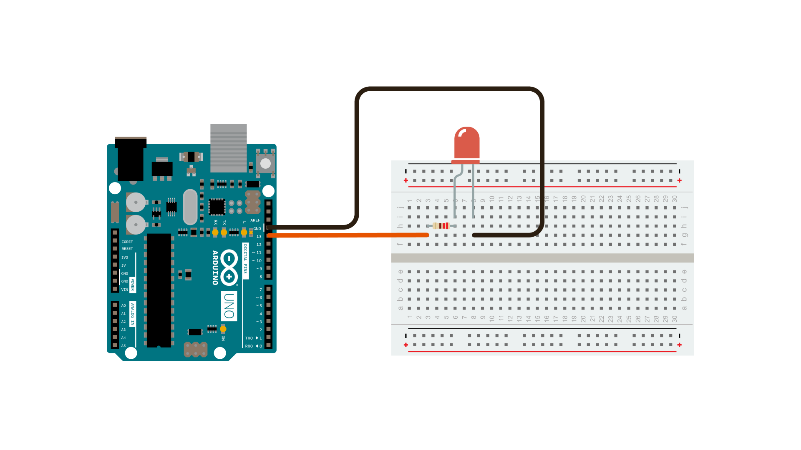
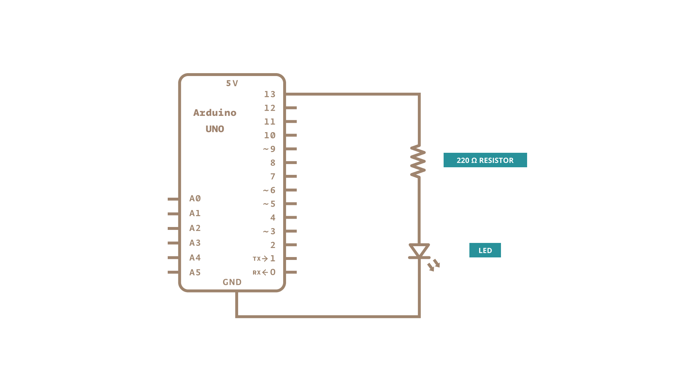

Sometimes you need to do two things at once.  For example you might want to blink an LED  while reading a button press.  In this case, you can't use `delay()`, because Arduino pauses your program during the `delay()`. If the button is pressed while Arduino is paused waiting for the `delay()` to pass, your program will miss the button press.

This sketch demonstrates how to blink an LED without using `delay()`. It turns the LED on and then makes note of the time.  Then, each time through `loop()`, it checks to see if the desired blink time has passed. If it has, it toggles the LED on or off and makes note of the new time. In this way the LED blinks continuously while the sketch execution never lags on a single instruction.

An analogy would be warming up a pizza in your microwave, and also waiting some important email. You put the pizza in the microwave and set it for 10 minutes.  The analogy to using `delay()` would be to sit in front of the microwave watching the timer count down from 10 minutes until the timer reaches zero. If the important email arrives during this time you will miss it.

What you would do in real life would be to turn on the pizza, and then check your email, and then maybe do something else (that doesn't take too long!) and every so often you will come back to the microwave to see if the timer has reached zero, indicating that your pizza is done.

In this tutorial you will learn how to set up a similar timer.

### Hardware Required

- Arduino Board

- LED

- 220 ohm resistor

### Circuit

To build the circuit, connect one end of the resistor to pin 13 of the board.  Connect the long leg of the LED (the positive leg, called the anode) to the other end of the resistor. Connect the short leg of the LED (the negative leg, called the cathode) to the board GND, as shown in the diagram above and the schematic below.

Most Arduino boards already have an LED attached to pin 13 on the board itself.  If you run this example with no hardware attached, you should see that LED blink.

### Schematic

After you build the circuit plug your board into your computer, start the Arduino Software (IDE), and enter the code below.

### Code

The code below uses the [millis()](https://www.arduino.cc/reference/en/language/functions/time/millis/) function, a command that returns the number of milliseconds since the board started running its current sketch, to blink an LED.

<iframe src='https://create.arduino.cc/example/builtin/02.Digital%5CBlinkWithoutDelay/BlinkWithoutDelay/preview?embed&snippet' style='height:510px;width:100%;margin:10px 0' frameborder='0'></iframe>

### Learn more

You can find more basic tutorials in the [built-in examples](/built-in-examples) section.

You can also explore the [language reference](https://www.arduino.cc/reference/en/), a detailed collection of the Arduino programming language.

*Last revision 2015/07/28 by SM*
