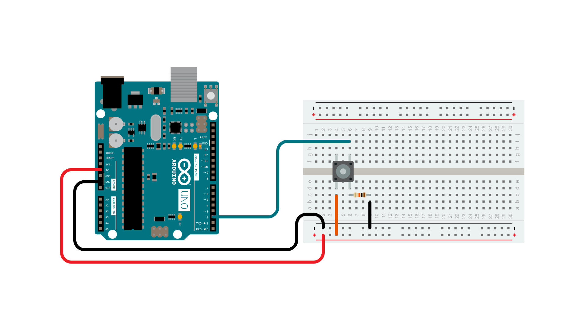
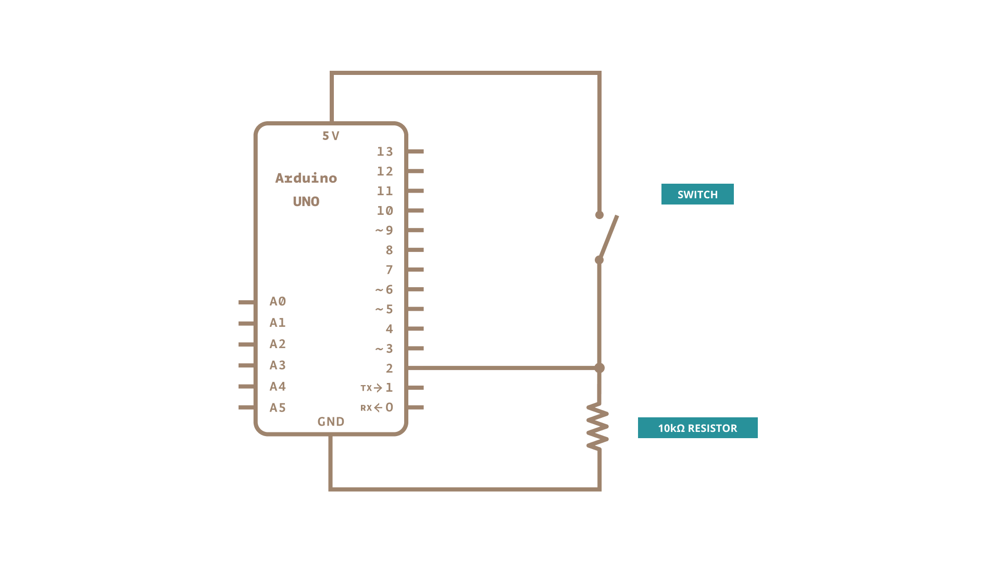

Pushbuttons or switches connect two points in a circuit when you press them.  This example turns on the built-in LED on pin 13 when you press the button.

### Hardware

- Arduino Board

- Momentary button or Switch

- 10K ohm resistor

- hook-up wires

- breadboard

### Circuit

Connect three wires to the board. The first two, red and black, connect to the two long vertical rows on the side of the breadboard to provide access to the 5 volt supply and ground. The third wire goes from digital pin 2 to one leg of the pushbutton.  That same leg of the button connects through a pull-down resistor (here 10K ohm) to ground. The other leg of the button connects to the 5 volt supply.

When the pushbutton is open (unpressed) there is no connection between the two legs of the pushbutton, so the pin is connected to ground (through the pull-down resistor) and we read a LOW.  When the button is closed (pressed), it makes a connection between its two legs, connecting the pin to 5 volts, so that we read a HIGH.

You can also wire this circuit the opposite way, with a pullup resistor keeping the input HIGH, and going LOW when the button is pressed.  If so, the behavior of the sketch will be reversed, with the LED normally on and turning off when you press the button.

If you disconnect the digital I/O pin from everything, the LED may blink erratically.  This is because the input is "floating" - that is, it will randomly return either HIGH or LOW.  That's why you need a pull-up or pull-down resistor in the circuit.

### Schematic

### Code

<iframe src='https://create.arduino.cc/example/builtin/02.Digital%5CButton/Button/preview?embed&snippet' style='height:510px;width:100%;margin:10px 0' frameborder='0'></iframe>

### Learn more

You can find more basic tutorials in the [built-in examples](/built-in-examples) section.

You can also explore the [language reference](https://www.arduino.cc/reference/en/), a detailed collection of the Arduino programming language.

*Last revision 2015/07/28 by SM*