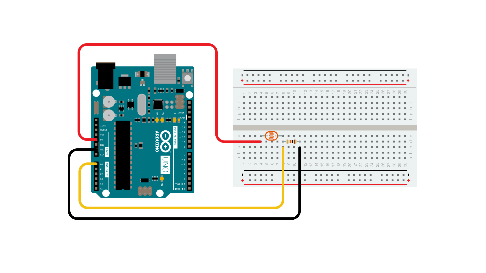
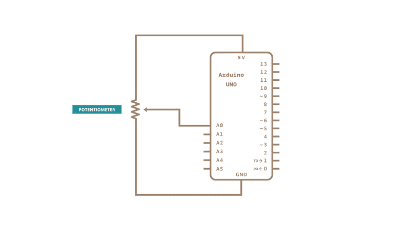

In this example we use a variable resistor (a potentiometer or a photoresistor), we read its value using one analog input of an Arduino board and we change the blink rate of the built-in LED accordingly. The resistor's analog value is read as a voltage because this is how the analog inputs work.

### Hardware Required

- Arduino Board

- Potentiometer **or**
- 10K ohm photoresistor and 10K ohm resistor

- built-in LED on pin 13 **or**
- 220 ohm resistor and red LED

### Circuit

With a potentiometer

With a photoresistor

Connect three wires to the Arduino board.  The first goes to ground from one of the outer pins of the potentiometer.  The second goes from 5 volts to the other outer pin of the potentiometer.  The third goes from analog input 0 to the middle pin of the potentiometer.

For this example, it is possible to use the board's built in LED attached to pin 13. To use an additional LED, attach its longer leg (the positive leg, or anode), to digital pin 13 in series with the 220 ohm resistor, and it's shorter leg (the negative leg, or cathode) to the ground (GND) pin next to pin 13.

The circuit based on a photoresistor uses a resistor divider to allow the high impedance Analog input to measure the voltage. These inputs do not draw almost any current, therefore by Ohm's law the voltage measured on the other end of a resistor connected to 5V is always 5V, regardless the resistor's value. To get a voltage proportional to the photoresistor value, a resistor divider is necessary.
This circuit uses a variable resistor, a fixed resistor and the measurement point is in the middle of the resistors. The voltage measured (Vout) follows this formula:

**Vout=Vin*(R2/(R1+R2))**

where Vin is 5V, R2 is 10k ohm and R1 is the photoresistor value that ranges from 1M ohm in darkness to 10k ohm in daylight (10 lumen) and less than 1k ohm in bright light or sunlight (>100 lumen).

### Schematic

Potentiometer

Photoresistor

### Code

At the beginning of this sketch, the variable `sensorPin` is set to to analog pin 0, where your potentiometer is attached, and `ledPin` is set to digital pin 13. You'll also create another variable, `sensorValue` to store the values read from your sensor.

The [`analogRead()`](https://www.arduino.cc/en/Reference/AnalogRead) command converts the input voltage range, 0 to 5 volts, to a digital value between 0 and 1023.  This is done by a circuit inside the microcontroller called an *analog-to-digital converter* or *ADC*.

By turning the shaft of the potentiometer, you change the amount of resistance on either side of the center pin (or wiper) of the potentiometer.  This changes the relative resistances between the center pin and the two outside pins, giving you a different voltage at the analog input.  When the shaft is turned all the way in one direction, there is no resistance between the center pin and the pin connected to ground. The voltage at the center pin then is 0 volts, and `analogRead()` returns 0.  When the shaft is turned all the way in the other direction, there is no resistance between the center pin and the pin connected to +5 volts. The voltage at the center pin then is 5 volts, and `analogRead()` returns 1023.  In between,  `analogRead()` returns a number between 0 and 1023 that is proportional to the amount of voltage being applied to the pin.

That value, stored in `sensorValue`, is used to set a `delay()` for your blink cycle. The higher the value, the longer the cycle, the smaller the value, the shorter the cycle. The value is read at the beginning of the cycle, therefore the on/off time is always equal.

<iframe src='https://create.arduino.cc/example/builtin/03.Analog%5CAnalogInput/AnalogInput/preview?embed&snippet' style='height:510px;width:100%;margin:10px 0' frameborder='0'></iframe>

### Learn more

You can find more basic tutorials in the [built-in examples](/built-in-examples) section.

You can also explore the [language reference](https://www.arduino.cc/reference/en/), a detailed collection of the Arduino programming language.

*Last revision 2015/07/28 by SM*
