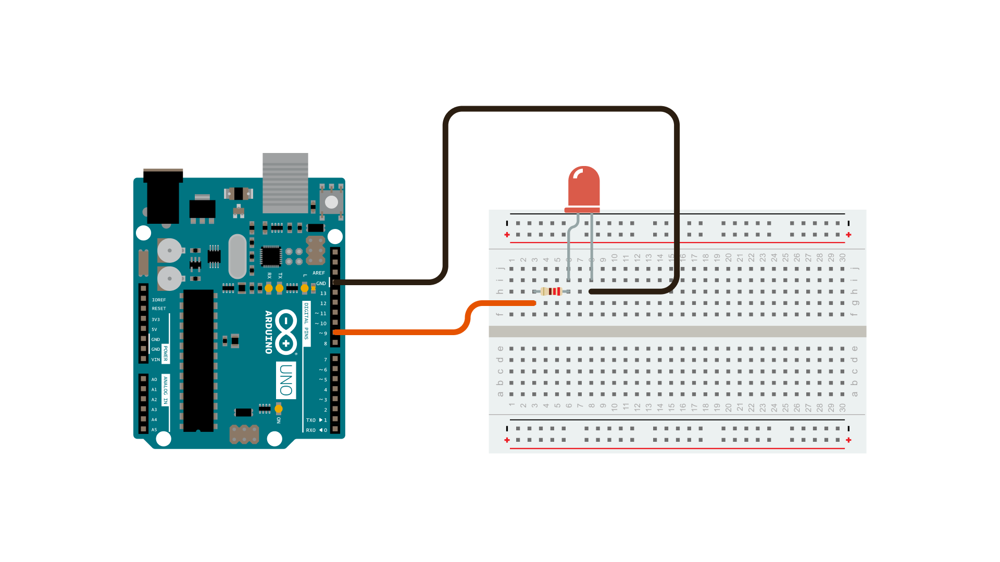

This example shows how to send data from a personal computer to an Arduino board to control the brightness of an LED.  The data is sent in individual bytes, each of which ranges in value from 0 to 255.  The sketch reads these bytes and uses them to set the brightness of the LED.

You can send bytes to the board from any software that can access the computer serial port. Examples for [Processing](http://www.processing.org) and [Max/MSP version 5](https://cycling74.com/downloads/older/) are shown below.

### Hardware Required

- Arduino Board

- LED

- 220 ohm resistor

### Software Required

- [Processing](http://www.processing.org) or

- [Max/MSP version 5](https://cycling74.com/downloads/older/)

### Circuit

Connect the 220 ohm current limiting resistor to digital pin 9, with an LED in series. The long, positive leg (the anode) of the LED should be connected to the output from the resistor, with the shorter, negative leg (the cathode) connected to ground.





### Schematic


### Code

```arduino

/*

  Dimmer

  Demonstrates sending data from the computer to the Arduino board, in this case

  to control the brightness of an LED. The data is sent in individual bytes,

  each of which ranges from 0 to 255. Arduino reads these bytes and uses them to

  set the brightness of the LED.

  The circuit:

  - LED attached from digital pin 9 to ground.

  - Serial connection to Processing, Max/MSP, or another serial application

  created 2006

  by David A. Mellis

  modified 30 Aug 2011

  by Tom Igoe and Scott Fitzgerald

  This example code is in the public domain.

  http://www.arduino.cchttps://www.arduino.cc/en/Tutorial/Dimmer

*/

const int ledPin = 9;      // the pin that the LED is attached to

void setup() {

  // initialize the serial communication:

  Serial.begin(9600);

  // initialize the ledPin as an output:

  pinMode(ledPin, OUTPUT);
}

void loop() {

  byte brightness;

  // check if data has been sent from the computer:

  if (Serial.available()) {

    // read the most recent byte (which will be from 0 to 255):

    brightness = Serial.read();

    // set the brightness of the LED:

    analogWrite(ledPin, brightness);

  }
}

/* Processing code for this example

  // Dimmer - sends bytes over a serial port

  // by David A. Mellis

  // This example code is in the public domain.

  import processing.serial.*;

  Serial port;

  void setup() {

    size(256, 150);

    println("Available serial ports:");

    // if using Processing 2.1 or later, use Serial.printArray()

    println(Serial.list());

    // Uses the first port in this list (number 0). Change this to select the port

    // corresponding to your Arduino board. The last parameter (e.g. 9600) is the

    // speed of the communication. It has to correspond to the value passed to

    // Serial.begin() in your Arduino sketch.

    port = new Serial(this, Serial.list()[0], 9600);

    // If you know the name of the port used by the Arduino board, you can specify

    // it directly like this.

    //port = new Serial(this, "COM1", 9600);

  }

  void draw() {

    // draw a gradient from black to white

    for (int i = 0; i < 256; i++) {

      stroke(i);

      line(i, 0, i, 150);

    }

    // write the current X-position of the mouse to the serial port as

    // a single byte

    port.write(mouseX);

  }

*/

/* Max/MSP v5 patch for this example

----------begin_max5_patcher----------

1008.3ocuXszaiaCD9r8uhA5rqAeHIa0aAMaAVf1S6hdoYQAsDiL6JQZHQ2M

YWr+2KeX4vjnjXKKkKhhiGQ9MeyCNz+X9rnMp63sQvuB+MLa1OlOalSjUvrC

ymEUytKuh05TKJWUWyk5nE9eSyuS6jesvHu4F4MxOuUzB6X57sPKWVzBLXiP

xZtGj6q2vafaaT0.BzJfjj.p8ZPukazsQvpfcpFs8mXR3plh8BoBxURIOWyK

rxspZ0YI.eTCEh5Vqp+wGtFXZMKe6CZc3yWZwTdCmYW.BBkdiby8v0r+ST.W

sD9SdUkn8FYspPbqvnBNFtZWiUyLmleJWo0vuKzeuj2vpJLaWA7YiE7wREui

FpDFDp1KcbAFcP5sJoVxp4NB5Jq40ougIDxJt1wo3GDZHiNocKhiIExx+owv

AdOEAksDs.RRrOoww1Arc.9RvN2J9tamwjkcqknvAE0l+8WnjHqreNet8whK

z6mukIK4d+Xknv3jstvJs8EirMMhxsZIusET25jXbX8xczIl5xPVxhPcTGFu

xNDu9rXtUCg37g9Q8Yc+EuofIYmg8QdkPCrOnXsaHwYs3rWx9PGsO+pqueG2

uNQBqWFh1X7qQG+3.VHcHrfO1nyR2TlqpTM9MDsLKNCQVz6KO.+Sfc5j1Ykj

jzkn2jwNDRP7LVb3d9LtoWBAOnvB92Le6yRmZ4UF7YpQhiFi7A5Ka8zXhKdA

4r9TRGG7V4COiSbAJKdXrWNhhF0hNUh7uBa4Mba0l7JUK+omjDMwkSn95Izr

TOwkdp7W.oPRmNRQsiKeu4j3CkfVgt.NYPEYqMGvvJ48vIlPiyzrIuZskWIS

xGJPcmPiWOfLodybH3wjPbMYwlbFIMNHPHFOtLBNaLSa9sGk1TxMzCX5KTa6

WIH2ocxSdngM0QPqFRxyPHFsprrhGc9Gy9xoBjz0NWdR2yW9DUa2F85jG2v9

FgTO4Q8qiC7fzzQNpmNpsY3BrYPVJBMJQ1uVmoItRhw9NrVGO3NMNzYZ+zS7

3WTvTOnUydG5kHMKLqAOjTe7fN2bGSxOZDkMrBrGQ9J1gONBEy0k4gVo8qHc

cxmfxVihWz6a3yqY9NazzUYkua9UnynadOtogW.JfsVGRVNEbWF8I+eHtcwJ

+wLXqZeSdWLo+FQF6731Tva0BISKTx.cLwmgJsUTTvkg1YsnXmxDge.CDR7x

D6YmX6fMznaF7kdczmJXwm.XSOOrdoHhNA7GMiZYLZZR.+4lconMaJP6JOZ8

ftCs1YWHZI3o.sIXezX5ihMSuXzZtk3ai1mXRSczoCS32hAydeyXNEu5SHyS

xqZqbd3ZLdera1iPqYxOm++v7SUSz

-----------end_max5_patcher-----------

*/
```

### Processing Code

The Processing sketch in the code sample above will send bytes out the computer serial port to the board to dim the LED.

### Max code

The Max/MSP patch in the code sample above looks like the image below.  Copy it and paste it into a new patch window.


### Learn more

You can find more basic tutorials in the [built-in examples](/built-in-examples) section.

You can also explore the [language reference](https://www.arduino.cc/reference/en/), a detailed collection of the Arduino programming language.

*Last revision 2015/07/29 by SM*