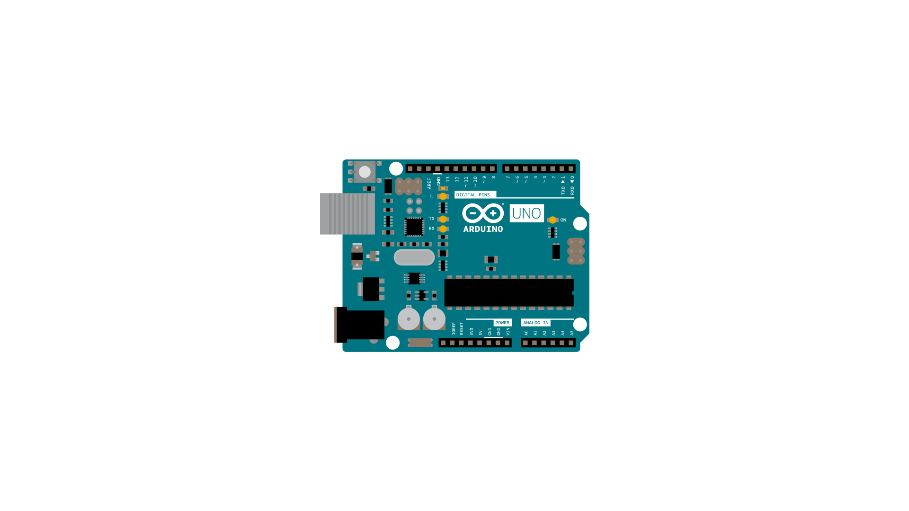

The [String](https://www.arduino.cc/en/Reference/StringObject) comparison operators `==`, `!=`,`>`, `<` ,`>=`, `<=` , and the `equals()` and `equalsIgnoreCase()` methods allow you to make alphabetic comparisons between Strings. They're useful for sorting and alphabetizing, among other things.

The operator `==` and the method `equals()` perform identically. In other words,

```arduino
if (stringOne.equals(stringTwo)) {
```

is identical to

```arduino
if (stringOne ==stringTwo) {
```

The ">" (greater than) and "<" (less than) operators evaluate strings in alphabetical order, on the first character where the two differ. So, for example `"a" < "b"` and `"1" < "2"`, but `"999" > "1000"` because 9 comes after 1.

**Caution:**
String comparison operators can be confusing when you're comparing numeric strings, because the numbers are treated as strings and not as numbers.  If you need to compare numbers, compare them as ints, floats, or longs, and not as Strings.

### Hardware Required

- Arduino Board

### Circuit

There is no circuit for this example, though your board must be connected to your computer via USB and the serial monitor window of the Arduino Software (IDE) should be open.




### Code

<iframe src='https://create.arduino.cc/example/builtin/08.Strings%5CStringComparisonOperators/StringComparisonOperators/preview?embed&snippet' style='height:510px;width:100%;margin:10px 0' frameborder='0'></iframe>

### Learn more

You can find more basic tutorials in the [built-in examples](/built-in-examples) section.

You can also explore the [language reference](https://www.arduino.cc/reference/en/), a detailed collection of the Arduino programming language.

*Last revision 2015/08/11 by SM*