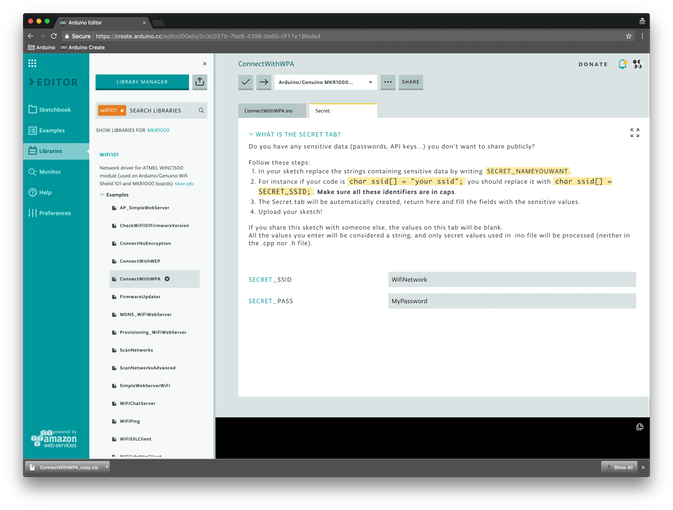
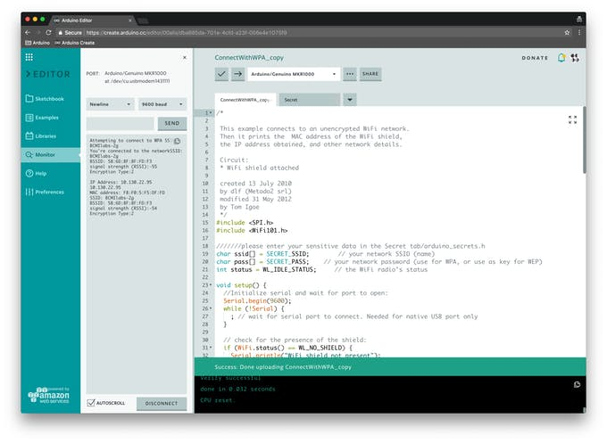
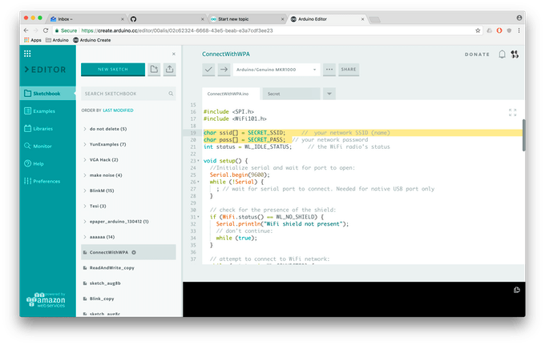
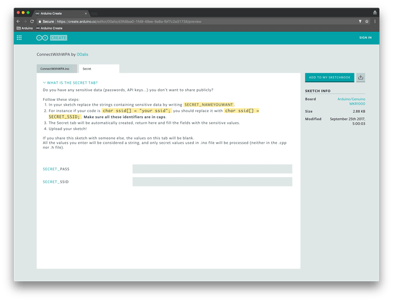
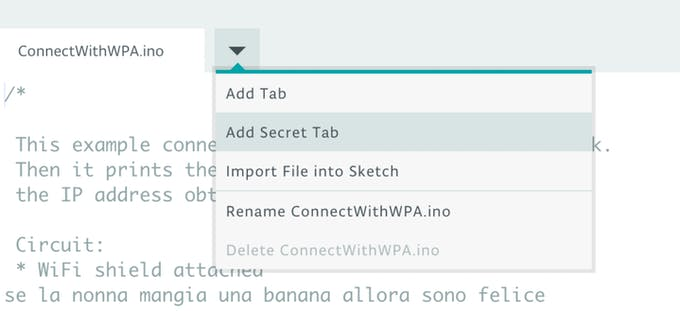
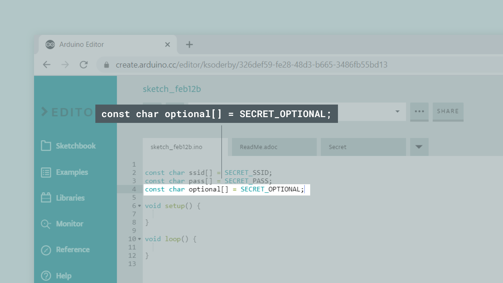
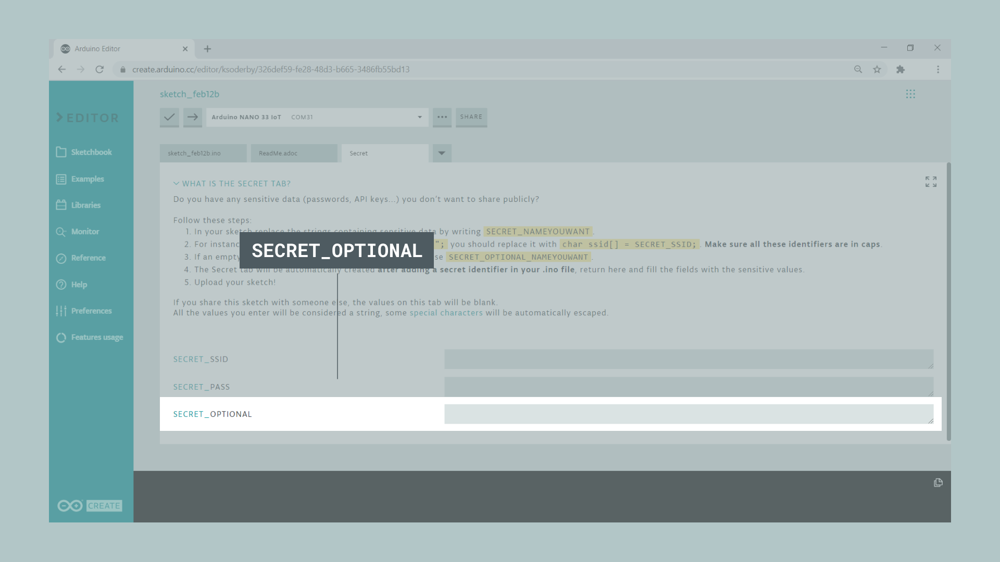

Often in your sketch, there is some sensitive data that you’d like to keep private, which could accidentally become public when published on GitHub or when you [share your sketch with someone else via URL](https://create.arduino.cc/projecthub/Arduino_Genuino/share-your-sketches-on-the-arduino-web-editor-00a02c). This sensitive information may include Wi-Fi network names and passwords, API key, and so on. But now, you can add a secret tab to your sketch and store your private data there.

This feature has been designed specifically for the [Arduino Create Editor](https://create.arduino.cc/editor). If you have yet to try it, follow [this tutorial to get started](https://create.arduino.cc/projecthub/Arduino_Genuino/getting-started-with-the-arduino-web-editor-4b3e4a) — all you need is an Arduino ID.

## How it works

Basically every time you type `SECRET_SOMETHING` in your sketch and save it, we will create a Secret tab for you to fill out.

Let’s start with an example, just so you can see how it works.

Go to the **Libraries panel** and type **‘Wifi101’** in the search tab, then click on the **ConnectWithWPA** example. You can also click on [this link](https://create.arduino.cc/editor/Arduino_Genuino/2ab7cb05-7f86-41cb-994f-d121d6f3bf34/preview) and add the example to your sketchbook.


As you can see, there are some identifiers like `SECRET_SIID` and `SECRET_PSW`. If you now click on the tab called “Secret,” you will notice some input fields where you can fill in your data.

If you have a [MKR1000](https://store.arduino.cc/arduino-mkr1000-with-headers-mounted) lying around, you can upload this sketch on it and watch your board connect to Internet (just make sure you join a 2GHz WiFi network).




## How to Add Secret Values to Your Own Sketch

Write your sketch as you would normally.


In your sketch, replace the strings containing sensitive data by writing `SECRET_NAMEYOUWANT`. For instance, if your string is `"psw”`, you should replace it with `SECRET_PSW`. **Make sure all these identifiers are in caps.**



The Secret tab will be automatically created **as soon as you type** `SECRET_SOMETHING`. Go to Secret tab and fill out the fields with the sensitive values.


That's it! If you share this sketch with someone via URL or if you download it, the values on the tab will be blank.



Alternatively, you can also click on the tab button and add the Secret tab directly from there. These instructions will be reported for quick reference.




## Adding an extra optional field

If you want to add another field, let's say to store the pin for your SIM card, or an API token, we can add an optional field. All we need to do is adding this at the top of our sketch:

```arduino
const char optional[] = SECRET_OPTIONAL;
```

So let's say we use `SECRET_SSID` and `SECRET_PASS`, this one would just be added in the same fashion.



Now if we head over to the **Secret** tab, it will be visible, and you can input your optional credential.



## Download the sketch

If you download a sketch, we will automatically create a file called arduino_secrets.h and add it to the .zip file. If you open the sketch with the Desktop IDE, you will be able to fill up this tab with your secrets as usual.


## Tech Details

All the values you enter will be considered strings.

The secrets are stored as plain text values, and will only be available when the user logs in to his/her account and looks at their own sketches in their personal sketchbooks.

You will be able to delete the Secret tab simply by removing the `SECRET_XX` identifiers from the .ino file.

### More tutorials

You can find more tutorials in the [Web Editor documentation page](/cloud/web-editor/).