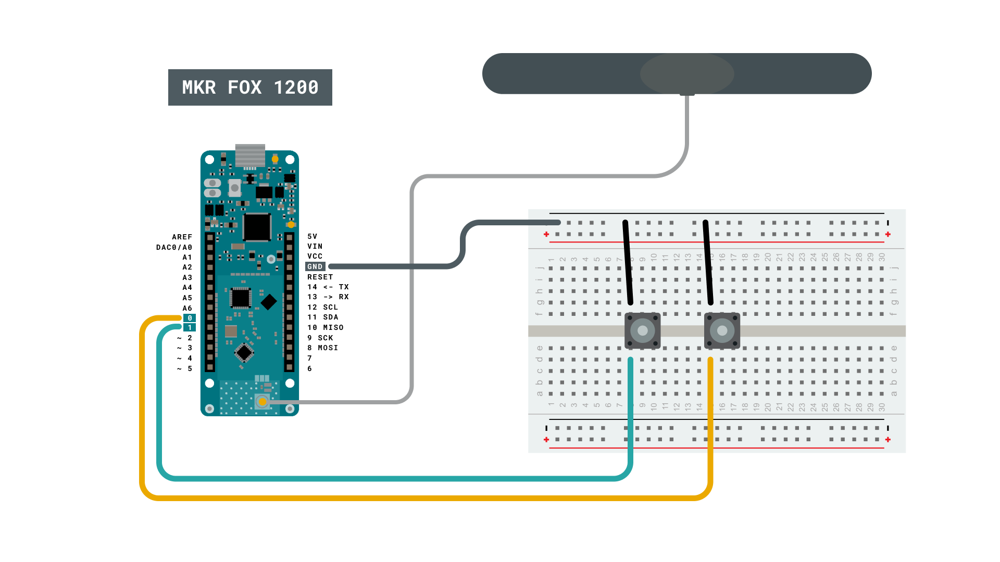
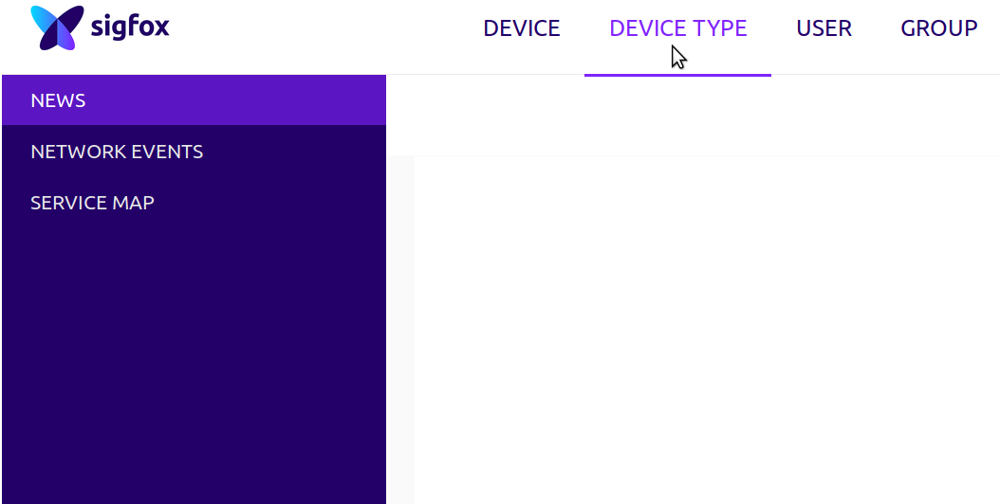
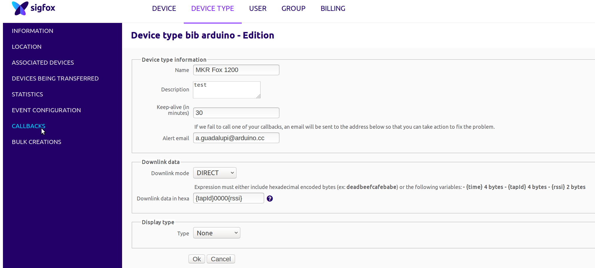
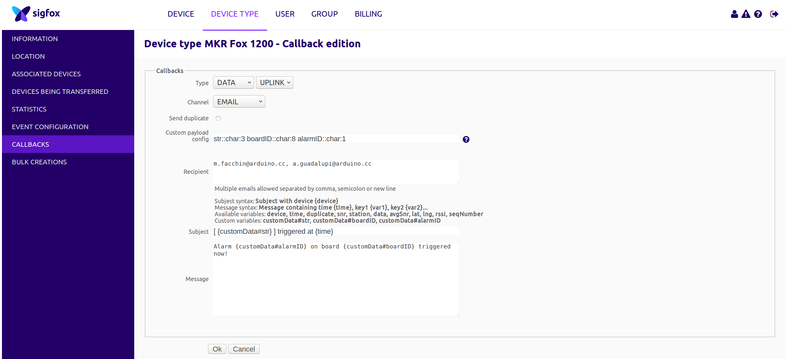
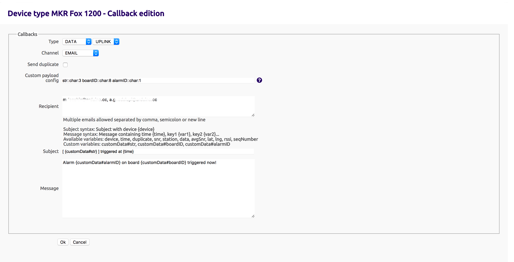

This example for a MKR Fox 1200 device allows you to use the board's low power features and the SigFox's backend utilities to send an email to a configured address when an event is triggered.

## Hardware Required

- MKR FOX 1200 [(link to store)](https://store.arduino.cc/arduino-mkr-fox-1200-1408)
- Antenna [(link to store)](https://store.arduino.cc/antenna)
- Jumper wires
- 2x pushbuttons

### Circuit

Connect the antenna to the MKR FOX 1200 board, and follow the circuit diagram to connect the buttons.



## Programming the Board

In `setup()` the SigFox hardware is initialized and the pins 0 and 1 declared as wakeup interrupt source.

```arduino
void setup() {

  if (!SigFox.begin()) {

    //something is really wrong, try rebooting

    reboot();

  }

  //Send module to standby until we need to send a message

  SigFox.end();

  // attach pin 0 and 1 to a switch and enable the interrupt on voltage falling event

  pinMode(0, INPUT_PULLUP);

  LowPower.attachInterruptWakeup(0, alarmEvent1, FALLING);

  pinMode(1, INPUT_PULLUP);

  LowPower.attachInterruptWakeup(1, alarmEvent2, FALLING);
}
```

The `loop` is executed only if a wakeup event occurs. In this case the board will send a message to the backend containing the chars **ATM**, the board's **ID** and the interrupt source number.

In this way we can parse the message (backend side) and send a custom email.

**You can find the complete code below:**

```arduino

/*

  SigFox Event Trigger tutorial

  This sketch demonstrates the usage of a MKRFox1200

  to build a battery-powered alarm sensor with email notifications

  A couple of sensors (normally open) should we wired between pins 1 and 2 and GND.

  This example code is in the public domain.

*/

#include <SigFox.h>
#include <ArduinoLowPower.h>

// Set debug to false to enable continuous mode
// and disable serial prints
int debug = true;

volatile int alarm_source = 0;

void setup() {

  if (debug == true) {

    // We are using Serial1 instead than Serial because we are going in standby

    // and the USB port could get confused during wakeup. To read the debug prints,

    // connect pins 13-14 (TX-RX) to a 3.3V USB-to-serial converter

    Serial1.begin(115200);

    while (!Serial1) {}

  }

  if (!SigFox.begin()) {

    //something is really wrong, try rebooting

    reboot();

  }

  //Send module to standby until we need to send a message

  SigFox.end();

  if (debug == true) {

    // Enable debug prints and LED indication if we are testing

    SigFox.debug();

  }

  // attach pin 0 and 1 to a switch and enable the interrupt on voltage falling event

  pinMode(0, INPUT_PULLUP);

  LowPower.attachInterruptWakeup(0, alarmEvent1, FALLING);

  pinMode(1, INPUT_PULLUP);

  LowPower.attachInterruptWakeup(1, alarmEvent2, FALLING);
}

void loop()
{

  // Sleep until an event is recognized

  LowPower.sleep();

  // if we get here it means that an event was received

  SigFox.begin();

  if (debug == true) {

    Serial1.println("Alarm event on sensor " + String(alarm_source));

  }

  delay(100);

  // 3 bytes (ALM) + 4 bytes (ID) + 1 byte (source) < 12 bytes

  String to_be_sent = "ALM" + SigFox.ID() +  String(alarm_source);

  SigFox.beginPacket();

  SigFox.print(to_be_sent);

  int ret = SigFox.endPacket();

  // shut down module, back to standby

  SigFox.end();

  if (debug == true) {

    if (ret > 0) {

      Serial1.println("No transmission");

    } else {

      Serial1.println("Transmission ok");

    }

    Serial1.println(SigFox.status(SIGFOX));

    Serial1.println(SigFox.status(ATMEL));

    // Loop forever if we are testing for a single event

    while (1) {};

  }
}

void alarmEvent1() {

  alarm_source = 1;
}

void alarmEvent2() {

  alarm_source = 2;
}

void reboot() {

  NVIC_SystemReset();

  while (1);
}
```

## Backend Configuration

To configure the backend to send an email you have to access your [control panel](https://backend.sigfox.com/welcome/news), click on Device Type, select MKR Fox 1200 from the list and click edit.




Once logged in you have to navigate to callbacks and click on **new** (top right corner)




Now you can edit the email parameters as shown in the image



In the **Custom payload config** you can read:

**str::char:3 boardID::char:8 alarmID::char:1**

This means that in the 12 bytes of received message (from left to right):

- **str::char:3**

3 characters are assigned to a variable called **str**

- **boardID::char:8**

8 chars are assigned to the boardID variable

- **alarmID::char:1**

1 char is assigned to the alarmID variable

Since you have assigned these values to these variables, you can now use them within your mail body and you can see in the **Subject** and  **Message** field!



To configure this callback:

- **Type field**: DATA - UPLINK
- **Channel**: EMAIL
- **Custom payload config**: str::char:3 boardID::char:8 alarmID::char:1 (as explained before)
Recipient: write your recipient email address, if you want more than one, use comma separated format.

- **Subject**: you can use a custom data value or a standard variable like **time**, **snr**, **station**, **data** as shown just before the subject line
- **Message**: same as Subject, you can use free text and some custom or standard variables.

Now click on OK to store your callback and you are done!
The very next time your alarm will trigger, you will receive an email!

## Conclusion

In this example we configured the Sigfox backend to send an email to a configured email address, using the MKR FOX 1200.
