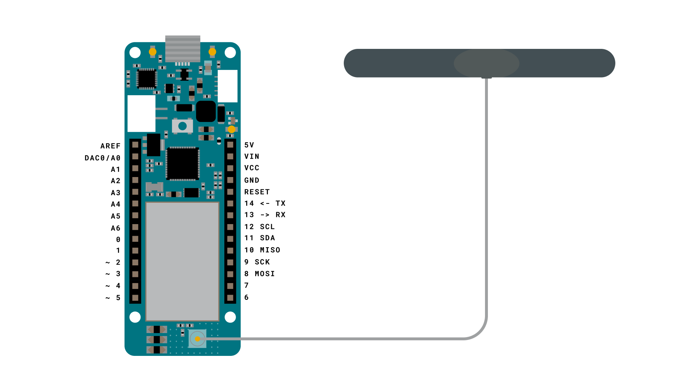
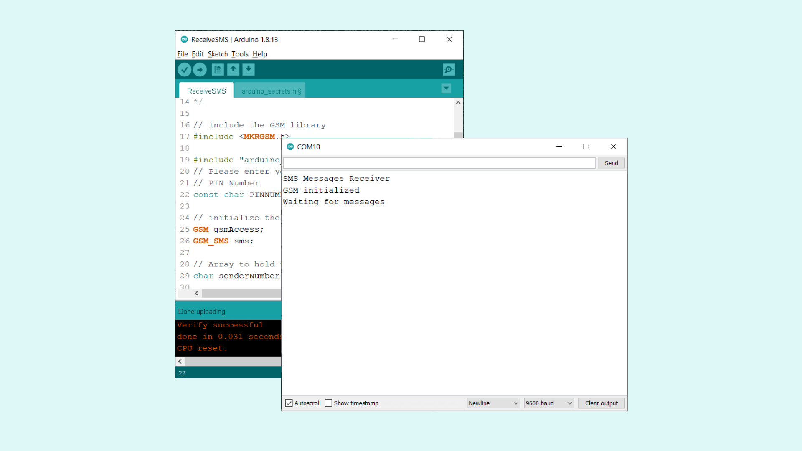
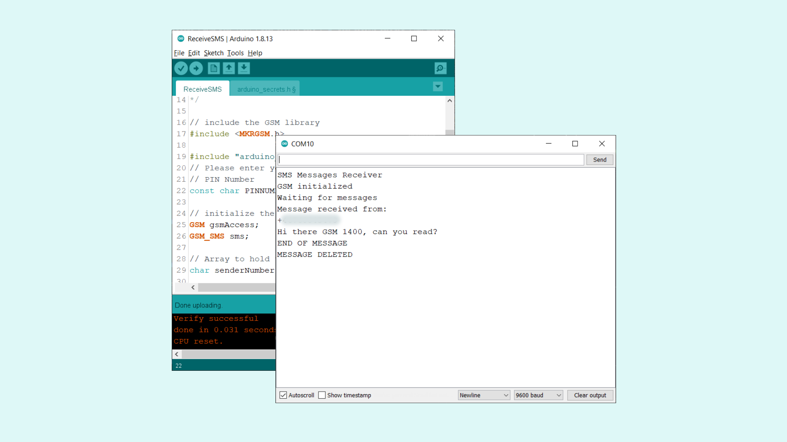

## Introduction 

This tutorial is a continuation of the [Send an SMS with MKR GSM 1400](/tutorials/mkr-gsm-1400/gsm-send-sms) tutorial, where you can read more about how the Global System for Mobile Communication (GSM) works. In the previous tutorial we set up the MKR GSM 1400 to send a text message to a phone, and in this tutorial, we will also see how we can receive text messages!

## Goals

The goals of this project are:

- Receive an SMS using the GSM network.
- Print the message and sender in the Serial Monitor.

## Hardware & Software Needed

- Arduino IDE ([online](https://create.arduino.cc/) or [offline](https://www.arduino.cc/en/main/software)).
- [MKRGSM](https://www.arduino.cc/en/Reference/GSM) library installed. 
- [Arduino MKR GSM 1400](https://store.arduino.cc/mkr-gsm-1400).
- [Antenna](https://store.arduino.cc/antenna).
- SIM card from an operator in your country.

## Useful Scenarios for Receiving SMS

The use of GSM technology is gaining more and more popularity, as it is gaining more coverage around the world. Practically speaking, wherever your phone has coverage, the MKR GSM 1400 has coverage too. This of course varies depending on what type of antenna you use. But often enough, even in a remote countryside, mountain and generally desolate places, we have coverage. We might not be able to stream movies or download large files, but we are able to send and receive messages, either over Internet or through calls or text messages.

If we manage to get access to one radio tower, it means we can call or text anyone in the country we live in, and, of course, the rest of world (this may be quite expensive however). This opens up many possibilities for projects in both rural and urban areas, when we either need to be updated, or to update something but we can't physically access it.

Now, in this tutorial, we will simply see how we can use a smartphone (or regular phone) to send a text message to our MKR GSM 1400 board, and print the message in the Serial Monitor.

### Circuit



## Programming the Board

We will now get to the programming part of this tutorial. 

**1.** First, let's make sure we have the drivers installed. If we are using the Web Editor, we do not need to install anything. If we are using an offline editor, we need to install it manually. This can be done by navigating to **Tools > Board > Board Manager...**. Here we need to look for the **Arduino SAMD boards (32-bits ARM Cortex M0+)** and install it. 

**2.** Now, we need to install the libraries needed. If we are using the Web Editor, there is no need to install anything. If we are using an offline editor, simply go to **Tools > Manage libraries..**, and search for **MKRGSM** and install it.

**3.** We can now go to **File > Examples > MKRGSM > ReceiveSMS** in the editor. This will open a new window, which has a sketch tab, but also a header file, called `arduino_secrets.h`. Inside this file, we need to enter our pin number between the " ". 
   
```cpp
#define SECRET_PINNUMBER     "" //enter pin code between ""
```
   
The pin number is often 1234 or 0000, but for more information, check the SIM plan that you bought.

**4.** Let's take a look at some of the core functions of this sketch:

- `GSM gsmAccess` - base class for all GSM functions.
- `GSM_SMS sms` - base class for all GSM functions for SMS.
- `gsmAccess.begin(pin)` - connects to the GSM network with the pin number as a parameter, e.g. 0123.
- `sms.available()` - checks to see if there is a SMS messages on the SIM card to be read.
- `sms.remoteNumber(number, 20)` - retrieves a sender's number. 
- `sms.beginSMS(number);` - creates an SMS for a specific number.  
- `sms.endSMS()` - sends the SMS.
- `sms.flush()` - deletes the message from the modem memory.

The sketch can also be found in the snippet below. Select the right board and port, and upload the sketch to the board.

```cpp
// include the GSM library
#include <MKRGSM.h>

#include "arduino_secrets.h" 
// Please enter your sensitive data in the Secret tab or arduino_secrets.h
// PIN Number
const char PINNUMBER[] = SECRET_PINNUMBER;

// initialize the library instances
GSM gsmAccess;
GSM_SMS sms;

// Array to hold the number a SMS is retrieved from
char senderNumber[20];

void setup() {
  // initialize serial communications and wait for port to open:
  Serial.begin(9600);
  while (!Serial) {
    ; // wait for serial port to connect. Needed for native USB port only
  }

  Serial.println("SMS Messages Receiver");

  // connection state
  bool connected = false;

  // Start GSM connection
  while (!connected) {
    if (gsmAccess.begin(PINNUMBER) == GSM_READY) {
      connected = true;
    } else {
      Serial.println("Not connected");
      delay(1000);
    }
  }

  Serial.println("GSM initialized");
  Serial.println("Waiting for messages");
}

void loop() {
  int c;

  // If there are any SMS available()
  if (sms.available()) {
    Serial.println("Message received from:");

    // Get remote number
    sms.remoteNumber(senderNumber, 20);
    Serial.println(senderNumber);

    // An example of message disposal
    // Any messages starting with # should be discarded
    if (sms.peek() == '#') {
      Serial.println("Discarded SMS");
      sms.flush();
    }

    // Read message bytes and print them
    while ((c = sms.read()) != -1) {
      Serial.print((char)c);
    }

    Serial.println("\nEND OF MESSAGE");

    // Delete message from modem memory
    sms.flush();
    Serial.println("MESSAGE DELETED");
  }

  delay(1000);

}
```

## Testing It Out

After the code has successfully uploaded, we need to open the Serial Monitor to initialize the rest of the program. For these type of projects, we use the `while(!Serial)` command, so we can read any available information only after we open the Serial Monitor.

After we open the Serial Monitor, the board will attempt to connect to the GSM network, and if it is successful, the following message can be seen in the Serial Monitor:



This means that we are ready to receive text messages. Now, we can open our phone, and send a text message to the number attached to your SIM card. 

We can send something simple, such as: 

```
Hi there GSM 1400, can you read?
```

After we have sent the message, it should appear in the Serial Monitor after a few seconds. If it successful, we will see the following message printed:



### Troubleshoot

If the code is not working, there are some common issues we can troubleshoot:

- Wrong pin number.
- SIM card lacking a data plan.
- Out of GSM network range (very unlikely in urban areas).
- Antenna not attached properly. 
- We have sent the message to the wrong number.

## Conclusion

In this tutorial, we have used the `ReceiveSMS` example, which allows us to receive SMS from an external device, and print it in the Serial Monitor.

Feel free to explore the [MKRGSM](https://www.arduino.cc/en/Reference/GSM) library further, and try out some of the many cool functions in this library.

