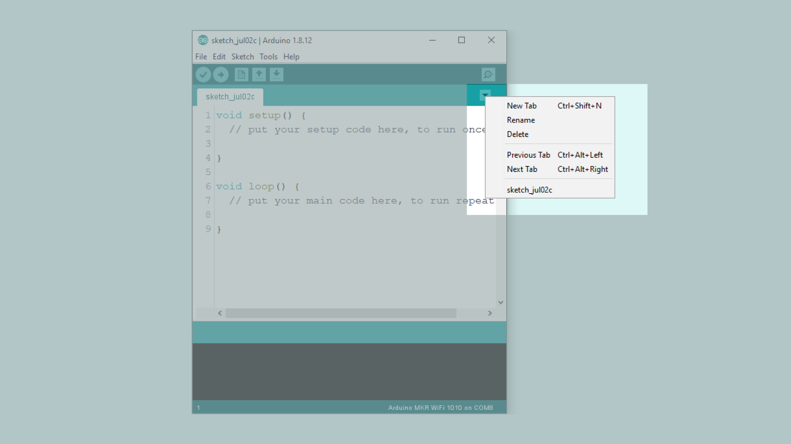
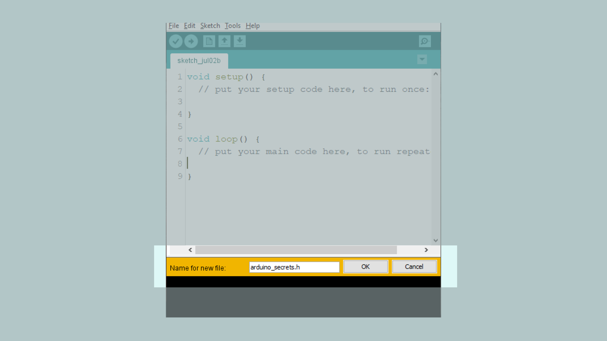
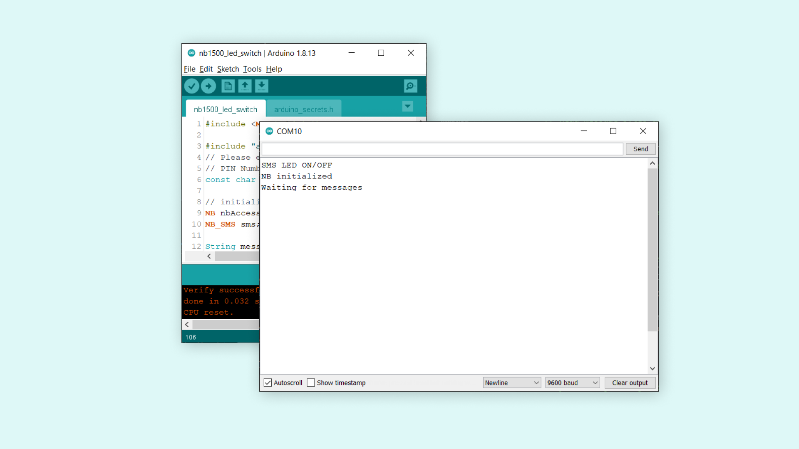
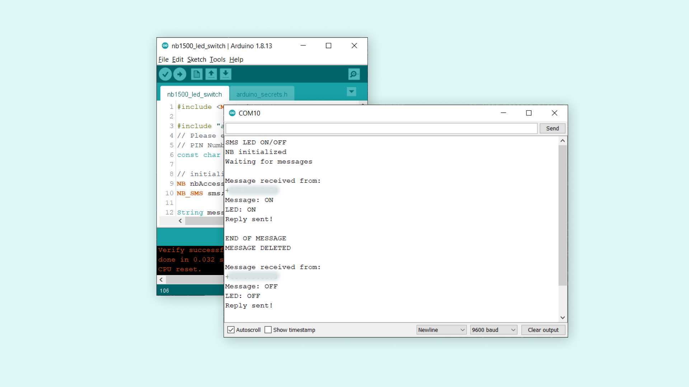

## Introduction 

In this tutorial we will learn how to use the Narrow Band IoT (NB IoT) or LTE CAT M1 network to turn ON or OFF an LED, using text messages (SMS). The sketch that we will create for the MKR NB 1500 board will allow a phone to send a text message to it. If the message matches a string defined in the code, it will either turn ON or OFF the in-built LED on the board.

Additionally, to receive feedback on whether the operation has worked or not, the board sends a message back to the sender number, to let the phone user know that it worked. 

## Goals

The goals of this project are:

- Learn more about using the `SMS` class in the `MKRNB` library.
- Create a SMS receiving functionality for the sketch.
- Create a string comparison that decides whether to take action or not.
- Send a feedback message back to the sender.

## Hardware & Software Needed

- Arduino IDE ([online](https://create.arduino.cc/) or [offline](https://www.arduino.cc/en/main/software)).
- [MKRNB](https://www.arduino.cc/en/Reference/MKRNB) library installed. 
- Arduino MKR NB 1500 ([link to store](https://store.arduino.cc/arduino-mkr-nb-1500-1413)).
- Antenna ([link to store](https://store.arduino.cc/antenna))
- SIM card from an operator in your country.
- Phone.

## Flexible Connectivity

The MKR NB 1500 is one of the best option to choose when you want to work with projects in remote areas, but also for urban projects as well. As it is capable of connecting to a widespread set of networks, it is becoming increasingly accessible, and allows a very **flexible connectivity** approach.

Other connectivity types, such as Wi-Fi and LoRa®, do not have the same level of easy access. Wi-Fi, of course is a very good option for stationary projects that has access to a Wi-Fi network, LoRa® is great for low power consumption and for extremely remote areas where there is no NB IoT or LTE CAT M1 network coverage. But with the MKR NB 1500, we can, with minimal effort, make it accessible using just our phone!

In this tutorial, we will create a sketch that allows us to send text messages that turns ON or OFF an LED, and replies with a confirmation text message.

### Circuit

The circuit for this tutorial is easy: simply attach the dipole antenna to the board.


## Creating the Program

We will now get to the programming part of this tutorial. 

**1.** First, let's make sure we have the drivers installed. If we are using the Web Editor, we do not need to install anything. If we are using an offline editor, we need to install it manually. This can be done by navigating to **Tools > Board > Board Manager...**. Here we need to look for the **Arduino SAMD boards (32-bits ARM Cortex M0+)** and install it. 

**2.** Now, we need to install the libraries needed. If we are using the Web Editor, there is no need to install anything. If we are using an offline editor, simply go to **Tools > Manage libraries..**, and search for **MKRNB** and install it.

**3.** We will now write the program for the board. Let's start by opening an empty sketch, and create a header file called `arduino_secrets.h` that we can store our credentials in. To create a tab in the offline editor, click the arrow symbol underneath the Serial Monitor symbol, and click on the "New tab" option.



Then, name the file "arduino_secrets.h".



Inside this file, we need to enter our pin number between the "". 
   
```cpp
#define SECRET_PINNUMBER     "" //enter pin code between ""
```

Note that if you are using the Web Editor, the `arduino_secrets.h` tab will look a bit different.

**4.** We can now take a look at some of the core functions of this sketch:

- `NB nbAccess` - base class for all NB functions.
- `NB_SMS sms` - base class for all NB functions for SMS.
- `nbAccess.begin(pin)` - connects to the selected network with the pin number as a parameter, e.g. 0123.
- `sms.available()`
- `sms.remoteNumber(number, 20)` - retrieves a sender's number. 
- `equals()` - function that checks if a `string` is exactly the same as `string2`.  
- `sms.beginSMS(number);` - creates an SMS for a specific number.  
- `sms.print(message);` - prints the content of the SMS.
- `sms.endSMS()` - sends the SMS.
- `sms.flush()` - deletes the message from the modem memory.

The sketch can be found in the snippet below. Select the right board and port, and upload the sketch to the board.

```arduino
// include the NB library
#include <MKRNB.h>

#include "arduino_secrets.h"
// Please enter your sensitive data in the Secret tab or arduino_secrets.h
// PIN Number
const char PINNUMBER[] = SECRET_PINNUMBER;

// initialize the library instances
NB nbAccess;
NB_SMS sms;

String message;
String ledON = "ON";
String ledOFF = "OFF";

// Array to hold the number a SMS is retrieved from
char senderNumber[20];

void setup() {
  // initialize serial communications and wait for port to open:
  Serial.begin(9600);
  pinMode(LED_BUILTIN, OUTPUT);

  while (!Serial) {
    ; // wait for serial port to connect. Needed for native USB port only
  }

  Serial.println("SMS LED ON/OFF");

  // connection state
  bool connected = false;

  // Start NB connection
  while (!connected) {
    if (nbAccess.begin(PINNUMBER) == NB_READY) {
      connected = true;
    } else {
      Serial.println("Not connected");
      delay(1000);
    }
  }

  Serial.println("NB initialized");
  Serial.println("Waiting for messages");
  Serial.println();
}

void loop() {
  int c;

  // If there are any SMSs available()
  if (sms.available()) {
    Serial.println("Message received from:");

    // Get remote number
    sms.remoteNumber(senderNumber, 20);
    Serial.println(senderNumber);

    Serial.print("Message: ");
    // Read message bytes and print them
    while ((c = sms.read()) != -1) {
      Serial.print((char)c);

      //print incoming message to the "message" string
      message += (char)c;
    }

    //print empty line to separate incoming message from LED status message
    Serial.println();

    //if incoming message is exactly "ON", turn on LED
    if (message.equals("ON")) {
      digitalWrite(LED_BUILTIN, HIGH);
      Serial.println("LED: ON");
      
      sms.beginSMS(senderNumber);
      sms.print("LED has been turned ON!");
      sms.endSMS();
      Serial.println("Reply sent!");
    }

    //if incoming message is exactly "OFF", turn off LED
    else if (message.equals("OFF")) {
      digitalWrite(LED_BUILTIN, LOW);
      Serial.println("LED: OFF");
      
      sms.beginSMS(senderNumber);
      sms.print("LED has been turned OFF!");
      sms.endSMS();
      Serial.println("Reply sent!");
    }

    Serial.println("\nEND OF MESSAGE");

    // Delete message from modem memory
    sms.flush();

    // Clear message string
    message = "";
    Serial.println("MESSAGE DELETED");
    Serial.println();
  }

  delay(1000);

}
```

## Testing It Out

After the code has been successfully uploaded, we need to open the Serial Monitor to initialize the rest of the program. For these type of projects, we use the `while(!Serial)` command, so we can read any available information only after we open the Serial Monitor.

After we open the Serial Monitor, the board will attempt to connect to the selected network, and if it is successful, the following message can be seen in the Serial Monitor:



This means that we are ready to receive text messages. Now, we can open our phone, and send a text message to the number attached to your SIM card.

In the program, whenever there's an incoming text message, the board reads it and stores it in the `message` string. This string is then compared with two other strings: `"ON"` and `"OFF"`.

- If we send a text message that contains only `ON`, it will trigger a conditional, which turns **ON** the **built-in LED**.

- If we send a text message that contains only `OFF`, it will trigger a conditional, which turns **OFF** the **built-in LED**.

Additionally, each time the conditional is triggered, it will also send a text message back to the number that originally sent the message. This message is either:

- `LED has been turned ON!`
- `LED has been turned OFF!`

The events will be visible in the Serial Monitor. Below is an example of sending two text messages: one to turn on the LED, and one to turn it OFF.



As we are sending a text message back, on the phone, we will receive the feedback that the operation has worked properly!

### Troubleshoot

Note that the board does not always find a way to connect to the selected network. There can be several issues behind this.

- Antenna is not working.
- SIM card is not working.
- We're not in range of the selected network. 

## Conclusion

This tutorial presents a basic, yet powerful way of remotely controlling a MKR NB 1500 board over the NB IoT or LTE CAT M1 network network. We have only created a way of turning ON or OFF an LED, but we can create a wide range of conditionals that can be triggered, depending on what type of messages we sent.

Additionally, by sending a feedback message back to the sender, we are also letting the phone user know that the operation worked. If we don't receive a message, we can assume that it is not working as intended!