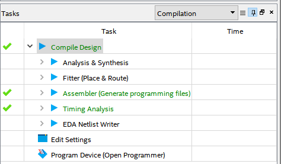
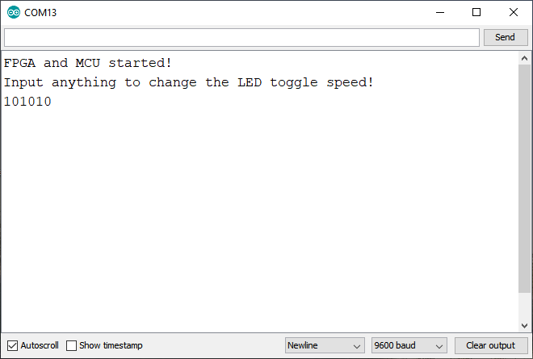

**Tutorial by [Daniel Hertz](https://www.nerdhut.de/)**, originally published on [Maker.pro](https://maker.pro/arduino/tutorial/getting-started-with-fpgas-using-the-arduino-mkr-vidor-4000)

Intimidated by FPGAs? Don't be! Learn about Arduino's most programmable board with this Arduino MKR Vidor 4000 tutorial. The [Arduino MKR Vidor 4000](https://store.arduino.cc/arduino-vidor-4000) is an interesting Arduino development board for many reasons. It not only contains a 32-Bit MCU, Wi-Fi, Bluetooth®, a camera interface, and built-in HDMI support but it also features an on-board [Intel Cyclone 10 FPGA](https://www.altera.com/content/dam/altera-www/global/en_US/pdfs/literature/hb/cyclone-10/c10lp-51001.pdf).

## What Is an FPGA?

A field-programmable gate array (FPGA) is an integrated circuit that can be freely configured by a user again and again to implement a logic function. This process is similar to programming a microcontroller. However, on an FPGA, you don't upload software that runs on set hardware.

Instead, you configure the FPGA to be the hardware itself. This enables you to implement very fast filters, audio and video processors, and other things that microcontrollers aren't able to do.

You can think of the Intel Cyclone on the MKR Vidor as a freely configurable expansion board that allows you to implement different hardware that can be used with the Arduino.

If you're interested in a deeper dive around FPGAs, check out his article about [FPGA HDL basics](/learn/programming/vidor).

## Setting Up the Basics

Before you can begin, you need to install the board's core in Arduino IDE. If you are using Windows, the necessary drivers will be installed automatically when you perform these steps.

In Arduino IDE, select **Tools** and open the board manager; in the window that opens up, search for "MKR 4000" and install the following package:

Once that's done, you are ready to go! This package allows you to program the MCU in Arduino IDE just like you would with any other Arduino compatible board. But remember, regular Arduino programming is not what we're discussing in this article.

## The Vidor 4000 and Verilog

Unfortunately, there's no easy way to program the Intel Cyclone 10 FPGA on the Vidor board. But experienced users can utilize Verilog to configure the FPGA. To do this, you'll need the Arduino IDE, [Intel Quartus Prime 18.1](https://fpgasoftware.intel.com/18.1/?edition=lite&amp;platform=windows) (or newer), and a tool that converts the compiled files for the FPGA.

The official program is available in this [Vidor 4000 repository on GitHub](https://github.com/vidor-libraries/VidorBitstream/tree/release/TOOLS/makeCompositeBinary). However, I used an [alternative VidorFPGA version](https://github.com/wd5gnr/VidorFPGA) as well as the accompanying Verilog project I'll use throughout this article.

## Compiling and Uploading Code

Once you [download the sample project](https://github.com/wd5gnr/VidorFPGA/tree/master/vidordemo/projects/MKRVIDOR4000_template), it's time to compile and upload it to the board. Open the Quartus project in the IDE and you'll see something similar to this:

Make sure to open these two files:

- MKRVIDOR4000_top.v

- user.v

MKRVIDOR4000_top.v is the main file, where all the pins are defined. User.v gets included in the first file, and it contains your custom code.

Note that the pins can not be shared between the microcontroller and the FPGA. If you accidentally define the same pin as an output or input in the Arduino sketch and the Verilog program, your board might get damaged. However, it's possible to use the pins to transfer data between the two devices.

## Compile the FPGA Code

Once you are ready to compile the FPGA code, double-click the Compile Design task on the left-hand side of the Quartus main window.

When the process is finished, a compiled ttf-file is placed in the output-files folder within your project's main folder. Use the conversion program to modify this file and then change its name to app.h and place it in the same directory as your Arduino sketch.

A short Arduino program can be downloaded [clicking HERE](https://content.arduino.cc/assets/SketchVidorFPGA.zip). It already contains a compiled and converted version of a simple Quartus test project that was taken from the GitHub repository mentioned above.

## Upload the Sketch and FPGA Configuration

The last step is uploading the sketch and the FPGA configuration to the Arduino. This can be accomplished with the Arduino IDE, just like for any other Arduino board. The microcontroller on the MKR Vidor 4000 will directly communicate with the FPGA and reconfigure it over JTAG.

It's worth mentioning that you can also use the JTAG pads on the board to upload the code to the FPGA directly. Once the code uploads, you should see something similar to this in the serial monitor:

## Final Reminders About the Vidor 4000

Arduino intended for the FPGA on the Vidor 4000 to be used with pre-configured Verilog IP-blocks. Luckily, the FPGA can be fully configured with Verilog and, with a few extra steps, the code can easily be uploaded to the board.

The microcontroller and the FPGA can communicate over the GPIO pins. However, they can not simultaneously use the same pin as either an in- or output. The microcontroller directly configures the FPGA, but it's also possible to do this manually by utilizing the JTAG header on the board.
