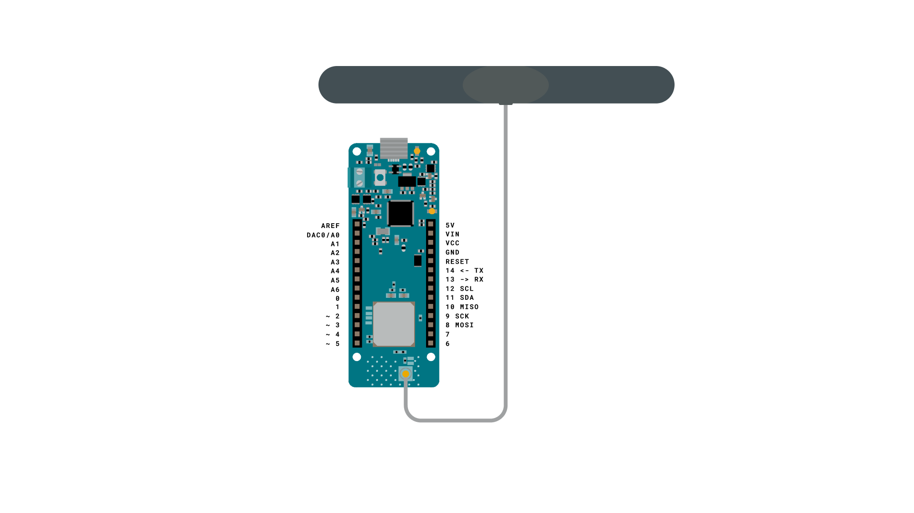
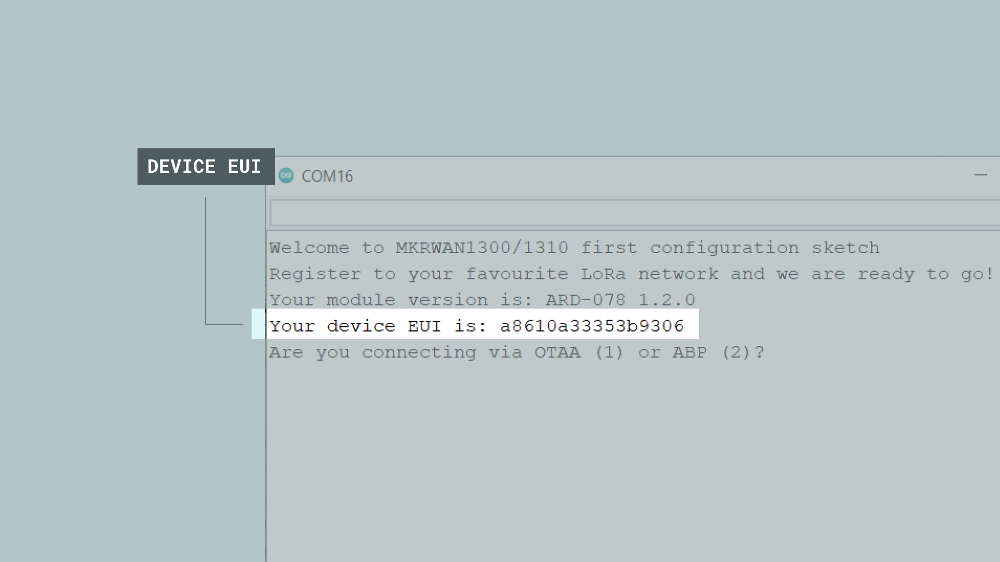
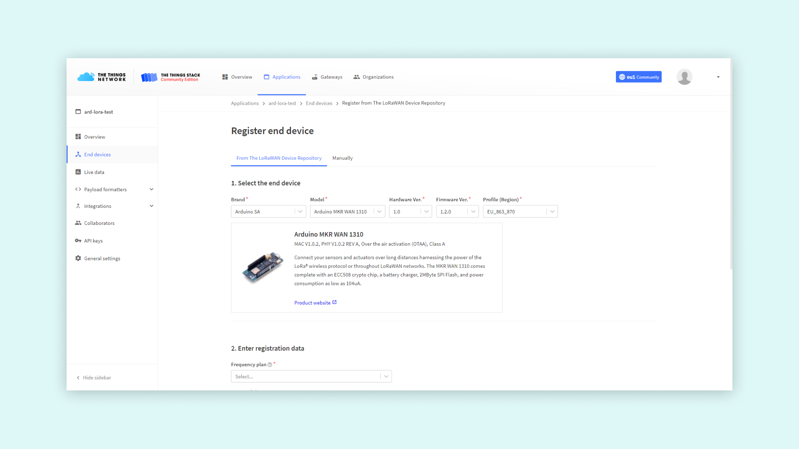
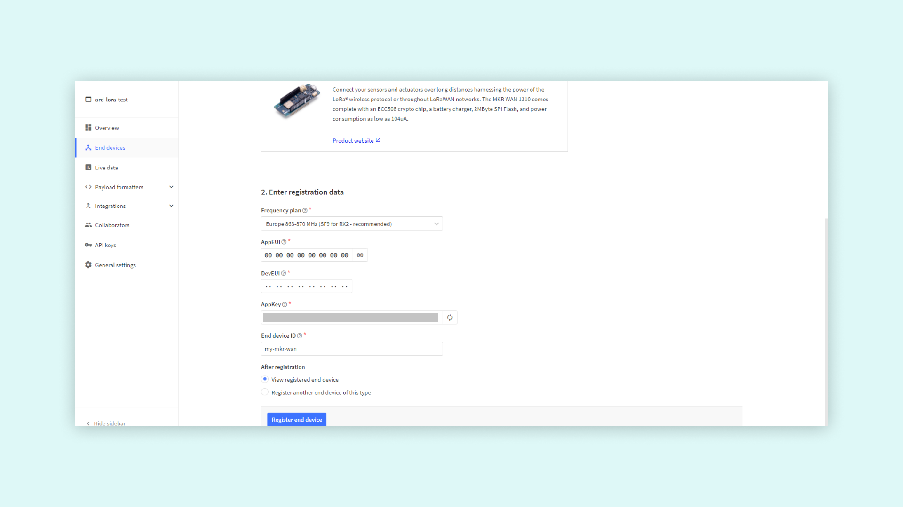
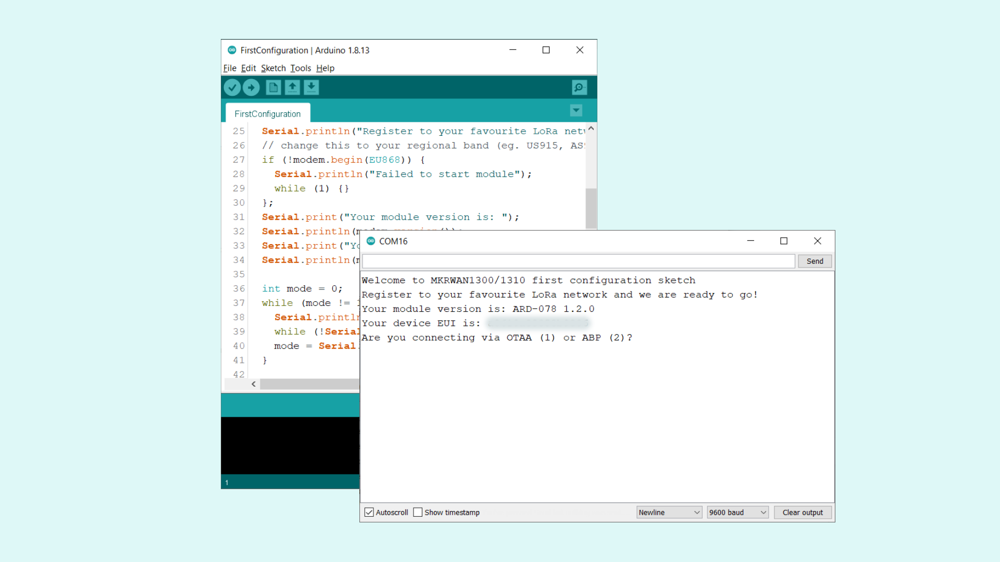
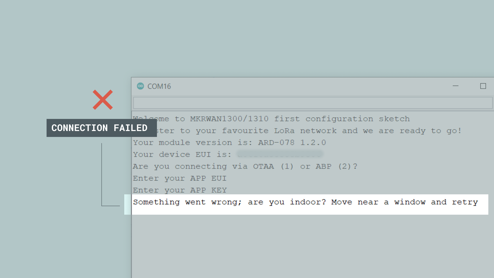
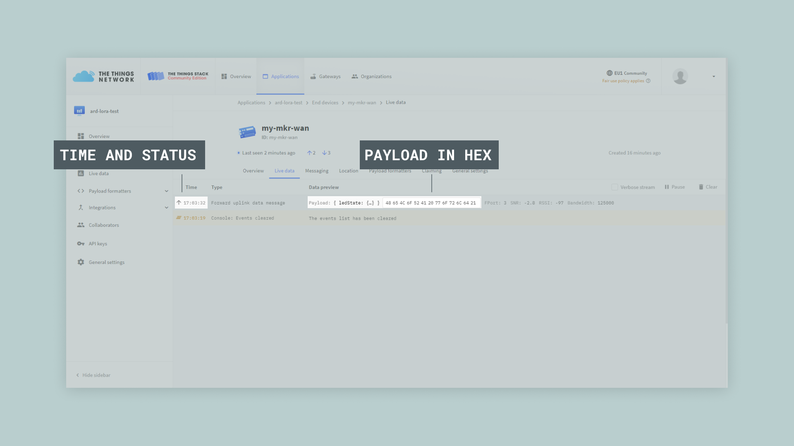

## Introduction 

In this tutorial, we will go through how to set up the MKR WAN 1300 board to work with The Things Network (TTN).

It is a good idea to already look at the limitations of using LoRa®. As with any technology, there advantages and disadvantages, and with LoRa®, there's also some limitations of how much data we can send. You can read more about this through the link below:

- [Limitations of LoRaWAN®](https://www.thethingsnetwork.org/docs/lorawan/limitations.html)

## Goals

The goals of this project are:

- Obtain the MKR WAN 1300's device EUI.
- Create a The Things Network (TTN) account.
- Establish a connection between the MKR WAN 1300 board and TTN.
- Send a payload from device to TTN.
- Decode the payload from hexcode to text.

## Hardware & Software Needed

- Arduino IDE ([online](https://create.arduino.cc/) or [offline](https://www.arduino.cc/en/main/software)).
- [MKRWAN](https://www.arduino.cc/en/Reference/MKRWAN) library installed.
- Registered account on [The Things Network](https://console.cloud.thethings.network/).
- 1x [Arduino MKR WAN 1300](https://store.arduino.cc/mkr-wan-1300).
- 1x [Antenna](https://store.arduino.cc/antenna).
- 1x micro USB cable.


## LoRaWAN®

LoRaWAN®, stands for **Long Range Wide Area Network**, which is becoming increasingly popular in the Internet of Things-sphere, due to its capability of sending data over larger distances using minimal battery power and ensuring that data and credentials remain secure. There are also other acronyms that are associated with LoRaWAN® such as:

- LoRa® which stands for Long Range
- LP WAN which stands for Low Power Wide Area Network

LoRa® devices come with lower data rates, with longer intervals than i.e. a device connected through WiFi. This is due to  the low-power consumption and long range that LoRa® technology puts emphasis on. 

While the data rate may be a restriction, let’s have a look at some of the amazing features LoRa® technology comes with:

- **Long range:** Up to 5km in an urban setting, 10km in suburban and up to 80km un-disrupted. 

- **Power consumption:** Our latest addition, the MKR WAN 1300, can now have as low power consumption as 104uA, when configured properly.

- **Security:** The MKR WAN 1300 board comes with the crypto chip (ECC-508), which allows us to store data and credentials securely.

In this tutorial, we will be covering the basics of setting up a MKRWAN series device to connect to the LoRa® network, through something called The Things Network (TTN). We can start by looking at [this map](https://www.thethingsnetwork.org/map) to see if we are within reach of a gateway.

### Circuit



## Step by Step

The aim with this tutorial is to achieve a connection between a MKR WAN 1300 board and The Things Network (TTN). First, we will need to retrieve our device's Extended Unique Identifier (EUI). Then, we will create an account at [The Things Network](https://console.cloud.thethings.network/), connect to a gateway in range and send a message through the gateway to the TTN service. 

**1.** First, let's make sure we have the drivers installed. If we are using the Web Editor, we do not need to install anything. If we are using an offline editor, we need to install it manually. This can be done by navigating to **Tools > Board > Board Manager...**. Here we need to look for the **Arduino SAMD boards (32-bits ARM Cortex M0+)** and install it. 

**2.** Now, we need to install the library needed. If we are using the Web Editor, there is no need to install anything. If we are using an offline editor, simply go to **Tools > Manage libraries..**, and search for **MKRWAN** and install it.

**3.** Once we have downloaded the library, we will need to upload an example from the **MKRWAN** library, called **FirstConfiguration**. We will find this in **File > Examples > MKRWAN > FirstConfiguration**. You can also find the code in the snippet below:

Copy and paste the code into the editor, and upload it to the board. Once we have uploaded the code successfully, open the Serial Monitor and an interface will appear in it. Here we will find the unique Device EUI as displayed in the picture below:



We will need to copy and save the device EUI, as we are going to use it in the TTN service.

Now, we will need to create and activate an account at [thethingsnetwork](https://console.cloud.thethings.network/). 

Once we have activated our account, go to the [TTN landing page](https://console.cloud.thethings.network/), first select your region and log in, then you will be taken to the landing page. Here, we will click the **"Create an application"** button, or **"Go to applications"** if you already have one created.

 

Here we need to fill in a unique name for our **application**. In this tutorial, we used **ard-lora-test**. When we have filled this in, we can click on the **"Create application"** button.


We have now created the application, and will move on to registering our device. There should now be a **"End devices"** section and a link that says **"Add end device"**, which we can click.


On the registration page, first we have to fill in information about our board. Select brand, **Arduino SA**, and then model, **Arduino MKR WAN 1310**, a MKR WAN 1300 will also work with this selection. Hardware and Firmware versions will automatically select the newest ones. Then set your preferred region.



In the second step of registering the device, fill in **End device ID** and **EUI**. You can click the generate button next to the AppKey field to generate an app key for this device. Similarly, you can press the button next to the AppEUI field to make it all zeros, or enter your own AppEUI.

**Note**: The Device ID must be lowercase and without spaces. The **EUI** should be copied from the Serial Monitor.



After pressing the Register button, your board will show up on the **Device Overview** page. You can now see all the information needed to complete the Arduino setup.

In our device overview, we can now see three rows: Device EUI, Application EUI and App Key. These contain information that we will need in the next few steps.


Now, we need to open the **FirstConfiguration** sketch again. To be safe, reset your board and open the Serial Monitor again. Once the program starts, it will start asking questions in the Serial Monitor. The first one is if we are using OTAA or ABP. We will use OTAA, so we can enter a **"1"** in the monitor and hit **"send"**.



Now it will proceed to ask for our **APP EUI** and **APP KEY**. Simply copy these from the device information inside the TTN service. Once we have entered them, the device will try to connect to TTN.


This can be quite a time-consuming process, and will most likely involve more than one attempt. There are two possible outcomes: either it successfully connects, or it fails. 

### If Connection Fails

If the connection fails, we will see the message:

```
Something went wrong; are you indoor? Move near a window and retry
``` 

This means we have not been able to connect to TTN. 



The most common issue is that the device cannot connect to a TTN gateway. Again, it is a good idea to check if we have coverage in the area we are conducting this tutorial, by checking out [this map](https://www.thethingsnetwork.org/map).

If we are within good range of a gateway, we should also try to move our device and antenna to a window, and even hold it out the window and move it around. This has proven successful on numerous accounts, as the signal can travel less obstructed. 

### If Connection Is Successful

If it succeeds, the Serial Monitor will print: 

```
Message sent correctly!
```

This means we have successfully been able to both connect, and send a payload to TTN. 


The payload contains a very simple message: `HelLora world!`, coded in HEX. This can be seen in the **"Live data"** tab in the **"End device"** overview. Here we can view any incoming data from our device. If the messaged was sent successfully, it will appear here. Any unsuccessful attempts to connect will also be listed here, with a **lightning** icon next to it.



As the payload comes in a HEX format, we will need to decode it. This can be done by using a Hex code translator, such as [this one](https://www.qbit.it/lab/hextext.php). We can also automate it directly in the TTN console, by navigating to our application overview, and to the **"Payload Formats"** tab. 

Here, we can enter a custom code, that will convert the incoming data in HEX format to a simple text format. Select Javascript as **Formatter type**, then use the code below as **Formatter parameter**.

```javascript
function Decoder(bytes, port) {
 var result = ""; 
 for (var i = 0; i < bytes.length; i++) { 
   result += String.fromCharCode(parseInt(bytes[i])); 
 } 
 return { payload: result, };
}
```

This will decode the incoming message and add the text "payload: yourmessage" at the end of the incoming payloads. That way, we do not need to manually translate it each time we get a new message. 

## Conclusion

In this tutorial, we have looked at how to connect our MKR WAN 1300 board to the The Things Network (TTN). We have retrieved the device EUI, used it to register the device in the TTN console, and programmed the board using the data provided by TTN.

As long as we are in range of a TTN gateway, we can now send data over the LoRa® network which can be viewed from anywhere in the world (as long as we have an Internet connection). 

