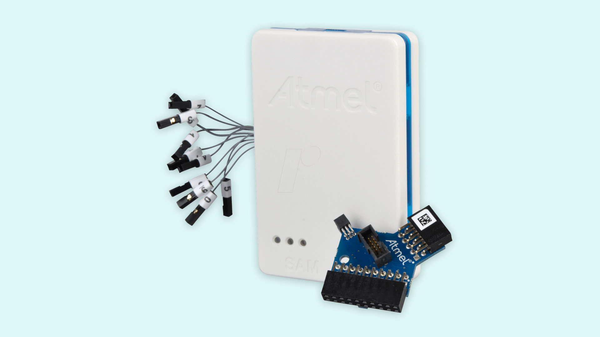
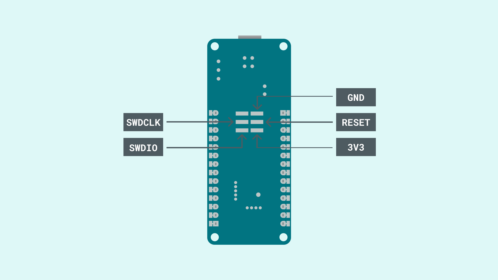
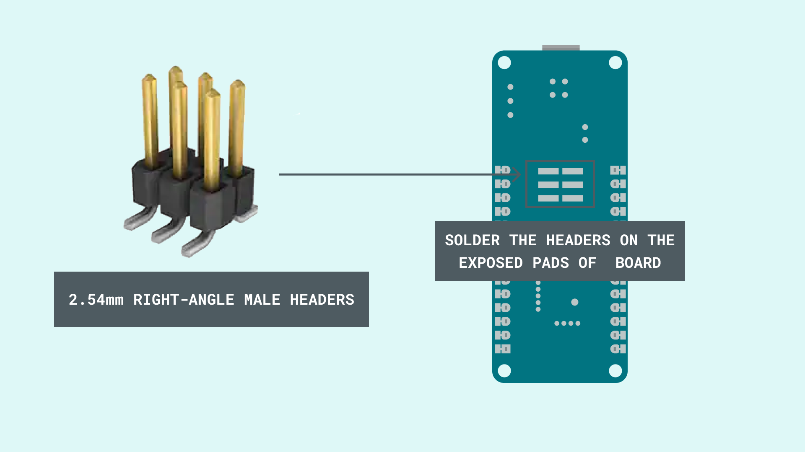
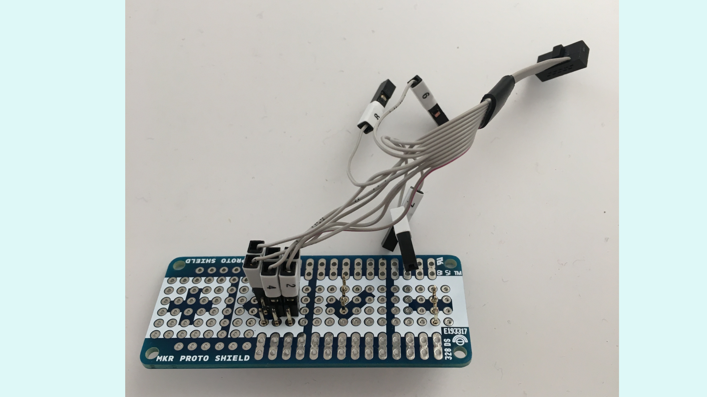
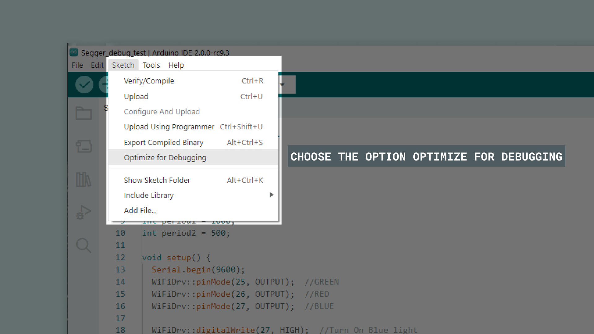
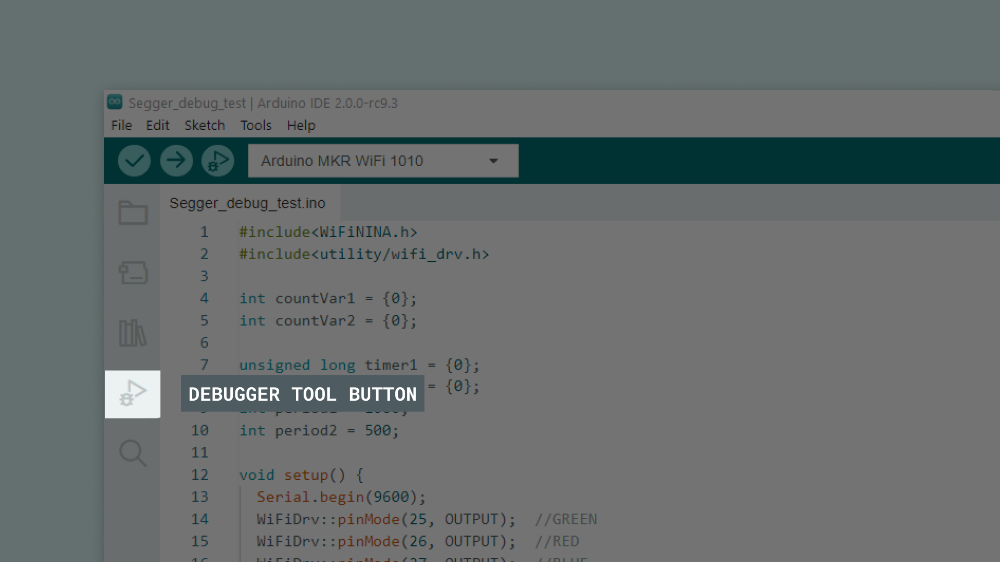
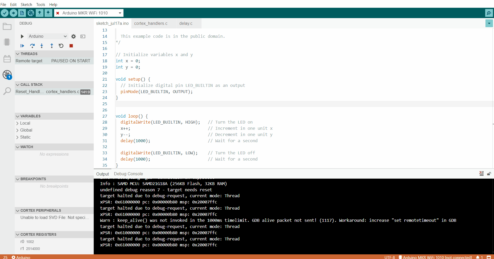
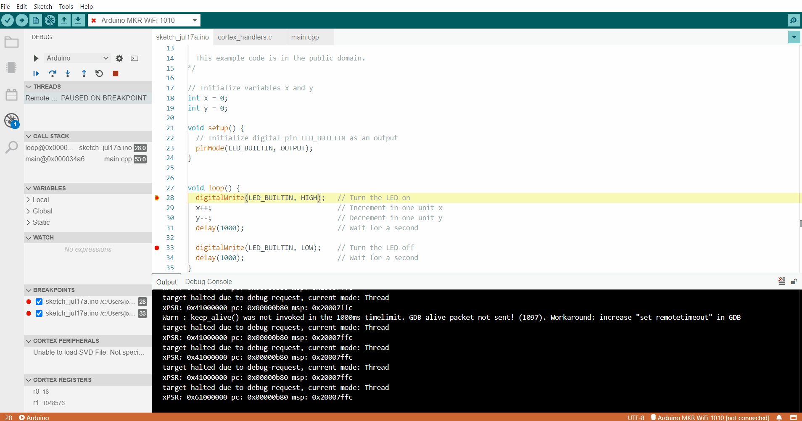
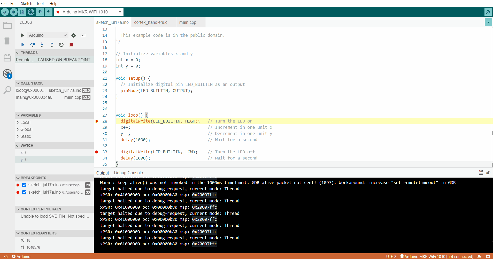

## Introduction

In this tutorial, we will learn how to use the [Atmel-ICE](https://www.microchip.com/DevelopmentTools/ProductDetails/ATATMEL-ICE) development tool with the new [Arduino IDE 2.0](https://www.arduino.cc/en/software#experimental-software) for debugging SAM-based Arduino® boards. Using an [Arduino MKR WiFi 1010](https://store.arduino.cc/arduino-mkr-wifi-1010) board and a simple program, we will learn about the debugging functionalities that are integrated with the debugger tool of the new IDE 2.0.

## Goals

The goals with this tutorial are: 

- Learn how to use an [Atmel-ICE](https://www.microchip.com/DevelopmentTools/ProductDetails/ATATMEL-ICE) development tool with the new [Arduino IDE 2.0](https://www.arduino.cc/en/software#experimental-software) and a SAM-based Arduino® board.
- Learn about the debugging functionalities of the new [Arduino IDE 2.0](https://www.arduino.cc/en/software#experimental-software).

## Hardware and Software Needed

The hardware and software used in this tutorial:

- [Arduino IDE 2.0](https://www.arduino.cc/en/software#experimental-software).
- [Arduino MKR WiFi 1010](https://store.arduino.cc/arduino-mkr-wifi-1010) board.
- [Atmel-ICE](https://www.microchip.com/DevelopmentTools/ProductDetails/ATATMEL-ICE) development tool.
- 10-pin mini-squid cable (included with the Atmel-ICE development tool)
- Micro USB cable (x2).
- 2.54mm right-angle male headers (x6).
- 2.54mm straight male headers (x6 - optional).
- [MKR Proto Shield](https://store.arduino.cc/mkr-proto-shield) (optional).
- Soldering iron, or a soldering station, and solder.

## The Atmel-ICE Development Tool

Atmel-ICE is a powerful development tool that can be used for **debugging** and **programming ARM&reg; Cortex&reg;-M-based SAM and AVR microcontrollers** with on-chip debug capability. One of the main features of Atmel-ICE is its support of several debugging/programming interfaces like JTAG, SWD, PDI, TPI, aWire, SPI, debugWIRE, and UPDI. For debugging SAM-based Arduino&reg; boards with the Atmel-ICE, we are going to use its **SWD interface**. 



## The SWD Interface

JTAG is the de facto interface for debugging and accessing a processor registers. This interface has been used for many years, and it is still largely used today. But JTAG has a drawback: **it uses many signals (or pins), at least four**. To address this drawback, ARM® created an alternative debug interface called the Serial Wire Debug (SWD) interface. 

The **SWD interface** is a **two-pin** (SWDIO/SWCLK) electrical alternative to the JTAG interface that has the same JTAG protocol on top. The SWD interface can be used to program the firmware of a processor and access its registers for debugging purposes. This interface and its associated protocol are now available in nearly all ARM® Cortex®-A, Cortex®-R, and Cortex®-M processors. 

### Preparing the SWD Interface

Before we connect the Atmel-ICE development tool to our Arduino® MKR WiFi 1010 board, we have to prepare the SWD interface pins of our board. The MKR WiFi 1010 board has the SWD interface pins, SWDIO and SWCLK, connected to the J2 header as shown in its [schematic](https://content.arduino.cc/assets/MKRWiFi1010V2.0_sch.pdf). 


The J2 header pins of the MKR WiFi 1010 board are located on the **underside** of the board in the exposed pads; the pinout is shown in the image below:



There are several methods to connect the J2 header pins of the MKR WiFi 1010 board to the SWD interface of the Atmel-ICE development tool. For example, one method can be **soldering wires directly on the exposed pads**; in this tutorial, we are going to explain how to set up two different methods: **one that requires soldering and one that doesn't**. 

> Note: The goal is to **reach** the exposed pads that are located on the underside of the board, feel free to choose one of the two methods that are explained in this tutorial or to implement another solution not mentioned here.  

### Method 1: Soldering 2.54mm Right-Angle Male Headers

In the first method, the one that requires soldering, **6 2.54mm right-angle male headers are soldered on the exposed pads** as shown in the image below:



Now you can connect the mini-squid cable to the soldered right-angle headers. Notice that, while the headers are soldered to the exposed pads of the MKR WiFi 1010 board, you are not going to be able to use the board in a breadboard because it won't fit. 
### Method 2: Using a MKR Proto Shield and Headers

In the second method, the one that doesn't requires any soldering, a **MKR Proto Shield and 6 2.54mm straight male headers** can be used to access the exposed pads of the MKR WiFi 1010 board as shown in the images below:



Besides not requiring any soldering, with this method the MKR Proto Shield remains also fully reusable. Now you can connect the mini-squid cable to the straight headers in the shield.


## Connecting the Atmel-ICE to the MKR WiFi 1010

Now that we have the MKR WiFi 1010 board SWD interface, we can connect it to the Atmel-ICE SWD interface. The Atmel-ICE development tool has two ports: an AVR and a SAM port. We can use both ports to access the SWD interface pins; the required connections are described in the table below: 

| Name |AVR Port Pin|SAM Port Pin|Description                        |
|------|------------|------------|-----------------------------------|
|SWDCLK|1           |4           |Serial Wire Debug Clock.           |
|SWDIO |5           |2           |Serial Wire Debug Data Input/Output.|
|SWO   |3           |6           |Serial Wire Output (optional).     |
|nSRST |6           |10          |Reset.                             |
|VTG   |4           |1           |Target voltage reference.          |
|GND   |2, 10       |3, 5, 9     |Ground.                            |

We used the SAM port in this tutorial; this means we used the pins **4**, **2**, **6**, **10**, **1** and **3** (just one GND connection is enough) of the SAM port. 

> Note: be careful and **double-check the connections between the Atmel-ICE and the MKR WiFi 1010 board SWD interfaces to avoid damaging one or both devices**. 

If the SWD interfaces of the debugger and the board are connected properly, a **green LED should turn on in the debugger**. Now that we have both devices, the Atmel-ICE and the MKR WiFi 1010 board, SWD interfaces connected, its time to use the **debugger tool** of the Arduino IDE 2.0.

## Using the Debugger Tool

Now that we have our hardware set up, we can learn how to use the IDE 2.0 Debugger Tool main functionalities through the [**Debugging with the Arduino IDE 2.0 tutorial**](https://docs.arduino.cc/software/ide-v2/tutorials/ide-v2-debugger). This tutorial goes through some key features of the Debugger Tool, and includes pointers to get started. 

As explained in the [**Debugging with the Arduino IDE 2.0 tutorial**](https://docs.arduino.cc/software/ide-v2/tutorials/ide-v2-debugger), before we can use the Debugger Tool of the Arduino IDE 2.0, we need to upload a sketch to our MKR WiFi 1010 board, making sure it is optimized for debugging. Let's try a simple program that blinks the onboard LED of our MKR WiFi 1010 board and changes the value of several variables while running. 

### 1. Setting Up

Let's start by opening the Arduino IDE 2.0 and connecting our MKR WiFi 1010 board to our computer with a micro USB cable. The IDE should recognize automatically the board, if so, the board and port should appear as shown in the image below:


### 2. Creating the Test Code

Let's try the example code show below, it is a simple program that blinks the onboard LED of our board and changes the value of variables `x` and `y` while running. Open a new sketch, copy and paste the code show below:

```arduino
/*
  Simple Debugger Test

  This example blinks the onboard LED of an Arduino board and changes 
  the value of the variables x and y wwhile running. The purpose of 
  this example is to test the debugging functionalities of the Arduino 
  IDE 2.0.

  The circuit:
  - Arduino MKR WiFi 1010

  Created by José Bagur

  This example code is in the public domain.
*/

// Initialize variables x and y
int x = 0;
int y = 0;

void setup() {
  // Initialize digital pin LED_BUILTIN as an output
  pinMode(LED_BUILTIN, OUTPUT);
}


void loop() {
  digitalWrite(LED_BUILTIN, HIGH);   // Turn the LED on
  x++;                               // Increment in one unit x
  y--;                               // Decrement in one unit y
  delay(1000);                       // Wait for a second

  digitalWrite(LED_BUILTIN, LOW);    // Turn the LED off 
  delay(1000);                       // Wait for a second
}
```

Before uploading the code to our board, we must optimize it for debugging. This can be made easily by clicking on the **Sketch** tab and then selecting the option **Optimize for Debbuging**:



With the **Optimize for Debugging** option selected, now its time to upload the code to our board and start debugging it.

### 3. Using the Debugger Tool with the Test Code

We can easily access to the Debugger Tool menu from the left sidebar of the Arduino IDE 2.0 where we can find also the **Board Manager**, **Library Manager**, **Search** and **Sketchbook Explorer**.  



Now, we can see the Debugger Tool menu expanded. Let's start using the debugger tool by selecting the **Start Debugging** button that is located near the **Upload** button:


We should see some text in the IDE console from the Debugger Tool. The text displayed in the console shows information about the current debugging session, the debugging hardware tool and the connected board; for example, the board's microcontroller part number should be recognized by the Debugger Tool as shown below:


Let's set two **breakpoints** in lines 28 and 33. The breakpoints can be set in the Debugger Tool by clicking to the left of the line numbering in the editor as shown below:



We should see now information about the breakpoint we created in the Debugger Tool menu. Let's also watch what is happening with variables `x` and `y` in the program. To watch this variables we must add them in **Watch** section of the Debugger Tool as shown below:



Now let's see what happens with the breakpoints and the x and y variables in the Watch section of the Debugger Tool. Let's use the **Continue** button, the program should run to the set breakpoints every time we press the Continue button as shown below, notice the value of x and y:



As expected, we can see that the value of x increases in one unit while the value of y decreases in one unit. Also we can see the onboard LED going on and off. 

## Conclusion

In this tutorial, we have learned how to use the Atmel-ICE development tool with the new Arduino IDE 2.0 for debugging SAM-based Arduino® boards. We learn how to connect the SWD interface of the Atmel-ICE development tool with the SWD interface of a MKR WiFi 1010 board. With a simple program, we learned also about the debugging functionalities of the debugger tool of the new Arduino IDE 2.0.

### Troubleshoot

Sometimes errors occur, there are some common issues we can troubleshoot:

- Missing a bracket or a semicolon in the code.
- Arduino board connected to the wrong port.
- Accidental interruption of cable connection of the board or the debugger.
- SWD interfaces of the debugger hardware tool and the board are not connected properly. 
- The debugging session in the IDE 2.0 didn't initialize correctly. 

We hope you enjoy the Debugger, and if you are having issues, please report them in [Arduino IDE GitHub repository](https://github.com/arduino/arduino-ide/issues).