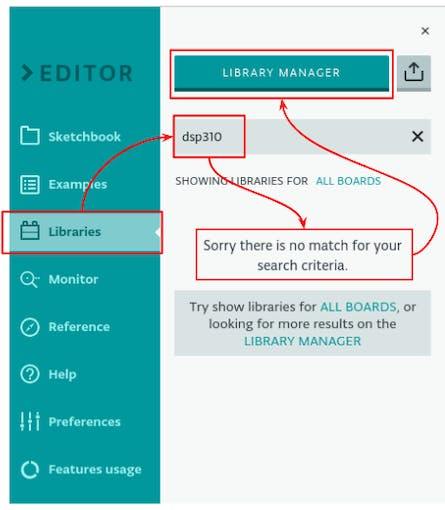
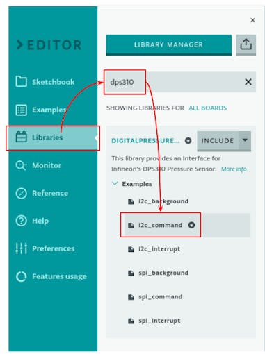
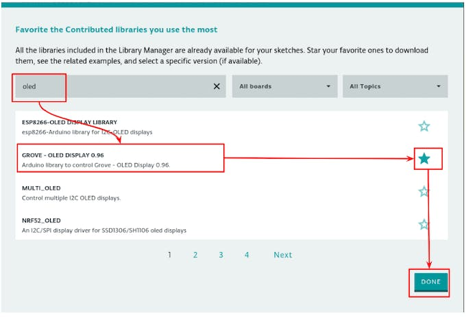
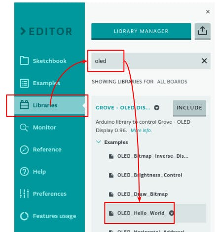
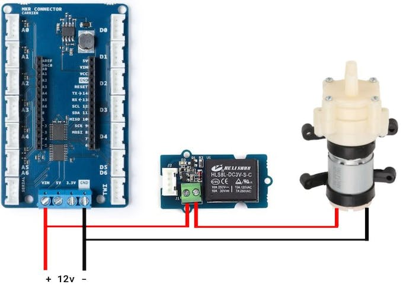

Gardens are a way to contribute to contrast the global warming. Maybe you don't have a backyard, but you have a balcony or a windowsill, in which you could put some plants!

Of course you have to take care of them, and here I am. Even if you don't have a green thumb (like me), you can successfully grow plants thanks to this project: an HGA, aka "Home Gardening Automation" system!

## Hardware & Software Needed

- [Arduino IDE](https://www.arduino.cc/en/software)
- [Arduino MKR Zero](https://store.arduino.cc/products/arduino-mkr-zero-i2s-bus-sd-for-sound-music-digital-audio-data)
- Seeed Grove Moisture Sensor
- Seeed Grove - Relay
- Seeed Seed - Grove - Oled Display 0.96"
- Seeed Seed - Grove - Water Sensor
- Seeed GROVE - HIGH PRECISION BAROMETRIC PRESSURE SENSOR (DPS310)
- Seeed Grove - I2C Hub
- Arduino MKR Connector Carrier (Grove compatible)
- Arduino USB cable type A male to micro type B male

### Circuit

This project is based on the Arduino MKRZERO, and few other Grove components ready-to-use; the BOM is the following:

- The Arduino MKRZERO itself
  
- The Arduino MKR Connector Carrier, that is used to connect easily to the Arduino board any of the hundreds Grove modules!
  
- The Grove Moisture sensor, used to measure the humidity level on the ground (connected to A0)
  
- The Grove Water sensor, used to check the water availability in the tank (connected to D0)
  
- The Grove relay module, used to activate the water pump - or if you prefer, you can drive an electronic valve (connected to D1)
  
- The Grove Barometric sensor, used to check the pressure and temperature (connected to TWI port with the Grove I2C Hub)
  
- The Grove OLED display, used to show all the values retrieved from the sensors, and other info (connected to TWI port with the Grove I2C Hub)


Then you have to add to the recipe:

- A pump or an electronic valve to water the plant(s)
  
- 12v power supply for Arduino and pump/valve powering
  
- last but not least: a vase with your plant

Of course you can reach the same setup using a breadboard, floating wires, spare components and a few time more!

## Programming the Board

To use the MKRZERO board, there are 2 options. Either using the Arduino Web Editor or using the Arduino IDE. You can find more information on the Web Editor and IDE setup for the MKRZERO at [this link](https://docs.arduino.cc/hardware/mkr-zero).

After connecting your Arduino to the usb port, be sure to have selected the right board and the right port.

Let's start sketching!

## Sketch #1: Water Level Sensor

The water sensor is connected to pin D0 and it works like a switch: it there water on its surface (or touching both the wire ends), then it will be read like a pressed switch.

So we can start with a simple sketch, to test the sensor!

```arduino
const int waterSensor = 0;
void setup() {
 Serial.begin(9600);
 pinMode(waterSensor, INPUT);
}
void loop() {
 int waterStatus = digitalRead(waterSensor);
 Serial.prinln(waterStatus);
 delay(500);
}
```

Now open the Monitor (or Serial Monitor if you are working on the IDE) and you'll see a column of "1".

If you touch the surface of the sensor with a wet finger, you'll see the number changing to "0".

So, the value in case of water presence, is LOW (0)!

```arduino
void loop() {
int waterStatus = digitalRead(waterSensor);
//the Water Sensor gives 0 when it measure water presence
Serial.println(waterStatus);
if (waterStatus == LOW) {
 //system ok
}
delay(500);
}
```

Save the code, and go on with the next step.

### Water Sensor Hacking

In order to use the water sensor to check the water availability in a tank, we have to fit the sensor inside it.

We can do a little hack to the sensor if we want to check the presence of water at a certain level or a minimum quantity of water.

We need two solid wires, of different length. For example, if we want to be sure to check the presence of at least 10 cm of water, the difference length will be exactly that.


Now just look at the water sensor: there is a sequence of tinned bar, alternatively connected together.


When a drop of water touch at least 2 adjacent bars, then the circuit is closed.

So we have to solder one ends of the solid wires to 2 tinned bar that are not connected together.


Now it will be enough to fit the solid wires in the water, and let the sensor outside the tank, in order to measure the water availability.

## Sketch #2: Barometric Sensor

We have a barometric sensor based on the DPS310 chip, connected to the TWI port.

We can use it to read the pressure and the temperature.

If we try to search a library for this component, we'll see that there's no one available.

That's because not all libraries are directly available: sometimes we need to install a new one, by using the Library Manager.



Let's install the Infineon library, simply by starring it!


Now that the library is available, for a basic test of the sensor, we can try the "I2C_command" example.



From that example, we'll get the lines needed for the sensor to work!

We'll need to add to our code the include of the library and the creation of a new Dps310 object, in order to use it.

```arduino
#include <Dps310.h>
// Dps310 Opject
Dps310 Dps310PressureSensor = Dps310();
//more oversamplig (7 is the highest usable value) means more precision!
const int dps310_oversampling = 7;
```

Then we need to initialize this object in the setup:

```arduino
Dps310PressureSensor.begin(Wire);
```

and then we need only to put these rows in the loop, to have a pressure and temperature values!

```arduino
float temperature;
float pressure;
Dps310PressureSensor.measureTempOnce(temperature, dps310_oversampling);
Dps310PressureSensor.measurePressureOnce(pressure, dps310_oversampling);
```

We'll use these values later on!

## Sketch #3: Moisture Sensor and Relay

Let's introduce in the system another sensor: the Moisture Sensor.

Fitted in the ground, it's able to measure its humidity level. The output is an analog value (in the range 0-1023), so it's connected to the A0 pin.

The relay, connected to pin D1, will be used to activate a pump, or to open an electronic valve, that need far more than the 3v3 provided by the MKRZERO board in order to work!

Now, we need to find out the threshold for the moisture sensor, used to trig the watering.

First, fit the sensor in the plant ground. Then upload this simple sketch, and open the serial monitor.

```arduino
const int moistureSensor = A0;
void setup() {
 Serial.begin(9600);
}
void loop() {
 int moistureStatus = analogRead(moistureSensor);
 Serial.prinln(moistureStatus);
 delay(500);
}
```

Now look at the values scrolling in the serial monitor, first with the dried ground, and then after watering the plant. The value we are going to use as threshold, is between the lower and the higher seen in this test.

Now come back to the main sketch.

We need to update the header by:

- Defining the constant for the relay and moisture sensor pins;

- Define the threshold for the moisture sensor;

- Define a duration, used to control the quantity of water provided. Depending on the pump or the pipe diameter, we could need 10 seconds or up to minutes; we need to check on our specific setup to estimate the right value.

- Define an interval between watering, in order to let the water to be absorbed, before to check again the ground humidity. It depends on our specific setup (for example, on the dimension of the vase).

- Define a couple of variables to keep the count of when we started the last watering, and the actual watering status.

```arduino
//Grove Relay -> D1
const int relay = 1;
//Grove Moisture Sensor -> A0
const int moistureSensor = A0;
//watering duration and threshold
const int threshold = 256;
const int watering_duration = 30 * 1000;
const int interval_between_watering = 60*1000;
unsigned long last_watering =  0;
bool watering = false;
```

Then move to the loop().

Add these line at the beginning:

```arduino
unsigned long now = millis(); 
unsigned long last_watering_ago = now - last_watering;
```

`millis()` returns the milliseconds passed since the board began running the current program, and it's very useful if we need to track intervals or duration.

`last_watering_ago` is used to store the total time passed since the last watering.

The first check is if it's passed at least the `interval_between_watering`.

If so, we can evaluate the humidity measurement, and if it's lower than the threshold, than the relay will be turned on. At the same time, it will update the `last_watering` and the watering variables in order to keep track of what's happening (and when).

```arduino
   if (last_watering_ago > interval_between_watering) {
     //check the humidity level, and if under the threshold, start watering!
     if (moistureStatus < threshold) {
       last_watering = now;
       watering = true;
       digitalWrite(relay, HIGH);
     }
   }
```

We have to add only another piece of code: the one that will turn off the relay after the watering_duration time. It will update the watering status as well.

```arduino
 if (now - last_watering >  watering_duration) {
     watering = false;
     digitalWrite(relay, LOW);
   }
```

## Sketch #4: OLED Display

The last component is the Oled Display!

It's quite small but the definition is high enough: it allows you to display graphics or up to 8 rows of text.

We'll use it to display all the sensors' measurements.

As already done for the pressure sensor., we have to use the Library Manager in order to install the right library. Just search for "oled" and star the Grove Oled Display 0.96 library



For a basic test of the display, we can start from the OLED_Hello_World example:



To include the display in our main skecth, we have to include the required libraries:

```arduino
#include <Wire.h>
#include <SeeedOLED.h>
```

and to initialize the display in the setup and clear it at least at the beginning:

```arduino
Wire.begin();
SeeedOled.init();
SeeedOled.setNormalDisplay();      //Set display to normal mode
SeeedOled.setPageMode();           //Set addressing mode to Page Mode
SeeedOled.clearDisplay();          //Clear the display
```

Now we can use it in our loop.

For every element we want to display, we have to specify the row and the column where we want it to appear using the `setTextXY` function.

Then for every data type, there's a different function to print it:

- String: `putString()`

- int: `putNumber()`

- float: `putFloat()`

Instead of using `clearDisplay` at every loop (it makes the display flickering!) we can "empty" the row used to display the measurements by putting a string of spaces, and then at the same position, write the new value!

The last row is used to display how many minutes ago the last watering was!

So at the end of the loop, just before the last curly bracket, we can put these rows:

```arduino
//1^ & 2^ rows: the moisture value
 SeeedOled.setTextXY(0, 0);           
 SeeedOled.putString("Moisture:");
 //empty the row
 SeeedOled.setTextXY(1, 2);
 SeeedOled.putString("        ");
 //...and then write the new value
 SeeedOled.setTextXY(1, 2);
 SeeedOled.putNumber(moistureStatus);
 //3^ & 4^ rows: the temperature value
 SeeedOled.setTextXY(2, 0);
 SeeedOled.putString("Temperature (C):");
 SeeedOled.setTextXY(3, 2);
 SeeedOled.putString("        ");
 SeeedOled.setTextXY(3, 2);
 SeeedOled.putFloat(temperature);
 //5^ & 6^ rows: the pressure value
 SeeedOled.setTextXY(4, 0);
 SeeedOled.putString("Pressure (hPa):");
 SeeedOled.setTextXY(5, 2);
 SeeedOled.putString("        ");
 SeeedOled.setTextXY(5, 2);
 SeeedOled.putFloat(pressure);
 //7^ & 8^ rows: Last watering
 SeeedOled.setTextXY(6, 0);
 SeeedOled.putString("Last (min. ago):");
 SeeedOled.setTextXY(7, 2);
 SeeedOled.putString("        ");
 SeeedOled.setTextXY(7, 2);
 //milliseconds / 1000 -> seconds / 60 -> minutes
 SeeedOled.putNumber(last_watering_ago / 1000 / 60); 
```

The result:


## Next Step

Now we have a fully automated system that will help us taking care of our plants at home. If we want to power the board and all the components, included the pump or valve, using a singular power supply, we have to switch to a 12V one. The MKR Connector Carrier is already ready to this voltage: there's screw block in which we can attach external power supply (VIN and GND).

In this simple schema you can find the power circuit and how to connect to it the relay and the pump.



The next improvements are then up to you! You could try to estimate the weather forecast upon the pressure variation! Or avoid watering if the temperature it too high. Or again, you could add a solar panel and a battery in order to have an off-grid system! And why not use the I2S combined to an uSD card to let your plants talk?