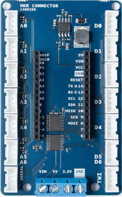
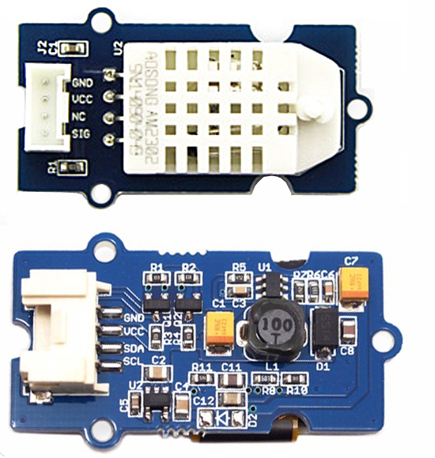

This basic example teaches you how to create a circuit that uses two Grove modules and requires no soldering. The MKR board you choose may be anyone of the MKR family because the connection is managed through the MKR Connector Carrier.

## Hardware Required

- [Arduino MKR family board](https://store.arduino.cc/arduino-genuino/boards-modules)
- [Arduino MKR Connector Carrier](https://store.arduino.cc/arduino-mkr-connector-carrier)
- [Grove DHT Module](https://www.seeedstudio.com/Grove-Temperature&amp;Humidity-Sensor-Pro-p-838.html)
- [Grove OLED 0.96"](https://www.seeedstudio.com/Grove-OLED-Display-0.96%22-p-781.html)

## Circuit

The connection to the Carrier board requires two standard Grove cables. The DHT humidity and temperature sensor goes to the D0 connector. The OLED screen is connected to the TWI connector.





We did not put a MKR board on the Carrier, but it is required to get the circuit to work, as specified in the bill of materials.

The DHT module uses a specific pin to communicate with the MKR board and it is  mapped on D0. This happens because the Grove standard for digital connections follows this rule:

PinFunctrionNotespin1DnPrimary digital i/opin2Dn+1Secondary digital i/opin3VCCPower to module 5V/3.3Vpin4GNDGround

and the module sends SIG on pin 1 that is mapped on the primary digital I/O.

In the picture, the OLED module is shown from component side to let you see the Grove connector. It goes into the TWI male on the MKR Connector Carrier that follows this pin mapping:

PinFunctrionNotespin1SCLI2C Clockpin2SDAI2C Datapin3VCCPower to module 5V/3.3Vpin4GNDGround

## Code

To drive the modules you need to load four separate libraries:

```arduino
#include <DHT.h>
#include <DHT_U.h>
#include <Wire.h>
#include <SeeedOLED.h>
```

The DHT module is mapped on D0 when the object dht is instantiated:

```arduino
DHT dht(0, DHT22);
```

The rest of the code is straightforward and keeps reading the `hum` and `temp` values to be printed on the OLED screen.

Here is the complete sketch:

```arduino

#include <DHT.h>
#include <DHT_U.h>
#include <Wire.h>
#include <SeeedOLED.h>

DHT dht(0, DHT22);

void setup() {

  Wire.begin();                 //initialize I2C in master mode

  SeeedOled.init();             //initialize the OLED

  SeeedOled.clearDisplay();     //clear the screen and set start position to top left corner

  SeeedOled.setNormalDisplay(); //Set display to normal mode (i.e non-inverse mode)

  SeeedOled.setPageMode();      //Set addressing mode to Page Mode
}

void loop() {

  float temp, hum;

  //Read temperature and humidity

  do {

    hum = dht.readHumidity();

    temp = dht.readTemperature();

  }

  while (isnan(temp) || isnan(hum));

  //Print temperature and humidity values on the OLED display

  SeeedOled.setTextXY(0, 0);

  SeeedOled.putString("Temperature:");

  SeeedOled.setTextXY(1, 0);

  SeeedOled.putString(String(temp).c_str());  //print temperature data converted to a c string

  SeeedOled.putString("C");

  SeeedOled.setTextXY(3, 0);

  SeeedOled.putString("Humidity:");

  SeeedOled.setTextXY(4, 0);

  SeeedOled.putString(String(hum).c_str());   //print humidity data converted to a c string

  SeeedOled.putString("%");

  delay(2000);
}
```