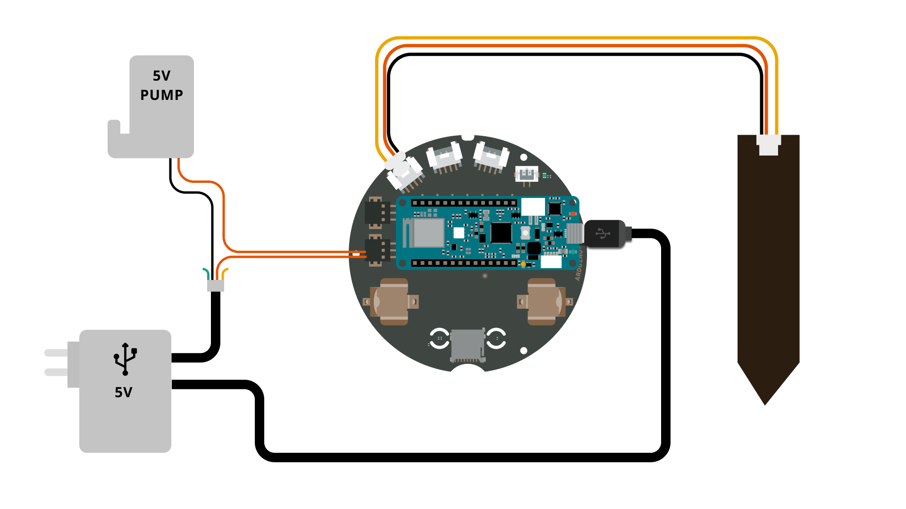
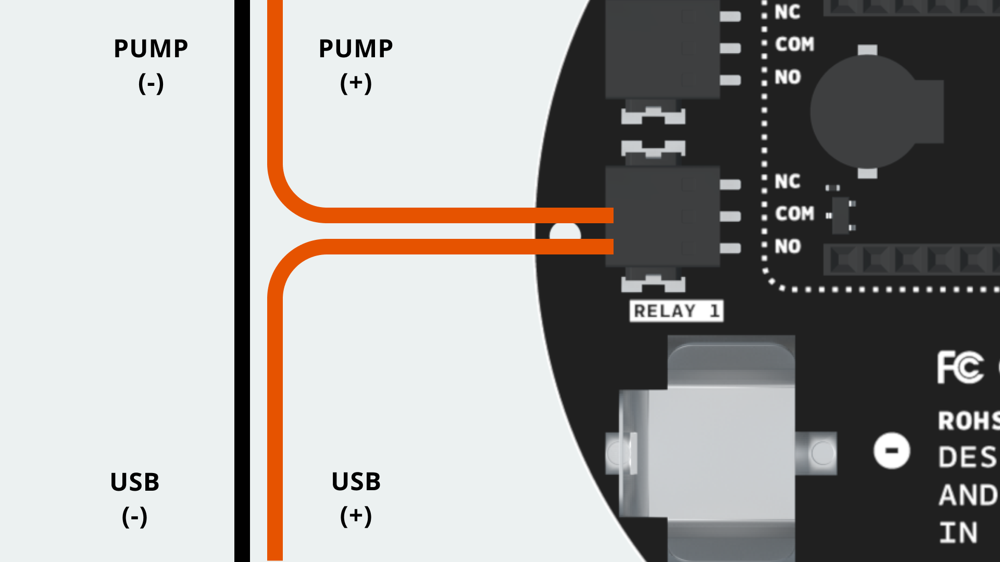
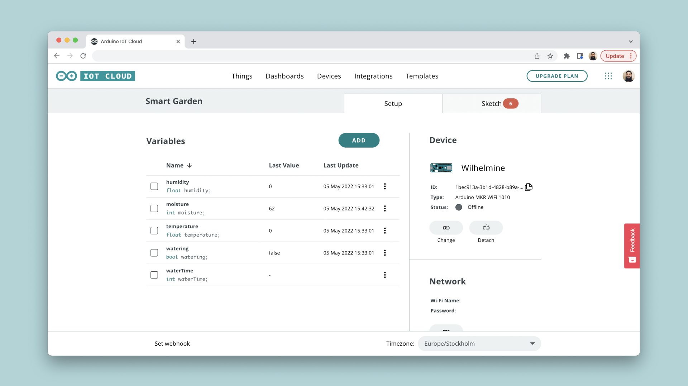
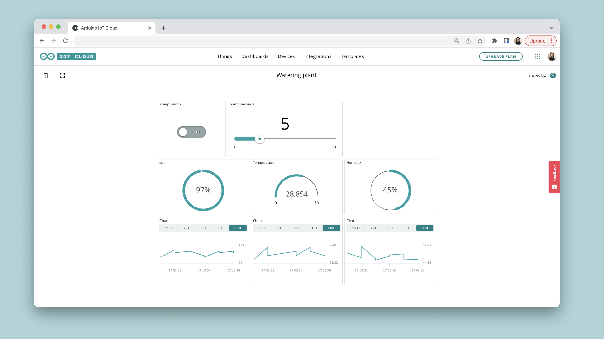
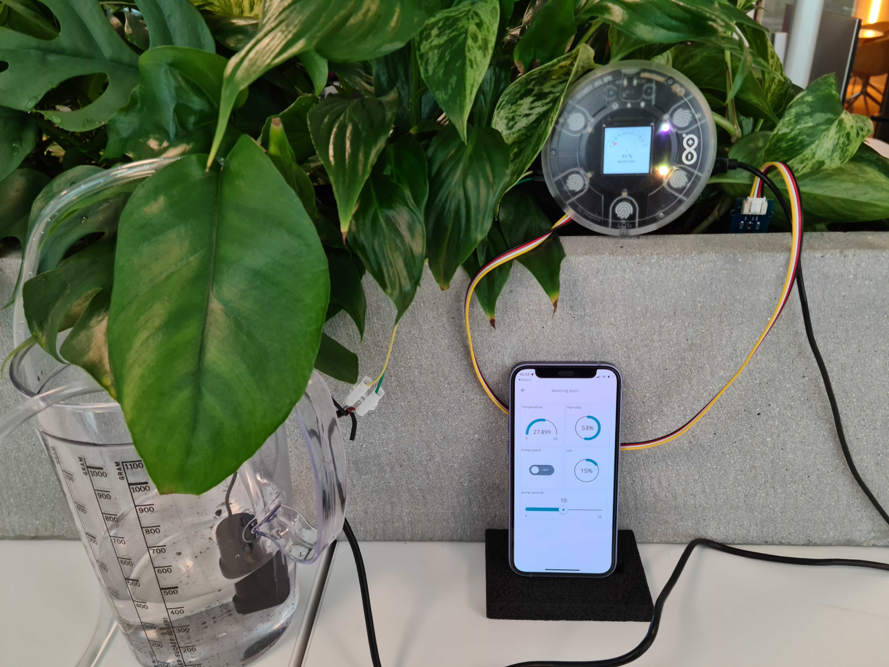

Decorating your home with plants is an easy way to bring some life into your day-to-day. The only problem is - those plants need water to survive, and if you forget to pay attention to them for a while you may need to start over. So instead of staying ever vigilant, why don't you spend an afternoon creating a setup that will let you both monitor the amount of moisture in your plants soil, and water your plants from afar using the Arduino IoT Cloud?

## How It Works

The MKR IoT Carrier has built in relay modules that can let you control circuits that are powered separately. In this tutorial we will be using one of the relay modules on the carrier to control a pump that can provide one of your plants with water from the Arduino IoT Cloud thanks to the functionality of the [Arduino MKR WiFi 1010](https://store.arduino.cc/products/arduino-mkr-wifi-1010). 

We will also connect a soil moisture sensor, and together with the sensors onboard the MKR IoT Carrier, we will create a sophisticated smart garden setup, capable of:

- Automatic or remotely triggered watering of your plant **(with a pump)**.
- Check the moisture of your plant **(with a moisture sensor)**.
- Check the temperature/humidity **(using the onboard HTS221 sensor)**.


## Hardware & Software Needed

- [MKR WiFi 1010](https://store.arduino.cc/products/arduino-mkr-wifi-1010)
- [MKR IoT Carrier](https://store.arduino.cc/products/arduino-mkr-iot-carrier)
- 5V submersible pump.
- 1 meter watering pipe.
- USB adapter with at least 2 USB ports.
- Micro-USB cable.
- Open ended USB Cable.
- [Soil moisture sensor](https://store.arduino.cc/products/grove-moisture-sensor).

### Apps and Online Services

- [Arduino IoT Cloud](https://docs.arduino.cc/cloud/iot-cloud)

## Hardware & Circuit Assembly

You will connect your Arduino board to the MKR IoT Carrier, the moisture sensor to one of the Grove inputs on the carrier, and the pump to one of the Relays that is on the carrier. The GND wires on the pump and the open USB ended USB cable should be connected directly, while the positive ends of those components should be going into the relay module. 

Start by placing the Arduino MKR WiFi 1010 on the MKR IoT Carrier. Then connect the soil moisture sensor to the Grove connector labelled "A6". 

The pump is powered separately from the Arduino board, and will be toggled on and off using the relay module that is on the MKR IoT Carrier. You will want to take the positive ends, which are most often red cables, of the submersible pump, and the open ended USB cable, and feed one of them into the relay port that is labelled "COM", and the other into the relay port labelled "NC". The negative ends, which are most often black, need to be connected to each other.

### Circuit

Below is the complete circuit for this setup.



As seen in the image below, positive ends are connected to the **"NC"** connector, while the negative ends are connected to the **"COM"** connector.



## IoT Cloud Setup

***If you are new to the Arduino IoT Cloud, please refer to the [Getting Started Guide](https://docs.arduino.cc/cloud/iot-cloud/tutorials/iot-cloud-getting-started) or visit the [full documentation](https://docs.arduino.cc/cloud/iot-cloud) to learn more about the service.*** 

Begin by navigating to the [Arduino IoT Cloud](https://create.arduino.cc/iot/things). You will need to have a registered account with Arduino to use it. Follow the steps below to set up the Arduino IoT Cloud. 

**1.** Create a new Thing, and select/configure the MKR WiFi 1010 board. Note that the board needs to be connected to your computer during this setup.

**2.** Create variables according to the table below:

| Name        | Data Type | Function                    | Permission   |
| ----------- | --------- | --------------------------- | ------------ |
| pump        | boolean   | Activate / de-activate pump | Read & Write |
| moisture    | int       | Read moisture               | Read Only    |
| temperature | float     | Read temperature            | Read Only    |
| humidity    | float     | Read humidity               | Read Only    |

**3.** Enter your credentials to your Wi-Fi network in the network section. 

**4.** Your Thing overview should now look like the following:



**5.** Go to the sketch tab, and use the following code:

```arduino
#include "arduino_secrets.h"
#include "thingProperties.h"

#include <Arduino_MKRIoTCarrier.h>
#include <Arduino_OplaUI.h>

const int moistPin = A5;
const float waterAmount = 2;  // liters
const float waterSpeed = 0.045; // liters/sec
const float waterTime = waterAmount / waterSpeed;  // seconds
unsigned long startedWatering;

MKRIoTCarrier opla;
CycleWidgetsApp app;
Gauge2_Widget moistureWidget;
Bool_Widget wateringToggleWidget;

void setup() {
  Serial.begin(9600);
  delay(1500);

  // Make sure the pump is not running
  stopWatering();

  // Connect to Arduino IoT Cloud
  initProperties();
  ArduinoCloud.begin(ArduinoIoTPreferredConnection);
  setDebugMessageLevel(4);
  ArduinoCloud.printDebugInfo();

  // Configure widgets
  moistureWidget.attachValue(moisture);
  moistureWidget.setTitle("MOISTURE");
  moistureWidget.setRange(0, 100);
  moistureWidget.setDigits(0);
  moistureWidget.setSuffix(" %");
  moistureWidget.setReadOnly(true);

  wateringToggleWidget.attachValue(watering);
  wateringToggleWidget.setTitle("PUMP");
  wateringToggleWidget.onValueChange(onWateringChange);
  
  // Initialize Oplà
  CARRIER_CASE = true;
  opla.begin();

  // Initialize the widget application
  app.begin(opla);
  app.addWidget(moistureWidget);
  app.addWidget(wateringToggleWidget);
}

void loop() {
  ArduinoCloud.update();
  app.loop();
  
  // Read the sensor and convert its value to a percentage 
  // (0% = dry; 100% = wet)
  raw_moisture = analogRead(moistPin);
  moisture = map(raw_moisture, 780, 1023, 100, 0);

  // Set the LED color according to the moisture percentage
  if (moisture > 40) {
    opla.leds.setPixelColor(1, 50, 0 , 0);  // green
  } else if (moisture > 10) {
    opla.leds.setPixelColor(1, 50, 50 , 0); // yellow
  } else {
    opla.leds.setPixelColor(1, 0, 50 , 0);  // red
  }
  opla.leds.show();
  
  // Stop watering after the configured duration
  if (watering && (millis() - startedWatering) >= waterTime*1000) {
    stopWatering();
  }
  
  delay(200);
}

// This function is triggered whenever the server sends a change event,
// which means that someone changed a value remotely and we need to do
// something.
void onWateringChange() {
  if (watering) {
    startWatering();
  } else {
    stopWatering();
  }
}

void startWatering () {
  if (!watering) log_message = "Start watering";
  watering = true;
  startedWatering = millis();
  opla.Relay2.open();
}

void stopWatering () {
  if (watering) log_message = "Stop watering";
  watering = false;
  opla.Relay2.close();
}
```

**6.** Upload the code. When successful, you can navigate over to the **"Dashboards"** section. Create a new dashboard.

**7.** Inside the dashboard view, click on **"Add"** then **"Things"** and select your Thing. This will generate a list of widgets and you can click on **"Create Widget"** to complete it. You should now see something similar to this dashboard:



Once you see the values changing, we know that the connection is successful, and we can monitor and interact with our device.

***In this dashboard, we replaced some of the widgets with more nicer representations, like gauges and percentage.***

## Final Setup

We have now assembled the hardware + configured the Arduino IoT Cloud, and we are ready to start using our setup. Now, let's start using it.

**1.** If you have confirmed that the connection works, we can unplug the setup from the computer, and move it to the plant we want to monitor.

**2.** Place the moisture sensor into the soil of the plant.


**3.** Place the pump inside a water container. We used some adhesive to make it stick firmly, like tape. Attach the plastic pipe to the pump, and place the other end into the plant pot. Place the MKR IoT Carrier next to the plant.



**4.** Finally, plug in the USB adapter into the wall. This will now power the MKR IoT Carrier, which should now connect to the IoT Cloud, via your Wi-Fi network. And that is it, you now have a Smart Garden setup! 

## Usage

Let's take a look at what our Smart Garden can do. To control it, we can either use the dashboard in the Arduino IoT Cloud, or the Arduino Remote app ([Playstore](https://play.google.com/store/apps/details?id=cc.arduino.cloudiot&hl=en&gl=US) / [Appstore](https://apps.apple.com/us/app/arduino-iot-cloud-remote/id1514358431)).


***In this dashboard, we have also added a chart widget for each of the variables we monitor.***

- **Watering:** to activate the pump, click on the switch widget on the dashboard.
- **Moisture:** monitor the moisture of your plant: if it is low, turn on the pump, and watch the moisture levels rise!
- **Temperature:** check temperature levels. Note that this may be inaccurate if placed directly in a sunny window!
- **Humidity:** measure the relative humidity of your room. Some plants like it dry; some doesn't!

## Conclusion

With a smart garden setup, you can easily monitor the environment of your plant, and water it remotely. In this tutorial, we have gone through the basic elements needed for achieving just that: but there are more things you can do. Below is a list of some fun ideas that you can do with your plant:

- **Automatic watering** - instead of watering your plant remotely, you can also activate the pump automatically whenever moisture drops too low. We do however think it is more fun to control it from a phone, but the choice is yours.
- **Cooling/heating fan** - you can use the other relay to connect a cooling/heating fan. This can help you bring the temperature to a perfect level (some plants like it cold, some hot).
- **Humidifier** - a humidifier is an awesome component that increases the humidity (a perfect combo with the humidity sensor).
- **UV lights** - a UV light allows you to grow plants even when there's no natural sun light.


