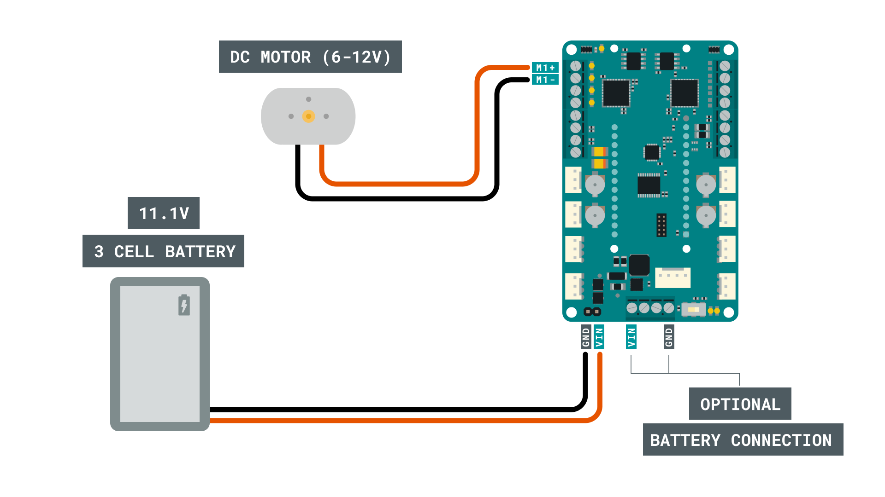
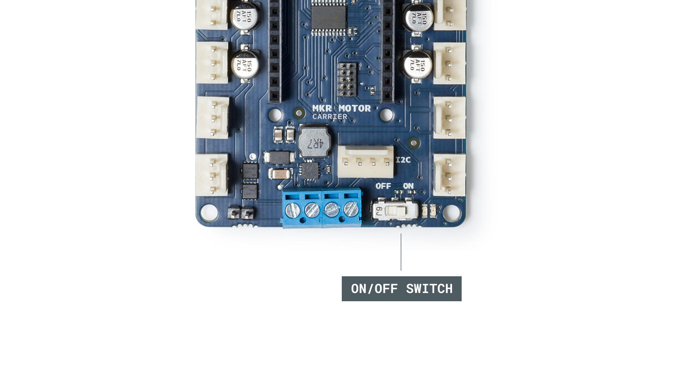

## Introduction 

In this tutorial we will take a look at how to read the battery levels of a LiPo battery that is connected to the **MKR Motor Carrier**. We are also going to check how we can use this information to trigger something in the code. 

We will do this by first reading the battery levels, and if the battery levels are OK, we will conduct a motor test, where we activate a DC motor. If the battery levels are NOT OK, we simply set the duty to 0, and print information to the Serial Monitor.

## Goals

The goals of this project are:

- Set up the MKR Motor Carrier.
- Learn how to read battery levels.
- Create a disengage mode in case battery is too low.

## Hardware & Software Needed

- Arduino IDE ([online](https://create.arduino.cc/) or [offline](https://www.arduino.cc/en/main/software)).
- [ArduinoMotorCarrier](https://github.com/arduino-libraries/ArduinoMotorCarrier) library installed.
- MKR Motor Carrier ([link to store](https://store.arduino.cc/arduino-mkr-motor-carrier)).
- Arduino MKR family board ([link to store](https://store.arduino.cc/arduino-genuino/arduino-genuino-mkr-family))
- LiPo Battery (2S or 3S).
- DC motor (optional).
- Power Supply (optional).

>**Note:** The DC motor is marked as optional as we are mainly testing the battery reading function in this tutorial.

>**Note:** For this tutorial, we used a 11.1V, 3 cell (3s) LiPo battery. 

## Useful Scenarios

Knowing the charge status of your batteries can be useful, since you can program your controller to take decisions based on this information. For example, you can blink an LED to give a signal that the battery needs to be recharged or exchanged. 


Another useful example is for protecting your batteries. For example, LiPo batteries are very delicate and can be damaged if you continue using them when they are discharged. One safety measure you can add to your project is to turn off all the motors when the battery is discharged. 

### Circuit

First, we need to mount the MKR family board on top of the MKR Motor Carrier.


Then, we need to add the battery (or power supply) to the male pins. We can also add this to the blue terminal block (VIN and GND) right next to the male pins. 

>**Optional:** We can also connect a DC motor to the pins **M1+** and **M1-**, as shown in the image below.



Now, we can turn on the MKR Motor Carrier, by flicking the switch from OFF to ON.



Finally, we can connect a micro USB cable to the MKR board that we are using.

## Programming the Board

We will now get to the programming part of this tutorial. 

**1.** First, let's make sure we have the drivers installed for the board we are using. If we are using the Web Editor, we do not need to install anything. If we are using an offline editor, we need to install it manually. This can be done by navigating to **Tools > Board > Board Manager...**. Here we need to look for the **Arduino SAMD boards (32-bits ARM Cortex M0+)** and install it. 

**2.** Now, we need to install the libraries needed. If we are using the Web Editor, there is no need to install anything. If we are using an offline editor, simply go to **Tools > Manage libraries..**, and search for **ArduinoMotorCarrier** and install it.

**3.** Here are some of the core functions of this sketch:

- `controller.begin()` - establish communication between board and carrier.
- `float batteryVoltage = (float)battery.getRaw() / 77;` - command to read the battery voltage.
- `M1.setDuty()` - sets working duty for the motor (0 is min, 100 is max).
- `controller.ping()` - keeps the communication between board and carrier active.

The full code for the sketch can be found in the snippet below. Upload the sketch to the board.

```cpp
#include <ArduinoMotorCarrier.h>
#define INTERRUPT_PIN 6

//Variable to store the battery voltage
static float batteryVoltage;
//low battery limit (discharged)
static float batteryLimit; 
//Variable to change the motor speed and direction
int duty = 50;


void setup()
{
  //Serial port initialization
  Serial.begin(115200);
  while (!Serial);

  //Establishing the communication with the motor shield
  if (controller.begin())
  {
    Serial.print("MKR Motor Shield connected, firmware version ");
    Serial.println(controller.getFWVersion());
  }
  else
  {
    Serial.println("Couldn't connect! Is the red led blinking? You may need to update the firmware with FWUpdater sketch");
    while (1);
  }

  // Reboot the motor controller; brings every value back to default
  Serial.println("reboot");
  controller.reboot();
  delay(500);

  //Take the battery status
  float batteryVoltage = (float)battery.getRaw() / 77;
  Serial.print("Battery voltage: ");
  Serial.println(batteryVoltage);

  M1.setDuty(0);
  M2.setDuty(0);
  M3.setDuty(0);
  M4.setDuty(0);

  batteryLimit = 9.50; //Around 9V for a 3S LiPo battery

}

void loop() {

  //Take the battery status
  batteryVoltage = (float)battery.getRaw() / 77;

  //Reset to the default values if the battery levels are lower than 11V
  if (batteryVoltage < batteryLimit)
  {
    Serial.println(" ");
    Serial.println("WARNING: LOW BATTERY");
    Serial.println("ALL SYSTEMS DOWN");
    M1.setDuty(0);
    M2.setDuty(0);
    M3.setDuty(0);
    M4.setDuty(0);
    while (batteryVoltage < batteryLimit) 
    {
      batteryVoltage = (float)battery.getRaw() / 77;
      controller.ping();
      //wait
      delay(50);
    }
  }
  else
  {
    //Motor test
    M1.setDuty(duty);
    delay(500);

    float batteryVoltage = (float)battery.getRaw() / 77;
    Serial.print("Battery voltage: ");
    Serial.println(batteryVoltage);

    //Keep active the communication MKR1000 & MKRMotorCarrier
    //Ping the samd11
    controller.ping();
    //wait
    delay(50);
  }
}
```

## Testing It Out

After successfully uploading the sketch, open the Serial Monitor.

In this sketch we are turning the DC motor (M1) ON, and constantly check whether the battery is at an acceptable level.  

In case the battery is discharged, we are turning OFF all the motors and sending an error message. This is visible in the Serial Monitor.


### Troubleshoot

If the code is not working, there are some common issues we can troubleshoot:

- Check that the circuit is made properly. The circuit section in the top shows exactly how to connect it.
- We are not using a powerful battery (or battery was discharged before we started).
- The **ArduinoMotorCarrier** library is not installed.

## Additional Information

- If you have a power supply you can modify the voltage levels to see how the system behaves. 

- You can test this sketch without the DC Motor. Just check the M1 LED indicator, next to the blue terminal block.

- When the systems go down, It will remain in that state until you exchange the battery. So if you have a USB connected, you can turn off the switch, change the battery, connect a charged one and then turn the switch on and the system will proceed as normal.

- You can set up the minimum voltage level that you need. For example if you have a 2S (2 cells) LiPo you can set it up to 6V, or if you have a 3S (3 cells) LiPo you can set it up to 9V.

## Conclusion

In this tutorial we created a simple, yet powerful way of monitoring a battery's levels. We also created a way of "shutting down" all activities if the battery levels were too low, which is great way of keeping your batteries alive for longer!

Feel free to explore the [ArduinoMotorCarrier](https://github.com/arduino-libraries/ArduinoMotorCarrier) library further, and try out some of the many cool functions.
