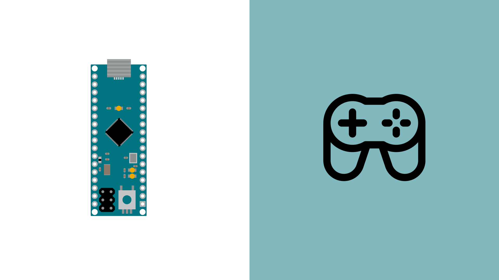
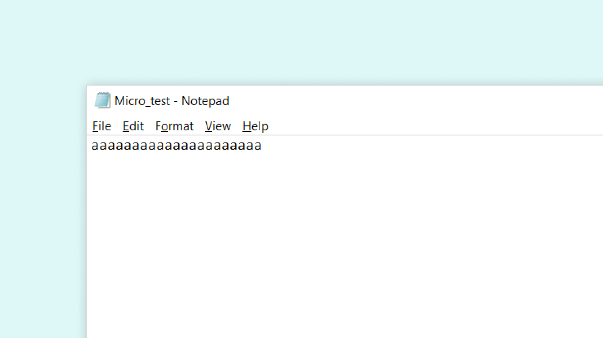

## Introduction 

In this tutorial, we will use the [Arduino Micro](https://store.arduino.cc/arduino-micro) to produce a keypress. This will be done by simply using a regular pushbutton, and the [Keyboard](https://www.arduino.cc/reference/en/language/functions/usb/keyboard/) library. We will create a program that, whenever we press the button on the board, it will act as if we were typing the character on our keyboard.

## Goals

The goals of this project are:

- Explore some creative ways of using key-presses.
- Simulate a key-press using the Arduino Micro.

## Hardware & Software Needed

- Arduino IDE ([online](https://create.arduino.cc/) or [offline](https://www.arduino.cc/en/main/software)).
- [Keyboard](https://www.arduino.cc/reference/en/language/functions/usb/keyboard/) library.
- Arduino Micro ([link to store](https://store.arduino.cc/arduino-micro)).

## Keyboard

The keyboard functions enable 32u4 or SAMD micro based boards to send keystrokes to an attached computer through their micro’s native USB port. This means that we are able to print most of the ASCII characters by just using our Arduino.

Simply explained: pick a key on the keyboard you are using to type, for example the letter "A". The ASCII value of upper-case letter A is `65`, while lower-case is `97`. With the [Keyboard](https://www.arduino.cc/reference/en/language/functions/usb/keyboard/) library, we can simply use these values to build our own kind of keyboard.

Instead of pressing the "A" button, we could use a 10x10 meter button on the wall that activates it. This is of course not a very practical solution, but in theory: anything is possible.

### Getting Creative with Key-Presses

Now, creating a fully sophisticated keyboard from scratch might be daunting (yet possible) task. But there's a ton of other fun, but also useful things we can create. One of them is a **video game controllers**. 



Let's imagine ourselves playing a game which involves several hotkeys (a keyboard shortcut). You are frustrating because most of your hotkeys are already bound to your most preferred location on the keyboard. 

Now we can start getting creative: how could we add more hotkeys without using our hands? We could, for example add a large button that can be activated by our foot (gas pedals for racing games perhaps?). Or we could do something completely crazy: use a sounds sensor that triggers a keypress when we scream. 

The main message is: you can in theory use thousands of unique ways of producing a keypress, as long as you have a microcontroller that can trigger it. But of course, the easiest way, is probably to use a button. 

You can read more about the ASCII values in the links below:

- http://www.asciitable.com/
- https://www.arduino.cc/en/Reference/KeyboardModifiers

### Circuit


## Programming the Board

In this tutorial, we will be using the **Keyboard** library, which is already included when [downloading the Arduino IDE](https://www.arduino.cc/en/software), or using the [Web Editor](https://create.arduino.cc/editor).

Before we begin, let's take a look at the functions used in this program:

- `Keyboard.press(97)` - simulates **pressing** the 'a' key.  
- `Keyboard.release(97)` - simulates **releasing** the 'a' key.

The sketch can be found in the snippet below. Upload the sketch to the board.

>**Note:** Remember to choose the right port and board. The board is located under **Tools > Board > Arduino AVR boards > Arduino Micro**. 

```cpp
#include "Keyboard.h"

//declaring button pins
const int buttonPin = 2;          

int previousButtonState = HIGH; 

void setup() {
  //declare the buttons as input_pullup
  pinMode(buttonPin, INPUT_PULLUP);  
  Keyboard.begin();
}

void loop() {
  //checking the state of the button
  int buttonState = digitalRead(buttonPin);
  
 //replaces button press with UP arrow
  if (buttonState == LOW && previousButtonState == HIGH) {
      // and it's currently pressed:
    Keyboard.press(97);
    delay(50);
  }

  if (buttonState == HIGH && previousButtonState == LOW) {
      // and it's currently released:
    Keyboard.release(97);
    delay(50);
  }
 
  previousButtonState = buttonState;

}
```

## Testing It Out

After we have successfully uploaded the code to the board, we can test it out by opening up a text editor of your choice (like NotePad for Windows). Now, test it out by pressing the button a couple of times while having the text editor open. If everything is working, the letter **'a'** should now be printed.



Congratulations! You have now managed to simulate one of the keypresses of your keyboard, and in a way, created your first mini-keyboard.

### Troubleshoot

If the code is not working, there are some common issues we can troubleshoot:

- Check the wiring for the button.
- The right port needs to be selected.
- The text editor is not open when we press the button.

## Conclusion

The **Keyboard** library has a lot of cool features, and in this tutorial, we have just covered one of them: replicating a key press on our keyboard. You can now start adding more buttons, by just replicating the structure in the code in this tutorial.

Feel free to explore the [Keyboard](https://www.arduino.cc/reference/en/language/functions/usb/keyboard/) library further, and try out some of the many cool functions.
