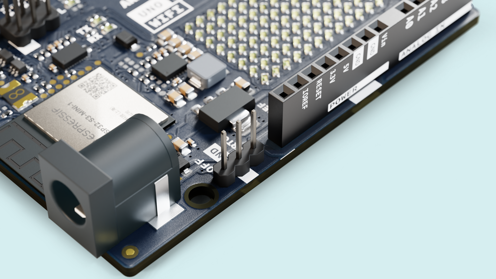
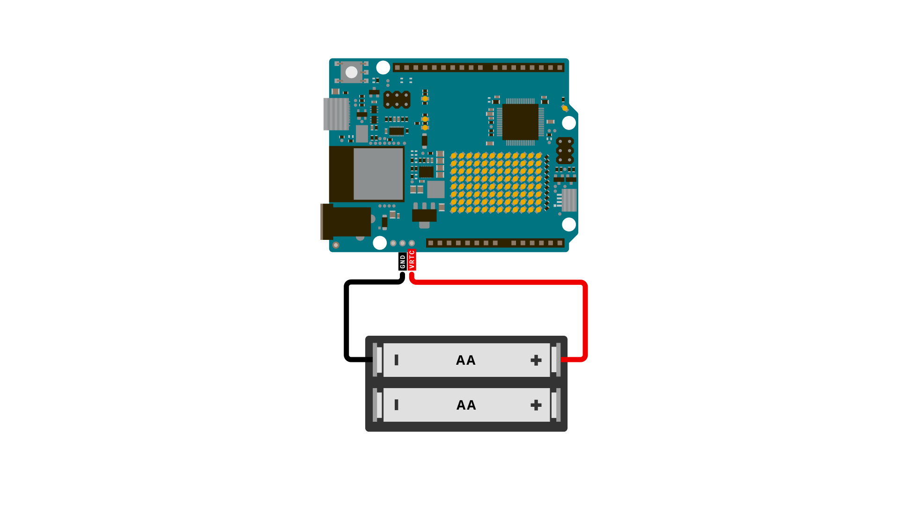

The Arduino UNO R4 WiFi features 2 pins that have not been seen before on UNO boards, the VRTC pin and the OFF pin. 

They are used to control some of the boards functions electrically. The VRTC pin can be used to keep the onboard RTC (Real Time Clock) running even when the boards main power supply is turned off, and the OFF pin is used to turn off the board by cutting off the power.

## Goals

In this tutorial you will learn how to use the VRTC and the OFF Pins on the Arduino UNO R4 WiFi.

You will learn about how you can use them, why you would use them, and some of the limitations that come with them.

## Hardware & Software Needed

- [Arduino UNO R4 WiFi](https://store.arduino.cc/uno-r4-wifi)
- A small battery or other power supply
- Jumper cables

## VRTC Pin

***This guide will not go in detail on how to use the RTC feature itself, only how to use the VRTC Pin. If you're looking for how to use the RTC features of the board, check out the [RTC Guide](/tutorials/uno-r4-wifi/rtc)***

The UNO R4 WiFi has a built in RTC (Real Time Clock) that can accurately keep track of time. RTCs are found in many of your gadgets, although often connected to them will be a small battery, to keep the clock running even when the gadget is turned off. This is for example how your laptop knows what time it is when you start it up, even if it's disconnected from the internet.

The UNO R4 WiFi provides the option for you to build a system similar to this in function, by exposing the RTCs power lines so that you can keep it running, even when the boards main power supply is disconnected. 

On the header that is located by the barrel jack, you'll find the VRTC pin. And to use it, just apply a voltage within the range of 1.6 - 3.3 V to that pin. This can be done either with a battery pack like shown in the circuit diagram below, but also with other power supplies that slot within the required voltage range.

## OFF Pin
The OFF pin on the Arduino UNO R4 WiFi board lets you turn the boards onboard 5 V power supply off, basically turning off the board.

However, it will only turn off the board when it is powered through the VIN pin, or the barrel jack. Why is this? Because by using this pin, you are turning off the step down converter that generates 5 V from whatever voltage you are providing it with. If you are powering the board from USB, 5 V is provided from the USB cable, and there is no need for this step down converter to begin with. 

To use the OFF pin, all you need to do is to create a short circuit from it to a GND connection. To experiment, you can do this with a jumper cable, but for your finished projects you may want to incorporate a button or switch that will turn the board on or off in this way.

## Summary

This short tutorial shows how to use the VRTC and OFF pins that are found on the new header on the Arduino UNO R4 WiFi, features that are brand new to the UNO family.