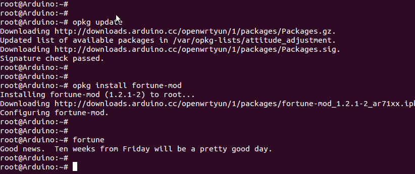

The package management system, also called "package manager", is a very important tool for Linux systems as it gives the user an easy way to install, update and remove additional applications or programs. Instead of downloading and compiling the source code of the program you want to install, the source is pre-configured and compiled according to your system requirements and is inserted inside a package with other information, such as the version and dependencies (requirements of the software to install the software).

On the OpenWrt-Yun Linux system the package manager tool is called "opkg".  Usually operations on a package can be done through the command line with a few arguments.

The package manager needs an updated database to display packages available for your system. Running the *opkg* update command updates the list of available packages. Due to the small flash memory available on the Yún, the database with the list of the package is only saved inside RAM. This means that you need to run the *opkg* update command every time you want to install a program after freeing the RAM or after a reboot.

The most important arguments for opkg are:

- **update** : Updates the package database.

Example:
`$ opkg update`

- **install**: Installs a package. It automatically resolves any dependencies for you. The install argument must be followed by the name of the package to install.

Example:
`$ opkg install fortune-mod`

- **remove**: Removes a previously installed package.

Example:
`$ opkg remove fortune-mod`

- **upgrade**: Upgrades an installed package to a newer version.

Example:
`$ opkg upgrade fortune-mod`

To obtain information about packages, you have options like `list-installed`, which shows the list of the packages currently installed on the Yún, or `find`, which searches for a package you want to install.

There are other arguments and options that can be used with the opkg tool. To know more about all the feature that the opkg tool can offer, you can consult the [reference on the OpenWrt website](http://wiki.openwrt.org/doc/techref/opkg).

