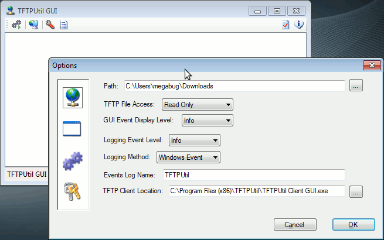
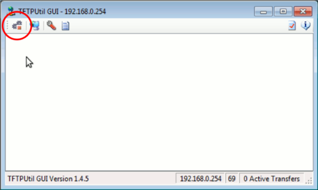

There are situations in which the recommended [upgrade procedure](https://www.arduino.cc/en/Tutorial/YunSysupgrade) does not or cannot work. Typically, this is because there is something wrong with the existing Linux installation. Changing the default  configuration and installing packages that take up too much space may cause the installation to become unstable.

This procedure uses U-Boot, something similar to the BIOS on a PC.  U-Boot is a very small program executed right after you power on a Yún. With U-Boot you can restore a Yún to its factory settings. To reflash the Yún from the U-Boot prompt, you will download 3 different image files and write their contents on the flash memory of the Yún, erasing all previously stored information. It's a bit like formatting a computer's hard drive.

This should be considered an advanced topic, pay heed to the warnings throughout. These notes are for reference only. You should read and understand this document before trying anything mentioned below.
If you are in doubt about any of these steps, **DO NOT** follow this guide and send an email to support@arduino.cc

***Warning: Following this guide will VOID the WARRANTY of your Yún***

## Download and Unpack the Image Files

Download the **[base images](https://content.arduino.cc/assets/YunImage_v1.5.3.zip)** zip file. Extract the three files (uboot, kernel, rootfs).

## Setup a TFTP Server

For U-Boot to download the 3 files from your computer to the Yún, you first need to setup a TFTP server on your computer.

### Setup a TFTP Server on Windows

Download and install TFTP Utility from [http://sourceforge.net/projects/tftputil/](http://sourceforge.net/projects/tftputil/).

Once the program has been installed, and you've started it, press the settings button and change the `path`, specifying the location where you have unpacked the base images zip file you downloaded earlier



Then start the TFTP server by pressing the first button on the left



### Setup a TFTP Server on Mac OS X

Open Terminal (found in Applications>Utilities) and type

```arduino
sudo launchctl load -F /System/Library/LaunchDaemons/tftp.plist
sudo launchctl start com.apple.tftpd
```

Move the unpacked base images files into the folder /private/tftpboot/

You can access hidden directories like **/private/** by using the **Go To Folder** option in the **Go** menu of the taskbar. In this instance, click on 'Go To Folder'' and enter `/private/tftpboot/` to open the directory in the Finder.

### Setup a TFTP Server on GNU/Linux (Ubuntu)

Open Terminal and type

```arduino
sudo apt-get install tftpd-hpa
```

When asked for the directory to use as root for the TFTP server, leave the default value /var/lib/tftpboot

Move the unpacked base images files into folder `/var/lib/tftpboot`

### Setup a TFTP Server on GNU/Linux (Fedora)

Open Terminal and type

```arduino
yum install tftp-server
```

Edit file `/etc/xinetd.d/tftp` and change `disable = yes` to `disable = no`. Then type

```arduino
systemctl restart xinetd.service
```

Check if it's running with

```arduino
chkconfig tftp
```

Move the unpacked base images files into folder `/var/lib/tftproot`

## Setup Your Yún

Connect your Yún to your computer with a USB cable. Then connect the Yún to your router or your computer with a wired **Ethernet cable**. This is crucial: you cannot reflash via wifi.

Open the Arduino IDE and upload the [YunSerialTerminal](https://www.arduino.cc/en/Tutorial/LibraryExamples/YunSerialTerminal) example to your Yún.

You'll need to do the next step quickly. Open the Serial Monitor from the Arduino IDE, press the `YUN RST` button (the white one near the LEDs), and press the Enter button a couple of times on your keyboard. If you're fast enough, you'll get something like the following in the Serial Monitor :

```arduino

...
...
ATHRS26: s26 reset done
eth1 up
eth0, eth1
Hit any key to stop autoboot:  4  3  2
ar7240>

```

The `ar7240>` is U-Boot prompt.

If you don't hit enter at the right time, and don't enter U-Boot, press the `YUN RST` button once more and retry until you get U-Boot prompt.

Once inside U-Boot, you need to tell it your computer's IP address and the IP address for the Yún. Find the IP for your computer, and choose a unique address for the the  Yún. If you're on a home network, you probably won't have any issues assigning something in the appropriate range (if you're in a network full of computers, you first need to ensure the IP address you'll assign to the Yún is not already used by someone else).

For example, your computer's IP address is 192.168.0.231, and you want to assign the  Yún the address of 192.168.0.146. First set the IP of your computer in the Serial Monitor :

```arduino

setenv serverip 192.168.0.231;

```

and press Enter. Then set the IP address for the Yún :

```arduino

setenv ipaddr 192.168.0.146;

```

The Yún is now ready for reflashing.

## Reflashing U-Boot (Optional)

Reflashing U-Boot is a last option. These commands are only a reference.

In the Serial Monitor, type

```arduino

tftp 0x80060000 openwrt-ar71xx-generic-linino-u-boot.bin;

```

and press Enter.

If it takes a long time to see the prompt `ar7240>` again, it means that you have used the wrong IP address for the  Yún or your computer, your TFTP server is not running, or the Ethernet cable between the computer and  Yún is not properly connected. Check these variables, and start over by pressing the `YUN RST` button.

If the U-Boot prompt does appear (it should be quite quick), type the following commands, pressing Enter after each line :

```arduino

erase 0x9f000000 +0x40000;
cp.b $fileaddr 0x9f000000 $filesize;
erase 0x9f040000 +0x10000

```

## Reflashing Kernel

In the Serial Monitor, type

```arduino

tftp 0x80060000 openwrt-ar71xx-generic-yun-16M-kernel.bin;

```

If it takes a long time to see the prompt `ar7240>` again, it means that you have used the wrong IP address for the  Yún or your computer, your TFTP server is not running, or the Ethernet cable between the computer and  Yún is not properly connected. Check these variables, and start over by pressing the `YUN RST` button.

If the U-Boot prompt does appear, type the following commands, pressing Enter after each line :

```arduino

erase 0x9fEa0000 +0x140000;
cp.b $fileaddr 0x9fea0000 $filesize;

```

## Reflashing OpenWrt-Yun

In the Serial Monitor, type

```arduino

tftp 0x80060000 openwrt-ar71xx-generic-yun-16M-rootfs-squashfs.bin;

```

If it takes a long time to see the prompt `ar7240>` again, it means that you have used the wrong IP address for the  Yún or your computer, your TFTP server is not running, or the Ethernet cable between the computer and  Yún is not properly connected. Check these variables, and start over by pressing the `YUN RST` button.

If the U-Boot prompt does appear, type the following commands, pressing Enter after each line :

```arduino

erase 0x9f050000 +0xE50000;
cp.b $fileaddr 0x9f050000 $filesize;

```

## Rebooting

After completing the above steps, if the U-Boot prompt appears, type the following command in the Serial monitor, followed by  Enter :

```arduino

bootm 0x9fea0000

```

OpenWrt-Yun will now start its boot process. Wait a couple of minutes (first boot is always slightly slower) and enjoy your freshly reflashed Yún.