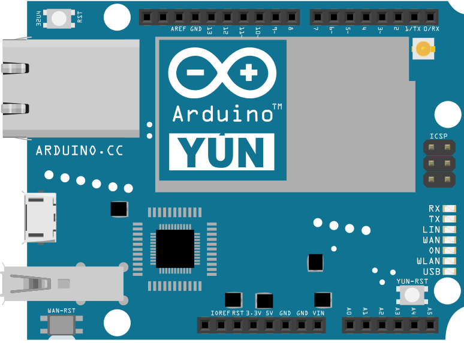

This example for a Yún device shows how create a basic HTTP client that connects to the Internet and downloads content. In this case, you'll connect to the Arduino website and download a version of the logo as ASCII text. This version uses Console and shows the output on your Arduino Software (IDE) Console through a Wi-Fi connection and not the USB one.

Select the IP port as connection to your board and open the Serial Monitor in the IDE once you've programmed the board.

## Hardware Required

- Yún board or shield

- a wireless network connection to the internet

## Circuit

There is no circuit for this example.



image developed using [Fritzing](http://www.fritzing.org). For more circuit examples, see the [Fritzing project page](http://fritzing.org/projects/)

## Code

Include the Bridge, HttpClient and Console libraries

```arduino
#include <Bridge.h>
#include <HttpClient.h>
#include <Console.h>
```

In `setup()` start Bridge, and wait for a serial connection before going into `loop()`.

```arduino
void setup() {

  pinMode(13, OUTPUT);

  digitalWrite(13, LOW);

  Bridge.begin();

  Console.begin();

  while(!Console);
}
```

In `loop()`, create a named instance of HttpClient, and call a URL with `client.get(url)`.

```arduino
void loop() {

  HttpClient client;

  client.get("http://www.arduino.cc/asciilogo.txt");
```

As long as there are bytes from the server in the client buffer, read the bytes and print them to the serial monitor. Repeat every 5 seconds.

```arduino
while (client.available()) {

    char c = client.read();

    Console.print(c);

  }

  Console.flush();

  delay(5000);
}
```

The complete sketch is below :

```arduino

/*

  Yún HTTP Client Console version for Arduino Uno and Mega using Yún Shield

 This example for the YunShield/Yún shows how create a basic

 HTTP client that connects to the internet and downloads

 content. In this case, you'll connect to the Arduino

 website and download a version of the logo as ASCII text.

 created by Tom igoe

 May 2013

 modified by Marco Brianza to use Console

 This example code is in the public domain.

 http://www.arduino.cc/en/Tutorial/HttpClient

 */

#include <Bridge.h>
#include <HttpClient.h>
#include <Console.h>

void setup() {

  // Bridge takes about two seconds to start up

  // it can be helpful to use the on-board LED

  // as an indicator for when it has initialized

  pinMode(13, OUTPUT);

  digitalWrite(13, LOW);

  Bridge.begin();

  digitalWrite(13, HIGH);

  Console.begin();

  while (!Console); // wait for a serial connection
}

void loop() {

  // Initialize the client library

  HttpClient client;

  // Make a HTTP request:

  client.get("http://www.arduino.cc/asciilogo.txt");

  // if there are incoming bytes available

  // from the server, read them and print them:

  while (client.available()) {

    char c = client.read();

    Console.print(c);

  }

  Console.flush();

  delay(5000);
}
```


**Last revision 2016/05/25 by SM**
