In this document we explain how to use the Atmel Studio 6.2 to program the bootloader and to debug a sketch using breakpoints and the EDBG functionality of the board.

## Embedded Debugger Interfaces

The Arduino Zero board is equipped with Atmel Embedded Debugger (EDBG) for on-board debugging. EDBG is a composite USB device having three different interfaces : a debugger, a Virtual COM Port and a Data Gateway Interface (DGI).
In conjunction with Atmel Studio, the EDBG debugger interface is able to program and debug the ATSAMD21G18A. On the board itself, there are two SWD interfaces : the first one is connected to the EDBG while the other is connected to ATSAMD21G18A.

Since the on-board Virtual COM Port is connected to a UART port on the ATSAMD21G18A, it provides an easy way to communicate with the target application through a simple terminal software. Its features are variable baud rates, parity and stop bit settings. Please note that the settings on the target device UART must match the given settings in the terminal software.

The DGI consists of several physical data interfaces to communicate with the host computer. Communication over the interfaces is bidirectional. It can be used to send events and values from the ATSAMD21G18A, or as a generic printf-style data channel. Traffic over the interfaces can be timestamped on the EDBG for a more accurate tracing of events. Note that timestamping imposes an overhead that reduces maximal throughput. The DGI uses a proprietary protocol, and is thus only compatible with Atmel Studio. Our tutorial assumes that you are using Atmel Studio 6.2. You can download the [software directly from Atmel](http://ww1.microchip.com/downloads/archive/AStudio6_2sp2_1563net.exe).

The EDBG controls two LEDs on the Zero: the "L" and the "Debug" LED.

Operation modeL LEDDebug LEDNormal operationL LED is lit when power is applied to the board.Activity indicator, LED blinks every time something happens on the EDBG.Bootloader mode (idle) The Debug LED blinks.Bootloader mode (firmware upgrade)The L LED fades in and out and the Debug LED blinks .Debug mode (with breakpoint) The L LED fades in and out and the Debug LED blinks .

## Burning Bootloader Procedure

To properly write the bootloader of Arduio Zero, you can use the programming port and the tool provided by ATMEL "AtmelStudio 6.2". It is important to learn how to program the bootloader on your Zero board because the debugging process - explained below - substitutes it. You need to reprogram the bootloader as explained in this chapter to bring the board back to its standard behavior.

Follow these steps:

**1.** Open AtmelStudio 6.2;

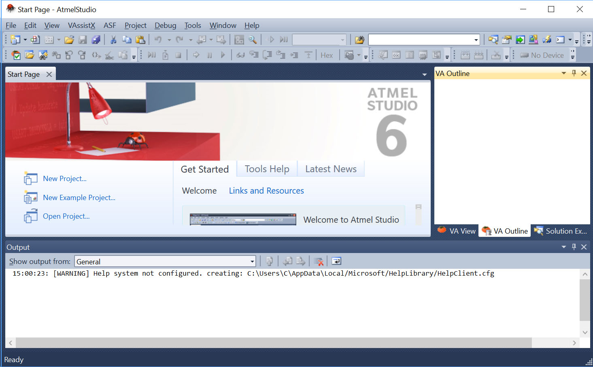

**2.** Plug the Zero board via the "Programming Port" into a USB port of your PC

**3.** Go to "Tools -> Device Programming" or press the keys "CTRL + SHIFT + P"

**4.** in Tool, select "EDBG"

**5.** in Device, select "ATSAMD21G18A"

**6.** in Interface, select "SWD"

**7.** press "Apply"

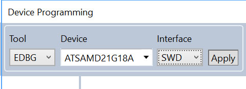

**8.** Go to "Memories"

**9.** Click "Erase now"

and, if all has gone as it should, in the log console you will see "OK".

**10.** Go to "Fuses"

**11.** Ensure that the "NVMCTRL_BOOTPROT" is equal to "0x07", otherwise set this value by double clicking on the value.

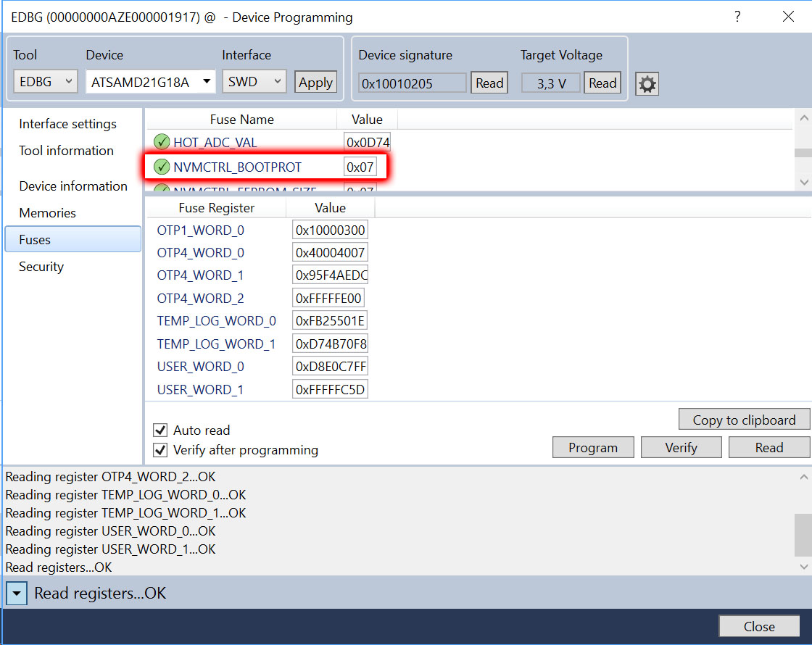

**12.** Press "Program". In the log console "OK" will be showed as output if everything has run smoothly.

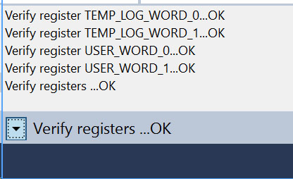

**13.** Go to "Memories"

**14.** Select the file to write (typically Bootloader\_board\_Vxxx.hex) that you will find in your Arduino Software (IDE) installation, under the \_hardware/arduino/samd/...* path found in your '**Documents/Arduino/sketchbook**' folder. You need to install the SAMD core from board manager if you haven't done it yet. If your Arduino installation has been made ["portable"](/en/Guide/PortableIDE), the firmware will be in the **portable/packages/arduino** path. folder, as seen in our screen capture below.

**15.** Click "Program" and again, in the log console you will see "OK".

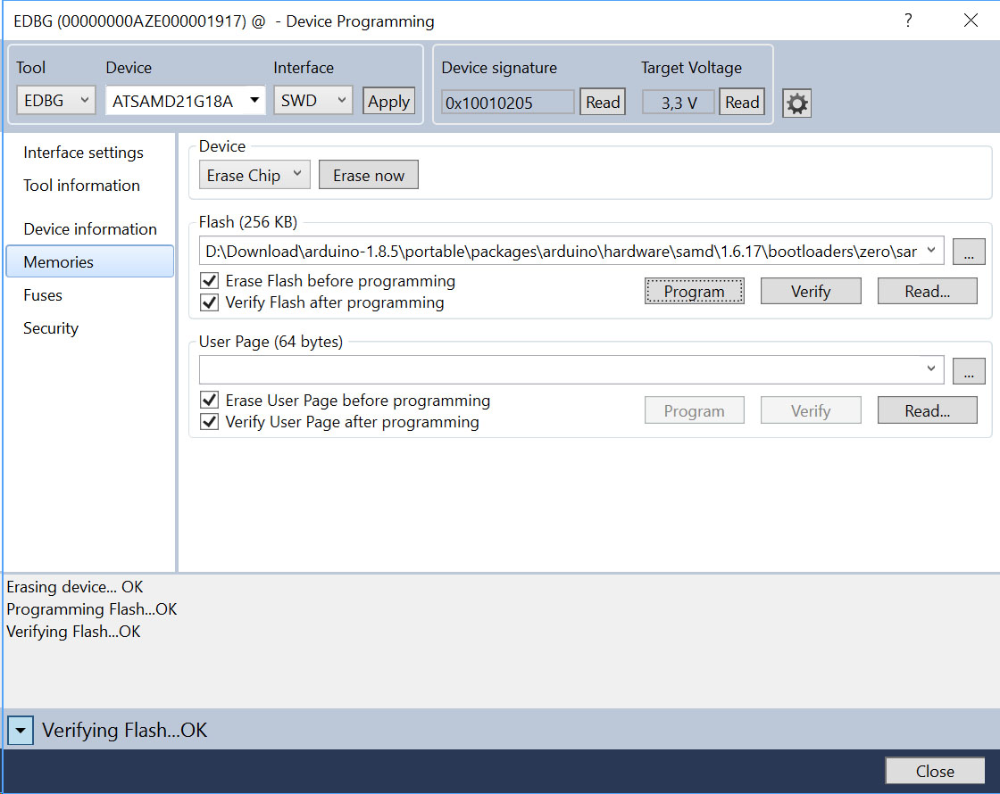

## Debugging with ATMEL STUDIO 6.2

In this example we will be using Arduino Software (IDE) 1.8.5 or later and [Atmel Studio 6.2](http://ww1.microchip.com/downloads/archive/AStudio6_2sp2_1563net.exe).

### Creating the File Needed for Debugging

Launch the Arduino Software (IDE), open the blink.ino sketch and then select the Arduino Zero (Programming Port) from the boards menu:

Select the COM port where the Arduino Zero is connected

Comment out rows 34 and 36 (the lines that are with the `delay(1000)` statements), to remove the delay call and save the sketch with a new name (i.e. save it as blinkEDBG.ino) :

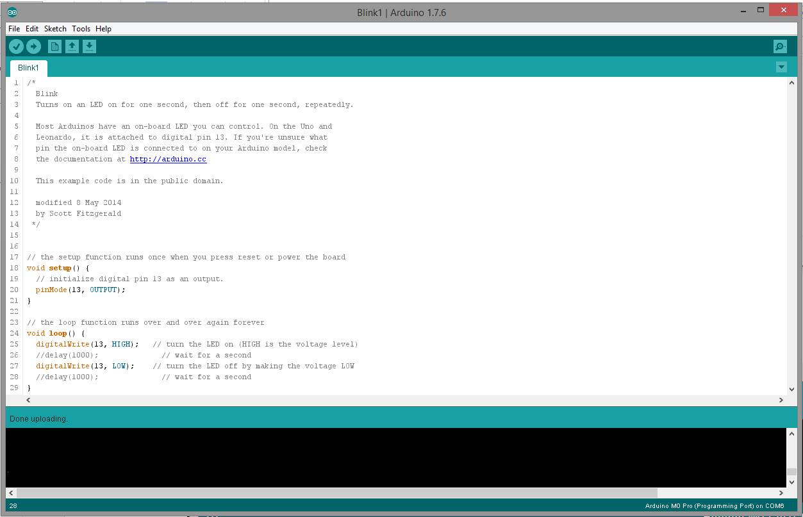

Click the icon to compile and upload the sketch.

Once done, you need to find the temporary folder where the files have been created. To see this information, you need to look at the console window (the area below the sketch) and scroll through the messages until you find a line where you see a temporary path like `C:\Users\C\AppData\Local\Temp\arduino_build_`. That path is needed to debug the sketch with Atmel Studio.

### Use Atmel Studio 6 for Debug

Now launch Atmel Studio 6.2 and from its main menu browse to : File -> Open -> Open Object File For Debugging

Select the file blinkEDBG.ino.elf that you should find in the TEMP path just found, then click 'next' :

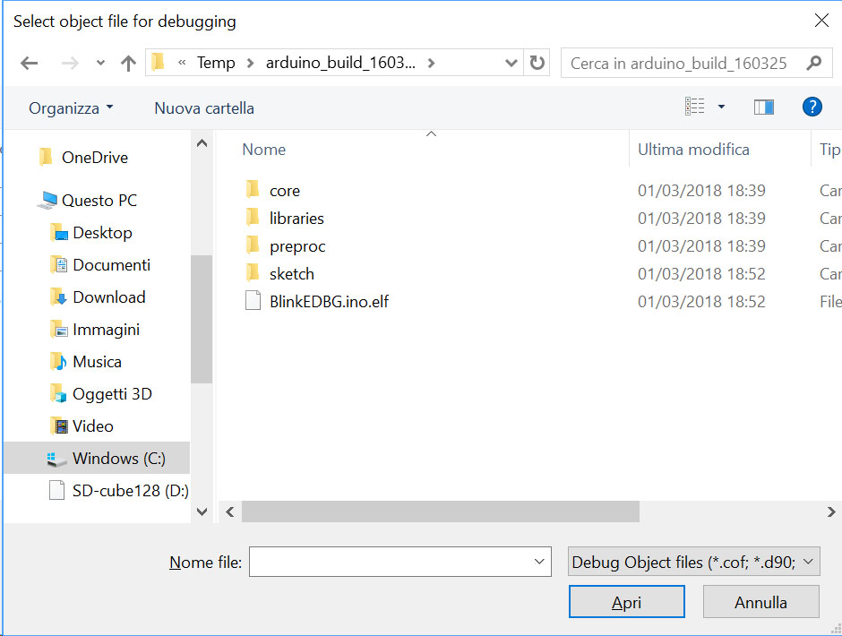

Choose SAMD21G18A, as shown in the next picture, and press 'finish' :

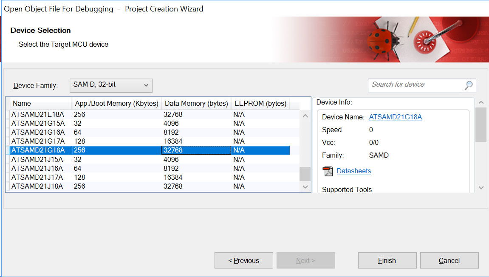

There is a chance that Atmel Studio 6.2 doesn't find the sketch and the Remap Object Files to Disk Files pops up with a **Missing: 1** error. Scroll the list of files until you find the line with a red X icon on the left, then click on the three dots on the right of the line.

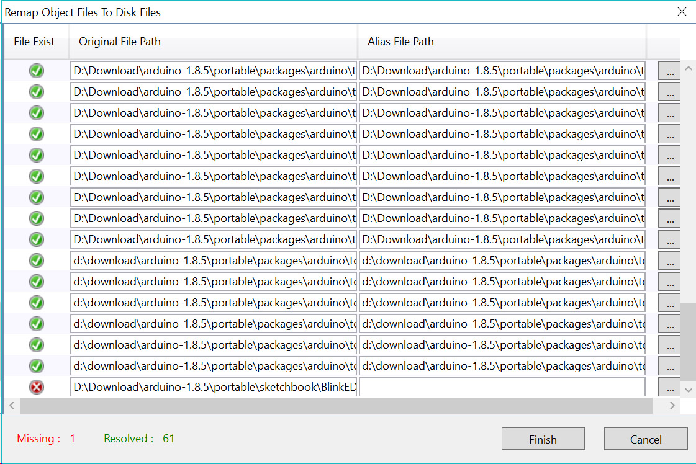

The window that pops up allows you to browse to your sketchbook where you need to select your **blinkEDBG.ino** sketch file. When you click on **Open** you go back to the Remap Object Files where the red X is now a green check mark. Click on **Finish**.

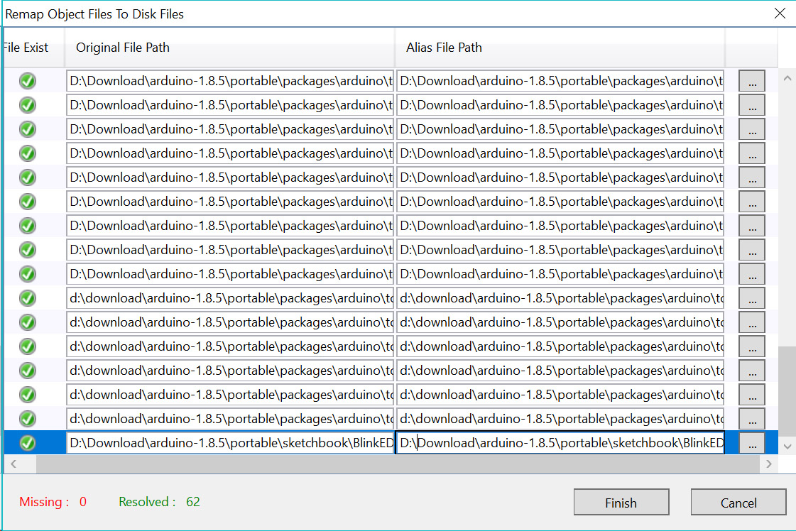

Open now the Blink1.ino entry in the Solution Explorer workspace of the main window of Atmel Studio:

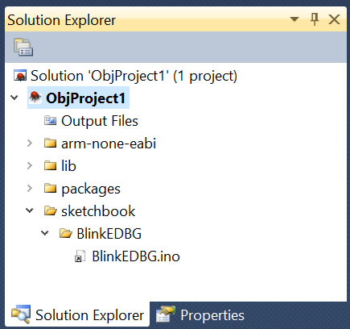

Click on the left side (the grayed out part) of the source code window to put a breakpoint (for example at row 25) in it:

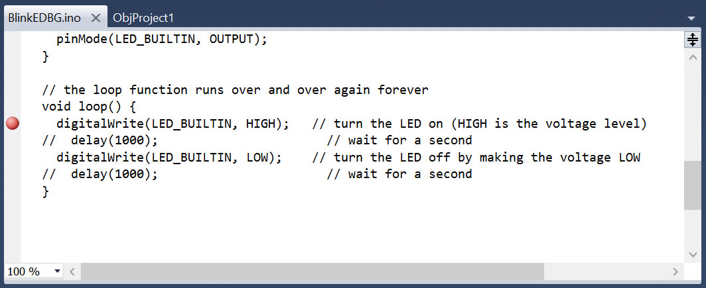

Press the play symbol in the top bar to start debugging:

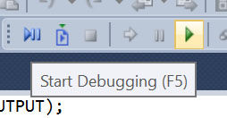

A window will pop-up asking you to choose the edbg debugger/programmer,

press continue and then select the proper EDBG and SWD entries as shown in the image below:

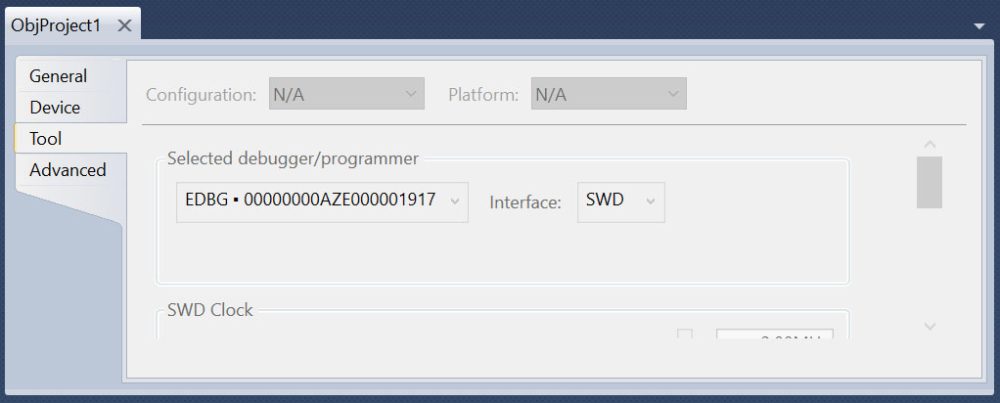

Press once again the play button and if required, update the edbg firmware entry and click play another time. Debugging will start and the code will stop at the breakpoint. You can go ahead in debugging by pressing F11 or F10. The software executes the next function or instruction, according to pressed key. Please note that the code is executed on the board itself, this is why we commented out the two delay calls so to speed up the debugging example.

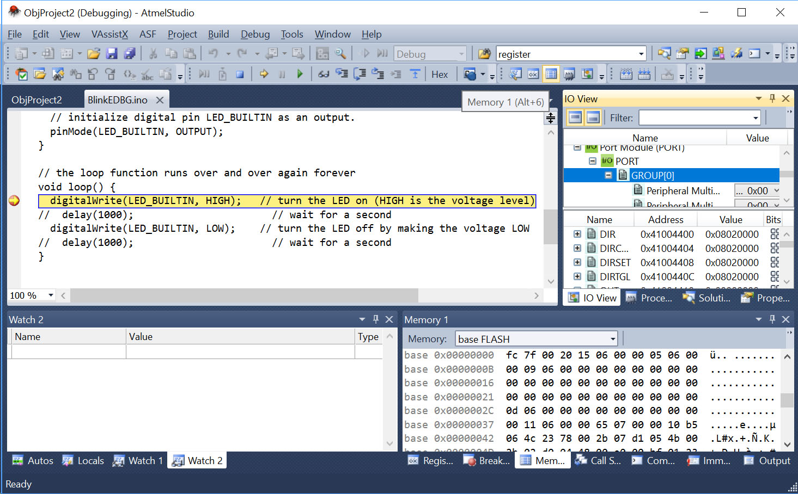

The functions available in Atmel Studio are very powerful and allow you to get a full report of the status of registers, memory, ports and almost all aspects of the microcontroller during the execution of the sketch. The use of breakpoints is one of the techniques to debug your code. We suggest that you read the documentation of Atmel Studio to learn the basics of debugging.

The text of the Arduino getting started guide is licensed under a
[Creative Commons Attribution-ShareAlike 3.0 License](http://creativecommons.org/licenses/by-sa/3.0/). Code samples in the guide are released into the public domain.
