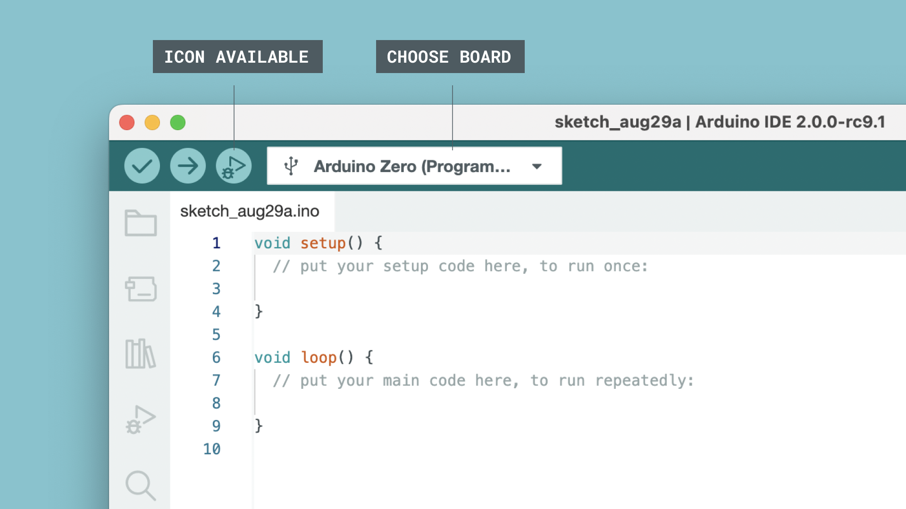
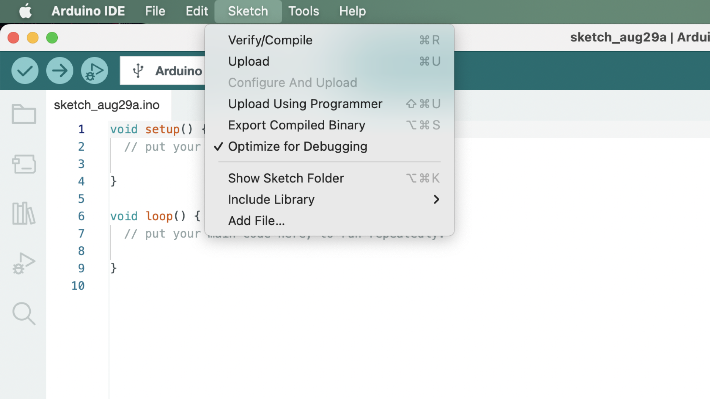

For this this tutorial we will be using the Arduino Zero's built-in debugger interface: no extra hardware needed.

## Requirements

- Arduino IDE 2.0 installed. 
- [Arduino Zero](https://store.arduino.cc/arduino-zero)
- Micro USB cable.

## Configuration

**1.** Connect the Arduino Zero board to our computer. We also need to make sure we have the right platform installed (SAMD).

***Important: You should connect the Arduino Zero through its programming USB port.***

**2.** Select the board from the board/port list. When we select the Arduino Zero, the debugger icon close to the upload button will also become more visible.

**3.** To use the debugger, we first need to make sure the built program will be optimized for debugging, so let's enable that option by navigating to **Sketch > Optimize for Debugging** and checking it.

**4.** Your Arduino Zero is now ready to be debugged using the Arduino IDE 2.0.

To learn more about using the Debugger, you can continue on to the [main article on Debugging with IDE 2.0](/software/ide-v2/tutorials/ide-v2-debugger). This article goes more in-depth on how to use the different Debugger features, and provides a good overview of the tool.  

## Conclusion

In this short tutorial, we set up the Arduino Zero for Debugging. Since the board already has a built-in debugger, we do not need to do any hardware configuration at all, which is one the greatest features of the Arduino Zero board. 

