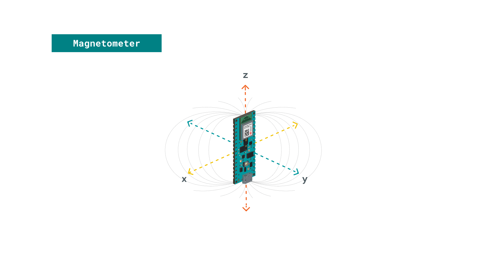
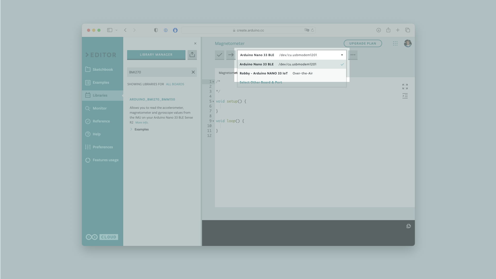

## IMU Module

This tutorial will focus on the 3-axis magnetometer sensor of the IMU system on the Arduino Nano 33 BLE Rev2. The tutorial will utilize the IMU sensor to create an application that will detect changes and disturbances in the magnetic field around an appliance or electric device. This will be achieved by reading the values of the magnetometer's axes and blinking the board's in-built LED according to the magnetic disturbances. 


## Goals

The goals of this project are to:

- Understand how the IMU system on the Nano 33 BLE Rev2 works.
- Use the BMI270_BMM150 library.
- Measure the value of a magnetometer sensor.
- Create visual feedback according to the magnetic disturbance in the environment.
- Convert the sensor's values in LED light intensity.


## Hardware & Software Needed
* This project uses no external sensors or components.
* In this tutorial, we will use the Arduino Web Editor to program the board.


## The BMI270 & BMM150 Inertial Modules
IMU (Inertial Measurement Unit) is an electronic device that measures and reports a body's specific force, angular rate and the orientation of the body, using a combination of accelerometers, gyroscopes, and oftentimes magnetometers. In this tutorial, we will learn a bit more about the built-in IMU system of the Nano 33 BLE Rev2.


The IMU system on the Nano 33 BLE Rev2 is a combination of two modules, the 6-axis BMI270, and the 3-axis BMM150, that together add up to a combined 9-axis IMU system that can measure acceleration, as well as rotation and magnetic fields all in 3D space.


### The Library
The [Arduino BMI270_BMM150 library](https://www.arduino.cc/reference/en/libraries/arduino_bmi270_bmm150/) allows us to use the Nano 33 BLE Rev2 IMU module without having to go into complicated programming. The library takes care of the sensor initialization and sets its values as follows:

- **Accelerometer** range is set at [-4, +4]g -/+0.122 mg.
- **Gyroscope** range is set at [-2000, +2000] dps +/-70 mdps.
- **Magnetometer** range is set at [-400, +400] uT +/-0.014 uT.
- **Accelerometer** output data rate is fixed at 104 Hz.
- **Gyroscope** output data rate is fixed at 104 Hz.
- **Magnetometer** output data rate is fixed at 20 Hz.

If you want to read more about the sensor modules that make up the IMU system, find the datasheet for the <a href="https://content.arduino.cc/assets/bst-bmi270-ds000.pdf" target="_blank">BMI270</a> and the <a href="https://content.arduino.cc/assets/bst-bmm150-ds001.pdf" target="_blank">BMM150</a> here.

### Magnetometer
A magnetometer is a device that measures magnetism, that is the direction, strength, or relative change of a magnetic field at a particular location.



In this tutorial, we will read the values X, Y and Z and provide visual feedback through the in-built LED according to the intensity of magnetism around an electric object's cord.


## Creating the Program

**1. Setting up** 

Let's start by opening the [Arduino Web Editor](https://create.arduino.cc/editor) and creating a new sketch, this can be named "magnetometer". Then, navigate to the **Libraries** tab, search for the **BMI270_BMM150** library and click on the **Include** button. 


**2. Connecting the board**

Next, connect the Nano 33 BLE Rev2 to the computer and make sure that the Web Editor recognizes it. If so, the board and port should appear as shown in the image below. If they don't appear, follow the [instructions](https://create.arduino.cc/getting-started/plugin/welcome) to install the plugin that will allow the editor to recognize your board.




**3. Identifying changes in the magnetic field**

After including the library, we can begin by building the rest of the code. 

Let's start by defining the float variables `float x,y,z, ledvalue;` which will be needed for our code to work.

In the `setup()` we only need to initialize the IMU sensor with the following code:
```arduino
if (!IMU.begin()) {
    Serial.println("Failed to initialize IMU!");
    while (1);
  }
```

In the `loop()` we add the function `IMU.readMagneticField(x, y, z);` to read the values of the three axes on the IMU. 
Next, we will add an `if` statement that checks if the magnetic field detected by the board is positive or negative (it will depend on the orientation of the board). If the magnetic field is negative, we convert the ledvalue in a positive range with ledvalue = -(x);, meaning that it is a valid value for the built-in LED.

Lastly, we use the command `analogWrite(LED_BUILTIN, ledvalue);` to set the intensity of the LED according to the disturbance in the magnetic field, and add a small delay. 


**4. Complete code**

The complete code can be found below:

```arduino
/*
  Arduino BMI270_BMM150 - Magnetometer

  This example reads the magnetometer's values from the LSM9DS1 sensor 
  and `analogWrite` the built-in LED according to the intensity of
  the magnetic field surrounding electrical devices.

  The circuit:
  - Arduino Nano 33 BLE

  Created by Benjamin Dannegård
  4 Dec 2020

  This example code is in the public domain.
*/


#include "Arduino_BMI270_BMM150.h"
float x,y,z, ledvalue;

void setup() {
  if (!IMU.begin()) {
    Serial.println("Failed to initialize IMU!");
    while (1);
  }
}

void loop() {
  
  // read magnetic field in all three directions
  IMU.readMagneticField(x, y, z);
  
  if(x < 0)
  {
    ledvalue = -(x);
  }
  else{
    ledvalue = x;
  }
  
  analogWrite(LED_BUILTIN, ledvalue);
  delay(500);
}
```


## Testing It Out

After you have successfully verified and uploaded the sketch to the board, it's time to put it to the test. You can choose an electric appliance at home or any object that runs with an electrical current. For example, in this tutorial, we will use a laptop charger to test it out. 

Place your board on top of the laptop's charging cord for 5-10 seconds and then move it away from it for some seconds again. While the board is close to the cord you should notice the (orange) built-in LED blinking. The intensity of the LED will vary according to the magnetic field detected.

Here is a screenshot illustrating the board's position:


However, there are other ways you can play around with this application. If you feel that the LED's brightness intensity is not visible enough you could experiment with other devices such as an electric kettle, toaster, TV or coffee machine. To do so, simply follow the same process and place the board close to the cable when the said device is active.

### Troubleshoot

Sometimes errors occur, if the code is not working there are some common issues we can troubleshoot:
- Missing a bracket or a semicolon.
- The Arduino board is connected to the wrong port. 
- Accidental interruption of cable connection.


## Conclusion

In this simple tutorial, we learned what an IMU sensor module is, how to use the **BMI270_BMM150** library, and how to use an Arduino Nano 33 BLE Rev2 microcontroller, to detect magnetic field disturbances with a magnetometer sensor. Furthermore, we created an application that controls the intensity of an LED according to the values read from an IMU sensor module.

