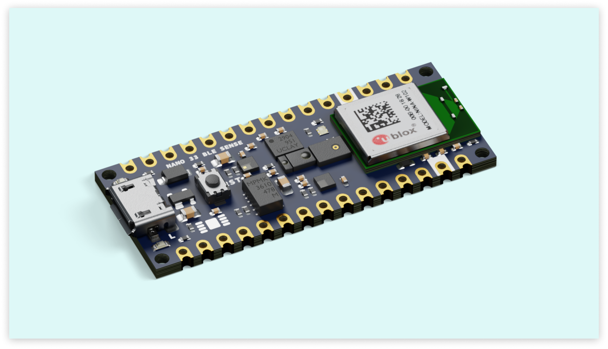
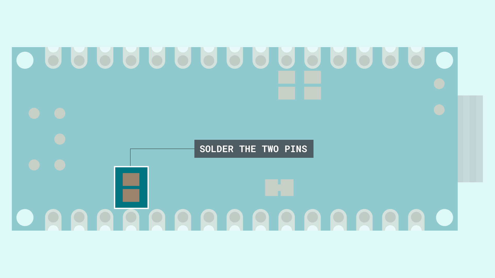
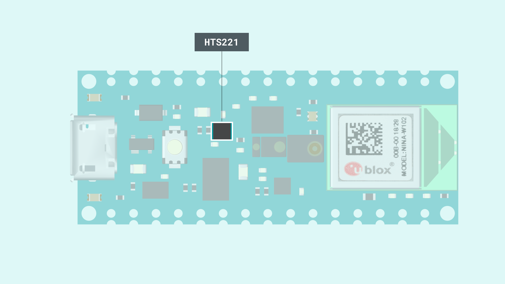
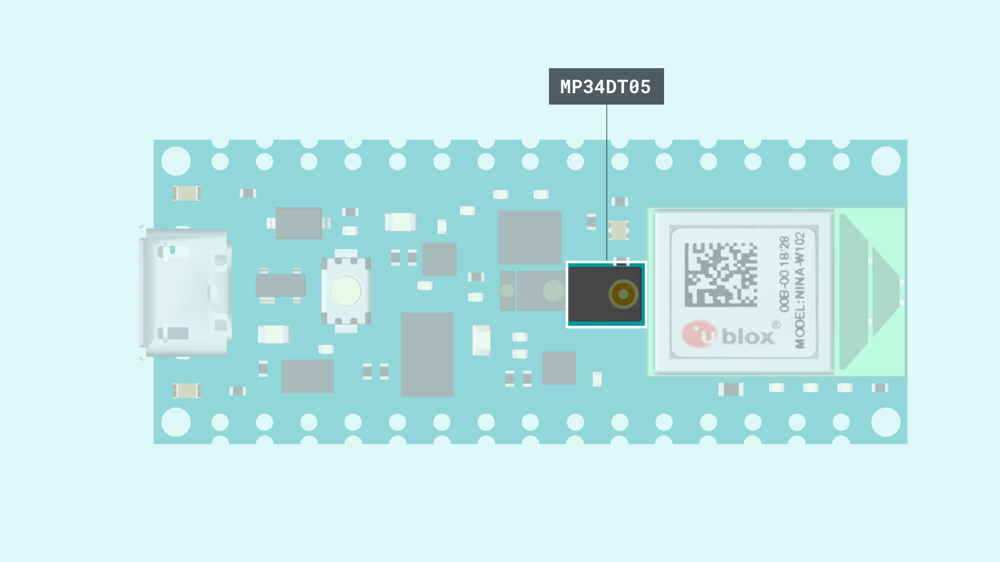
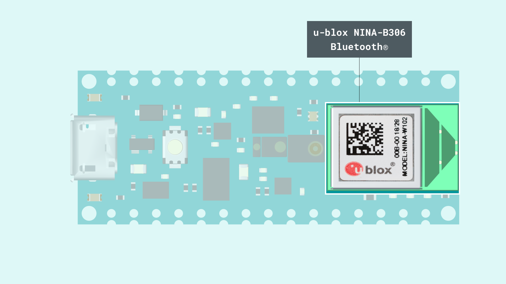

This article is a collection of guides, API calls, libraries and tutorials that can help you get started with the Nano 33 BLE Sense board.

You can also visit the [documentation platform for the Nano 33 BLE Sense](/hardware/nano-33-ble-sense).

## Core

The Nano 33 BLE Sense uses the [Arduino Mbed OS Nano Boards core](https://github.com/arduino/ArduinoCore-mbed).

## Datasheet

The full datasheet is available as a downloadable PDF from the link below:

- [Download the Arduino Nano 33 BLE Sense datasheet](docs.arduino.cc/resources/datasheets/ABX00031-datasheet.pdf)

## Installation

### Arduino IDE 1.8.X

The Nano 33 BLE Sense can be programmed through the **Classic Arduino IDE 1.8.X**. To install your board, you can check out the guide below:

- [Installing the Arduino Mbed OS Nano Boards core](/software/ide-v1/tutorials/getting-started/cores/arduino-mbed_nano)

### Arduino IDE 2.0.X 

The Nano 33 BLE Sense can be programmed through the **Arduino IDE 2.0.X**. To install your board, you can check out the guide below:

- [How to use the board manager with the Arduino IDE 2.0](/software/ide-v2/tutorials/ide-v2-board-manager)

### Web Editor

The Nano 33 BLE Sense can be programmed through the **Web Editor**. To get started with your board, you will only need to install a plugin, which is explained in the guide below:

- [Getting started with the Web Editor](/cloud/web-editor/tutorials/getting-started/getting-started-web-editor)

## Using OpenMV IDE

If you want to use your board with MicroPython and OpenMV. Follow the tutorial below.

- [Getting started with OpenMV with Nano 33 BLE Sense](/tutorials/nano-33-ble-sense/getting-started-omv)

If you want an overlook of the functions and features that MicroPython provides, take a look at the tutorial below.

- [MicroPython functions and syntax guide](/tutorials/nano-33-ble-sense/ble-sense-python-api)

### Forcing Bootloader

There is a risk that the uploading process gets stuck during an upload. If this happens, we can double-tap the reset button, to forcefully trigger the bootloader.

## Pins


### Analog Pins

The Nano 33 BLE Sense has 8 analog pins, that can be used through the `analogRead()` function.

```arduino
value = analogRead(pin, value);
```

***Please note: pin `A4` and `A5` should be used for I2C only.***


### PWM Pins

Pins **D2-D12** and **A0-A7** supports PWM (Pulse Width Modulation).
***Pins A4, A5 and D11, D12 are not recommended for PWM as they have I2C & SPI buses attached.***

```arduino
analogWrite(pin, value);
```

### Digital Pins

There are a total of 14 digital pins.


To use them, we first need to define them inside the `void setup()` function of our sketch.


```arduino
pinMode(pin, INPUT); //configured as an input
pinMode(pin, OUTPUT); //configured as an output
pinMode(pin, INPUT_PULLUP); //uses the internal 10k ohm resistor
```

To read the state of a digital pin:

```arduino
state = digitalRead(pin);
```

To write a state to a digital pin:

```arduino
digitalWrite(pin, HIGH);
```

### 5V Pin

The microcontroller on the Arduino Nano 33 BLE Sense runs at 3.3V, which means that you must never apply more than 3.3V to its Digital and Analog pins. Care must be taken when connecting sensors and actuators to assure that this limit of 3.3V is never exceeded. Connecting higher voltage signals, like the 5V commonly used with the other Arduino boards, will damage the Arduino Nano 33 BLE Sense.

To avoid such risk with existing projects, where you should be able to pull out a Nano and replace it with the new Nano 33 BLE Sense, we have the 5V pin on the header, positioned between RST and A7 that is not connected as default factory setting. This means that if you have a design that takes 5V from that pin, it won't work immediately, as a precaution we put in place to draw your attention to the 3.3V compliance on digital and analog inputs.

5V on that pin is available only when two conditions are met: you make a solder bridge on the two pads marked as VUSB and you power the Nano 33 BLE Sense through the USB port. If you power the board from the VIN pin, you won't get any regulated 5V and therefore even if you do the solder bridge, nothing will come out of that 5V pin. The 3.3V, on the other hand, is always available and supports enough current to drive your sensors. Please make your designs so that sensors and actuators are driven with 3.3V and work with 3.3V digital IO levels. 5V is now an option for many modules and 3.3V is becoming the standard voltage for electronic ICs.



## IMU


### LSM9DS1

The LSM9DS1 inertial measurement unit features a 3D accelerometer, gyroscope and magnetometer and allows you to detect orientation, motion or vibrations in your project.

### LSM9DS1 Library

To access the data from the LSM9DS1 module, we need to install the [LSM9DS1](https://github.com/arduino-libraries/Arduino_LSM9DS1) library, which comes with examples that can be used directly with the Nano 33 BLE Sense.

It can be installed directly from the library manager through the IDE of your choice. To use it, we need to include it at the top of the sketch:

```arduino
#include <Arduino_LSM9DS1.h>
```

And to initialize the library, we can use the following command inside `void setup()`.

```arduino
  if (!IMU.begin()) {
    Serial.println("Failed to initialize IMU!");
    while (1);
  }
```

### Accelerometer

The accelerometer data can be accessed through the following commands:

```arduino
  float x, y, z;

  if (IMU.accelerationAvailable()) {
    IMU.readAcceleration(x, y, z);
  }
```

### Gyroscope

The gyroscope data can be accessed through the following commands:

```arduino
  float x, y, z;

  if (IMU.gyroscopeAvailable()) {
    IMU.readGyroscope(x, y, z);
  }
```

### Magnetometer

The magnetometer data can be accessed through the following commands:

```arduino
  float x, y, z;

  IMU.readMagneticField(x, y, z);
```

### Tutorials

If you want to learn more on how to use the IMU, please check out the tutorial below:

- [Accessing IMU gyroscope data with Nano 33 BLE Sense](/tutorials/nano-33-ble-sense/imu_gyroscope)
- [Accessing IMU accelerometer data with Nano 33 BLE Sense](/tutorials/nano-33-ble-sense/imu_accelerometer)
- [Accessing IMU magnetometer data with Nano 33 BLE Sense](/tutorials/nano-33-ble-sense/imu_magnetometer)

## Proximity and Gesture Detection


### APDS9960

The **APDS9960** chip allows for measuring digital proximity and ambient light as well as for detecting RGB colors and gestures.

### APDS9960 Library

To access the data from the APDS9960 module, we need to install the [APDS9960](https://github.com/arduino-libraries/Arduino_APDS9960) library, which comes with examples that can be used directly with the Nano 33 BLE Sense.

It can be installed directly from the library manager through the IDE of your choice. To use it, we need to include it at the top of the sketch:

```arduino
#include <Arduino_APDS9960.h>
```

And to initialize the library, we can use the following command inside `void setup()`.

```arduino
if (!APDS.begin()) {
  Serial.println("Error initializing APDS9960 sensor!");
}
```

Then we check if there is data available from the proximity sensor. If there is we can print the value in the serial monitor. The value can range between 0-255, where 0 is close and 255 is far away. If it prints the value -1, it indicates an error.

```arduino
if (APDS.proximityAvailable()) {
  Serial.println(APDS.readProximity());
}
```

### Tutorials

If you want to learn more on how to use the proximity sensor, please check out the tutorial below:

- [Proximity Detection with the Nano 33 BLE Sense](https://docs.arduino.cc/tutorials/nano-33-ble-sense/proximity_sensor)
- [Gesture Recognition with the Nano 33 BLE Sense](https://docs.arduino.cc/tutorials/nano-33-ble-sense/gesture_sensor)

## Temperature and Humidity Sensor



### HTS221

The **HTS221** capacitive digital sensor measures relative humidity and temperature. It has a temperature accuracy of ± 0.5 °C (between 15-40 °C) and is thereby perfectly suited to detect ambient temperature.

### HTS221 Library

To access the data from the HTS221 module, we need to install the [HTS221](https://github.com/arduino-libraries/Arduino_HTS221) library, which comes with examples that can be used directly with the Nano 33 BLE Sense.

It can be installed directly from the library manager through the IDE of your choice. To use it, we need to include it at the top of the sketch:

```arduino
#include <Arduino_HTS221.h>
```

And to initialize the library, we can use the following command inside `void setup()`.

```arduino
if (!HTS.begin()) {
  Serial.println("Failed to initialize humidity temperature sensor!");
}
```

Then we can print our values in the serial monitor to check the temperature and humidity values.

```arduino
Serial.println(HTS.readTemperature());
Serial.println(HTS.readHumidity());
```

### Tutorial

If you want to learn more on how to use the temperature and humidity sensor, please check out the tutorial below:

- [Reading Temperature & Humidity on Nano 33 BLE Sense](https://docs.arduino.cc/tutorials/nano-33-ble-sense/humidity_and_temperature_sensor)

## Pressure Sensor


### LPS22HB

The **LPS22HB** picks up on barometric pressure and allows for a 24-bit pressure data output between 260 to 1260 hPa. This data can also be processed to calculate the height above sea level of the current location.

### LPS22HB Library

To access the data from the LPS22HB module, we need to install the [LPS22HB](https://github.com/arduino-libraries/Arduino_LPS22HB) library, which comes with examples that can be used directly with the Nano 33 BLE Sense.

It can be installed directly from the library manager through the IDE of your choice. To use it, we need to include it at the top of the sketch:

```arduino
#include <Arduino_LPS22HB.h>
```

And to initialize the library, we can use the following command inside `void setup()`.

```arduino
if (!BARO.begin()) {
  Serial.println("Failed to initialize pressure sensor!");
}
```

Then we can read the values from the sensor using the code below.

```arduino
BARO.readPressure();
```

### Tutorial

If you want to learn more on how to use the temperature and humidity sensor, please check out the tutorial below:

- [Access Barometric Pressure Sensor Data on Nano 33 BLE Sense](https://docs.arduino.cc/tutorials/nano-33-ble-sense/barometric_sensor)

## Microphone



### MP34DT05 

The **MP34DT05** is a compact, low-power omnidirectional digital MEMS microphone with an IC interface. It has a 64 dB signal-to-noise ratio, is capable of sensing acoustic waves and can operate in temperatures of -40 °C to +85 °C.

### PDM Library

To access the data from the MP34DT05, we need to use the [PDM](https://www.arduino.cc/en/Reference/PDM) library that is included in the **Arduino Mbed OS Nano Boards** core. If the core is installed, you will find an example that works by browsing **File > Examples > PDM > PDMSerialPlotter**. 

***Please note: The sampling frequency in the PDMSerialPlotter example is set to 16000 Hz. If the microphone appears to not be working (monitor is printing a value of -128), try to change this rate to 20000 Hz. You can change this at the top of the PDMSerialPlotter example sketch.***

```arduino
static const int frequency = 20000; //frequency at 20 KHz instead of 16 KHz
```

### Tutorial

If you want to learn more on how to use the Microphone, please check out the tutorial below:

- [Controlling the On-Board RGB LED with Microphone](https://docs.arduino.cc/tutorials/nano-33-ble-sense/microphone_sensor)

## RGB

To turn ON the pixels, write a `HIGH` state to the LED:

```arduino
digitalWrite(LEDR, HIGH); //RED
digitalWrite(LEDG, HIGH); //GREEN
digitalWrite(LEDB, HIGH); //BLUE
```

To turn OFF the pixels, write a `LOW` state to the LED:

```arduino
digitalWrite(LEDR, LOW); //RED
digitalWrite(LEDG, LOW); //GREEN
digitalWrite(LEDB, LOW); //BLUE
```

We can also choose a value between 255 - 0 to write to the LED:

```arduino
analogWrite(LEDR, 72);  //GREEN 
analogWrite(LEDG, 122); //BLUE 
analogWrite(LEDB, 234); //RED 
```

## Communication

Like other Arduino® products, the Nano 33 BLE Sense features dedicated pins for different protocols.

### SPI

The pins used for SPI (Serial Peripheral Interface) on the Nano 33 BLE Sense are the following:

- (CIPO) - D12
- (COPI) - D11
- (SCK) - D13
- (CS/SS) - Any GPIO

***The signal names MOSI, MISO and SS has been replaced by COPI (Controller Out, Peripheral In), CIPO (Controller In, Peripheral Out) and CS (Chip Select).***

To use SPI, we first need to include the [SPI](https://www.arduino.cc/en/reference/SPI) library.

```arduino
#include <SPI.h>
```

Inside `void setup()` we need to initialize the library.

```arduino
SPI.begin();
```

And to write to the device:

```arduino
  digitalWrite(chipSelectPin, LOW); //pull down the CS pin
  
  SPI.transfer(address); // address for device, for example 0x00
  SPI.transfer(value); // value to write

  digitalWrite(chipSelectPin, HIGH); // pull up the CS pin
```


### I2C

The pins used for I2C (Inter-Integrated Circuit) on the Nano 33 BLE Sense are the following:

- (SDA) - A4
- (SCL) - A5

To use I2C, we can use the [Wire](https://www.arduino.cc/en/Reference/wire) library, which we need to include at the top of our sketch.

```arduino
#include <Wire.h>
```

Inside `void setup()` we need to initialize the library.

```arduino
Wire.begin(); 
```

And to write something to a device connected via I2C, we can use the following commands:

```arduino
  Wire.beginTransmission(1); //begin transmit to device 1
  Wire.write(byte(0x00)); //send instruction byte 
  Wire.write(val); //send a value
  Wire.endTransmission(); //stop transmit
```

### UART

The pins used for UART (Universal asynchronous receiver-transmitter) are the following:

- (Rx) - D0
- (Tx) - D1

To send and receive data through UART, we will first need to set the baud rate inside `void setup()`.

```arduino
Serial1.begin(9600);
```

To read incoming data, we can use a while loop() to read each individual character and add it to a string.

```arduino
  while(Serial1.available()){
    delay(2);
    char c = Serial1.read();
    incoming += c;
  }
```

And to write something, we can use the following command:

```arduino
Serial1.write("Hello world!");
```

## Connectivity

The Nano 33 BLE Sense supports Bluetooth® through the [u-blox NINA-B306](https://docs.arduino.cc/resources/datasheets/NINA-B3-series.pdf) module. To use this module, we can use the [ArduinoBLE](https://www.arduino.cc/en/Reference/ArduinoBLE) library. 



## Bluetooth®

To enable Bluetooth® on the Nano 33 BLE Sense, we can use the [ArduinoBLE](https://www.arduino.cc/en/Reference/ArduinoBLE) library, and include it at the top of our sketch:

```arduino
#include <ArduinoBLE.h>
```

Set the service and characteristic:

```arduino
BLEService ledService("180A"); // BLE LED Service
BLEByteCharacteristic switchCharacteristic("2A57", BLERead | BLEWrite);
```

Set advertised name and service:

```arduino
  BLE.setLocalName("Nano 33 BLE Sense");
  BLE.setAdvertisedService(ledService);
```

Start advertising:

```arduino
BLE.advertise();
```

Listen for BLE peripherals to connect:

```arduino  
BLEDevice central = BLE.central();
```

### Tutorials

- [Controlling Nano 33 BLE Sense RGB LED via Bluetooth®](/tutorials/nano-33-ble-sense/bluetooth)

## USB Keyboard

To use the board as a keyboard, you can refer to the [USBHID](https://github.com/arduino/ArduinoCore-mbed/tree/master/libraries/USBHID) library that can be found inside the core.

You first need to include the libraries and create an object:

```arduino
#include "PluggableUSBHID.h"
#include "USBKeyboard.h"

USBKeyboard Keyboard;
```

Then use the following command to write something:

```arduino
Keyboard.printf("This is Nano 33 speaking!");
```
