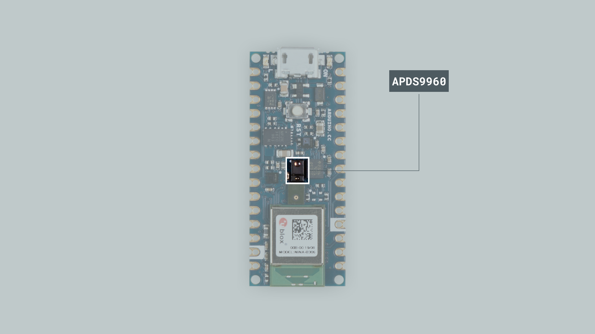
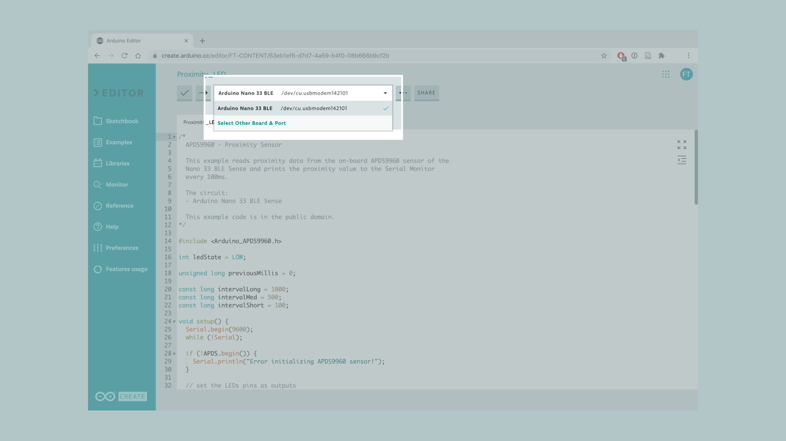
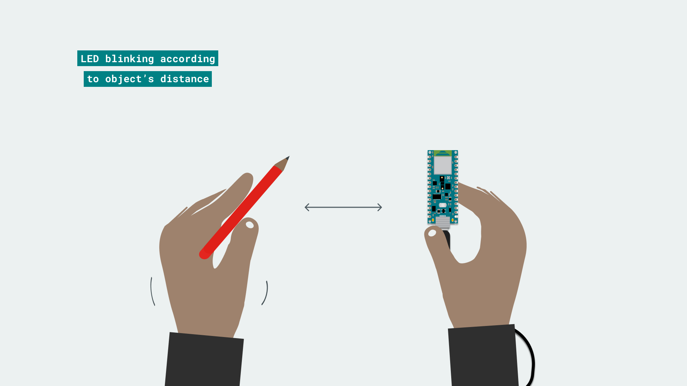

In this tutorial we will use an Arduino Nano 33 BLE Sense for proximity detection, made possible by the embedded **APDS9960** sensor.

We will use the sensor to print out simple proximity detections and control the board's RGB LED accordingly. In addition, we will program our board to change the colors of the RGB LED according to the proximity of an object to the board.

## Goals
The goals of this project are:
 - Learn how the APDS9960 sensor works.
 - Use the APDS9960 library.
 - Learn how to output raw sensor data from the Arduino Nano 33 BLE Sense.
 - Create your own proximity detection monitor.
 - Learn how to control the RGB LED, through proximity values.


## Hardware & Software Needed
* This project uses no external sensors or components.
* In this tutorial we will use the [Arduino Web Editor](https://create.arduino.cc/editor) to program the board.


## APDS9960 Sensor
The APDS9960 sensor is a multipurpose device that features advanced gesture detection, proximity detection, digital ambient light sense (ALS) and color sense (RGBC).



The sensor's gesture detection utilizes four directional photodiodes to sense reflected infrared (IR) energy, sourced by the integrated LED, to convert physical motion information (i.e. velocity, direction and distance) into digital information.

It features:
- Four separate diodes sensitive to different directions.
- Ambient light rejection.
- Offset compensation.
- Programmable driver for IR LED current.
- 32 dataset storage FIFO.
- Interrupt driven I2C-bus communication.


If you want to read more about the APDS9960 sensor module see <a href="https://content.arduino.cc/assets/Nano_BLE_Sense_av02-4191en_ds_apds-9960.pdf" target="_blank">here</a>.


### The Library
The APDS9960 library allows us to use the sensor available on the board, to read gestures, color, light intensity and proximity. The library includes some of the following functions:

```arduino
begin()
end()
gestureAvailable()
readGesture()
colorAvailable()
readColor()
proximityAvailable()
readProximity()
setGestureSensitivity()
setInterruptPin()
setLEDBoost()
```

If you want a deeper understanding on any of the functions of the library, you can check the Arduino [reference](https://www.arduino.cc/en/Reference/ArduinoAPDS9960) for more information.

For the purposes of this tutorial we will only focus on the proximity readings, which are based on the detection of an object over four photodiodes and then converted to millimeters inside the sensor for our usage. 


## Creating the Program

**1. Setting up**


Let's start by opening the Arduino Web Editor, click on the **Libraries** tab and search for the **APDS9960** library. Then in **> Examples**, open the **ProximitySensor** sketch and once it opens, you could rename is as **Proximity_LED**.


**2. Connecting the board**


Now, connect the Arduino Nano 33 BLE Sense to the computer and make sure that the Web Editor recognizes it, if so, the board and port should appear as shown in the image below. If they don't appear, follow the [instructions](https://create.arduino.cc/getting-started/plugin/welcome) to install the plugin that will allow the Editor to recognize your board.



**3. Blink patters according to proximity**


Now we will need to modify the code on the example, in order to change the color of the RGB LED according to the proximity.

After including the `Arduino_APDS9960.h` library, we will need to initialize some variables that will be used to control the blinking time of the RGB LED.

```arduino
#include <Arduino_APDS9960.h>

int ledState = LOW;

unsigned long previousMillis = 0;

const long intervalLong = 1000;
const long intervalMed = 500;
const long intervalShort = 100;
```

Now, we need to configure the LED's pins at the end of the `setup()` section, to behave as `OUTPUT`s and then we need to turn all the LEDs OFF, by adding the following statements:

```arduino
  // set the LEDs pins as outputs
  pinMode(LEDR, OUTPUT);
  pinMode(LEDG, OUTPUT);
  pinMode(LEDB, OUTPUT);

  // turn all the LEDs off
  digitalWrite(LEDR, HIGH);
  digitalWrite(LEDG, HIGH);
  digitalWrite(LEDB, HIGH);
```

In the `loop()` section, we need to initialize a new variable called `currentMillis` where the time that the sketch has been running, will be stored. The `if()` statement is checking that the gesture sensor is available and if it is, it reads for any incoming gesture detection.

```arduino
  unsigned long currentMillis = millis();

  // check if a proximity reading is available
  if (APDS.proximityAvailable()) {
    // read the proximity
    // - 0   => close
    // - 255 => far
    // - -1  => error
    int proximity = APDS.readProximity();
```

The next thing we need to do is create an `if` statement to check if the object is far. If it is, the green LED will blink slowly using the `intervalLong` to set the blinking time.

```arduino
  if (proximity > 150) {
      if (currentMillis - previousMillis >= intervalLong) {
        previousMillis = currentMillis;

        // if the LED is off turn it on and vice-versa:
        if (ledState == LOW) {
          ledState = HIGH;
        } else {
          ledState = LOW;
        }

        // set the green LED with the ledState of the variable and turn off the rest
        digitalWrite(LEDG, ledState);
        digitalWrite(LEDR, HIGH);
        digitalWrite(LEDB, HIGH);
      }
    }
```

Now, we need to do the same to check if the object is in a medium distance from the board using an `else if` statement. If it is, the blue LED will blink faster than before due to the `intervalMed`.

```arduino
  else if(proximity > 50 && proximity <= 150){
    if (currentMillis - previousMillis >= intervalMed) {
      previousMillis = currentMillis;

      // if the LED is off turn it on and vice-versa:
      if (ledState == LOW) {
        ledState = HIGH;
        } else {
          ledState = LOW;
        }

        // set the blue LED with the ledState of the variable and turn off the rest
        digitalWrite(LEDB, ledState);
        digitalWrite(LEDR, HIGH);
        digitalWrite(LEDG, HIGH);
      }
    }
```

Lastly, we use another `else` statement to check if the object is too close from the board. If it is, the red LED will blink fast thanks to the `intervalShort`. Finally, we will use a `Serial.println()` function to print out the proximity values to the Serial Monitor. Don't forget to delete the `delay()` function since this could make us lose some data.

```arduino
  else {
    if (currentMillis - previousMillis >= intervalShort) {
      previousMillis = currentMillis;

      // if the LED is off turn it on and vice-versa:
      if (ledState == LOW) {
        ledState = HIGH;
      } else {
        ledState = LOW;
      }

      // set the blue LED with the ledState of the variable and turn off the rest
      digitalWrite(LEDR, ledState);
      digitalWrite(LEDB, HIGH);
      digitalWrite(LEDG, HIGH);
      }
    }

    // print value to the Serial Monitor
    Serial.println(proximity);
  }
}
```

Now the code is complete!


**4. Complete code**


If you choose to skip the code building section, the complete code can be found below:

```arduino
#include <Arduino_APDS9960.h>

int ledState = LOW;

unsigned long previousMillis = 0;

const long intervalLong = 1000;
const long intervalMed = 500;
const long intervalShort = 100;

void setup() {
  Serial.begin(9600);
  while (!Serial);

  if (!APDS.begin()) {
    Serial.println("Error initializing APDS9960 sensor!");
  }

  // set the LEDs pins as outputs
  pinMode(LEDR, OUTPUT);
  pinMode(LEDG, OUTPUT);
  pinMode(LEDB, OUTPUT);

  // turn all the LEDs off
  digitalWrite(LEDR, HIGH);
  digitalWrite(LEDG, HIGH);
  digitalWrite(LEDB, HIGH);
}

void loop() {
  unsigned long currentMillis = millis();

  // check if a proximity reading is available
  if (APDS.proximityAvailable()) {
    // read the proximity
    // - 0   => close
    // - 255 => far
    // - -1  => error
    int proximity = APDS.readProximity();

    if (proximity > 150) {
      if (currentMillis - previousMillis >= intervalLong) {
        previousMillis = currentMillis;

        // if the LED is off turn it on and vice-versa:
        if (ledState == LOW) {
          ledState = HIGH;
        } else {
          ledState = LOW;
        }

        // set the green LED with the ledState of the variable and turn off the rest
        digitalWrite(LEDG, ledState);
        digitalWrite(LEDR, HIGH);
        digitalWrite(LEDB, HIGH);
      }
    }

    else if(proximity > 50 && proximity <= 150){
      if (currentMillis - previousMillis >= intervalMed) {
        previousMillis = currentMillis;

        // if the LED is off turn it on and vice-versa:
        if (ledState == LOW) {
          ledState = HIGH;
        } else {
          ledState = LOW;
        }

        // set the blue LED with the ledState of the variable and turn off the rest
        digitalWrite(LEDB, ledState);
        digitalWrite(LEDR, HIGH);
        digitalWrite(LEDG, HIGH);
      }
    }

    else {
      if (currentMillis - previousMillis >= intervalShort) {
        previousMillis = currentMillis;

        // if the LED is off turn it on and vice-versa:
        if (ledState == LOW) {
          ledState = HIGH;
        } else {
          ledState = LOW;
        }

        // set the blue LED with the ledState of the variable and turn off the rest
        digitalWrite(LEDR, ledState);
        digitalWrite(LEDB, HIGH);
        digitalWrite(LEDG, HIGH);
      }
    }

    // print value to the Serial Monitor
    Serial.println(proximity);
  }
}
```


## Testing It Out

After you have successfully verified and uploaded the sketch to the board, open the Serial Monitor from the menu on the left.

In order to test out the code, you could begin by stabilizing your board on a standing position in front of you (USB port facing down) and moving an object up and down close to the board. You will see the values on the Serial Monitor changing and changing the color of the RGB LED and the blinking time.




Here is a screenshot example of the sketch returning values through the Serial Monitor.


### Troubleshoot
Sometimes errors occur, if the code is not working there are some common issues we can troubleshoot:
- Missing a bracket or a semicolon
- Arduino board connected to the wrong port
- Accidental interruption of cable connection


## Conclusion
In this tutorial we learned what the **APDS9960** sensor is, how to use the one embedded in the Arduino Nano 33 BLE Sense board and the APDS9960 library. In addition, we demonstrated how to create your own proximity detection monitor which can operate the RGB LED in various color and time patterns.

