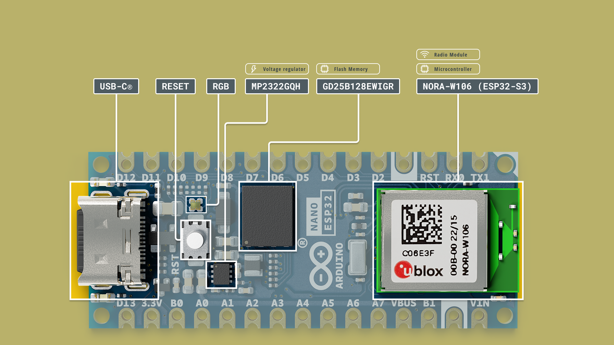
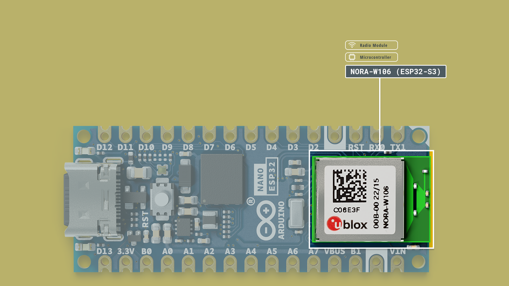
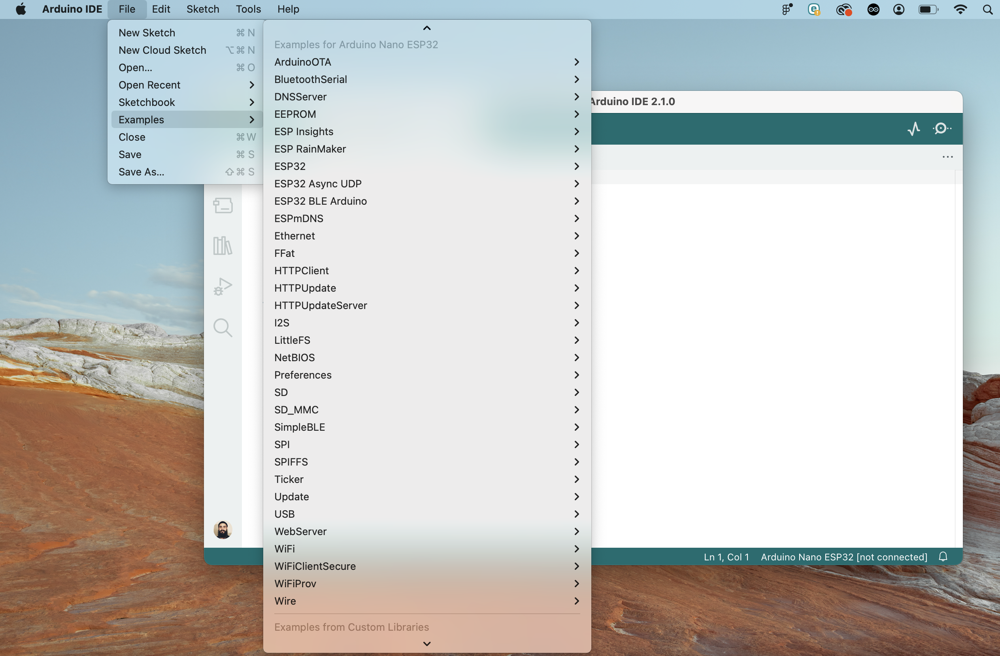
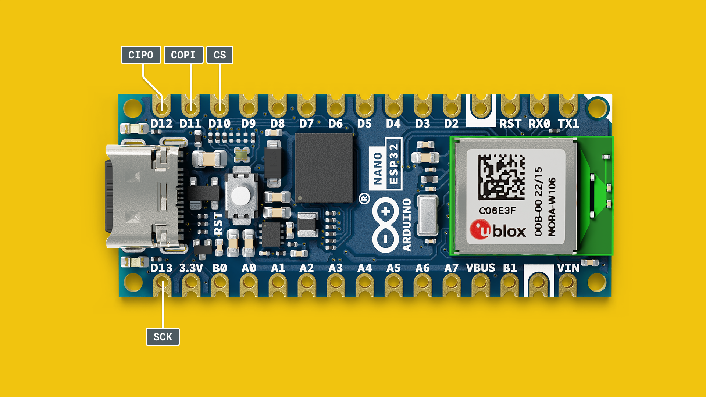

The **Arduino Nano ESP32** is the first Arduino to feature an ESP32 SoC, based on the [ESP32-S3](https://www.espressif.com/en/products/socs/esp32-s3). This SoC is found inside the **uBlox NORA-W106** module and provides both Bluetooth® & Wi-Fi® connectivity, as well as embedding an antenna.



In this document, you will find information regarding features your board, and links to resources. 

***Note that this board is compatible with many ESP32 examples out of the box, but that the pinout may vary. You can find the complete API at [ESP32-S3 API reference](https://docs.espressif.com/projects/esp-idf/en/latest/esp32s3/api-reference/index.html).*** 

## NORA-W106 (ESP32-S3)



The Nano ESP32 features the **ESP32-S3** system on a chip (SoC) from Espressif, which is embedded in the **NORA-W106** module. The ESP32-S3 has a dual-core microprocessor Xtensa® 32-bit LX7, and has support for the 2.4 GHz Wi-Fi band as well as Bluetooth 5. The operating voltage of this SoC is 3.3V.

The NORA-W106 also embeds an antenna for Bluetooth® and Wi-Fi® connectivity.

### Memory

The memory of the ESP32-S3 has 
- 384 KB ROM
- 512 KB SRAM
- 128MB of Flash (external, provided via GD25B128EWIGR)

## Datasheet

The full datasheet is available as a downloadable PDF from the link below:

- [Download the Nano ESP32 datasheet](/resources/datasheets/ABX00083-datasheet.pdf)

## Nano ESP32 Core

This board is based on the [Arduino ESP32 Core](https://github.com/arduino/arduino-esp32), a derivation of the original ESP32 core. It provides a rich set of examples to access the various features on your board, which is accessed directly through the IDE.



To install the core, go the **board manager** and search for **Nano ESP32**. If you need more instructions to install the core, please refer to the [Getting Started with Nano ESP32]() article.

You can also program your board via the [Arduino Web Editor](arduino-cloud/getting-started/getting-started-web-editor), an online IDE.

## API

Please refer to the well documented [ESP32-S3 API](https://docs.espressif.com/projects/esp-idf/en/latest/esp32s3/api-reference/index.html#) for more information regarding the API and accessing the boards peripherals.

To access the ESP32-S3's peripherals (e.g. ADC, I2C, SPI), refer to the [Peripherals API section](https://docs.espressif.com/projects/esp-idf/en/latest/esp32s3/api-reference/peripherals/index.html#).


## MicroPython

The Nano ESP32 has support for MicroPython, a micro-implementation of Python that can easily be installed on your board.

To get started with MicroPython, please visit [MicroPython 101](), a course dedicated towards learning MicroPython on the Nano ESP32.

In this course, you will fundamental knowledge to get started, as well as a large selection of examples for popular third-party components.

## Arduino IoT Cloud

Nano ESP32 is supported in the [Arduino IoT Cloud](https://create.arduino.cc/iot/) platform. You can connect to the cloud either through "classic" Arduino, using the C++ library, or via MicroPython:
- [Getting Started with Arduino IoT Cloud (classic)](https://docs.arduino.cc/arduino-cloud/getting-started/iot-cloud-getting-started)
- [MicroPython with Arduino IoT Cloud](https://docs.arduino.cc/arduino-cloud/getting-started/iot-cloud-micropython)

## Power Considerations

To power the Nano ESP32 you may either use a USB-C cable, or the VIN pin. Never exceed 5-18V as the **MP2322GQH** converter on the board is not designed for any higher voltages. 

### Input Voltage (VIN)

- If you're using the USB-C connector you must power it with 5V.
- The recommended input voltage on the VIN pin is 5-18V.

### Operating Voltage

The internal operating voltage of the microcontroller is 3.3V, and you should not apply voltages higher than that to the GPIO pins.

### 5V Pin / VUSB

The Nano ESP32 is the first board to not feature a **5V** pin. It has instead been replaced with VBUS, which is a more accurate description of the pin's capabilities.

`VBUS` provides 5V whenever powered via USB. If powered via the VIN pin, it is disabled. This means that while powering the board through the VIN pin, you can't get 5V from the board, and you need to use a logic level shifter or an external 5V power supply.

This measure is taken to prevent the board's microcontroller from accidentially receiving 5V, which will damage it.

## Pins

The Nano ESP32 has two headers: the **analog** and **digital**. Listed here are the **default** pins that comply with previous Nano form factor designs.

### Analog Header
| Function | Type   | Description                                 |
| -------- | ------ | ------------------------------------------- |
| D13/SCK  | NC     | **SPI** Serial Clock / LED Built in         |
| +3V3     | Power  | +3V3 Power Rail                             |
| BOOT0    | Mode   | Board Reset 0                               |
| A0       | Analog | Analog input 0                              |
| A1       | Analog | Analog input 1                              |
| A2       | Analog | Analog input 2                              |
| A3       | Analog | Analog input 3                              |
| A4       | Analog | Analog input 4 / **I2C** Serial Datal (SDA) |
| A5       | Analog | Analog input 5 / **I2C** Serial Clock (SCL) |
| A6       | Analog | Analog input 6                              |
| A7       | Analog | Analog input 7                              |
| VUSB     | Power  | USB power (5V)                              |
| BOOT1    | Mode   | Board Reset 1                               |
| GND      | Power  | Ground                                      |
| VIN      | Power  | Voltage Input                               |

### Digital Header

| Pin      | Type     | Description                          |
| -------- | -------- | ------------------------------------ |
| D12/CIPO | Digital  | **SPI** Controller In Peripheral Out |
| D11/COPI | Digital  | **SPI** Controller Out Peripheral In |
| D10      | Digital  | GPIO                                 |
| D9       | Digital  | GPIO                                 |
| D8       | Digital  | GPIO                                 |
| D7       | Digital  | GPIO                                 |
| D6       | Digital  | GPIO                                 |
| D5       | Digital  | GPIO                                 |
| D4       | Digital  | GPIO                                 |
| D3       | Digital  | GPIO                                 |
| D2       | Digital  | GPIO                                 |
| GND      | Power    | Ground                               |
| RST      | Internal | Reset                                |
| D1/RX    | Digital  | GPIO 1 / **UART** Receiver (RX)      |
| D0/TX    | Digital  | GPIO 0 / **UART** Transmitter (TX)   |

## Boot Pins

To enter bootloader mode (chip boot mode), you can use either the BOOT0 or BOOT1 pins, which are connected to the ESP32-S3's `GPIO0` and `GPIO46`.

Shorting these to GND + pressing the reset button will enter a bootloader mode. Note that while shorting these pins, a corresponding LED will  

You can read more about different this in the [Strapping Pins section](https://www.espressif.com/sites/default/files/documentation/esp32-s3_datasheet_en.pdf#page=23) in the ESP32-S3's datasheet.

## IO Mux & GPIO Matrix

The ESP32-S3 SoC features an IO mux (input/output multiplexer) and a GPIO matrix. The IO mux acts as a data selector and allows for different peripherals to be connected to a physical pin. 

The ESP32-S3 chip has 45 physical GPIOs, but many more digital peripherals. The IO mux provides the flexibility of routing the signals to different GPIOs, thus changing the function of a specific pin.


This technique is well known and applied within ESP32 boards, but on the Nano ESP32 we use a set of default pins for the I2C, SPI & UART peripherals to remain consistent with previous designs.

As an example, the Nano ESP32's SDA/SCL pins are attached to A4/A5 by default. These pins can be changed to e.g. D8,D9 if you need to use another set of pins. This is done through the mux / GPIO matrix.

### Re-assigning Pins

You can read more about re-assigning the peripherals through the links below:
- [I2C configuration (link to Espressif docs)](https://docs.espressif.com/projects/esp-idf/en/latest/esp32s3/api-reference/peripherals/i2c.html#i2c-api-configure-driver)
- [UART configuration (link to Espressif docs)](https://docs.espressif.com/projects/esp-idf/en/latest/esp32s3/api-reference/peripherals/uart.html#uart-api-setting-communication-pins)

You can also 

- [IO MUX and GPIO Matrix (ESP32-S3 technical reference manual)](https://www.espressif.com/sites/default/files/documentation/esp32-s3_technical_reference_manual_en.pdf#iomuxgpio)

## Wi-Fi®

The Nano ESP32 has a NORA-W106 module which has the ESP32-S3 SoC embedded. This module supports Wi-Fi communication over the 2.4GHz band.

There are several examples provided bundled with the core that showcase how to make HTTP requests, host web servers, send data over MQTT etc.

## RGB

The ESP32 features an RGB that can be controlled with the `0`, `45` and `46` GPIO. These are not connected to any physical pins. 

To control them, use:

```arduino
digitalWrite(46, STATE); //red
digitalWrite(45, STATE); //green
digitalWrite(0, STATE); //blue
```

## USB HID

Nano ESP32 can be used to emulate an HID device by using e.g. `Mouse.move(x,y)` or `Keyboard.press('w')`. The API documentation can be found in Arduino's language reference:

- [Keyboard API](https://www.arduino.cc/reference/en/language/functions/usb/keyboard/)
- [Mouse API](https://www.arduino.cc/reference/en/language/functions/usb/mouse/)

Several ready to use examples are also available in the core at **Examples > USB**.

## SPI 



The **Nano ESP32** SPI peripheral is attached to the following pins: 

`SPI` uses the following pins:

- (SCK) - D13
- (CIPO) - D12
- (COPI) - D11
- (CS) - D10\*

\*CS (Chip Select) can be changed to any free GPIO


## I2C


I2C lets you connect multiple I2C compatible devices in series using only two pins. The controller will send out information through the I2C bus to a 7-bit address, meaning that the technical limit of I2C devices on a single line is 128.

The pins used for I2C on the **Nano ESP32** are the following:
- SDA - A4
- SCL - A5

To connect I2C devices you will need to include the [Wire](https://www.arduino.cc/reference/en/language/functions/communication/wire/) library at the top of your sketch.

```arduino
#include <Wire.h>
```

Inside `void setup()` you need to initialize the library, and initialize the I2C port you want to use.

```arduino
Wire.begin(); //initialize library
```

And to write something to a device connected via I2C, we can use the following commands:

```arduino
Wire.beginTransmission(1); //begin transmit to device 1
Wire.write(byte(0x00)); //send instruction byte 
Wire.write(val); //send a value
Wire.endTransmission(); //stop transmit
```

## Serial/UART Pins

The **Nano ESP32** supports hardware serial communication with UART (Universal Asynchronous, Receiver-Transmitter). 

The default UART pins are the following:

- RX0 - D0
- TX0 - D1

Serial communication is handled via the `Serial` API, where `Serial` handles communication over USB, and `Serial1` over D0/D1.

```arduino
Serial //serial over USB
Serial1 //serial over D0/D1
```

To send and receive data through UART, we will first need to set the baud rate inside `void setup()`.

```arduino
Serial.begin(9600); //serial over USB
Serial1.begin(9600); //serial using D0/D1
```

To print something to the computer over USB, we use the `print()` / `println()` function.

```arduino
Serial.print(); //prints content 
Serial.println(); //prints content + new line
```

And to write something using D0/D1 (UART), we can use the following command:

```arduino
Serial1.write("Hello world!");
```

To read incoming data, we can use a while loop() to read each individual character and add it to a string.

```arduino
  while(Serial1.available()){
    delay(2);
    char c = Serial1.read();
    incoming += c;
  }
```

## Test Pads

There are several test pads on the bottom side of the Nano ESP32. See the image below:

