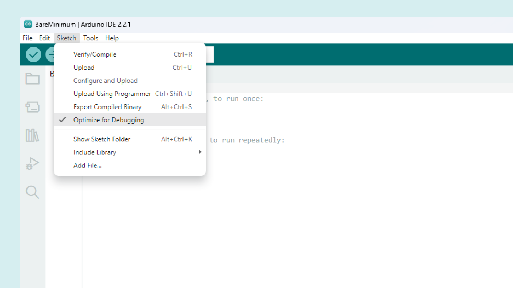
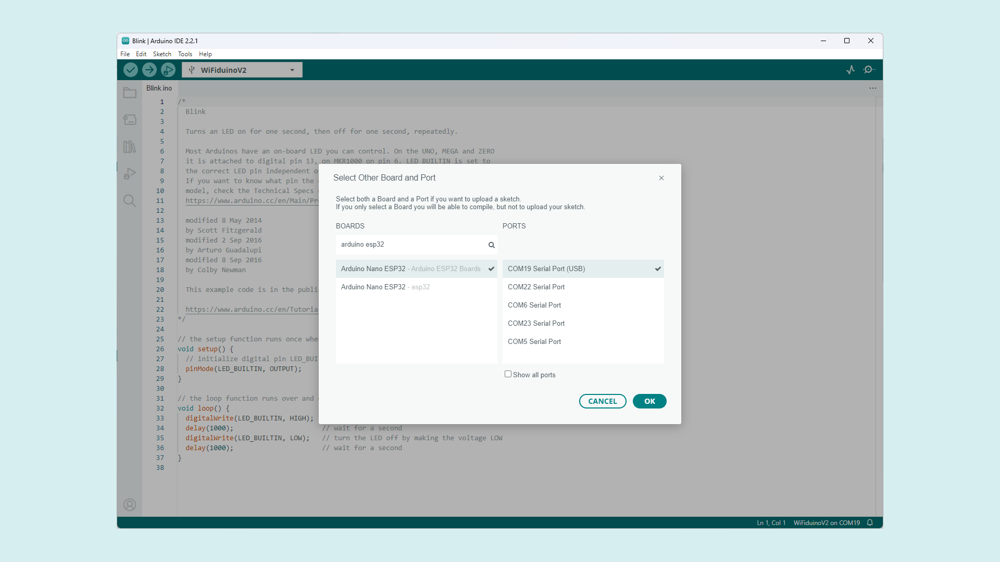
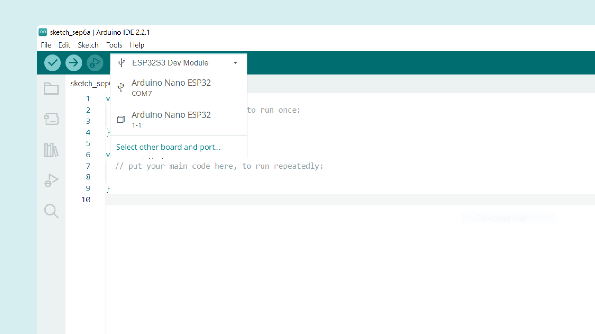
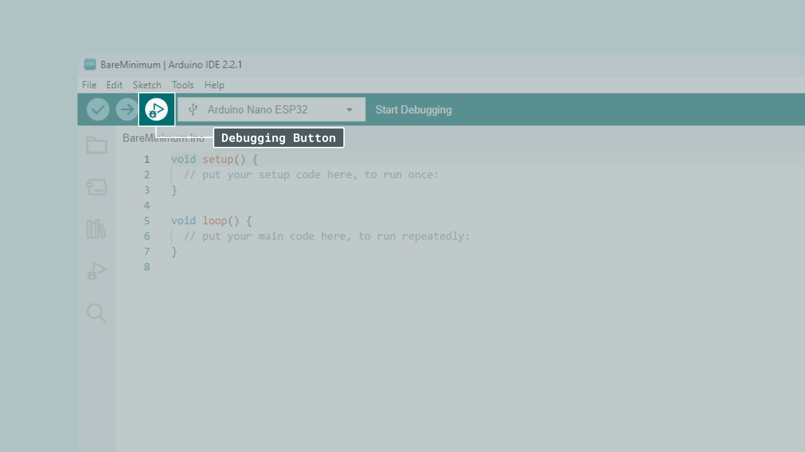

Debugging skills are valuable not only for tackling complex projects but also for beginners and those working on intermediate-level projects, as they offer valuable insights into the specific behavior of your code.

***Some boards from the first limited production batch were assembled with a different RGB LED which has the green and blue pins inverted. For more information read our full Help Center article [here](https://support.arduino.cc/hc/en-us/articles/9589073738012).***

## What Is Debugging?

Debugging is an essential skill for anyone working with technology, whether you're a software developer, a student learning to code, or someone who just wants to understand how computers work. Here's why it's so crucial:

**Improving Performance**: Debugging helps identify and resolve issues that can slow down your software or make it behave unpredictably.

**Ensuring Reliability**: Debugging ensures that your programs and devices work correctly and reliably, preventing crashes or malfunctions.

**Saving Time and Frustration**: Fixing bugs early in the development process can save you hours, days, or even weeks of frustration down the road.

**Learning Opportunity**: Debugging challenges your problem-solving skills and deepens your understanding of programming and technology.

## Software & Hardware Needed

- [Arduino Nano ESP32](https://store.arduino.cc/nano-esp32)
- [Arduino IDE](https://www.arduino.cc/en/software)
- [Arduino ESP32 Core](https://github.com/arduino/arduino-esp32) installed (2.0.12 or newer)

***It's important to use the "Arduino ESP32 Boards" core by "Arduino" and not the "esp32" core by "Espressif Systems". For Windows users this is paramount, otherwise no drivers will be ever installed and no debugging can be performed.***

## System Setup

### Debugging on Linux

When debugging on a Linux machine you may encounter the following error, due to your user not having the authorization to connect:

```
Error: libusb_open() failed with LIBUSB_ERROR_ACCESS
Error: esp_usb_jtag: could not find or open device!
```

To fix this, you can copy [this file](https://raw.githubusercontent.com/espressif/openocd-esp32/master/contrib/60-openocd.rules) in your `/etc/udev/rules.d/` folder (as root).

### Debugging on Windows

On Windows machines it's important to accept the driver installation when prompted during the core installation.

### IDE Setup

To use the debugging feature on the Nano ESP32, you need to have the IDE 2.2.0 or a newer version installed. After you install it, you have to configure the IDE as follows:

-  **Tools** > **USB Mode** > **Debug mode (Hardware CDC)**


-  **Tools** > **Programmer** > **Esptool**


-  **Sketch** > **Optimize for Debugging**



## Running a Debug Session

If this is your first time debugging your code we recommend starting with the classic Blink example. It's a simple sketch but works great for understanding the basics of debugging.

Before starting a debug session you need to upload your sketch using one of the following methods:

### Method 1

- Connect a jumper cable between the **GND** and the **B1** pins and press the reset button **once**. The RGB LED will turn on with a green or blue color.

- Remove the jumper cable and you should see the RGB LED light up in a purple or yellow color, which means you successfully entered the **ROM Boot mode**. Note that inside **Tools**, the board will be shown as a random ESP32 board.

***This is because in this mode all ESP32 chips share the same identifier assigned to USB devices, therefore the IDE selects a random ESP32 board.***

- Continue by clicking on the drop-down menu.


- Then type "Arduino ESP32" and select the correct Port. Make sure to select the option by Arduino!



- After that select **Sketch** > **Upload Using Programmer**.

### Method 2

- Slowly double-tap the reset button to enter the Arduino bootloader mode.

***Performing the double press can be a little tricky. Press it once, wait until you see the RGB LED flashing in different colours, then press again. If done correctly the RGB LED will start fading slowly.***

- You should see two ports in the drop-down menu, one showing a USB symbol and another one showing a cube.



- Select the port next to the **USB symbol** and upload a sketch like normal.

### Manual Reset

After uploading a sketch using **either** Method 1 or Method 2 make sure to also **manually reset** the board by pressing the reset button **once**. Otherwise, it may not properly connect via USB and not show up inside the IDE.

### Start Debugging

Finally, after completing all necessary steps above the last step is to start the debugging sessions via the **Start Debugging** button found at the top of the IDE next to the Upload button.



***Note: During the upload you will see a debug_custom.json appear in the file view. If you want to debug using another board it's important that you delete this file otherwise the IDE will use the wrong debugger and fail. You can find the file inside your sketch folder, typically at `~/documents/Arduino/<yoursketch>`***

After starting the debugging session you have to press the continue button **several times** until you reach your main sketch and the breakpoints you set. This is due to how the recovery system works is expected behavior.


## Restore Normal Upload Functionality

Debug-enabled sketches will only accept updates with the above instructions. To restore normal upload functionality, set **Tools** > **USB Mode** to "**Normal mode (Tiny USB)**". You can also uncheck "**Optimize for Debugging**" to increase compilation speed.

Then **either** repeat [Method 1](#method-1) or [Method 2](#method-2).

## Summary

In this article, we covered the basic steps for debugging the Arduino Nano ESP32 using the Arduino IDE. We have learned how to select the debug mode, how to place the board in the right mode, and how to test out the Arduino IDE's debugging features.

## Learn More
This article only covers how to configure the Nano ESP32 for debugging, and how to get things working. To learn more about how to use the debugging features in the IDE, see the [Debugging with the Arduino IDE 2](/software/ide-v2/tutorials/ide-v2-debugger) article, which covers things in more detail.