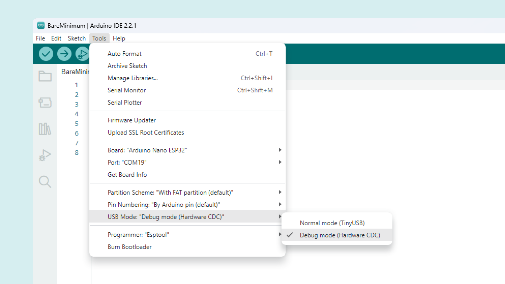
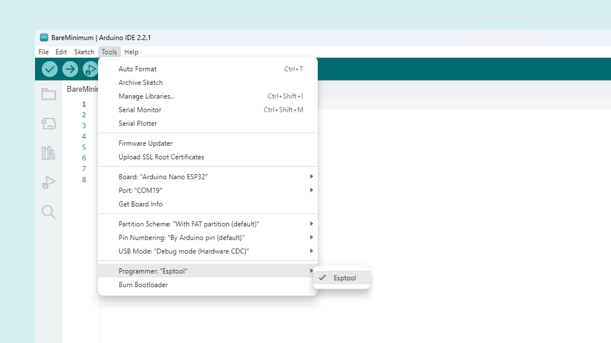

Debugging is a crucial step especially when developing more complex projects. But even for beginners, it can be worth looking into as it gives you a lot more insights on what your code does at a specific time. 

## What Is Debugging?

Debugging is an essential skill for anyone working with technology, whether you're a software developer, a student learning to code, or someone who just wants to understand how computers work. Here's why it's so crucial:

**Improving Performance**: Debugging helps identify and resolve issues that can slow down your software or make it behave unpredictably.

**Ensuring Reliability**: Debugging ensures that your programs and devices work correctly and reliably, preventing crashes or malfunctions.

**Saving Time and Frustration**: Fixing bugs early in the development process can save you hours, days, or even weeks of frustration down the road.

**Learning Opportunity**: Debugging challenges your problem-solving skills and deepens your understanding of programming and technology.

## Software & Hardware Needed

- [Arduino Nano ESP32](https://store.arduino.cc/nano-esp32)
- [Arduino IDE](/software/ide-v2)
- [Arduino Nano ESP32 Core](https://github.com/arduino/arduino-esp32) (2.0.12 or newer)

## IDE Setup

In order to use the debugging feature on the Nano ESP32 you will need to download and install the IDE 2.2.0 or newer. After you install it, you have to configure the IDE as follows:

-  **Tools** > **USB Mode** > **Debug mode (Hardware CDC)**

-  **Tools** > **Programmer** > **Esptool**

-  **Sketch** > **Optimize for Debugging**

## Running a Debug Session

If this is your first time debugging your code we recommend starting with the classic Blink example. It's a simple sketch but works great for understanding the basics of debugging.

Before starting a debug session make sure to always do one of the following:

- Either connect a jumper cable between the **GND** and the **B1** pins and press the reset button **once**. The RGB LED will turn on with a green or blue color. Inside **Tools**, the board will be shown as a random ESP32 board. 

***This is because in this mode all ESP32 chips share the same identifier assigned to USB devices, therefore the IDE selects a random ESP32 board.***

Continue to select **Tools** > **Board** > **Arduino Nano ESP32** as well as the correct **Port**.

After that select **Sketch** > **Upload Using Programmer**.

- Or double tap the reset button. You will see the RGB LED fading slowly which means you correctly entered the recovery / Device Firmware Update (DFU) mode. You should see two ports in the drop-down menu, one showing a USB symbol and another one showing a cube.

**After the upload completes** either way, make sure to also **manually reset** the board by pressing the reset button **once**. Otherwise, it may not properly connect via USB and not show up inside the IDE.

Finally, after completing all steps above the last step is to start the debugging sessions via the **Start Debugging** button found at the top of the IDE next to the Upload button.

***Note: During the upload you will see a debug_custom.json being created at the top of the IDE. If you want to debug using another board it's important that you delete this file otherwise the IDE will use the wrong debugger and fail. You can find the file inside your sketch folder at ~\Documents\Arduino\sketches\"Your Sketch".***

After starting the debugging session you will have to press the continue button **several times** until you reach you main sketch and the breakpoints you set. This is due to how the recovery system works and is **expected behavior**.

## Restore Normal Upload Functionality

Debug-enabled sketches will only accept updates with the above instructions. To restore normal upload functionality, set **Tools** > **USB Mode** to "**Normal mode (Tiny USB)**". You can also uncheck "**Optimize for Debugging**" to increase compilation speed.

Then repeat the steps described above:

- Either connect a jumper cable between the **GND** and the **B1** pins press the reset button **once** and upload using programmer 

- Or **double tap** the reset button to enter **DFU mode** and perform a normal upload using the upload button.

## Learn More

To learn more about how to debug using the IDE check out [Debugging with the Arduino IDE 2](/software/ide-v2/tutorials/ide-v2-debugger)

## Summary

In this article we covered the basic steps for getting started with debugging using the Arduino Nano ESP32 and the IDE 2.