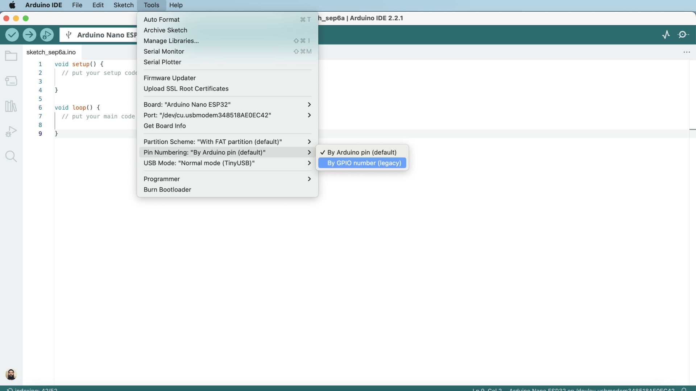
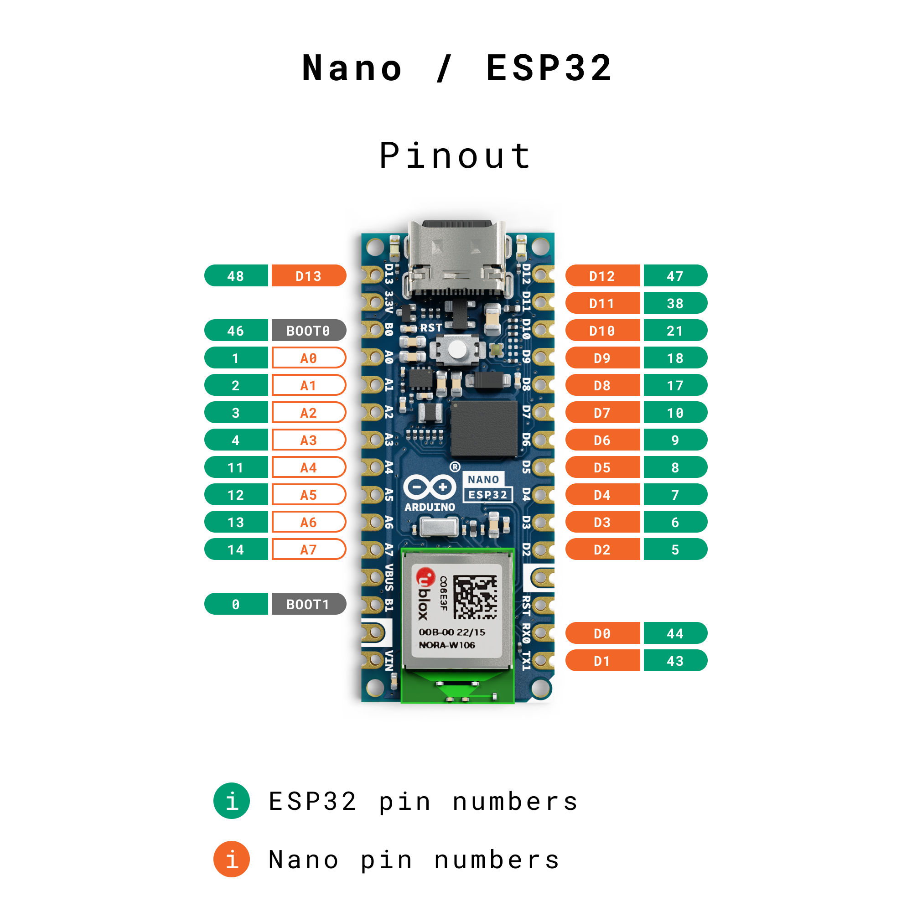

The [Arduino Nano ESP32](https://store.arduino.cc/nano-esp32) is a Nano form factor board based on an ESP32-S3 SoC. This board is part of the [Arduino Nano Family](https://store.arduino.cc/pages/nano-family), and follows the same pinout as all Nano boards. This is very convenient if you want to port a project from another Nano board, as you can preserve the same wiring and pin numbers in the code.

This means that if you want to control a pin you can simply use the pin number that is printed on the board itself:

```
// This will enable the pin marked with "8" on the board:
digitalWrite(8, HIGH);
```

However, some libraries previously written for ESP32 boards (to name a few: OneWire, FastLED, ESP32Servo) don't support the pin numbers printed on the board and require you to refer to the internal microcontroller's GPIO number instead.  For instance, to refer to the pin labelled "8" on the board such libraries expect you to write `17` in your code as that's the GPIO number corresponding to that pin.

For this purpose, we added a compatibility mode so that you can choose which numbering scheme you want to use:

* when porting an existing Arduino project from another Nano board, it's convenient to use the "Arduino pin" scheme which reflects the numbers printed on the board
* when using third-party libraries for ESP32, you should use the "GPIO number" scheme which corresponds to the internal numbers

To change this configuration, simply connect your board, go to **Tools > Pin Numbering > Select Option**. More details are available in this tutorial.

## Software & Hardware Needed

- [Arduino Nano ESP32](https://store.arduino.cc/nano-esp32)
- [Arduino IDE](https://www.arduino.cc/en/software)
- [Arduino ESP32 Core](https://github.com/arduino/arduino-esp32) (version 2.0.12 and above). Can be installed directly in the Arduino IDE.

## Different Pin Configurations

So why does the Nano ESP32 pins not match the ESP32 (MCU) pins? The Nano ESP32 was designed using the **Nano form factor**, a favorable form factor for many, which has consistently kept its pins for many years. 

This makes it possible to migrate an older Nano board, to a newer generation Nano (like the Nano ESP32), without having to change your hardware setup. 

This of course brings a separate issue, which is that by default, the Nano ESP32 does not use the ESP32's pinout. An example of this is:
- Pin `2` is actually `5`
- Pin `5` is actually `8`
- and so on..

It is common in a board's design that the actual microcontroller's pins doesn't match the header pins.

Luckily, we have two configurations available to choose between:
- **Nano (Default)**
- **ESP32-S3 (Legacy)**.  

So, let's say we are configuring a pin in a sketch:

```arduino
// with default configuration, this enables pin 2 as an output
pinMode(2, OUTPUT);
```

But, using the ESP32 configuration (legacy):

```arduino
// with ESP32 configuration, this enables pin 2 as an output
pinMode(5, OUTPUT);
```

### Which Pin Config Should I Choose?

The answer to this depends on what platform you prefer most: if you are most familiar with Arduino & the Nano form factor, we recommend you use the default (Nano).

If you experience with the ESP32 platform, and not so much with the Arduino platform, the legacy (ESP32) configuration might be a better option. However please bare in mind that pins in the code will not match the Nano ESP32's physical pin labels.

## Change Pin Configuration

To change the pin configuration, open the Arduino IDE, and navigate to **Tools > Pin Numbering.** Here you can select between the default (Nano) and legacy (ESP32) options. 



You can now upload a sketch, and the configuration will change. 

## Nano ESP32 Pin Map

To understand how the Nano ESP32 board's pins correlates with the ESP32-S3 SoC pins, have a look at the pin map below:

| Nano  | ESP32  |
| ----- | ------ |
| D0    | GPIO44 |
| D1    | GPIO43 |
| D2    | GPIO5  |
| D3    | GPIO6  |
| D4    | GPIO7  |
| D5    | GPIO8  |
| D6    | GPIO9  |
| D7    | GPIO10 |
| D8    | GPIO17 |
| D9    | GPIO18 |
| D10   | GPIO21 |
| D11   | GPIO38 |
| D12   | GPIO47 |
| D13   | GPIO48 |
| A0    | GPIO1  |
| A1    | GPIO2  |
| A2    | GPIO3  |
| A3    | GPIO4  |
| A4    | GPIO11 |
| A5    | GPIO12 |
| A6    | GPIO13 |
| A7    | GPIO14 |
| BOOT0 | GPIO46 |
| BOOT1 | GPIO0  |

See the pinout below for a better visual translation:



## Summary

In this tutorial, we've covered how the Nano ESP32's pinout differ from the ESP32-S3 SoC pinout. We've also had a look at how to change the configuration, and provided a pin map that can be used as a reference when making your next project.