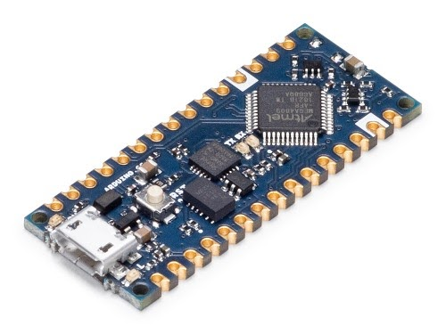
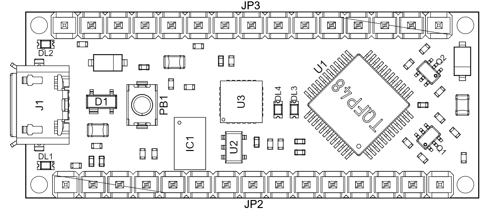
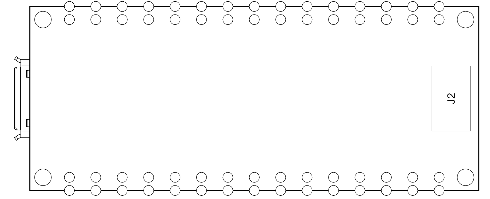
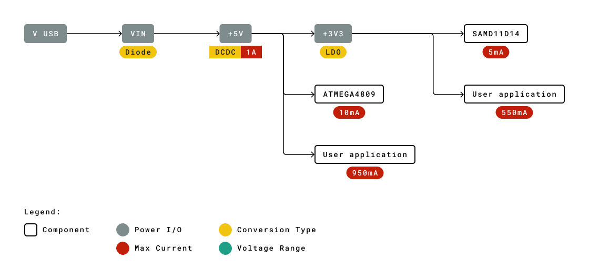
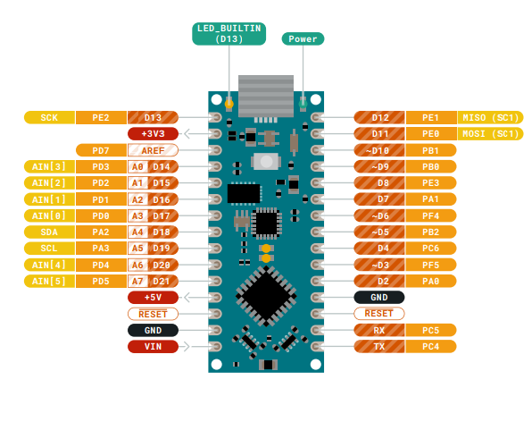
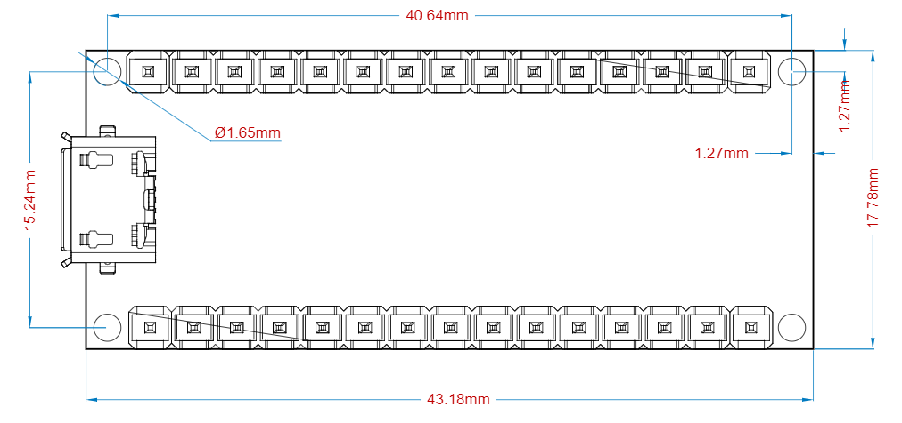

# Description 
Arduino® Nano Every is a miniature sized module containing an ATMega4809 AVR processor and an ATSAMD11D14A Arm® Cortex®-M0+ processor to act as a bridge between USB and the main AVR processor. The module can either be mounted as a DIP component (when mounting pin headers), or as a SMT component, directly soldering it via the castellated pads.

# Target Areas: 
Maker, robotics

# Features
- **ATMega4809** 
    - **Processor**
        - AVR CPU at up to 20 MHz
        - 48 kB Flash
        - 6 kB SRAM
        - 256B EEPROM
        - Power On Reset (POR) and Brown Out Detection (BOD) 

    - **Peripherals**
        - 1x 16-bit Timer/Counter with a dedicated period register and 3x compare channels
        - 4x 16-bit Timer/Counter with input capture 
        - 1x 16-bit Real-Time Counter (RTC) running from an external crystal or an internal RC oscillator
        - 4x USART with fractional baud rate generator, auto-baud, and start-of-frame detection
        - 1x Master/slave Serial Peripheral Interface (SPI)
        - 1x Dual mode Master/Slave TWI with dual address match 6x 16 bit Timers (1 dedicated to RTC)
        - Event System for CPU independent and predictable inter-peripheral signaling
        - Configurable Custom Logic (CCL) with up to four programmable Look-up Tables (LUT)
        - 1x Analog Comparator (AC) with a scalable reference input
        - Watchdog Timer with Window mode, with separate on-chip oscillator
        - External interrupt on all general purpose pins  

- **ATSAMD11D14A**
    - **Processor**
        - Arm® Cortex®-M0+ at up to 48 MHz
        - 16KB Flash
        - 4KB SRAM
        - Power On Reset (POR) and Brown Out Detection (BOD)
        - One full-speed (12Mbps) Universal Serial Bus (USB) 2.0 interface
        - Embedded device function
        - Eight endpoints
        - Standard firmware for USB-UART bridge
        - Can be reprogrammed for other USB classes
        - UART connection to ATMega4809
        - Field upgradeable through USB Bootloader

- **MPM3610** (DC-DC)
    - Regulates input voltage from up to 21V with a minimum of 65% efficiency @minimum load
    - More than 85% efficiency @12V 

- **AP2112K-3,3** (LDO)
    - Regulates input voltage from 5V to 3.3V
    - Up to 550mA output current for user application (recommended max 200mA)

# CONTENTS
## The Board
As all Nano form factor boards, Nano Every does not have a battery charger but can be powered through USB or headers.

**NOTE:** Arduino Nano Every is 5V compatible so it is a drop in replacement for the standard Nano board 

## Ratings
### Recommended Operating Conditions

| Symbol | Description                                      | Min             | Max            |
| ------ | ------------------------------------------------ | --------------- | -------------- |
|        | Conservative thermal limits for the whole board: | -40 °C ( 40 °F) | 85 °C ( 185 °F) |

### Power Consumption

| Symbol | Description                         | Min  | Typ  | Max  | Unit |
| ------ | ----------------------------------- | ---- | ---- | ---- | ---- |
| PBL    | Power consumption with busy loop    |      | TBC  |      | mW   |
| PLP    | Power consumption in low power mode |      | TBC  |      | mW   |
| PMAX   | Maximum Power Consumption           |      | TBC  |      | mW   |

## Functional Overview
### Board Topology 
Top: 

| **Ref.** | **Description**          | **Ref.** | **Description**                 |
| -------- | ------------------------ | -------- | ------------------------------- |
| U1       | ATMEGA4809-A.6 IC Module | D1       | PRTR5VOU2X Diodes               |
| U2       | AP2112k-3.3TRG1 Diodes   | PB1      | T-1185AP1C-160G-GTR Push button |
| U3       | ATSAM-D11 Chip           | IC1      | MPM3610AGQV-P Module            |
| J1       | Micro USB Connector      |          |                                 |

Bottom: 

| **Ref.** | **Description** | **Ref.** | **Description** |
| -------- | --------------- | -------- | --------------- |
| J2       | Bridge?         |          |                 |

### Processor
The Main Processor is an AVR running at up to 20MHz. Most of its pins are connected to the external headers, however some are reserved for internal communication with the USB Bridge coprocessor.

Communication with SAMD11D14A happens through a serial port and a single wire programming through the following pins:

| **ATMega4809 Pin** | **ATMega4809 Acronym** | **SAMD11 Pin** | **SAMD11 Acronym** | **Description**           |
| --------------------------- | ------------------------------ | ---------------------- | ---------------------- | ------------------------- |
| 9                           | PB05                           | 15                     | PA22                   | SAMD11 TX 🡺 ATMega4809 RX |
| 8                           | PB04                           | 16                     | PA23                   | ATMega4809 TX 🡺 SAMD11 RX |
| 41                          | UPDI                           | 12                     | PA15                   | UPDI RX                   |
| 11                          | PA14                           | UPDI TX                |                        |                           |

### USB Bridge
The SAMD11D14A processor is shipped with a firmware that implements USB to serial bridge and handles ATMega4809 firmware upgrade through the UPDI interface.

Firmware also has a bootloader that allows reprogramming to implement other USB classes, expanding the possibilities of classic Nano boards that are limited to serial bridge.

**NOTE:** SAMD11D14A pins are 3.3V only and are connected to ATMega4809 through level shifters. Although it is possible to wire its pins to the external world care must be taken as they are NOT 5V tolerant

### Power Tree
The board can be powered via USB connector, VIN or VUSB pins on headers. 

**NOTE:** Since VUSB feeds VIN via a Schottky diode and a DC-DC regulator specified minimum input voltage is 4.5V the minimum supply voltage from USB has to be increased to a voltage in the range between 4.8V to 4.96V depending on the current being drawn.

## Board Operation
### Getting Started - IDE 
If you want to program your Nano ESP32 while offline you need to install the Arduino Desktop IDE [1] To connect the Arduino Nano 33 BLE to your computer, you’ll need a Micro-B USB cable. This also provides power to the board, as indicated by the LED.

### Getting Started - Arduino Cloud Editor
All Arduino boards, including this one, work out-of-the-box on the Arduino Cloud Editor [2], by just installing a simple plugin.

The Arduino Cloud Editor is hosted online, therefore it will always be up-to-date with the latest features and support for all boards. Follow **[3]** to start coding on the browser and upload your sketches onto your board.

### Getting Started - Arduino Cloud
All Arduino IoT enabled products are supported on Arduino Cloud which allows you to Log, graph and analyze sensor data, trigger events, and automate your home or business.

## Sample Sketches
### Online Resources
Now that you have gone through the basics of what you can do with the board you can explore the endless possibilities it provides by checking exciting projects on Arduino Project Hub **[4]**, the Arduino Library Reference **[5]** and the on line store **[6]** where you will be able to complement your board with sensors, actuators and more.

## Connector Pinouts

    
### USB

| Pin  | **Function** | **Type**     | **Description**         |
| ---- | ------------ | ------------ | ----------------------- |
| 1    | VUSB         | Power        | Power Supply Input.     |
| 2    | D-           | Differential | USB differential data - |
| 3    | D+           | Differential | USB differential data + |
| 4    | NC           |              |                         |
| 5    | GND          | Power        | Power Ground            |

### Headers
The board exposes two 15 pin connectors which can either be assembled with pin headers or soldered through castellated vias. 

| Pin  | **Function** | **Type**   | **Description**                                       |
| ---- | ------------ | ---------- | ----------------------------------------------------- |
| 1    | D13          | Digital    | SPI SCK, GPIO                                         |
| 2    | +3V3         | Power Out  | Internally generated power output to external devices |
| 3    | AREF         | Analog     | Analog Reference; can be used as GPIO                 |
| 4    | A0/DAC0      | Analog     | ADC in/DAC out; can be used as GPIO                   |
| 5    | A1           | Analog     | ADC in; can be used as GPIO                           |
| 6    | A2           | Analog     | ADC in; can be used as GPIO                           |
| 7    | A3           | Analog     | ADC in; can be used as GPIO                           |
| 8    | A4/SDA       | Analog     | ADC in; I2C SDA; Can be used as GPIO                  |
| 9    | A5/SCL       | Analog     | ADC in; I2C SCL; Can be used as GPIO                  |
| 10   | A6           | Analog     | ADC in; can be used as GPIO                           |
| 11   | A7           | Analog     | ADC in; can be used as GPIO                           |
| 12   | +5V          | Power Out  | Internally generated power output to external devices |
| 13   | RST          | Digital In | Active low reset input (duplicate of pin 18)          |
| 14   | GND          | Power      | Power Ground                                          |
| 15   | VIN          | Power In   | Vin Power input                                       |
| 16   | TX           | Digital    | USART TX; can be used as GPIO                         |
| 17   | RX           | Digital    | USART RX; can be used as GPIO                         |
| 18   | RST          | Digital    | Active low reset input (duplicate of pin 13)          |
| 19   | GND          | Power      | Power Ground                                          |
| 20   | D2           | Digital    | GPIO                                                  |
| 21   | D3/PWM       | Digital    | GPIO; can be used as PWM                              |
| 22   | D4           | Digital    | GPIO                                                  |
| 23   | D5/PWM       | Digital    | GPIO; can be used as PWM                              |
| 24   | D6/PWM       | Digital    | GPIO, can be used as PWM                              |
| 25   | D7           | Digital    | GPIO                                                  |
| 26   | D8           | Digital    | GPIO                                                  |
| 27   | D9/PWM       | Digital    | GPIO; can be used as PWM                              |
| 28   | D10/PWM      | Digital    | GPIO; can be used as PWM                              |
| 29   | D11/MOSI     | Digital    | SPI MOSI; can be used as GPIO                         |
| 30   | D12/MISO     | Digital    | SPI MISO; can be used as GPIO                         |

### Debug
On the bottom side of the board, under the communication module, debug signals are arranged as 3x2 test pads with 100 mil pitch with pin 4 removed. Pin 1 is depicted in Figure 3 – Connector Positions

| Pin  | **Function** | **Type**   | **Description**                                              |
| ---- | ------------ | ---------- | ------------------------------------------------------------ |
| 1    | +3V3         | Power Out  | Internally generated power output to be used as voltage reference |
| 2    | SWD          | Digital    | Single Wire Debug Data                                       |
| 3    | SWCLK        | Digital In | Single Wire Debug Clock                                      |
| 5    | GND          | Power      | Power Ground                                                 |
| 6    | RST          | Digital In | Active low reset input                                       |

## Mechanical Information
### Board Outline and Mounting Holes
The board measures are imperial. Imperial measures are used to maintain 100 mil pitch grid between pin rows to allow them to fit a breadboard.

## Certifications
### Declaration of Conformity CE DoC (EU)
We declare under our sole responsibility that the products above are in conformity with the essential requirements of the following EU Directives and therefore qualify for free movement within markets comprising the European Union (EU) and European Economic Area (EEA). 

### Declaration of Conformity to EU RoHS & REACH 211 01/19/2021
Arduino boards are in compliance with RoHS 2 Directive 2011/65/EU of the European Parliament and RoHS 3 Directive 2015/863/EU of the Council of 4 June 2015 on the restriction of the use of certain hazardous substances in electrical and electronic equipment. 

| Substance                              | **Maximum limit (ppm)** |
| -------------------------------------- | ----------------------- |
| Lead (Pb)                              | 1000                    |
| Cadmium (Cd)                           | 100                     |
| Mercury (Hg)                           | 1000                    |
| Hexavalent Chromium (Cr6+)             | 1000                    |
| Poly Brominated Biphenyls (PBB)        | 1000                    |
| Poly Brominated Diphenyl ethers (PBDE) | 1000                    |
| Bis(2-Ethylhexyl} phthalate (DEHP)     | 1000                    |
| Benzyl butyl phthalate (BBP)           | 1000                    |
| Dibutyl phthalate (DBP)                | 1000                    |
| Diisobutyl phthalate (DIBP)            | 1000                    |

Exemptions : No exemptions are claimed. 

Arduino Boards are fully compliant with the related requirements of European Union Regulation (EC) 1907 /2006 concerning the Registration, Evaluation, Authorization and Restriction of Chemicals (REACH). We declare none of the SVHCs (https://echa.europa.eu/web/guest/candidate-list-table), the Candidate List of Substances of Very High Concern for authorization currently released by ECHA, is present in all products (and also package) in quantities totaling in a concentration equal or above 0.1%. To the best of our knowledge, we also declare that our products do not contain any of the substances listed on the "Authorization List" (Annex XIV of the REACH regulations) and Substances of Very High Concern (SVHC) in any significant amounts as specified by the Annex XVII of Candidate list published by ECHA (European Chemical Agency) 1907 /2006/EC.

### Conflict Minerals Declaration 
As a global supplier of electronic and electrical components, Arduino is aware of our obligations with regards to laws and regulations regarding Conflict Minerals, specifically the Dodd-Frank Wall Street Reform and Consumer Protection Act, Section 1502. Arduino does not directly source or process conflict minerals such as Tin, Tantalum, Tungsten, or Gold. Conflict minerals are contained in our products in the form of solder, or as a component in metal alloys. As part of our reasonable due diligence Arduino has contacted component suppliers within our supply chain to verify their continued compliance with the regulations. Based on the information received thus far we declare that our products contain Conflict Minerals sourced from conflict-free areas. 

## FCC Caution
Any Changes or modifications not expressly approved by the party responsible for compliance could void the user’s authority to operate the equipment.

This device complies with part 15 of the FCC Rules. Operation is subject to the following two conditions: 

(1) This device may not cause harmful interference

 (2) this device must accept any interference received, including interference that may cause undesired operation.

**FCC RF Radiation Exposure Statement:**

1. This Transmitter must not be co-located or operating in conjunction with any other antenna or transmitter.

2. This equipment complies with RF radiation exposure limits set forth for an uncontrolled environment.

3. This equipment should be installed and operated with minimum distance 20cm between the radiator & your body.

English: 
User manuals for license-exempt radio apparatus shall contain the following or equivalent notice in a conspicuous location in the user manual or alternatively on the device or both. This device complies with Industry Canada license-exempt RSS standard(s). Operation is subject to the following two conditions:

(1) this device may not cause interference

 (2) this device must accept any interference, including interference that may cause undesired operation of the device.

French: 
Le présent appareil est conforme aux CNR d’Industrie Canada applicables aux appareils radio exempts de licence. L’exploitation est autorisée aux deux conditions suivantes :

(1) l’ appareil nedoit pas produire de brouillage

(2) l’utilisateur de l’appareil doit accepter tout brouillage radioélectrique subi, même si le brouillage est susceptible d’en compromettre le fonctionnement.

**IC SAR Warning:**

English 
This equipment should be installed and operated with minimum distance 20 cm between the radiator and your body.  

French: 
Lors de l’ installation et de l’ exploitation de ce dispositif, la distance entre le radiateur et le corps est d ’au moins 20 cm.

**Important:** The operating temperature of the EUT can’t exceed 85℃ and shouldn’t be lower than -40℃.

Hereby, Arduino S.r.l. declares that this product is in compliance with essential requirements and other relevant provisions of Directive 2014/53/EU. This product is allowed to be used in all EU member states.

| Frequency bands | Maximum output power (ERP) |
| --------------- | -------------------------- |
| 863-870Mhz      | -3.22dBm                   |

 

## Company Information

| Company name    | Arduino SA.                                    |
| --------------- | ---------------------------------------------- |
| Company Address | Via Ferruccio Pelli 14 6900 Lugano Switzerland |

## Reference Documentation

| Reference                              | **Link**                                                     |
| -------------------------------------- | ------------------------------------------------------------ |
| Arduino IDE (Desktop)                  | https://www.arduino.cc/en/software                           |
| Arduino Cloud Editor                   | https://create.arduino.cc/editor                             |
| Arduino Cloud Editor - Getting Started | https://docs.arduino.cc/arduino-cloud/guides/editor/         |
| Arduino Project Hub                    | https://create.arduino.cc/projecthub?by=part&part_id=11332&sort=trending |
| Library Reference                      | https://www.arduino.cc/reference/en/                         |
| Arduino Store                          | https://store.arduino.cc/                                    |
| Forum                                  | http://forum.arduino.cc/                                     |
| SAMD21G18                              | https://ww1.microchip.com/downloads/aemDocuments/documents/MCU32/ProductDocuments/DataSheets/SAM-D21DA1-Family-Data-Sheet-DS40001882G.pdf |
| NINA W102                              | https://content.u-blox.com/sites/default/files/NINA-W10_DataSheet_UBX-17065507.pdf |
| ECC608                                 | https://ww1.microchip.com/downloads/aemDocuments/documents/SCBU/ProductDocuments/DataSheets/ATECC608A-CryptoAuthentication-Device-Summary-Data-Sheet-DS40001977B.pdf |
| MPM3610                                | https://www.monolithicpower.com/pub/media/document/MPM3610_r1.01.pdf |
| NINA Firmware                          | https://github.com/arduino/nina-fw                           |
| ECC608 Library                         | https://github.com/arduino-libraries/ArduinoECCX08           |
| LSM6DSL Library                        | https://github.com/stm32duino/LSM6DSL                        |

## Revision History

| Date       | **Revision** | **Changes**                           |
| ---------- | ------------ |-------------------------------------- |
| 25/04/2024 | 3            | Updated link to new Cloud Editor      |
| 03/08/2022 | 2            | Reference documentation links updates |
| 27/04/2021 | 1            | General datasheet updates             |

