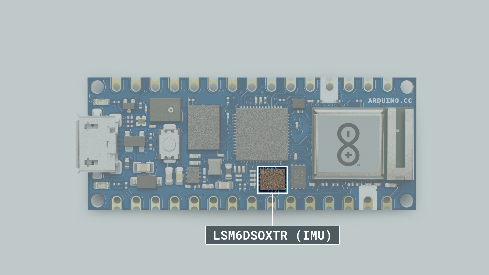
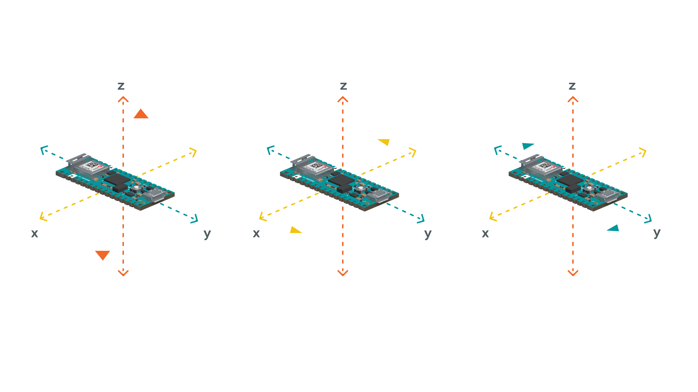
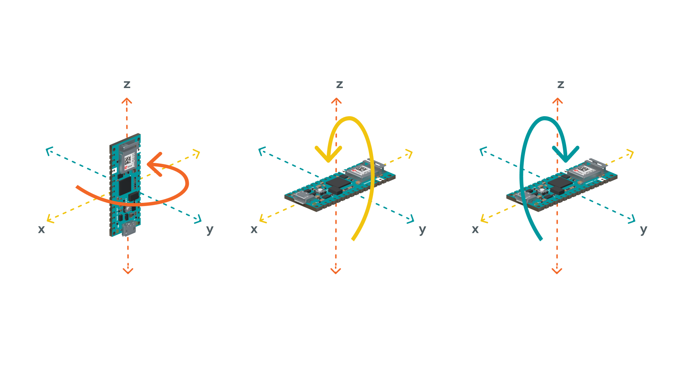
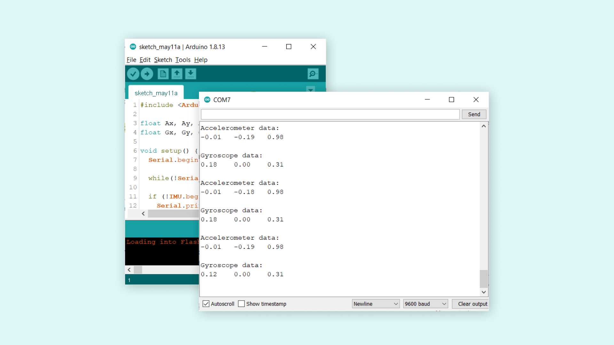

## Introduction 

In this tutorial, we will learn how to access the gyroscope and accelerometer onboard the Nano RP2040 Connect. For this, we will be using the [Arduino_LSMDS63](https://www.arduino.cc/en/Reference/ArduinoLSM6DS3) library. 

>**Note:** if you need help setting up your environment to use your Arduino Nano RP2040 board, please refer to [this installation guide](/software/ide-v1/installing-mbed-os-nano-boards).

## Goals

The goals of this project are:

- Read accelerometer data.
- Read gyroscope data.
- Print the data in the Serial Monitor.

## Hardware & Software Needed

- Arduino IDE ([online](https://create.arduino.cc/) or [offline](https://www.arduino.cc/en/main/software)).
- [LSM6DSOX](https://github.com/arduino-libraries/Arduino_LSM6DSOX) library.
- [Arduino Nano RP2040 Connect](https://store.arduino.cc/nano-rp2040-connect).

## IMU (Inertial Measurement Unit)



An IMU is a component that exists of different sensors that records data such as specific force, angular rate, orientation. On the Nano RP2040 Connect, there is one **gyroscope** and one **accelerometer.** Let's take a look at how they work!

### Accelerometer

An accelerometer is an electromechanical device used to measure acceleration forces. Such forces may be static, like the continuous force of gravity or, as is the case with many mobile devices, dynamic to sense movement or vibrations.



In this example, we will use the accelerometer as a "level" that will provide information about the position of the board. With this application we will be able to read what the relative position of the board is, as well as the degrees by tilting the board up, down, left or right.

### Gyroscope

A gyroscope sensor is a device that can measure and maintain the orientation and angular velocity of an object. Gyroscopes are more advanced than accelerometers, as they can measure the tilt and lateral orientation of an object, whereas an accelerometer can only measure its linear motion.



Gyroscope sensors are also called "Angular Rate Sensors" or "Angular Velocity Sensors". Measured in degrees per second, angular velocity is the change in the rotational angle of the object per unit of time.

In this example, we will use the gyroscope as an indicator for the direction of the force that is applied to the board. This will be achieved by swiftly moving the board for an instant in four directions: forward, backward, to the left and to the right. The results will be visible through the Serial Monitor.

### Circuit


## Programming the Board

We will now get to the programming part of this tutorial. 

1. First, let's make sure we have the drivers installed. If we are using the Web Editor, we do not need to install anything. If we are using an offline editor, we need to install it manually. This can be done by navigating to **Tools > Board > Board Manager...**. Here we need to look for the **Arduino Mbed OS Nano Boards** and install it. 

2. Now, we need to install the libraries needed. If we are using the Web Editor, there is no need to install anything. If we are using an offline editor, simply go to **Tools > Manage libraries..**, and search for **Arduino_LSM6DS3** and install it.

3. We can now take a look at some of the core functions of this sketch:

- `IMU.begin()` - initializes the library.
- `IMU.accelerationSampleRate()` - reads the sampling rate in Hz.
- `IMU.accelerationAvailable()` - checks if there's data available from the IMU.
- `IMU.readAcceleration(Ax, Ay, Az)` - reads the accelerometer, and returns the value of the **x y** and **z** axis.
- `IMU.gyroscopeSampleRate()` - reads the sampling rate in Hz.
- `IMU.gyroscopeAvailable()` - checks if there's data available from the IMU.
- `IMU.readGyroscope(Gx, Gy, Gz)` - reads the accelerometer, and returns the value of the **x y** and **z** axis.

The sketch can be found in the snippet below. Upload the sketch to the board.

```cpp
#include <Arduino_LSM6DSOX.h>

float Ax, Ay, Az;
float Gx, Gy, Gz;

void setup() {
  Serial.begin(9600);

  while(!Serial);

  if (!IMU.begin()) {
    Serial.println("Failed to initialize IMU!");
    while (1);
  }

  Serial.print("Accelerometer sample rate = ");
  Serial.print(IMU.accelerationSampleRate());
  Serial.println("Hz");
  Serial.println();

  Serial.print("Gyroscope sample rate = ");  
  Serial.print(IMU.gyroscopeSampleRate());
  Serial.println("Hz");
  Serial.println();

}

void loop() {

  if (IMU.accelerationAvailable()) {
    IMU.readAcceleration(Ax, Ay, Az);

    Serial.println("Accelerometer data: ");
    Serial.print(Ax);
    Serial.print('\t');
    Serial.print(Ay);
    Serial.print('\t');
    Serial.println(Az);
    Serial.println();
  }

  if (IMU.gyroscopeAvailable()) {
    IMU.readGyroscope(Gx, Gy, Gz);
    
    Serial.println("Gyroscope data: ");
    Serial.print(Gx);
    Serial.print('\t');
    Serial.print(Gy);
    Serial.print('\t');
    Serial.println(Gz);
    Serial.println();
  }

delay(500);

}
```

## Testing It Out

After successfully uploading the code to the board, we will need to open the Serial Monitor to initialize the program. Once we open it, data will start printing. 



The data is being printed with an interval of 500 milliseconds. This can be adjusted by changing the line `delay(500)` at the bottom of the sketch.

### Troubleshoot

If the code is not working, there are some common issues we can troubleshoot:

- We have not installed the **Arduino_LSM6DSOX** library.
- We have a faulty USB cable. 

## Conclusion

In this tutorial we have learned how to retrieve data from the IMU onboard our Nano RP2040 Connect board. With the gyroscope and accelerometer data, we can create a lot of interesting projects, such as gesture control, orientation and more. 