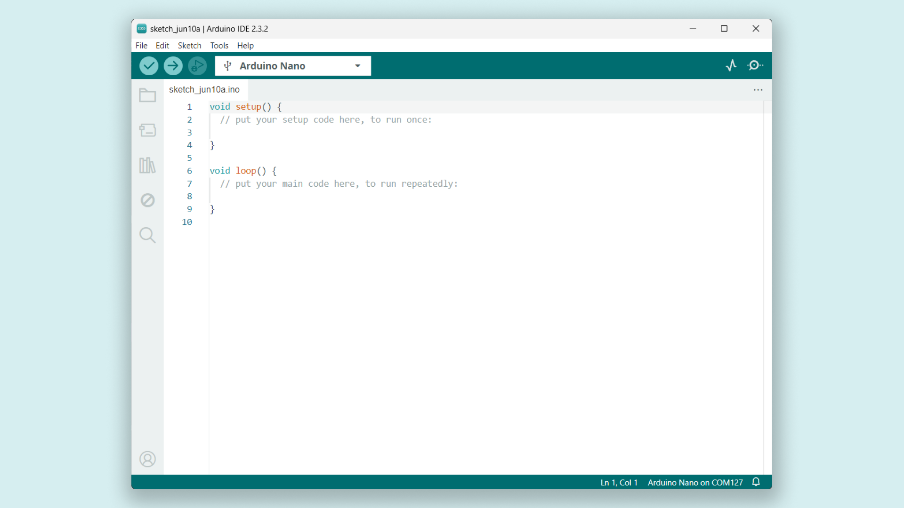
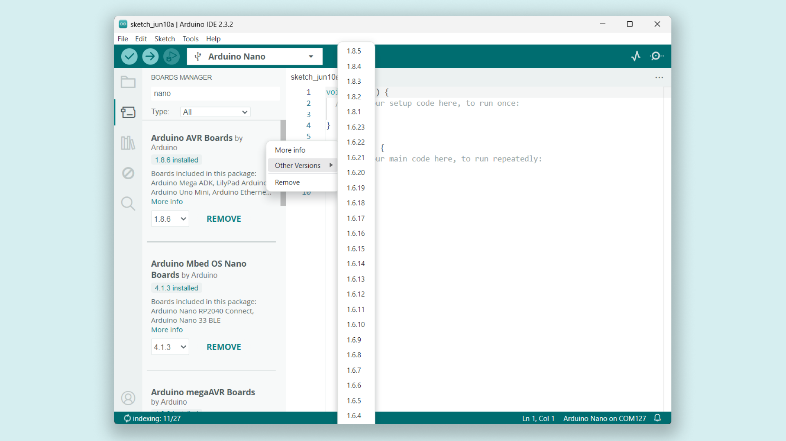
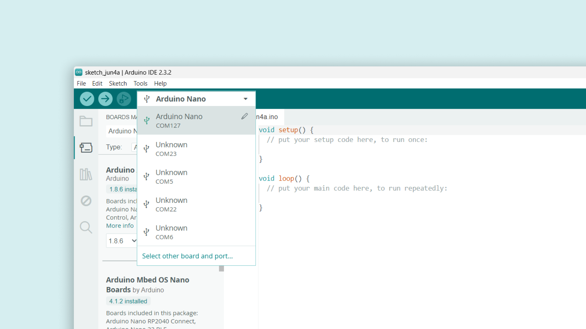
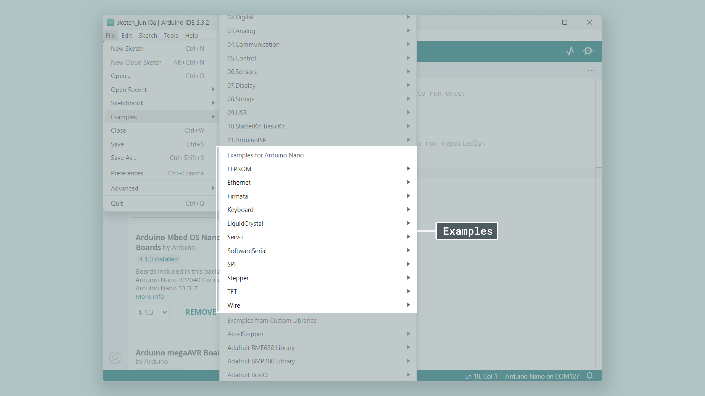

To use the [Arduino Nano](/hardware/nano/) board, you will need to install the Arduino AVR Board Package.

To install it, you will need a version of the Arduino IDE, which you can download from the [Arduino Software page](https://www.arduino.cc/en/software). In this guide, we will use the latest version of the IDE 2.

## Software & Hardware Needed

- [Arduino Nano](https://store.arduino.cc/products/arduino-nano)
- [Arduino IDE](/software/ide-v2)

***You can also use the [Web Editor](https://create.arduino.cc/editor) which comes with all Arduino boards pre-installed.*** 

## Download & Install IDE

1. First, we need to download the Arduino IDE, which can be done from the [Arduino Software page](https://www.arduino.cc/en/software/).
2. Install the Arduino IDE on your local machine.
3. Open the Arduino IDE.

## Install Board Package

The [Arduino Core for AVR devices](https://github.com/arduino/ArduinoCore-avr) comes preinstalled with the IDE, so no additional installation is necessary to get started.  To use a different version than the latest, open the "Board Manager" from the left-hand menu. Search for Nano and install the version you want to use.

You should now be able to select your board in the board selector. You will need to have your board connected to your computer via the USB Mini B connector at this point.

Congratulations, you have now successfully installed the Arduino AVR board package via the Arduino IDE.

## Compile & Upload Sketches

To compile and upload sketches, you can use the:
- **Checkmark** for compiling code.
- **Right arrow** to upload code.

There are several examples available for the Nano board, which can be accessed directly in the IDE, through **File > Examples**. These examples can be used directly without external libraries.

## Summary

In this tutorial, we have installed the Arduino AVR board package, using the Arduino IDE.

For any issues regarding the Arduino AVR board package, please refer to the [Arduino Core for AVR devices](https://github.com/arduino/ArduinoCore-avr).