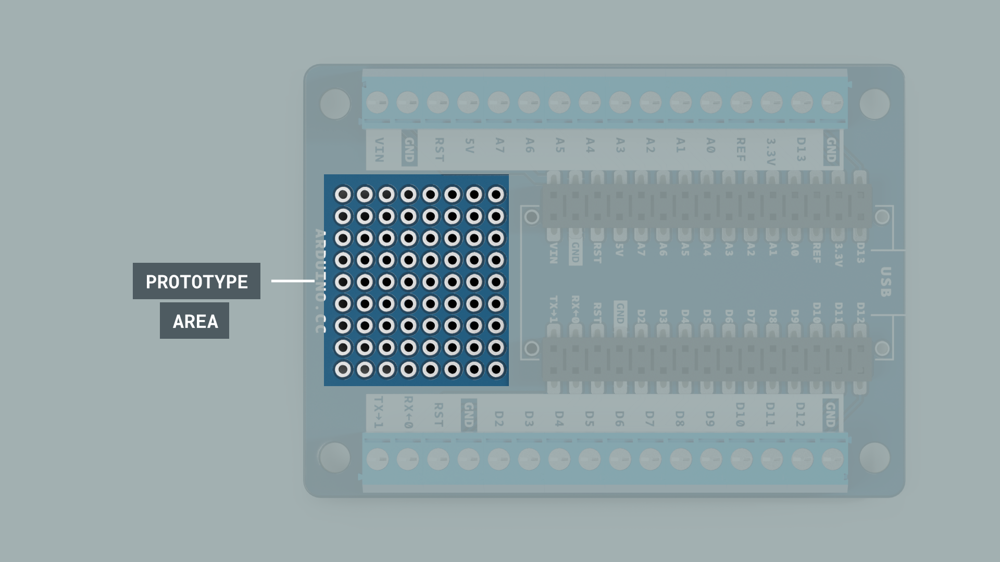
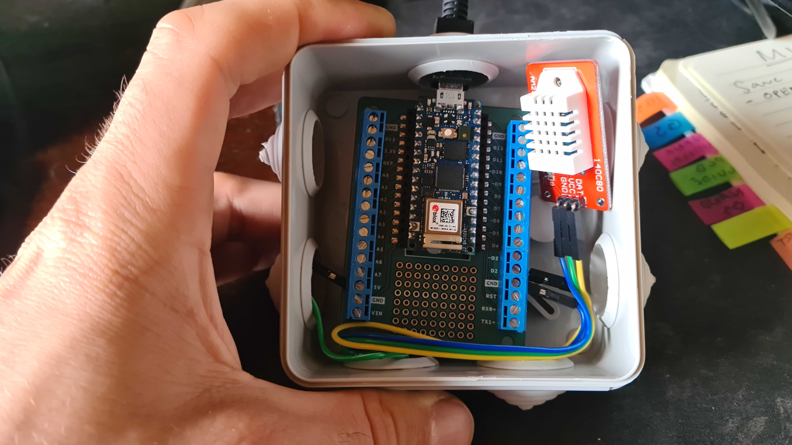

If you love the Nano form factor but are tired of spaghetti-monster looking breadboards: [Nano Screw Terminal](https://store.arduino.cc/nano-screw-terminal) is here to help. 

In this guide, we will have a look at how this carrier functions, some inspiration for use cases, and some important considerations to take into account while using this carrier.

## Hardware & Software Needed

- [Nano Screw Terminal](https://store.arduino.cc/nano-screw-terminal)

### Compatible Boards

The Nano Screw Terminal is compatible with the following boards:

- [Nano](https://store.arduino.cc/products/arduino-nano)
- [Nano Every](https://store.arduino.cc/nano-every)
- [Nano 33 IoT](https://store.arduino.cc/arduino-nano-33-iot)
- [Nano 33 BLE](https://store.arduino.cc/nano-33-ble)
- [Nano 33 BLE Sense](https://store.arduino.cc/nano-33-ble-sense)
- [Nano RP2040 Connect](https://store.arduino.cc/nano-rp2040-connect)

## The Nano Screw Terminal

The [Nano Screw Terminal](https://store.arduino.cc/nano-screw-terminal) serves a simple purpose: provide screw terminal connections with clear markings to your Nano board. This makes it easy to assemble robust circuits that can be used for finished projects. 

As a bonus, it also comes with a smaller prototyping area that you can solder components to (through hole). Perfect for adding a tiny display, LEDs or sensors.

### Screw Terminals

### Prototyping Area

## Considerations

As the pinout slightly differs from one Nano board to another, there are some important considerations to take into account. This sections lists out all considerations to take into account when using this product.

### RST Pin

The pin marked **"RST"** on the board stands for **"reset"**. On the Nano Screw Terminal, it is disconnected by default. The reason behind this is that the function of this pin varies from board to board. 

An example of this is the [Nano RP2040 Connect](https://store.arduino.cc/nano-rp2040-connect), where this pin is named **"REC"** as in **"recovery"**. If this pin had been connected, it would have constantly resetted the board.

### PWM

There are no PWM markings (~) on the carrier. This is because the PWM supported pins varies from board to board. 

To know which pins are PWM, please refer to the pinout of your board (available in the [hardware documentation](/)), or the markings on your board.

## Use Cases

The Nano Screw Terminal can be used for any project that already involves an Arduino Nano board.

In particular, the carrier can be used when a project is done with the "breadboard prototyping phase", and need more reliable connections.

Seen in the image below is a DHT22 temperature/humidity sensor, connected to a [Nano RP2040 Connect](https://store.arduino.cc/nano-rp2040-connect) board, placed inside a water tight enclosure (for outdoor use).

While this was a quick prototype put together in a couple of minutes, you can build much more sophisticated setups. The board has a hole in each corner, so that you can easily attach it with screws.

## Conclusion

The Nano Screw Terminal is a great board that will help you create robust electronic circuits with your Nano boards.

In this guide, we have gone through some of the technical specifications, as well as highlighting some important considerations.