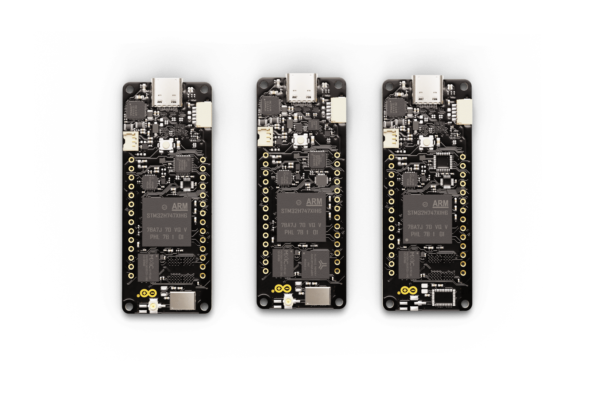
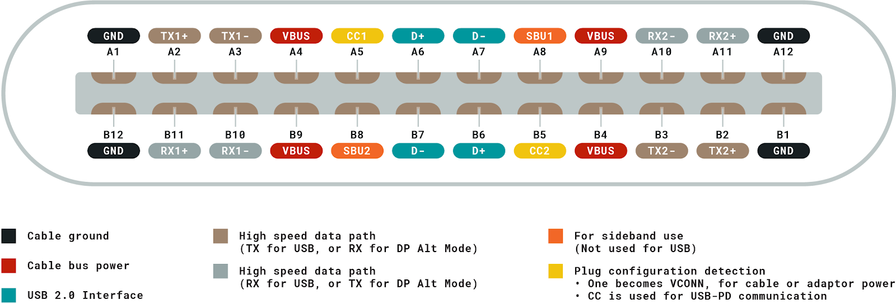
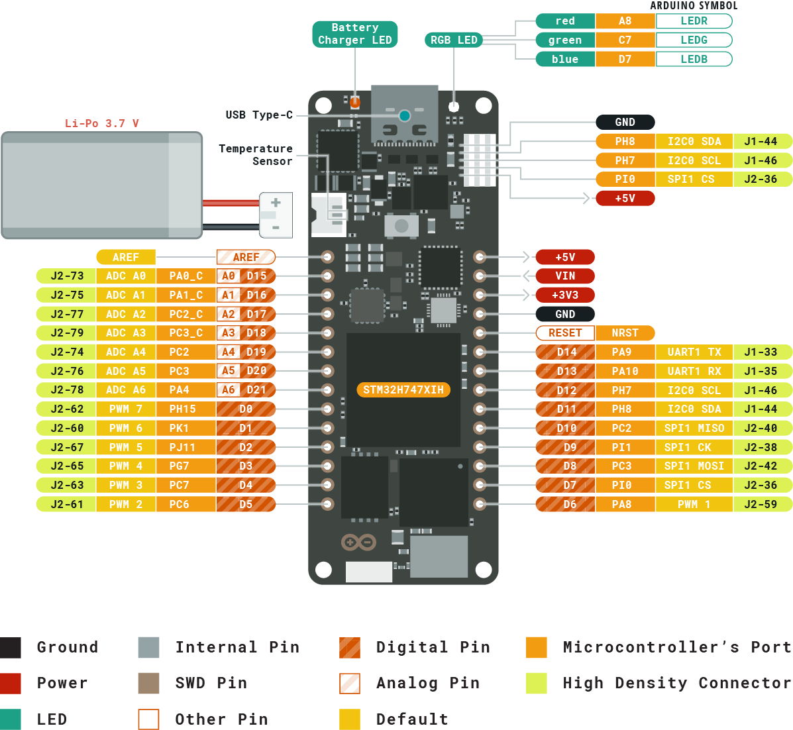
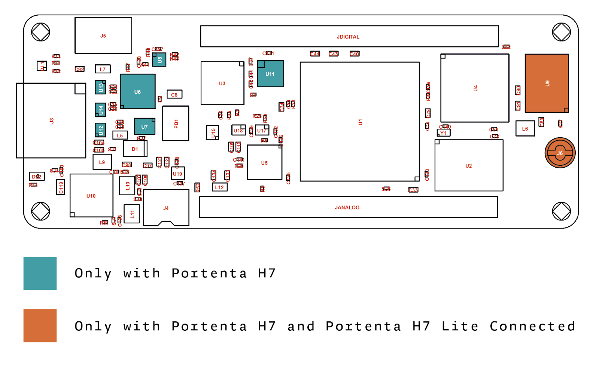
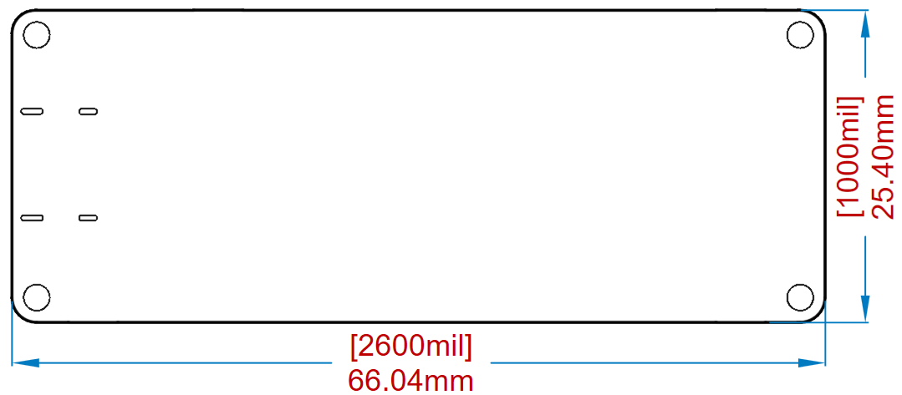
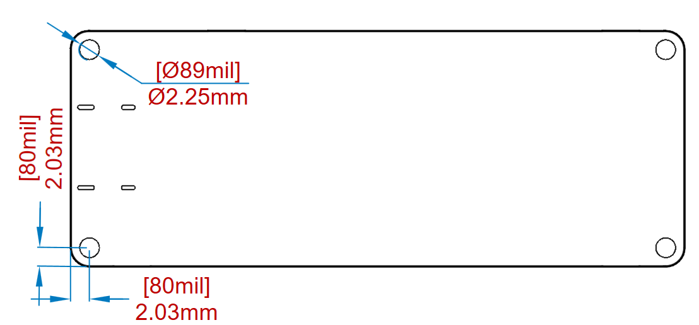
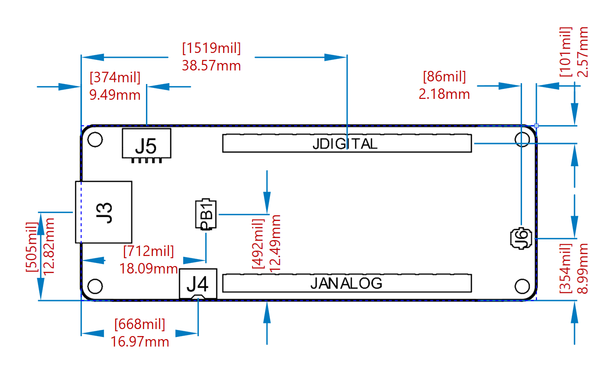
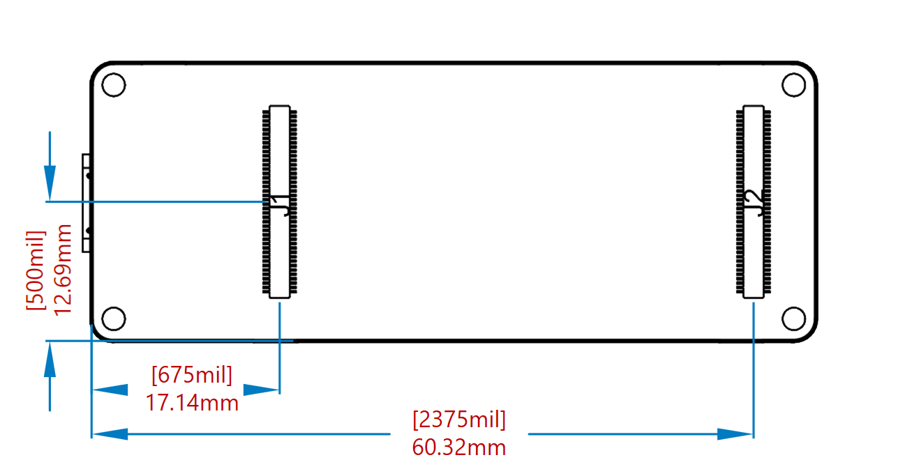

# Description 
Portenta H7 family runs high level codes along with real time tasks thanks to the two processors that makes it possible to run tasks in parallel. For example, it is possible to execute Arduino compiled code along with MicroPython one simultaneously, and have both cores to communicate with one another. 

Within the H7 family,  there are two variants; H7 Lite and H7 Lite Connected. All the three boards and their differences are presented in this datasheet.  

# Target Areas:
Laboratory equipment, Computer vision

<table style="page-break-before: always;">
   <thead>
      <tr>
         <th style="text-align: center;">Name </th>
         <th style="text-align: center;">Portenta H7   </th>
         <th style="text-align: center;">Portenta H7 Lite   </th>
         <th style="text-align: center;">Portenta H7 Lite Connected</th>
      </tr>
   </thead>
   <tbody>
      <tr>
         <td style="text-align: center;">SKU</td>
         <td style="text-align: center;">ABX00042</td>
         <td style="text-align: center;">ABX00045</td>
         <td style="text-align: center;">ABX00046</td>
      </tr>
      <tr>
         <td style="text-align: center;">Preview</td>
         <td>
            
         </td>
         <td>
            
         </td>
         <td>
            
         </td>
      </tr>
      <tr>
         <td style="vertical-align: middle;text-align: center;">Security  </td>
         <td style="vertical-align: middle;text-align: center;">
            
ATECC608 

            
NXP SE050C2

         </td>
         <td style="text-align: center;">ATECC608</td>
         <td style="text-align: center;">ATECC608</td>
      </tr>
      <tr>
         <td style="text-align: center;">Connectivity</td>
         <td style="text-align: center;">Ethernet PHY / Wi-Fi® / Bluetooth® Low Energy (BLE 5 via Cordio stack, BLE 4.2 via Arduino Stack)</td>
         <td style="text-align: center;">Ethernet PHY</td>
         <td style="text-align: center;">Ethernet PHY / Wi-Fi® / Bluetooth® Low Energy (BLE 5 via Cordio stack, BLE 4.2 via Arduino Stack)</td>
      </tr>
      <tr>
         <td style="text-align: center;">Memory</td>
         <td style="text-align: center;">8 MB SDRAM / 16 MB QSPI Flash</td>
         <td style="text-align: center;">8 MB SDRAM / 16 MB QSPI Flash</td>
         <td style="text-align: center;">8 MB SDRAM / 16 MB QSPI Flash</td>
      </tr>
      <tr>
         <td style="text-align: center;">Power</td>
         <td style="text-align: center;">Li-Po Single Cell 3.7V, 700mAh Minimum</td>
         <td style="text-align: center;">Li-Po Single Cell 3.7V, 700mAh Minimum</td>
         <td style="text-align: center;">Li-Po Single Cell 3.7V, 700mAh Minimum</td>
      </tr>
   </tbody>
</table>

# CONTENTS

## Features

### Microcontroller

<table>
   <thead>
      <tr style="text-align: middle;">
         <th width="30%">Component</th>
         <th colspan="2">Details</th>
         <th>
            
 Supported boards 

         </th>
      </tr>
   </thead>
   <tbody>
      <tr>
         <td rowspan="35" style="vertical-align: top;" >ST STM32H747XI Processor</td>
         <td style="vertical-align: top;">Dual Core</td>
         <td>
            
Arm® Cortex®-M7 core at up to 480 MHz with double-precision FPU and 16K data + 16K instruction L1 cache

            
Arm® 32-bit Cortex®-M4 core at up to 240 MHz with FPU, Adaptive real-time accelerator (ART AcceleratorTM)

         </td>
         <td rowspan="35" style="vertical-align: top;" >
All
</td>
      </tr>
      <tr>
         <td style="vertical-align: top;">Flash Memory</td>
         <td style="vertical-align: top;">
            
2Mbytes of Flash Memory with read-while-write support

            
1 Mbyte of RAM

         </td>
      </tr>
      <tr>
         <td>Dual mode Quad-SPI memory interface running up to 133 MHz</td>
         <td></td>
      </tr>
      <tr>
         <td>CRC calculation unit</td>
         <td></td>
      </tr>
      <tr>
         <td>Security</td>
         <td></td>
      </tr>
      <tr>
         <td>ROP, PC-ROP, active tamper</td>
         <td></td>
      </tr>
      <tr>
         <td style="vertical-align: top;">3 separate power domains. Possible to be independently clock gated or switched off.</td>
         <td style="vertical-align: top;">
            
D1: high performance capabilities

            
D2: communication peripherals and timers

            
D3: reset/clock control/power management

         </td>
      </tr>
      <tr>
         <td>Voltage scaling in Run and Stop mode 6 configurable ranges</td>
         <td></td>
      </tr>
      <tr>
         <td>4 DMA controllers to unload the CPU</td>
         <td></td>
      </tr>
      <tr>
         <td>1x high-speed master direct memory access controller (MDMA) With linked list support</td>
         <td></td>
      </tr>
      <tr>
         <td>2x Dual-port DMA with FIFO</td>
         <td></td>
      </tr>
      <tr>
         <td>1x basic DMA with request router capabilities</td>
         <td></td>
      </tr>
      <tr>
         <td style="vertical-align: top;">Up to 35 communication peripherals</td>
         <td style="vertical-align: top;">
            
4× I2Cs FM+ interfaces (SMBus/PMBus)

            
4× USARTs/4x UARTs (ISO7816 interface, LIN, IrDA, up to 12.5 Mbit/s) and 1x LPUART

            
6× SPIs, 3 with muxed duplex I2S audio class accuracy via internal audio PLL or external clock, 1x I2S in LP domain (up to 150 MHz) 4x SAIs (serial audio interface)

            
SPDIFRX interface

            
SWPMI single-wire protocol master I/F

            
MDIO Slave interface

            
2× SD/SDIO/MMC interfaces (up to 125 MHz)

            
2× CAN controllers: 2 with CAN FD, 1 with time-triggered CAN (TT-CAN)

            
2× USB OTG interfaces (1FS, 1HS/FS) crystal-less solution with LPM and BCD

            
Ethernet MAC interface with DMA controller

         </td>
      </tr>
      <tr>
         <td>8-bit camera interface (up to 80 MHz)</td>
         <td></td>
      </tr>
      <tr>
         <td>11 analog peripherals</td>
         <td></td>
      </tr>
      <tr>
         <td>3x ADCs with 16-bit max. resolution (up to 36 channels, up to 3,6 MSPS)</td>
         <td></td>
      </tr>
      <tr>
         <td>1x temperature sensor </td>
         <td></td>
      </tr>
      <tr>
         <td>2x 12-bit D/A converters (1 MHz)</td>
         <td></td>
      </tr>
      <tr>
         <td>2x ultra-low power comparators</td>
         <td></td>
      </tr>
      <tr>
         <td>2x operational amplifiers (7.3 MHz bandwidth)</td>
         <td></td>
      </tr>
      <tr>
         <td>1x digital filters for sigma delta modulator (DFSDM) with 8 channel/4 filters</td>
         <td></td>
      </tr>
      <tr>
         <td>Graphics</td>
         <td></td>
      </tr>
      <tr>
         <td>Chrom.ART graphical hardware AcceleratorTM (DMA2D) to reduce CPU load</td>
         <td></td>
      </tr>
      <tr>
         <td>Hardware JPEG Codec</td>
         <td></td>
      </tr>
      <tr>
         <td>Up to 22 timers and watchdogs</td>
         <td></td>
      </tr>
      <tr>
         <td>1x high-resolution timer (2.1 ns max resolution)</td>
         <td></td>
      </tr>
      <tr>
         <td>2× 32-bit timers with up to 4 IC/OC/PWM or pulse counter and quadrature (incremental) encoder input (up to 240 MHz)	</td>
         <td></td>
      </tr>
      <tr>
         <td>2× 16-bit advanced motor control timers (up to 240 MHz)</td>
         <td></td>
      </tr>
      <tr>
         <td>10× 16-bit general-purpose timers (up to 240 MHz)</td>
         <td></td>
      </tr>
      <tr>
         <td>5× 16-bit low-power timers (up to 240 MHz)</td>
         <td></td>
      </tr>
      <tr>
         <td>4× watchdogs (independent and window)</td>
         <td></td>
      </tr>
      <tr>
         <td>2× SysTick timers	</td>
         <td></td>
      </tr>
      <tr>
         <td>RTC with sub-second accuracy and hardware calendar</td>
         <td></td>
      </tr>
      <tr>
         <td>True random number generators (3 oscillators each)</td>
         <td></td>
      </tr>
      <tr>
         <td>96-bit unique ID </td>
         <td></td>
      </tr>
   </tbody>
</table>

### Memory

<table>
   <thead>
      <tr style="text-align: middle;">
         <th width="30%">Component</th>
         <th colspan="2">Details</th>
         <th>
            
 Supported boards 

         </th>
      </tr>
   </thead>
   <tbody>
      <tr>
         <td rowspan="2" style="vertical-align: top;">External memories</td>
         <td>SDRAM</td>
         <td>8 MByte</td>
         <td rowspan="2" style="vertical-align: top;" >
All
</td>
      </tr>
      <tr>
         <td>QSPI Flash</td>
         <td>16 MByte</td>
      </tr>
   <tbody>
</table>

### USB

<table>
   <thead>
      <tr style="text-align: middle;">
         <th width="30%">Component</th>
         <th colspan="1">Details</th>
         <th>
            
 Supported boards 

         </th>
      </tr>
   </thead> 
   <tbody>     
      <tr>
         <td rowspan="4" style="vertical-align: top;" >USB-C®</td>
         <td>High speed (optional/FUll Speed USB)</td>
         <td rowspan="3" style="vertical-align: top;" >
All
</td>
      </tr>
      <tr>
         <td>Host and Device operation</td>
      </tr>
      <tr>
         <td>Power Delivery support (optional)</td>
      </tr>
      <tr>
         <td>DisplayPort</td>
         <td style="text-align: right">H7 full</td>
      </tr>
   <tbody>
</table>

### HD Connectors

<table>
   <thead>
      <tr style="text-align: middle;">
         <th width="30%">Component</th>
         <th colspan="1">Details</th>
         <th>
            
 Supported boards 

         </th>
      </tr>
   </thead> 
   <tbody>     
      <tr>
         <td rowspan="13" style="vertical-align: top;" >High Density connectors </td>
         <td>1x10/100 Ethernet with PHY</td>
         <td rowspan="13" style="vertical-align: top;" >
All
</td>
      </tr>
      <tr>
         <td>1x CAN</td>
      </tr>
      <tr>
         <td>4x UART (2 with flow control)</td>
      </tr>
      <tr>
         <td>3x I2C</td>
      </tr>
      <tr>
         <td>1x SD Card</td>
      </tr>
      <tr>
         <td>1x SPI </td>
      </tr>
      <tr>
         <td>1x I2S</td>
      </tr>
      <tr>
         <td>1x PDM input</td>
      </tr>
      <tr>
         <td>2 lane MIPI DSI output</td>
      </tr>
      <tr>
         <td>8 bit parallel camera interface</td>
      </tr>
      <tr>
         <td>10x PWM output</td>
      </tr>
      <tr>
         <td>7x GPIO</td>
      </tr>
      <tr>
         <td>8x ADC inputs with separate VREF</td>
      </tr>
   <tbody>
</table>

### Crypto Chip

<table>
   <thead>
      <tr style="text-align: middle;">
         <th width="30%">Component</th>
         <th colspan="1">Details</th>
         <th>
            
 Supported boards 

         </th>
      </tr>
   </thead>
   <tbody>         
      <tr>
         <td rowspan="15" style="vertical-align: top;" >ATECC608 Microchip®  Crypto (optional)</td>
         <td>Protected storage for up to 16 Keys, certificates or data</td>
         <td rowspan="15" style="vertical-align: top;" >
All
</td>
      </tr>
         <tr>
            <td>Hardware support for asymmetric sign, verify, key agreement – ECDSA: FIPS186-3 Elliptic Curve Digital Signature</td>
         </tr>
      <tr>
         <td>ECDH: FIPS SP800-56A Elliptic Curve Diffie-Hellman</td>
      </tr>
      <tr>
         <td>NIST standard P256 elliptic curve support</td>
      </tr>
      <tr>
         <td>Hardware support for symmetric algorithms</td>
      </tr>
      <tr>
         <td>SHA-256 & HMAC hash including off-chip context save/restore</td>
      </tr>
      <tr>
         <td>AES-128: encrypt/decrypt, galois field multiply for GCM</td>
      </tr>
      <tr>
         <td>Networking key management support</td>
      </tr>
      <tr>
         <td>Turnkey PRF/HKDF calculation for TLS 1.2 & 1.3</td>
      </tr>
      <tr>
         <td>Ephemeral key generation and key agreement in SRAM – Small message encryption with keys entirely protected</td>
      </tr>
      <tr>
         <td>Secure boot support</td>
      </tr>
      <tr>
         <td>Full ECDSA code signature validation, optional stored digest/signature – optional communication key disablement prior to secure boot</td>
      </tr>
      <tr>
         <td>Internal high-quality FIPS 800-90 A/B/C Random Number Generator (RNG)</td>
      </tr>
      <tr>
         <td>Two high-endurance monotonic counters</td>
      </tr>
      <tr>
         <td>Guaranteed unique 72-bit serial number</td>
      </tr>
   <tbody>
</table>

### Secure Element

<table>
   <thead>
      <tr style="text-align: middle;">
         <th width="30%">Component</th>
         <th colspan="1">Details</th>
         <th>
            
 Supported boards 

         </th>
      </tr>
   </thead>
   <tbody>  
      <tr>
         <td rowspan="8" style="vertical-align: top;">SE050C2 Secure element</td>
         <td>Ready-to-use IoT secure element solution</td>
         <td rowspan="8" >
H7 full
</td>
      </tr>
      <tr>
         <td>Securely storing and provisioning credentials and performing cryptographic operations</td>
      </tr>
      <tr>
         <td>based on NXP's Integral Security Architecture 3.0™</td>
      </tr>
      <tr>
         <td>CC EAL 6+ certified HW</td>
      </tr>
      <tr>
         <td>FIPS 140-2 certified platform with Security Level 3</td>
      </tr>
      <tr>
         <td>Support for RSA and ECC asymmetric cryptography algorithms</td>
      </tr>
      <tr>
         <td>Support for SCP03 protocol</td>
      </tr>
      <tr>
         <td>up to 100 Mio write cycles / 25 years</td>
      </tr>
   </tbody>
</table>

### MKR Compatibility

<table>
   <thead>
      <tr style="text-align: middle;">
         <th width="30%">Component</th>
         <th colspan="1">Details</th>
         <th>
            
 Supported boards 

         </th>
      </tr>
   </thead>
   <tbody>  
      <tr>
         <td rowspan="5" style="vertical-align: top;" >MKR compatible header</td>
         <td>7x PWM channels</td>
         <td rowspan="5" style="vertical-align: top;">
All
</td>
      </tr>
      <tr>
         <td>7x ADC channels</td>
      </tr>
      <tr>
         <td>1x SPI</td>
      </tr>
      <tr>
         <td>1x UART</td>
      </tr>
      <tr>
         <td>1x I2C</td>
      </tr>
   </tbody>
</table>

### ESLOV

<table>
   <thead>
      <tr style="text-align: middle;">
         <th width="30%">Component</th>
         <th colspan="1">Details</th>
         <th>
            
 Supported boards 

         </th>
      </tr>
   </thead>
   <tbody>        
      <tr>
         <td style="vertical-align: top;">ESLOV Connector</td>
         <td style="vertical-align: top;">
I2C port with automatic device enumeration
</td>
         <td rowspan="1" style="vertical-align: top;">
All
</td>
      </tr>
   </tbody>
</table>

### Power Management

<table>
   <thead>
      <tr style="text-align: middle;">
         <th width="30%">Component</th>
         <th colspan="1">Details</th>
         <th>
            
 Supported boards 

         </th>
      </tr>
   </thead>
   <tbody>       
      <tr>
         <td rowspan="4" style="vertical-align: top;">NXP PF1550 Programmable PMIC</td>
         <td>Dynamic voltage scaling</td>
         <td rowspan="4" style="vertical-align: top;">
All
</td>
      </tr>
      <tr>
         <td>
            
Programmable independent 

            
1A voltage output to carrier board

         </td>
      </tr>
      <tr>
         <td>Programmable I/O voltage</td>
      </tr>
      <tr>
         <td>Integrated Li-Po/Li-lon Battery charger</td>
      </tr>
   </tbody>
</table>

## Ratings
### Recommended Operating Conditions

| Symbol | Description                                      | Min             | Max            |
|--------|--------------------------------------------------|-----------------|----------------|
|        | Conservative thermal limits for the whole board: | -40 °C (-40 °F) | 85 °C (185 °F) |

### Power Consumption

| Description                                                    | Min | Typ  | Max | Unit |
|----------------------------------------------------------------|-----|------|-----|------|
| Current consumption in deep sleep mode (@3.7V)                 |     | 0.67 |     | mA   |
| Current consumption in busy loop (@5V)                         |     | 2.6  |     | mA   |
| Maximum current consumption with M7 ON and M4 ON bliking (@5V) |     | 230  |     | mA   |

**Note:** All the measurements have been performed with Portenta H7 full version (ABX00042). The current consumption in busy loop has been evaluated according to the following loop:
1. Deep sleep mode.
2. Wake up every 595 seconds.
3. Acquire data for 5 seconds.
4. Go back to deep sleep mode.

### Block Diagram 

## Connector Pinouts

### USB-C®

| Pin     | **Description**                                                                                                     | **Pin**         | **Description**                                          |
|---------|---------------------------------------------------------------------------------------------------------------------|-----------------|----------------------------------------------------------|
| GND     | Cable Ground                                                                                                        | TX1 +/- TX2 +/- | High speed data path (TX for USB, or RX for DP Alt Mode) |
| VBUS    | Cable bus power                                                                                                     | RX1 +/- RX2 +/- | High speed data path (TX for USB, or RX for DP Alt Mode) |
| D+/D-   | USB 2.0 Interface                                                                                                   | SBU1 SBU2       | For sideband use  (Not used for USB)                     |
| CC1 CC2 | Plug configuration detection \* One becomes VCONN for cable or adaptor power \* CC is used for USB-PD communication |                 |                                                          |

### High Density Connector

| Pin               | **Description**        | **Pin**                                | **Description**        |
|-------------------|------------------------|----------------------------------------|------------------------|
| ETH               | High Density Connector | CAN                                    | High Density Connector |
| USB               | High Density Connector | DSI                                    | High Density Connector |
| CAM               | High Density Connector | DMIC                                   | High Density Connector |
| I2C0 I2C1 I2C2I2S | High Density Connector | VSYS VIN V-SDCARDVCC VBUS USB ADC-VREF | Power                  |
| GND               | Ground                 | PWM                                    | High Density Connector |
| GPIO              | High Density Connector | SPI1                                   | High Density Connector |
| SWDIOSWCK SWO     | High Density Connector | ADC                                    | High Density Connector |
| SDC               | High Density Connector | RESET                                  | Other Pin              |

### Wake Up Signals/External Relay Commands

## Application Examples

Due to the dual core processing, the Portenta supports a wide array of applications.  

### Accessories
* Portenta Vision shield
* USB 2.0 Cable Type A/B
* Portenta Breakout Board 

## Functional Overview

### Board Topology 

Depending on the variant, some of the components does not apply. The image below originates from the H7 form factor, see what components are applied on your board:

| **Ref.** |            **Description**            |     **Ref.**     |       **Description**       |
|:--------:|:-------------------------------------:|:----------------:|:---------------------------:|
|    U1    |             Main processor            |        U10       |        Power manager        |
|    U2    |           QSPI Flash memory           |        U11       |     Crypto chip (NXP®)*     |
|    U3    |               USB HS PHY              |   U12, U13, U14  |       ESD protection*       |
|    U4    |                 SDRAM                 |        U16       |   Crypto chip (Microchip®)  |
|    U5    |              Ethernet PHY             |      J1, J2      |   High Density connectors   |
|    U6    | MIPI to USB-C®/DisplayPort converter* |       ANT1       | Antenna or U.FL connector** |
|    U7    |             Level shifter*            | JANALOG JDIGITAL |    MKR compatible headers   |
|    U8    |           I2C level shifter*          |        J4        |      Battery connector      |
|    U9    |       Wi-Fi®/Bluetooth® module**      |        J5        |       ESLOV connector       |
|    J6    |          Micro UFL connector          |                  |                             |

* &emsp;&nbsp;&nbsp; = Only with Portenta H7  
**      &emsp; = Only with Portenta H7 and Portenta H7 Lite Connected

### Power Tree

## Mechanical Information

### Board Outline

### Mounting Holes

### Connector Positions

## Certifications
<table>
   <thead>
      <tr>
         <th style="width: 16%;vertical-align: middle;text-align: center;"><strong>Cert</strong></th>
         <th style="width: 28%;vertical-align: middle;text-align: center;"><strong>H7</strong></th>
         <th style="width: 28%;vertical-align: middle;text-align: center;"><strong>H7 Lite </strong></th>
         <th style="width: 28%;vertical-align: middle;text-align: center;"><strong>H7 Lite Connected</strong></th>
      </tr>
      <tr></tr>
   </thead>
   <tbody>
      <tr>
         <td style="vertical-align: middle;text-align: center;"><strong>CE (EU)</strong></td>
         <td style="vertical-align: middle;text-align: center;">
            
EN 301489-1,  

            
EN 301489-17,  

            
EN 300328,  

            
EN 62368-1, 

            
EN 62311

         </td>
         <td style="vertical-align: middle;text-align: center;">
            
EN55032,  

            
EN 55035, 

            
EN 62368-1

         </td>
         <td style="vertical-align: middle;text-align: center;">
            
EN 301489-1,  

            
EN 301489-17,  

            
EN 300328,  

            
EN 62368-1, 

            
EN 62311

         </td>
      </tr>
      <tr>
         <td style="vertical-align: middle;text-align: center;"><strong>WEEE (EU)</strong></td>
         <td style="vertical-align: middle;text-align: center;">Yes</td>
         <td style="vertical-align: middle;text-align: center;">Yes</td>
         <td style="vertical-align: middle;text-align: center;">Yes</td>
      </tr>
      <tr>
         <td style="vertical-align: middle;text-align: center;"><strong>RoHS (EU)</strong></td>
         <td style="vertical-align: middle;text-align: center;">
            
2011/65/(EU) 

            
2015/863/(EU)

         </td>
         <td style="vertical-align: middle;text-align: center;">
            
2011/65/(EU) 

            
2015/863/(EU)

         </td>
         <td style="vertical-align: middle;text-align: center;">
            
2011/65/(EU) 

            
2015/863/(EU)

         </td>
      </tr>
      <tr>
         <td style="vertical-align: middle;text-align: center;"><strong>REACH (EU)</strong></td>
         <td style="vertical-align: middle;text-align: center;">Yes</td>
         <td style="vertical-align: middle;text-align: center;">Yes</td>
         <td style="vertical-align: middle;text-align: center;">Yes</td>
      </tr>
      <tr>
         <td style="vertical-align: middle;text-align: center;"><strong>UKCA (UK)</strong></td>
         <td style="vertical-align: middle;text-align: center;">Yes</td>
         <td style="vertical-align: middle;text-align: center;">Yes</td>
         <td style="vertical-align: middle;text-align: center;">Yes</td>
      </tr>
      <tr>
         <td style="vertical-align: middle;text-align: center;"><strong>RCM (RCM)</strong></td>
         <td style="vertical-align: middle;text-align: center;">Yes</td>
         <td style="vertical-align: middle;text-align: center;">Yes</td>
         <td style="vertical-align: middle;text-align: center;">Yes</td>
      </tr>
      <tr>
         <td style="vertical-align: middle;text-align: center;"><strong>FCC (US)</strong></td>
         <td style="vertical-align: middle;text-align: center;">
            
<strong>ID. </strong> 

            
Radio: Part 15-247 

            
MPE: Part 2. 1091

         </td>
         <td style="vertical-align: middle;text-align: center;">
            
<strong>SDoC. </strong> 

            
47 CFR FCC Part 15 Subpart B

         </td>
         <td style="vertical-align: middle;text-align: center;">
            
<strong>ID. </strong> 

            
Radio: Part 15-247 

            
MPE: Part 2. 1091

         </td>
      </tr>
      <tr>
         <td style="vertical-align: middle;text-align: center;"><strong>IC (CA)</strong></td>
         <td style="vertical-align: middle;text-align: center;">
            <strong>ID.</strong>
            
Radio: RSS-247 

            
MPE: RSS-102 

         </td>
         <td style="vertical-align: middle;text-align: center;">X </td>
         <td style="vertical-align: middle;text-align: center;">X</td>
      </tr>
      <tr>
         <td style="vertical-align: middle;text-align: center;"><strong>RCM </strong>(AU)</td>
         <td style="vertical-align: middle;text-align: center;">Yes</td>
         <td style="vertical-align: middle;text-align: center;">Yes</td>
         <td style="vertical-align: middle;text-align: center;">Yes</td>
      </tr>
      <tr>
         <td style="vertical-align: middle;text-align: center;"><strong>SRRC </strong>(China) NO</td>
         <td style="vertical-align: middle;text-align: center;">X</td>
         <td style="vertical-align: middle;text-align: center;">X</td>
         <td style="vertical-align: middle;text-align: center;">X</td>
      </tr>
      <tr>
         <td style="vertical-align: middle;text-align: center;"><strong>MIC </strong>(Japan)</td>
         <td style="vertical-align: middle;text-align: center;">Article 2, Paragraph 1, Item 19 </td>
         <td style="vertical-align: middle;text-align: center;">X</td>
         <td style="vertical-align: middle;text-align: center;">X</td>
      </tr>
   </tbody>
</table>

### Declaration of Conformity CE DoC (EU)

We declare under our sole responsibility that the products above are in conformity with the essential requirements of the following EU Directives and therefore qualify for free movement within markets comprising the European Union (EU) and European Economic Area (EEA). 

### Declaration of Conformity to EU RoHS & REACH 211 01/19/2021

Arduino boards are in compliance with RoHS 2 Directive 2011/65/EU of the European Parliament and RoHS 3 Directive 2015/863/EU of the Council of 4 June 2015 on the restriction of the use of certain hazardous substances in electrical and electronic equipment. 

| Substance                              | **Maximum limit (ppm)** |
|----------------------------------------|-------------------------|
| Lead (Pb)                              | 1000                    |
| Cadmium (Cd)                           | 100                     |
| Mercury (Hg)                           | 1000                    |
| Hexavalent Chromium (Cr6+)             | 1000                    |
| Poly Brominated Biphenyls (PBB)        | 1000                    |
| Poly Brominated Diphenyl ethers (PBDE) | 1000                    |
| Bis(2-Ethylhexyl} phthalate (DEHP)     | 1000                    |
| Benzyl butyl phthalate (BBP)           | 1000                    |
| Dibutyl phthalate (DBP)                | 1000                    |
| Diisobutyl phthalate (DIBP)            | 1000                    |

Exemptions : No exemptions are claimed. 

Arduino Boards are fully compliant with the related requirements of European Union Regulation (EC) 1907 /2006 concerning the Registration, Evaluation, Authorization and Restriction of Chemicals (REACH). We declare none of the SVHCs (https://echa.europa.eu/web/guest/candidate-list-table), the Candidate List of Substances of Very High Concern for authorization currently released by ECHA, is present in all products (and also package) in quantities totaling in a concentration equal or above 0.1%. To the best of our knowledge, we also declare that our products do not contain any of the substances listed on the "Authorization List" (Annex XIV of the REACH regulations) and Substances of Very High Concern (SVHC) in any significant amounts as specified by the Annex XVII of Candidate list published by ECHA (European Chemical Agency) 1907 /2006/EC.

### Conflict Minerals Declaration 

As a global supplier of electronic and electrical components, Arduino is aware of our obligations with regards to laws and regulations regarding Conflict Minerals, specifically the Dodd-Frank Wall Street Reform and Consumer Protection Act, Section 1502. Arduino does not directly source or process conflict minerals such as Tin, Tantalum, Tungsten, or Gold. Conflict minerals are contained in our products in the form of solder, or as a component in metal alloys. As part of our reasonable due diligence Arduino has contacted component suppliers within our supply chain to verify their continued compliance with the regulations. Based on the information received thus far we declare that our products contain Conflict Minerals sourced from conflict-free areas. 

## FCC Caution
Any Changes or modifications not expressly approved by the party responsible for compliance could void the user’s authority to operate the equipment.

This device complies with part 15 of the FCC Rules. Operation is subject to the following two conditions: 

(1) This device may not cause harmful interference

 (2) this device must accept any interference received, including interference that may cause undesired operation.

**FCC RF Radiation Exposure Statement:**

1. This Transmitter must not be co-located or operating in conjunction with any other antenna or transmitter.

2. This equipment complies with RF radiation exposure limits set forth for an uncontrolled environment.

3. This equipment should be installed and operated with minimum distance 20cm between the radiator & your body.

English: 
User manuals for licence-exempt radio apparatus shall contain the following or equivalent notice in a conspicuous location in the user manual or alternatively on the device or both. This device complies with Industry Canada licence-exempt RSS standard(s). Operation is subject to the following two conditions:

(1) this device may not cause interference

 (2) this device must accept any interference, including interference that may cause undesired operation of the device.

French: 
Le présent appareil est conforme aux CNR d’Industrie Canada applicables aux appareils radio exempts de licence. L’exploitation est autorisée aux deux conditions suivantes :

(1) l’ appareil nedoit pas produire de brouillage

(2) l’utilisateur de l’appareil doit accepter tout brouillage radioélectrique subi, même si le brouillage est susceptible d’en compromettre le fonctionnement.

**IC SAR Warning:**

English 
This equipment should be installed and operated with minimum distance 20 cm between the radiator and your body.  

French: 
Lors de l’ installation et de l’ exploitation de ce dispositif, la distance entre le radiateur et le corps est d ’au moins 20 cm.

**Important:** The operating temperature of the EUT can’t exceed 85℃ and shouldn’t be lower than -40℃.

Hereby, Arduino S.r.l. declares that this product is in compliance with essential requirements and other relevant provisions of Directive 2014/53/EU. This product is allowed to be used in all EU member states. 

| Frequency bands | Maximum output power (ERP) |
|-----------------|----------------------------|
| 863-870Mhz      | -3.22dBm                   |

## Company Information

| Company name    | Arduino SRL                                   |
|-----------------|---------------------------------------------- |
|  Company address | Via Andrea Appiani, 25 - 20900 MONZA (Italy) |

## Reference Documentation

| Reference             | **Link**                                |
|-----------------------|-----------------------------------------|
| Arduino IDE (Desktop) | https://www.arduino.cc/en/Main/Software |

## Revision History

| Date       | **Revision** | **Changes**                        |
|------------|--------------|------------------------------------|
| 27/01/2023 | 3            | Add power consumption information  |
| 18/08/2022 | 2            | Add Secure Element specs (SE050C2) |
| 27/12/2021 | 1            | First Release                      |
