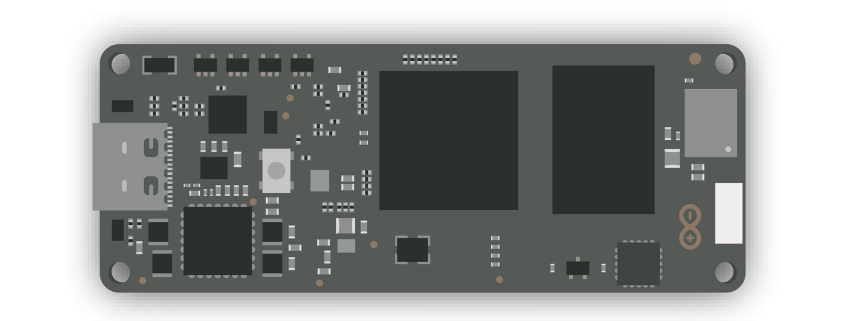
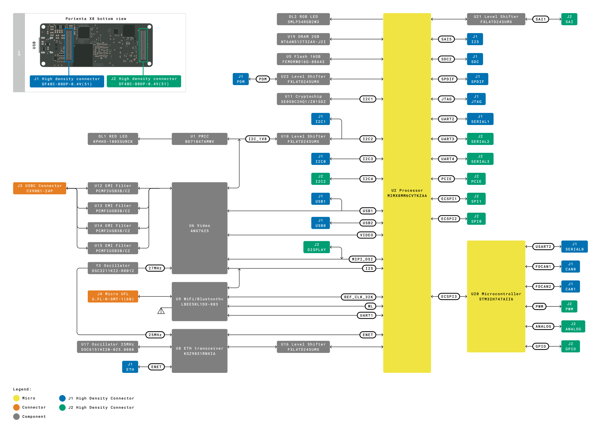
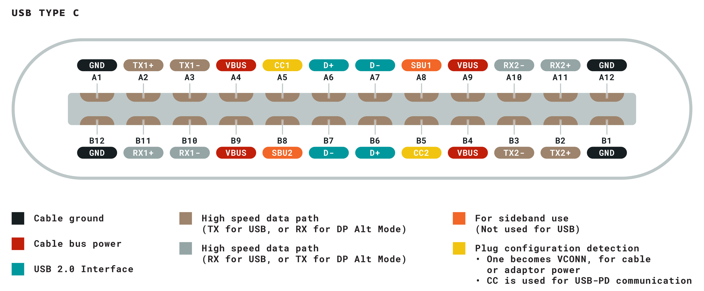
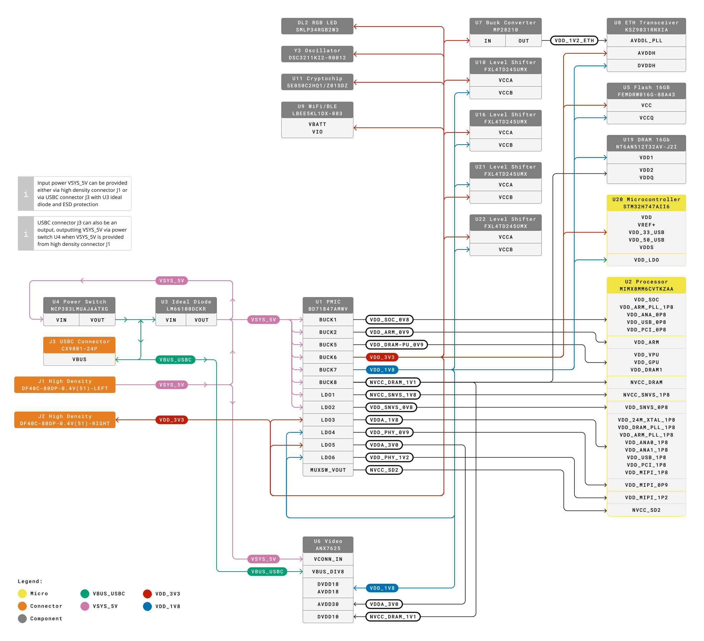

# Description
The Arduino® Portenta X8 is a high performance system on module designed to power the upcoming generation of Industrial Internet of Things. This board combines the NXP® i.MX 8M Mini hosting an embedded Linux OS with the STM32H7 to leverage Arduino libraries/skills. Shield and carrier boards are available to extend the functionality of the X8 or alternatively can be used as reference designs to develop your own custom solutions.

# Target Areas
Edge computing, industrial internet of things, system on module, artificial intelligence

# Features 
<table>
   <thead>
      <tr>
         <th>Component</th>
         <th colspan="2">Details</th>
      </tr>
   </thead>
   <tbody>
      <tr>
         <td rowspan="16" ><strong>NXP® i.MX 8M Mini </strong>Processor</td>
         <td>4x Arm® Cortex®-A53 core platforms up to 1.8 GHz per core</td>
         <td>
            
32KB L1-I Cache

            
32 kB L1-D Cache

            
512 kB L2 Cache

         </td>
      </tr>
      <tr>
         <td>Arm® Cortex®-M4 core up to 400 MHz</td>
         <td>
            
16 kB L1-I Cache

            
 16 kB L2-D Cache

         </td>
      </tr>
      <tr>
         <td>3D GPU (1x shader, OpenGL® ES 2.0)</td>
         <td></td>
      </tr>
      <tr>
         <td>2D GPU</td>
         <td></td>
      </tr>
      <tr>
         <td>1x MIPI DSI (4-lane) with PHY</td>
         <td></td>
      </tr>
      <tr>
         <td>1080p60 VP9 Profile 0, 2 (10-bit) decoder, HEVC/H.265 decoder, AVC/H.264 Baseline, Main, High decoder, VP8 decoder</td>
         <td></td>
      </tr>
      <tr>
         <td>1080p60 AVC/H.264 encoder, VP8 encoder</td>
         <td></td>
      </tr>
      <tr>
         <td>5x SAI (12Tx + 16Rx external I2S lanes), 8ch PDM input</td>
         <td></td>
      </tr>
      <tr>
         <td>1x MIPI CSI (4-lane) with PHY</td>
         <td></td>
      </tr>
      <tr>
         <td>2x USB 2.0 OTG controllers with integrated PHY</td>
         <td></td>
      </tr>
      <tr>
         <td>1x PCIe 2.0 (1-lane) with L1 low power substates</td>
         <td></td>
      </tr>
      <tr>
         <td>1x Gigabit Ethernet (MAC) with AVB and IEEE 1588, Energy Efficient Ethernet (EEE) for low power</td>
         <td></td>
      </tr>
      <tr>
         <td>4x UART (5mbps)</td>
         <td></td>
      </tr>
      <tr>
         <td>4x I2C</td>
         <td></td>
      </tr>
      <tr>
         <td>3x SPI</td>
         <td></td>
      </tr>
      <tr>
         <td>4x PWM</td>
         <td></td>
      </tr>
      <tr>
         <td rowspan="3" ><strong>STM32H747XI</strong> Microcontroller</td>
         <td>Arm® Cortex®-M7 core at up to 480 MHz with double-precision FPU</td>
         <td>16K data + 16K instruction L1 cache</td>
      </tr>
      <tr>
         <td>1x Arm® 32-bit Cortex®-M4 core at up to 240 MHz with FPU, Adaptive real-time accelerator (ART Accelerator™)</td>
         <td></td>
      </tr>
      <tr>
         <td>Memory</td>
         <td>
            
2 MB of Flash Memory with read-while-write support

            
1 MB of RAM

         </td>
      </tr>
      <tr>
         <td rowspan="2" ><strong>Onboard memory</strong></td>
         <td>NT6AN512T32AV</td>
         <td>2GB Low Power DDR4 DRAM</td>
      </tr>
      <tr>
         <td>FEMDRW016G</td>
         <td>16GB Foresee® eMMC Flash module</td>
      </tr>
      <tr>
         <td rowspan="4" ><strong>USB-C®</strong></td>
         <td>High Speed USB</td>
         <td></td>
      </tr>
      <tr>
         <td>DisplayPort output </td>
         <td></td>
      </tr>
      <tr>
         <td>Host and Device operation</td>
         <td></td>
      </tr>
      <tr>
         <td>Power Delivery support</td>
         <td></td>
      </tr>
      <tr >
         <td rowspan="14" >
            
<strong>High Density connectors</strong>

         </td>
         <td>1 lane PCI express</td>
         <td></td>
      </tr>
      <tr>
         <td>1x 10/100/1000 Ethernet interface with PHY</td>
         <td></td>
      </tr>
      <tr>
         <td>2x USB HS</td>
         <td></td>
      </tr>
      <tr>
         <td>4x UART (2 with flow control)</td>
         <td></td>
      </tr>
      <tr>
         <td>3x I2C</td>
         <td></td>
      </tr>
      <tr>
         <td>1x SDCard interface</td>
         <td></td>
      </tr>
      <tr>
         <td>2x SPI (1 shared with UART)</td>
         <td></td>
      </tr>
      <tr>
         <td>1x I2S</td>
         <td></td>
      </tr>
      <tr>
         <td>1x PDM input</td>
         <td></td>
      </tr>
      <tr>
         <td>4 lane MIPI DSI output</td>
         <td></td>
      </tr>
      <tr>
         <td>4 lane MIPI CSI input</td>
         <td></td>
      </tr>
      <tr>
         <td>4x PWM outputs</td>
         <td></td>
      </tr>
      <tr>
         <td>7x GPIO</td>
         <td></td>
      </tr>
      <tr>
         <td>8x ADC inputs with separate VREF</td>
         <td></td>
      </tr>
      <tr>
         <td rowspan="2" ><strong>Murata® 1DX </strong>Wi-Fi®/Bluetooth® Module</td>
         <td>Wi-Fi® 802.11b/g/n 65 Mbps</td>
         <td></td>
      </tr>
      <tr>
         <td>Bluetooth® 5.1 BR/EDR/LE</td>
         <td></td>
      </tr>
      <tr>
         <td rowspan="9" ><strong>NXP® SE050C2</strong> Crypto</td>
         <td>Common Criteria EAL 6+ certified up to OS level   </td>
         <td></td>
      </tr>
      <tr>
         <td>RSA & ECC functionalities, high key length and future proof curves, such as brainpool, Edwards, and Montgomery</td>
         <td></td>
      </tr>
      <tr>
         <td>AES & 3DES encryption and decryption</td>
         <td></td>
      </tr>
      <tr>
         <td>HMAC, CMAC, SHA-1, SHA-224/256/384/512 operations</td>
         <td></td>
      </tr>
      <tr>
         <td>HKDF, MIFARE® KDF, PRF (TLS-PSK)   </td>
         <td></td>
      </tr>
      <tr>
         <td>Support of main TPM functionalities</td>
         <td></td>
      </tr>
      <tr>
         <td>Secured flash user memory up to 50kB</td>
         <td></td>
      </tr>
      <tr>
         <td>I2C slave (High-speed mode, 3.4 Mbit/s), I2C master (Fast-mode, 400 kbit/s)</td>
         <td></td>
      </tr>
      <tr>
         <td>SCP03 (bus encryption and encrypted credential injection on applet and platform level)</td>
         <td></td>
      </tr>
      <tr>
         <td rowspan="2"><strong>ROHM BD71847AMWV</strong> Programmable PMIC</td>
         <td>Dynamic voltage scaling</td>
         <td></td>
      </tr>
      <tr>
         <td>3.3V/2A voltage output to carrier board</td>
         <td></td>
      </tr>
      <tr>
         <td><strong>Temperature range</strong></td>
         <td> -40°C to +85°C</td>
         <td> It is user’s sole responsibility to test board's operation in full temperature
         range. To improve board performance in critical conditions, it is possible to attach external heatsinks on the processor and on the memory.</td>
      </tr>
      <tr>
         <td><strong>Safety information</strong></td>
         <td>Class A</td>
         <td></td>
      </tr>
   </tbody>
</table>

# Contents

# The Board
## Application Examples
The Arduino® Portenta X8 has been designed for high performance embedded computing applications in mind, based on the quad core NXP® i.MX 8M Mini Processor. The Portenta form factor enables the use of a wide range of shields to expand upon its functionality.
- **Embedded Linux:** Kickstart the deployment of Industry 4.0 with Linux Board Support Packages running on the feature packed and energy efficient Arduino® Portenta X8. Make use of the GNU toolchain to develop your solutions free from technological lock in.   
- **High performance networking:** The Arduino® Portenta X8 includes Wi-Fi® and Bluetooth® connectivity to interact with a wide range of external devices and networks providing high flexibility. Additionally, Gigabit Ethernet interface provides high speed and low latency for the most demanding of applications. 
- **High speed modular embedded development:** The Arduino® Portenta X8 is a great unit for developing a wide range of custom solutions. The high density connector provides access to many functions, including PCIe connectivity, CAN, SAI and MIPI. Alternatively, use the Arduino ecosystem of professionally designed boards as a reference for your own designs. Low-code software containers allow for rapid deployment.

## Accessories (Not Included)
- USB-C® Hub
- USB-C® to HDMI Adapter
- Heatsink (if required)

## Related Products
- Arduino® Portenta Breakout Board (ASX00031)
- Arduino® Portenta Max Carrier (ABX00043)

# Rating

## Recommended Operating Conditions

| Symbol             | Description                                         | Min  | Typ  | Max  | Unit |
| :----------------- | :-------------------------------------------------- | :--: | :--: | :--: | :--: |
| VIN     | Input voltage from VIN pad                          | 4.5  |  5   | 5.5  |  V   |
| VUSB    | Input voltage from USB connector                    | 4.5  |  5   | 5.5  |  V   |
| V3V3    | 3.3 V output to user application                    |      | 3.1  |      |  V   |
| I3V3    | 3.3 V output current available for user application |  -   |  -   | 1000 |  mA  |
| VIH     | Input high-level voltage                            | 2.31 |  -   | 3.3  |  V   |
| VIL     | Input low-level voltage                             |  0   |  -   | 0.99 |  V   |
| IOH Max | Current at VDD-0.4 V, output set high               |      |      |  8   |  mA  |
| IOL Max | Current at VSS+0.4 V, output set low                |      |      |  8   |  mA  |
| VOH     | Output high voltage, 8 mA                           | 2.7  |  -   | 3.3  |  V   |
| VOL     | Output low voltage, 8 mA                            |  0   |  -   | 0.4  |  V   |

## Power Consumption

| Symbol          | Description                         | Min  | Typ  | Max  | Unit |
| --------------- | :---------------------------------- | :--: | :--: | :--: | :--: |
| PBL  | Power consumption with busy loop    |      | 2350 |      |  mW  |
| PLP  | Power consumption in low power mode |      | 200  |      |  mW  |
| PMAX | Maximum Power Consumption           |      | 4000 |      |  mW  |

The use of a USB 3.0 compatible port will ensure that current requirements for the Portenta X8 are met. Dynamic scaling of the Portenta X8 compute units can change the current consumption, leading to current surges during bootup. Average power consumption is provided in the above table for several reference scenarios.

# Functional Overview
## Block Diagram

## Board Topology
### Front View

| **Ref.** | **Description**                                | **Ref.**        | **Description**                                              |
| -------- | ---------------------------------------------- | --------------- | ------------------------------------------------------------ |
| U1       | BD71847AMWV i.MX 8M Mini  PMIC                 | U2              | MIMX8MM6CVTKZAA i.MX 8M Mini Quad IC                         |
| U4       | NCP383LMUAJAATXG Current-Limiting Power Switch | U6              | ANX7625 MIPI-DSI/DPI to USB Type-C® Bridge IC                |
| U7       | MP28210 Step Down IC                           | U9              | LBEE5KL1DX-883 WLAN+Bluetooth® Combo IC                      |
| U12      | PCMF2USB3B/CZ Bidirectional EMI Protection IC  | U16,U21,U22,U23 | FXL4TD245UMX 4-Bit Bidirectional Voltage-level Translator IC |
| U17      | DSC6151HI2B 25MHz MEMS Oscillator              | U18             | DSC6151HI2B 27MHz MEMS Oscillator                            |
| U19      | NT6AN512T32AV 2GB LP-DDR4 DRAM                 | IC1,IC2,IC3,IC4 | SN74LVC1G125DCKR 3-state 1.65-V to 5.5-V buffer IC           |
| PB1      | PTS820J25KSMTRLFS Reset Push Button            | Dl1             | KPHHS-1005SURCK Power On SMD LED                             |
| DL2      | SMLP34RGB2W3 RGB Common Anode SMD LED          | Y1              | CX3225GB24000P0HPQCC 24MHz crystal                           |
| Y3       | DSC2311KI2-R0012 Dual-Output MEMS Oscillator   | J3              | CX90B1-24P USB Type-C® connector                              |
| J4       | U.FL-R-SMT-1(60) UFL Connector                 |

### Back View

| **Ref.** | **Description**                                       | **Ref.**     | **Description**                                      |
| -------- | ----------------------------------------------------- | ------------ | ---------------------------------------------------- |
| U3       | LM66100DCKR Ideal Diode                               | U5           | FEMDRW016G 16GB eMMC Flash IC                        |
| U8       | KSZ9031RNXIA Gigabit Ethernet Transceiver IC          | U10          | FXMA2102L8X Dual Supply, 2-Bit Voltage Translator IC |
| U11      | SE050C2HQ1/Z01SDZ IoT Secure Element                  | U12, U13,U14 | PCMF2USB3B/CZ Bidirectional EMI Protection IC        |
| U15      | NX18P3001UKZ Bidirectional power switch IC            | U20          | STM32H747AII6 Dual ARM® Cortex® M7/M4 IC             |
| Y2       | SIT1532AI-J4-DCC-32.768E 32.768KHz MEMS Oscillator IC | J1, J2       | High density connectors                              |
| Q1       | 2N7002T-7-F N-Channel 60V 115mA MOSFET                |

## Processor
The Arduino Portenta X8 makes use of two ARM®-based physical processing units.

### NXP® i.MX 8M Mini Quad Core Microprocessor
The MIMX8MM6CVTKZAA iMX8M (U2) features a quad core ARM® Cortex® A53 running at up to 1.8 GHz for high performance applications alongside an ARM® Cortex® M4 running at up to 400 MHz. The ARM® Cortex® A53 is capable of running a fully fledged Linux or Android operating system through a Board Support Packages (BSP) in a multithreaded fashion. This can be expanded via the use of specialized software containers via OTA updates. The ARM® Cortex® M4 has lower power consumption allowing for effective sleep management as well as optimal performance in real-time applications and is reserved for future use. Both processors can share all peripherals and resources available on the i.MX 8M Mini, including PCIe, on-chip memory, GPIO, GPU and Audio.

### STM32 Dual Core Microprocessor
The X8 includes an embedded H7 in the form of a STM32H747AII6 IC (U20) with a dual core ARM® Cortex® M7 and ARM® Cortex® M4. This IC is used as a I/O expander for the NXP® i.MX 8M Mini (U2). Peripherals are automatically controlled via the M7 core. Additionally, the M4 core is available for real time control of motors and other time-critical machinery at a barebones level. The M7 core acts as a mediator between the peripherals and the i.MX 8M Mini and runs a proprietary firmware inaccessible to the User. The STM32H7 is not exposed to networking and should be programmed via the i.MX 8M Mini (U2). 

## Wi-Fi®/Bluetooth® Connectivity
The Murata® LBEE5KL1DX-883 wireless module (U9) simultaneously provides Wi-Fi® and Bluetooth® connectivity in an ultra small package based on the Cypress CYW4343W. The IEEE802.11b/g/n Wi-Fi® interface can be operated as an access point (AP), station (STA) or as a dual mode simultaneous AP/STA and supports a maximum transfer rate of 65 Mbps. Bluetooth® interface supports Bluetooth® Classic and Bluetooth® Low Energy. An integrated antenna circuitry switch allows a single external antenna (J4 or ANT1) to be shared between Wi-Fi® and Bluetooth®. Module U9 interfaces with i.MX 8M Mini (U2) via a 4bit SDIO and UART interface. Based on the software stack of the wireless module in the embedded linux OS, Bluetooth® 5.1 is supported together with Wi-Fi® conforming to the IEEE802.11b/g/n standard.

## Onboard Memories
The Arduino® Portenta X8 includes two onboard memory modules. A NT6AN512T32AV 2GB LP-DDR4 DRAM (U19) and 16GB Forsee eMMC Flash module (FEMDRW016G) (U5) are accessible to the i.MX 8M Mini (U2).

## Crypto Capabilities
The Arduino® Portenta X8 enables IC level edge-to-cloud security capability through the NXP® SE050C2 Crypto chip (U11). This provides Common Criteria EAL 6+ security certification up to OS level, as well as RSA/ECC cryptographic algorithm support and credential storage. It interacts with the NXP® i.MX 8M Mini via I2C. 

## Gigabit Ethernet
The NXP® i.MX 8M Mini Quad includes a 10/100/1000 Ethernet controller with support for Energy Efficient Ethernet (EEE), Ethernet AVB, and IEEE 1588. An external physical connector is required to complete the interface. This can be accessed via a high density connector with an external component such as the Arduino® Portenta Breakout board.

## USB-C® Connector

The USB-C® connector provides multiple connectivity options over a single physical interface:
- Provide board power supply in both DFP and DRP mode
- Source power to external peripherals when board is powered through VIN
- Expose High Speed (480 Mbps) or Full Speed (12 Mbps) USB Host/Device interface
- Expose Displayport output interface 
The Displayport interface is usable in conjunction with USB and can be either used with a simple cable adapter when board is powered via VIN or with dongles able to provide power to the board while simultaneously outputting Displayport and USB. Such dongles usually provide an ethernet over USB port, a 2 port USB hub and a USB-C® port that can be used to provide power to the system.

## Real Time Clock
The Real Time clock allows keeping time of day with a very low power consumption.

## Power Tree

Power management is mainly performed by the BD71847AMWV IC (U1).

## Board Operation
### Getting Started - IDE
If you want to program your Arduino® Portenta X8 while offline you need to install the Arduino® Desktop IDE **[1]** To connect the Arduino® Edge control to your computer, you’ll need a Type-c USB cable. This also provides power to the board, as indicated by the LED.

### Getting Started - Arduino Web Editor
All Arduino® boards, including this one, work out-of-the-box on the Arduino® Web Editor **[2]**, by just installing a simple plugin. 

The Arduino® Web Editor is hosted online, therefore it will always be up-to-date with the latest features and support for all boards. Follow **[3]** to start coding on the browser and upload your sketches onto your board.

### Getting Started - Arduino IoT Cloud
All Arduino® IoT enabled products are supported on Arduino® IoT Cloud which allows you to Log, graph and analyze sensor data, trigger events, and automate your home or business.

### Sample Sketches
Sample sketches for the Arduino® Portenta X8 can be found either in the “Examples” menu in the Arduino® IDE or in the “Documentation” section of the Arduino Pro website **[4]**

### Online Resources
Now that you have gone through the basics of what you can do with the board you can explore the endless possibilities it provides by checking exciting projects on ProjectHub **[5]**, the Arduino® Library Reference **[6]** and the online store **[7]** where you will be able to complement your board with sensors, actuators and more.

### Board Recovery
All Arduino boards have a built-in bootloader which allows flashing the board via USB. In case a sketch locks up the processor and the board is not reachable anymore via USB it is possible to enter bootloader mode by configuring DIP switches. 

**Note: A compatible carrier board with DIP switches (e.g. Portenta Max Carrier or Portenta Breakout) is required to enable bootloader mode. It cannot be enabled with the Portenta X8 alone.**

# Mechanical Information

## Pinout

## Mounting Holes and Board Outline

# Certifications

| Certification | Details                                                      |
| :------------ | :----------------------------------------------------------- |
| CE (EU)       | EN 301489-1 EN 301489-1 EN 300328 EN 62368-1 EN 62311 |
| WEEE (EU)     | Yes                                                          |
| RoHS (EU)     | 2011/65/(EU) 2015/863/(EU)                              |
| REACH (EU)    | Yes                                                          |
| UKCA (UK)     | Yes                                                          |
| RCM (RCM)     | Yes                                                          |
| FCC (US)      | ID. Radio: Part 15.247 MPE: Part 2.1091            |
| RCM (AU)      | Yes                                                          |

## Declaration of Conformity CE DoC (EU)
We declare under our sole responsibility that the products above are in conformity with the essential requirements of the following EU Directives and therefore qualify for free movement within markets comprising the European Union (EU) and European Economic Area (EEA). 

## Declaration of Conformity to EU RoHS & REACH 211 01/19/2021
Arduino boards are in compliance with RoHS 2 Directive 2011/65/EU of the European Parliament and RoHS 3 Directive 2015/863/EU of the Council of 4 June 2015 on the restriction of the use of certain hazardous substances in electrical and electronic equipment. 

| **Substance**                          | **Maximum Limit (ppm)** |
| -------------------------------------- | ----------------------- |
| Lead (Pb)                              | 1000                    |
| Cadmium (Cd)                           | 100                     |
| Mercury (Hg)                           | 1000                    |
| Hexavalent Chromium (Cr6+)             | 1000                    |
| Poly Brominated Biphenyls (PBB)        | 1000                    |
| Poly Brominated Diphenyl ethers (PBDE) | 1000                    |
| Bis(2-Ethylhexyl} phthalate (DEHP)     | 1000                    |
| Benzyl butyl phthalate (BBP)           | 1000                    |
| Dibutyl phthalate (DBP)                | 1000                    |
| Diisobutyl phthalate (DIBP)            | 1000                    |

Exemptions : No exemptions are claimed. 

Arduino Boards are fully compliant with the related requirements of European Union Regulation (EC) 1907 /2006 concerning the Registration, Evaluation, Authorization and Restriction of Chemicals (REACH). We declare none of the SVHCs (https://echa.europa.eu/web/guest/candidate-list-table), the Candidate List of Substances of Very High Concern for authorization currently released by ECHA, is present in all products (and also package) in quantities totaling in a concentration equal or above 0.1%. To the best of our knowledge, we also declare that our products do not contain any of the substances listed on the "Authorization List" (Annex XIV of the REACH regulations) and Substances of Very High Concern (SVHC) in any significant amounts as specified by the Annex XVII of Candidate list published by ECHA (European Chemical Agency) 1907 /2006/EC.

## Conflict Minerals Declaration 
As a global supplier of electronic and electrical components, Arduino is aware of our obligations with regards to laws and regulations regarding Conflict Minerals, specifically the Dodd-Frank Wall Street Reform and Consumer Protection Act, Section 1502. Arduino does not directly source or process conflict minerals such as Tin, Tantalum, Tungsten, or Gold. Conflict minerals are contained in our products in the form of solder, or as a component in metal alloys. As part of our reasonable due diligence Arduino has contacted component suppliers within our supply chain to verify their continued compliance with the regulations. Based on the information received thus far we declare that our products contain Conflict Minerals sourced from conflict-free areas. 

## FCC Caution
Any Changes or modifications not expressly approved by the party responsible for compliance could void the user’s authority to operate the equipment.

This device complies with part 15 of the FCC Rules. Operation is subject to the following two conditions: 

(1) This device may not cause harmful interference

(2) this device must accept any interference received, including interference that may cause undesired operation.

**FCC RF Radiation Exposure Statement:**

1. This Transmitter must not be co-located or operating in conjunction with any other antenna or transmitter.

2. This equipment complies with RF radiation exposure limits set forth for an uncontrolled environment.

3. This equipment should be installed and operated with minimum distance 20cm between the radiator & your body.

English: 
User manuals for licence-exempt radio apparatus shall contain the following or equivalent notice in a conspicuous location in the user manual or alternatively on the device or both. This device complies with Industry Canada licence-exempt RSS standard(s). Operation is subject to the following two conditions:

(1) this device may not cause interference

(2) this device must accept any interference, including interference that may cause undesired operation of the device.

French: 
Le présent appareil est conforme aux CNR d’Industrie Canada applicables aux appareils radio exempts de licence. L’exploitation est autorisée aux deux conditions suivantes :

(1) l’ appareil nedoit pas produire de brouillage

(2) l’utilisateur de l’appareil doit accepter tout brouillage radioélectrique subi, même si le brouillage est susceptible d’en compromettre le fonctionnement.

**IC SAR Warning:**

English 
This equipment should be installed and operated with minimum distance 20 cm between the radiator and your body.  

French: 
Lors de l’ installation et de l’ exploitation de ce dispositif, la distance entre le radiateur et le corps est d ’au moins 20 cm.

**Important:** The operating temperature of the EUT can’t exceed 85℃ and shouldn’t be lower than -40℃.

Hereby, Arduino S.r.l. declares that this product is in compliance with essential requirements and other relevant provisions of Directive 201453/EU. This product is allowed to be used in all EU member states. 

| Frequency bands      | Maximum output power (ERP) |
| -------------------- | -------------------------- |
| 2.4 GHz, 40 channels | +6dBm                      |

## Company Information

| Company name    | Arduino SRL                                   |
| --------------- | --------------------------------------------- |
| Company Address | Via Andrea Appiani 25, 20900, MONZA MB, Italy |

## Reference Documentation

| Ref                       | Link                                                         |
| ------------------------- | ------------------------------------------------------------ |
| Arduino IDE (Desktop)     | https://www.arduino.cc/en/Main/Software                      |
| Arduino IDE (Cloud)       | https://create.arduino.cc/editor                             |
| Cloud IDE Getting Started | https://create.arduino.cc/projecthub/Arduino_Genuino/getting-started-with-arduino-web-editor-4b3e4a |
| Arduino Pro Website       | https://www.arduino.cc/pro                                   |
| Project Hub               | https://create.arduino.cc/projecthub?by=part&part_id=11332&sort=trending |
| Library Reference         | https://github.com/arduino-libraries/                        |
| Online Store              | https://store.arduino.cc/                                    |

## Change Log

| **Date**   | **Changes** |
| ---------- | ----------- |
| 24/03/2022 | Release     |
