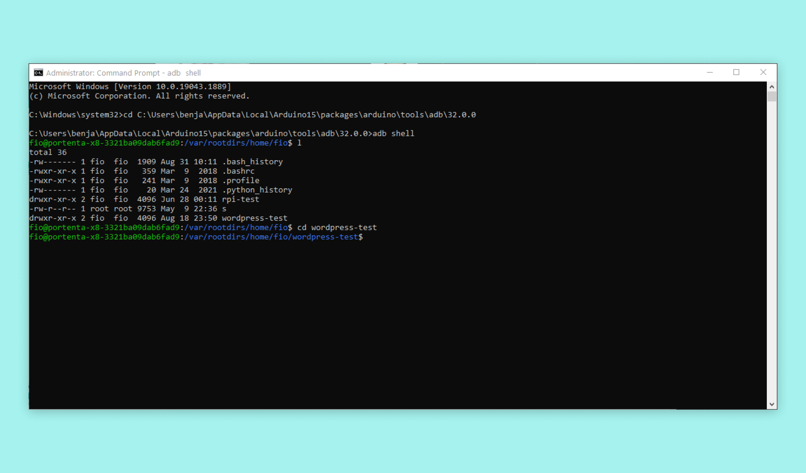
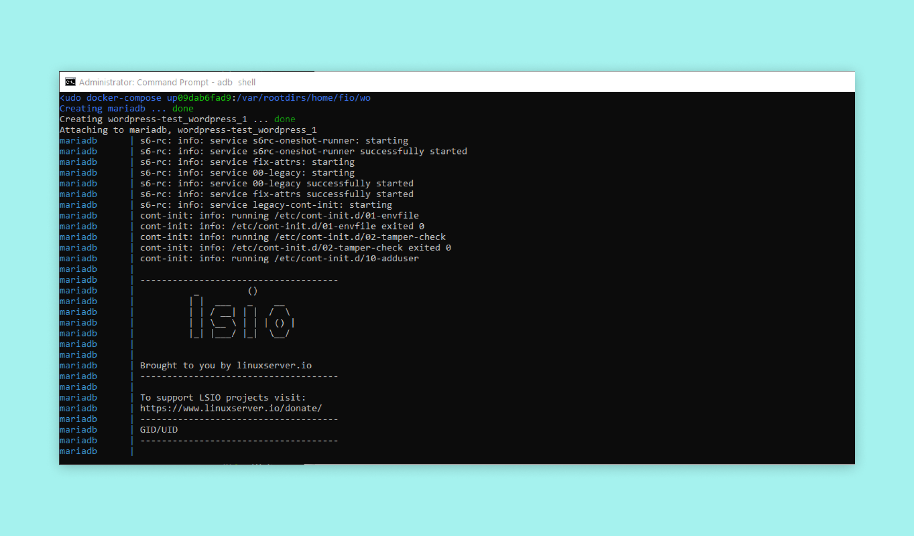
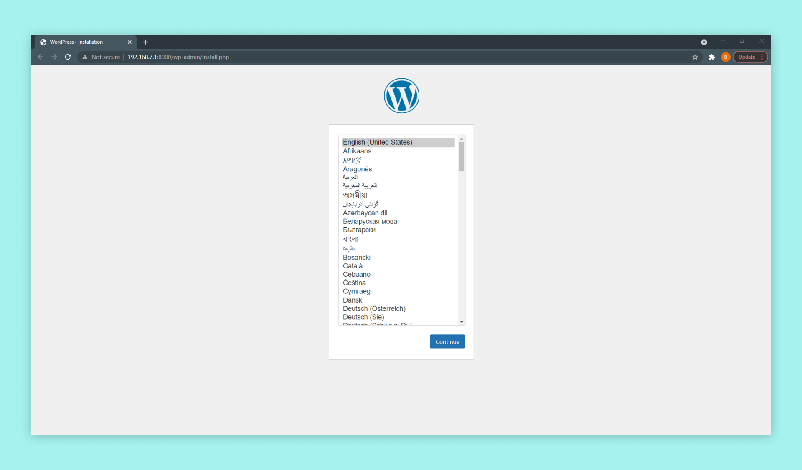

## Overview

The Arduino Portenta X8's robust features are ideally complemented by Docker containers, simplifying various applications. This tutorial demonstrates how to deploy a WordPress web server on the Portenta X8, leveraging containers for web service and database management. 

You will learn to set up and access a WordPress site hosted on the X8 via a web browser.

## Goals

- Prepare the necessary files for Docker container deployment
- Deploy and activate the Docker containers on the Portenta X8
- Access and configure the WordPress site hosted on the Portenta X8

### Required Hardware and Software

- [Portenta X8](https://store.arduino.cc/products/portenta-x8)
- USB-C® cable (either USB-C® to USB-A or USB-C® to USB-C®)
- The [docker-compose.yml](assets/docker-compose.rar) file used in this tutorial

## Instructions

Begin by ensuring your Portenta X8 is ready for use, following the setup guide in the [User Manual's Out-of-the-Box Experience](https://docs.arduino.cc/tutorials/portenta-x8/user-manual#out-of-the-box-experience).

### Creating the **docker-compose.yml** File

Our WordPress setup involves a multi-container approach, integrating both the WordPress and a MariaDB database server containers. The WordPress container uses Apache as the web server, merged within the container for easy deployment.

To direct this setup, we will craft a docker-compose.yml file describing the configurations for both WordPress and MariaDB containers, including essential settings like usernames, passwords, time zones, and database names. For security, ensure the default passwords are substituted with stronger alternatives in the provided configuration template.

### Complete **docker-compose.yml** File

In this section, you can find the complete **docker-compose.yml** file that we will be using for this tutorial.

```yaml
version: "3.9"
    
services:
  db:
    image: mariadb:latest
    container_name: mariadb
    environment:
      - PUID=1000
      - PGID=1000
      - MYSQL_ROOT_PASSWORD=Wordpress
      - TZ=Europe/London
      - MYSQL_DATABASE=Wordpress
      - MYSQL_USER=Wordpress
      - MYSQL_PASSWORD=Wordpress
    volumes:
      - db_data:/var/lib/mysql
    restart: unless-stopped
    
  Wordpress:
    depends_on:
      - db
    image: wordpress:latest
    volumes:
      - Wordpress_data:/var/www/html
    ports:
      - "8000:80"
    restart: always
    environment:
      WORDPRESS_DB_HOST: db
      WORDPRESS_DB_USER: Wordpress
      WORDPRESS_DB_PASSWORD: Wordpress
      WORDPRESS_DB_NAME: Wordpress
volumes:
  Wordpress_data: {}
  db_data: {}
```

Now, let's prepare our Portenta X8 by creating a directory for our **docker-compose.yml** file, which can be downloaded [here](assets/docker-compose.rar).

### Installing The Containers

Begin by creating a directory for the Docker setup, naming it **wordpress-test**. Navigate into this directory and either copy the *docker-compose.yml* file into it or create the file directly within.

To create the file on the device, use *`cat > docker-compose.yml`*, paste the contents, and exit with `CTRL + C`. To transfer the file from your computer, use the following command, making sure to replace *`<path to docker-compose.yml file>`* with the actual file path:

```bash
adb push <path to docker-compose.yml file> /home/fio/wordpress-test
```

Alternatively, you could place the `docker-compose.yml` file inside the `wordpress-test` directory and push the file using the following command:

Alternatively, if the *docker-compose.yml* is already inside the **wordpress-test** directory on your computer, use:

```bash
adb push .\wordpress-test\ /home/fio
```

Choose the method that best suits your workflow.



***Access Docker with administrative privileges by executing `sudo su -`, with `fio` as the default password.***

Ensure no conflicting containers are running on your intended ports by inspecting current containers with *`docker ps -a`*. Remove any active containers by first stopping them with:

```bash
docker stop <container id>
```

Then removing them with:

```bash
docker rm <container id>
```

If you want more information about handling containers on your Portenta X8, take a look at our [Managing Containers with Docker tutorial](https://docs.arduino.cc/tutorials/portenta-x8/docker-container).

With the setup directory ready and no port conflicts, begin the container installation with:

```bash
docker compose up -d
```
The `-d` flag runs the containers in the background; omitting it will tie the container's lifecycle to the terminal session.

The installation of the **WordPress** and **MariaDB** containers will begin and may take some time. To monitor the installation process, use:

```bash
docker-compose logs -f
```

Upon completion, your WordPress site will be accessible from the Portenta X8.



### Connecting to the WordPress Site

Accessing your WordPress site on the Portenta X8 is straightforward. Use the following URL format, composed with your Portenta X8's unique id and port, in your browser:

```bash
http://portenta-x8-<uuid>.local:<port>
```

Replace *`<uuid>`* with your Portenta X8's unique identifier and *`<port>`* with the port you have allocated for the WordPress container. You can find your device's *`<uuid>`* in the setup guide within the [User Manual's Out-of-the-Box Experience](https://docs.arduino.cc/tutorials/portenta-x8/user-manual#out-of-the-box-experience), through terminal commands involving *`adb`*, or by visiting **`http://192.168.7.1:8000`** on Windows and Linux (use **`http://192.168.8.1:8000`**for MacOS).

Upon establishing a connection, your terminal will display details similar to those below.


Your browser will then present the WordPress setup page, allowing you to commence the configuration process.



You are now free to go through the WordPress setup process and configure it however you like.

### Removing the containers ###

Should you need to remove the containers, navigate back to the *`/home/fio/wordpress-test`* directory and use the commands below based on your requirements.

To remove the containers while retaining your WordPress data:

```bash
docker compose down
```

To delete both the containers and all associated data:

```bash
docker compose down --volumes
```

Confirm the removal by executing *`docker ps -a`* and verifying that the WordPress and MariaDB containers are no longer listed.

## Conclusion

In this tutorial, we went through installing and running a WordPress and database container on the Portenta X8. We then accessed the WordPress site on our X8 through our web browser. Now, you can set up your WordPress site on your X8 device and access it from another device.

## Troubleshooting

- If the containers are not being installed or running correctly, check if any other containers are currently running on the same ports as the ones used by the WordPress container. You can check it with ``docker ps -a``.

- If there is any issue running docker commands, ensure you are using ``sudo`` before the commands or having root access using: ``sudo su -r`` with password: ``fio``.

- If you cannot connect to the site when everything is running, you can double-check the X8's IP address. Run the command `ip -h address` in the **adb shell**. This will display the X8's IP address via USB and Wi-Fi®. Try connecting via those IP addresses if all the rest fails.
