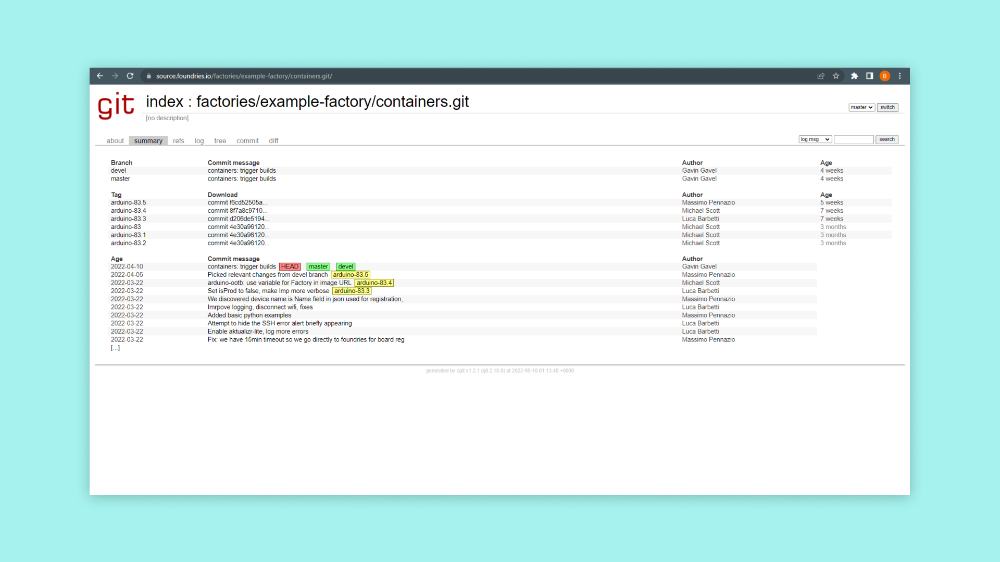
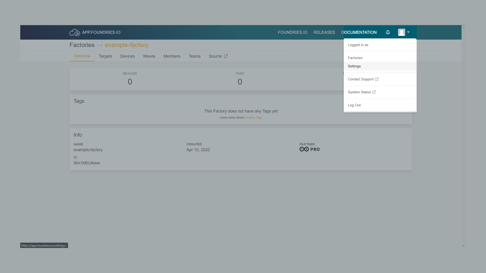

## Overview

In this tutorial we will create a simple container that we can then upload to the Arduino Portenta X8. A container consists of an image file and all it's dependencies if there are any. This tutorial will go through the different files needed to create a container and their functions. Building this container locally and then uploading it to a Portenta X8. Using docker with ADB to build, run and attach our container to the Portenta X8.

## Goals

- Learn how to create a container for use with the Portenta X8
- Learn how to upload a container to the Portenta X8

### Required Hardware and Software

- [Portenta X8](https://store.arduino.cc/portenta-x8)
- ADB
- USB-C cable (either USB-C to USB-A or USB-C to USB-C)
- Arduino Pro Cloud Subscription. [Learn more about the Pro Cloud](https://www.arduino.cc/pro/hardware/product/portenta-x8#pro-cloud).


## Instructions

When running a container, it uses an isolated filesystem. This custom filesystem is provided by a container image. Since the image contains the container’s filesystem, it must contain everything needed to run an application - all dependencies, configuration, scripts, binaries, etc. The image also contains other configuration for the container, such as environment variables, a default command to run, and other metadata.

## Container File Structure

To create our container we need to collect our necessary files. Creating a folder called **x8-custom-test**, the following files needs to be in the folder:
- docker-build.conf
- docker-compose.yml
- Dockerfile
- requirements.txt
- src folder
- main.py (This file should be inside the src folder)

The complete folder will look like this:


Lets go through what these files contain and do.

### Docker-build.conf
A file containing the minimal "unit test" command to be executed on the container to prove it's working. Our file will make our containers minimal unit test a test of Python3 help command.

```python
TEST_CMD="python3 --help"
```

### Docker-compose.yml
This file defines the app name through the factory, permissions and settings for the involved containers. The argument in the image tag will make it so our image file builds locally.

```python
version: '3.6'

services:
  x8-custom-test:
    image: blob-opera:latest
    restart: always
    tty: true
    read_only: true
    user: "63"
    tmpfs:
    - /run
    - /var/lock
    - /var/log
    - /tmp
```

### Dockerfile
This is used to build the container.

```python
FROM python:3-alpine3.15

# Set our working directory
WORKDIR /usr/src/app

# Copy requirements.txt first for better cache on later pushes
COPY requirements.txt requirements.txt

# pip install python deps from requirements.txt on the resin.io build server
RUN pip install -r requirements.txt

# This will copy all files in our root to the working  directory in the container
COPY ./src/main.py ./

# Enable udevd so that plugged dynamic hardware devices show up in our container.
ENV UDEV=1

# main.py will run when container starts up on the device
CMD ["python","-u","main.py"]
```

### Requirements.txt

```python
Flask==0.12.3
```

### Source
Here we will keep source code of the app you want to run in the container or a startup script. We will create a file and name it **main.py** in this folder. This script will print "Hello World!" in the CLI window.

```python
from flask import Flask
app = Flask(__name__)

@app.route('/')
def hello_world():
    return 'Hello World!'

if __name__ == '__main__':
    app.run(host='0.0.0.0', port=80)
```

## Uploading the Container Folder

First, you have to have set up your board to a factory, as shown in the [Portenta X8 Out of the Box tutorial](https://docs.arduino.cc/tutorials/portenta-x8/out-of-the-box).

Once this is done, we will push our folder to a repository within the factory. Lets place our folder "x8-custom-test" inside the "containers.git" repository. You can find this repository inside your factory page, if you click on "Source". And then on "container.git", the url of this page will be used in the next command.




In order to pull or push repositories you have to generate an API key. This can be done by going to the user settings on the Factory page. First click on the user drop-down menu, then go into the tokens page and follow the steps of creating a new API key. This token will be used as the password for all git operations while the username can be anything, except an empty string.




Use the following command in a Linux shell, like ADB which the previously mentioned tutorial showed how to set up. To get the repository on your board, replace "YOUR_FACTORY" with the name of your factory. The "-b" parameter specifies a branch to checkout after cloning the repository. Running this command will get the container repository, where we will put our folder.

```
git clone https://source.foundries.io/factories/YOUR_FACTORY/containers.git -b devel
```

Put the "x8-custom-test" folder in the repository. If you push the commit to "containers.git" a new target will automatically build on your FoundriesFactory, you can inspect it in the "Targets" page.

### Building and Running the Container

After the build is finished, it can take up to 10 minutes for your device to OTA update to this new version. You can inspect it via the "Devices" tab of your FoundriesFactory. After your device takes the update, navigate into the "x8-custom-test" folder, that should be located on your board now. This allows us to build our container with a simple command. Using ```docker build``` with a ```--tag``` will let us give the container a tag so we can easily keep track of what version of the build this is.

```python
docker build --tag "x8-custom-test:latest" .
```

Now that it is built we can run it with ```docker run```, finding it with the tag that we chose to give to the build we want to run. Here we will have to enter the user information into the --user tag. This information is found inside the "docker-compose.yml" file.

```python
docker run -it --rm --user "63" x8-custom-test:latest
```

### Using Docker-Compose

A option for testing an app or container is to use "docker-compose". This is helpful when we have a lot of settings in our "docker-compose.yml" file, since we don't have to use those settings in the run argument with this method. First navigate into the container folder.

```python
cd /home/fio/x8-custom-test
```

This docker-compose command will start your application and register it as a systemd service that will persist even when a reboot occurs. So at the next boot your docker-compose app will run automatically.

```python
docker-compose up --detach
```

To stop the docker-compose app from running, use the following command:

```python
docker-compose stop
```

## Conclusion

This tutorial went through what goes into a container, how the folder should be built and what files it should contain. It then explained what each files purpose is and what they should contain for this example. Then we went through how this relates back to the factory, and how Foundries.io makes the whole process easier for us. We then showed how to build the container and run it on the Portenta X8. Lastly, we showed a useful testing feature with docker-compose. Which lets us test our container with a faster process.

### Next Steps

To get a better understanding of how to manage containers with Docker, take a look at our [Managing Containers with Docker on Portenta X8](https://docs.arduino.cc/tutorials/portenta-x8/docker-container). This tutorial will show some useful commands to use with the docker service and ADB or SSH.


## Troubleshooting

Here are some errors that might occur in the process of this tutorial:

- Make sure you have followed our other tutorials that shows how to set up the [Portenta X8 out of the box](https://docs.arduino.cc/tutorials/portenta-x8/out-of-the-box)
- If you are having issues with the adb shell, don't forget to try and use `sudo` and `su`
