## Overview

This tutorial will set up a typical Internet of Things (IoT) application: an MQTT data logger. For this application, we are going to use what we call in the Arduino team the "IoT-Quartet," four common building blocks that are popular and regularly used in these types of applications:

- [Mosquitto](https://mosquitto.org/) (MQTT broker) 
- [Node-RED](https://nodered.org/)
- [InfluxDB](https://www.influxdata.com/)
- [Grafana](https://grafana.com/)

These four blocks will be running locally on the [Arduino® Portenta X8](https://store.arduino.cc/products/portenta-x8) board. We will use data from an [Arduino® MKR WiFi 1010](https://store.arduino.cc/products/arduino-mkr-wifi-1010) board to test the data logging application.

## Goals

- Install, configure and run Mosquitto (MQTT broker) locally in the Portenta X8
- Install, configure and run Node-RED locally in the Portenta X8
- Install, configure and run InfluxDB locally in the Portenta X8
- Install, configure and run Grafana locally in the Portenta X8
- Send data from an Arduino® MKR WiFi 1010 board to the data logging application running locally in the Portenta X8

## Required Hardware and Software

- [Arduino® Portenta X8](https://store.arduino.cc/products/portenta-x8)
- [Arduino® MKR WiFi 1010](https://store.arduino.cc/products/arduino-mkr-wifi-1010)
- USB-C cable (either USB-C to USB-A or USB-C to USB-C)
- Wi-Fi Access Point (AP) with Internet access
- ADB or SSH
- Command-line interface
- [Arduino IDE 2.0](https://www.arduino.cc/en/software)
  
***If you are new to the Portenta X8 board, check out this [getting started tutorial](/tutorials/portenta-x8/out-of-the-box#controlling-portenta-x8-through-the-terminal) on controlling your board using a terminal or command-line interface.***

## IoT Architecture 101

IoT applications and devices are everywhere nowadays, even where we don't think a device or application is connected to the Internet. Rather than a single technology, **IoT is a concept** that refers to the connection of everyday devices, just like your watch, to the Internet and how that Internet connection creates more and different ways to interact with your device and your environment. Interactions between humans and devices or applications create **data** (lots) that must be communicated and processed. 

How can we plan, build and deploy IoT solutions? To answer that question, we must think about **IoT architecture**. Due to the different IoT devices and applications that exist and can exist, there is not just one unique architecture for IoT devices and applications. But, we can talk about a base architecture that can be considered as a starting point for every IoT project. This base architecture consists of **three essential layers**: **perception** (or devices), **network**, and **application**. Let's talk more about these layers:

- **Perception layer**: this is the sensor's layer, where data comes from. In this layer, data is gathered with one or more sensor nodes; actuators, that answer to data collected from sensor nodes, are also in this layer.
- **Network layer**: this is where sensor node data is recollected and transmitted to back-end services, such as databases. 
- **Application layer**: this layer is what the device or application user sees and interacts with, for example, a dashboard. 

The three-layer IoT architecture can be a starting point for designing and implementing an IoT device or application. In this tutorial, we are going to take this base architecture and set up a data logging application, as shown in the image below:

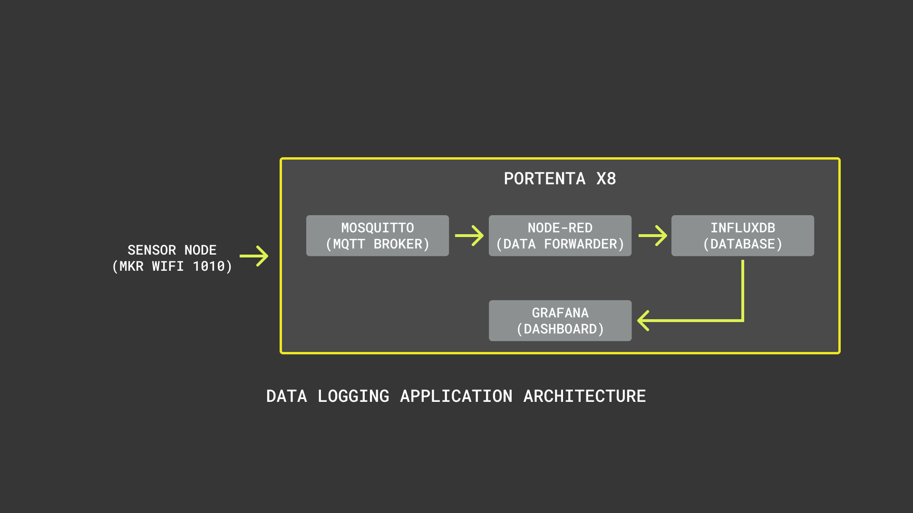

In the high-level architecture described in the image above:

- The perception layer consists of an MKR WiFi 1010 board; this board will gather information from a sensor. 
- The network layer consists of the MQTT broker (Mosquitto), the data forwarder (Node-RED), and the database (InfluxDB). 
- The application layer consists of a dashboard (Grafana) where information from the sensor node is shown.

***For documentation purposes, we will to explain, step by step, the installation process of each part of the application (Mosquitto, Node-RED, InfluxDB, and Grafana); this process can be done quickly using a unique Compose `YAML` file.***

Let's start by configuring the MQTT broker!

## Installing Mosquitto

Let's start by creating a new directory in our Portenta X8 called `mqtt`; inside this directory, we are going to make a file named `docker-compose.yml`: 

```
$ mkdir mqtt
$ cd mqtt
$ export TERM=xterm
$ stty rows 36 cols 150
$ sudo vi docker-compose.yml
```

***The `export TERM=xterm` and `stty rows 36 cols 150` commands enable VI editor full screen.*** 

Inside VI editor, copy and paste the following:

```
services:
        mqtt:
                container_name: mosquitto
                image: eclipse-mosquitto
                restart: always
                ports:
                        - "1883:1883"
                        - "9001:9001"
                volumes:
                        - /var/rootdirs/home/root/mqtt/config:/mosquitto/config
                        - /var/rootdirs/home/root/mqtt/data:/mosquitto/data
                        - /var/rootdirs/home/root/mqtt/log:/mosquitto/log
volumes:
        config:
        data:
        log:
```

***`1883` is a standard MQTT port; the `8883` port is usually used for TLS-secured MQTT connections.***

Save the file and exit the VI editor. Return to the `mqtt` directory and run the following command:

```
mqtt$ docker-compose up -d
```

The Mosquitto broker should be available on your Portenta X8 `IP address`. You can retrieve the `IP Address` of your board with the `ping <hostname>` command: 

```
$ ping portenta-x8-a28ba09dab6fad9
PING portenta-x8-a28ba09dab6fad9 (192.168.1.111) 56 data bytes
```

We should see inside the `mqtt` directory three folders (`config`, `data`, and `log`) and the `docker-compose.yml` file we created before. Go to the `config` directory and make a file named `mosquitto.conf`:

```
mqtt$ ls
config  data  docker-compose.yml  log
mqtt$ cd config
/mqtt/config# sudo vi mosquitto.config
```

Inside the VI editor, copy and paste the following:

```
persistence true
persistence_location /mosquitto/data/
log_dest file /mosquitto/log/mosquitto.log
```

Save the file and exit the VI editor. Now, let's restart the Mosquitto container so the configuration file can start working. This can be done using the `docker restart` command and the Mosquitto `CONTAINER ID`. To identify the Mosquitto `CONTAINER ID`, run the `docker ps` command and copy the `CONTAINER ID`, as shown in the image below:

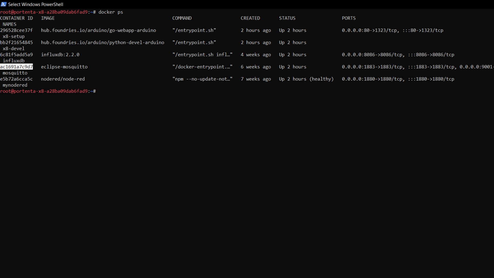

Now, let's manage password files by adding a user to a new password file. For this, we need to run the `sh` command in the mosquitto container with the mosquitto `CONTAINER ID` found before, as shown below:

```
/mqtt/config$ docker exec -it CONTAINER ID sh
/ # 
```

Let's dissect that command:
- `docker exec` runs a command in a running container (in this case, the Mosquitto container)
- `-it CONTAINER ID sh` attaches a terminal session into the running container so we can see what is going with the container and interact with it

Now, in the terminal session with the Mosquitto container, run the following command:

```
/ # mosquitto_passwd -c /mosquitto/config/mosquitto.passwd guest
```

This command creates a new password file (`mosquitto.passwd`); if the file already exists, it will be overwritten; `guest` is the username. After entering the `username` we want, we must define a password for the username and then exit the terminal session with the `exit` command: 

```
/ # mosquitto_passwd -c /mosquitto/config/mosquitto.passwd guest
Password:
Reenter password:
/ # exit
```

Now, let's return to the `config` directory; you should see now inside this directory the `mosquitto.passwd` file. Open the `mosquitto.config` file and add the following information to it:

```
password_file /mosquitto/config/mosquitto.passwd
allow_anonymous true

listener 1883
listener 9001
protocol websockets
```

The file should see now like this:

```
persistence true
persistence_location /mosquitto/data/
log_dest file /mosquitto/log/mosquitto.log

password_file /mosquitto/config/mosquitto.passwd
allow_anonymous true

listener 1883
listener 9001
protocol websockets
```

Let's test it! Save the file and exit the VI editor; also, we need to restart the Mosquitto container so the configuration file can start working. This can be done by using the `docker restart` command and the Mosquitto `CONTAINER ID`. After restarting the container, the local Mosquitto broker should be ready.

### Testing Mosquitto

To test the Mosquitto broker, we need an MQTT client. We can use several ways to implement an MQTT client, one of the easiest ways is to install an MQTT client in our web browser and use it to test the connection between the local MQTT broker on the Portenta X8 board and the web-based MQTT client. This tutorial will use [MQTTBox](https://chrome.google.com/webstore/detail/mqttbox/kaajoficamnjijhkeomgfljpicifbkaf?hl=en), a Google Chrome extension that works as an MQTT client.      

In MQTTBox, let's start by configuring the settings of the MQTT client. The information we are going to need is the following:

- **MQTT client name**: in this example, Portenta X8 MQTT Broker
- **Protocol**: mqtt/tcp
- **Username**: the one you defined previously in the tutorial
- **Password**: the one for the user you defined previously in the tutorial
- **Host**: This is your Portenta X8 board IP address

Leave everything else as default and save the settings of the client. If everything is ok, you should see now that the MQTT client connected with the local MQTT broker in our Portenta X8 board. Success! We can now start sending messages to the MQTT broker.

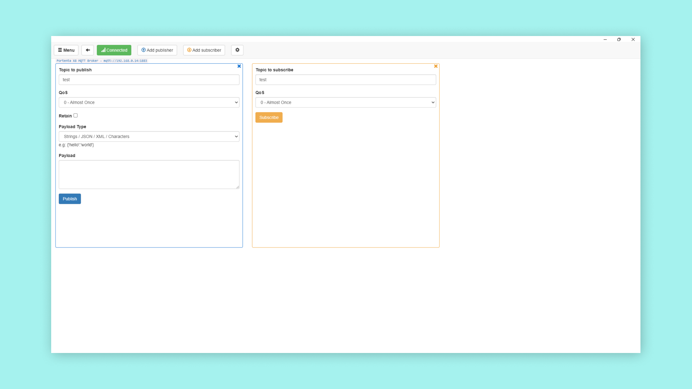

When MQTTBox client connects to the local Mosquitto broker deployed in our Portenta X8 board, a blue "Not Connected" button should change to a green "Connected" button; also, notice that with the MQTTBox client, we are going to publish data to the `test` topic. Now, let's install Node-RED. 

## Installing Node-RED

Node-RED is an open-source programming tool that connects hardware with API's and online services. It is a visual tool designed for Internet of Things devices and applications, but it can also be used for other of applications. The simplest form to run Node-RED with Docker is by using the following command:

```
docker run -it -p 1880:1880 -v node_red_data:/data --name mynodered nodered/node-red    
```

This command will run a Node-RED container **locally** in our Portenta X8 board. Let's dissect the command:

- `-it`: a terminal session is attached to the container so we can see what is happening with the container
- `-p 1880:1880`: Node-RED local port `1880` connects to the exposed internal port `1880` 
- `v node_red_data:/data`: a docker named volume called `node_red_data` is mounted to the container `/data` directory. This permits any changes to the flow to persist
- `--name mynodered`: a friendly local name
- `nodered/node-red`: the image to base it on

After running the command, we should see a running instance of Node-RED in the terminal. The local instance of Node-RED should be ready; let's test it! We can detach the terminal with `Ctrl-p` `Ctrl-q`; this doesn't stop the container; the container will run in the background.

### Testing Node-RED

Let's browse to `http://{your-portenta-ip}:1880`; this will open the Node-RED desktop as shown in the image below:

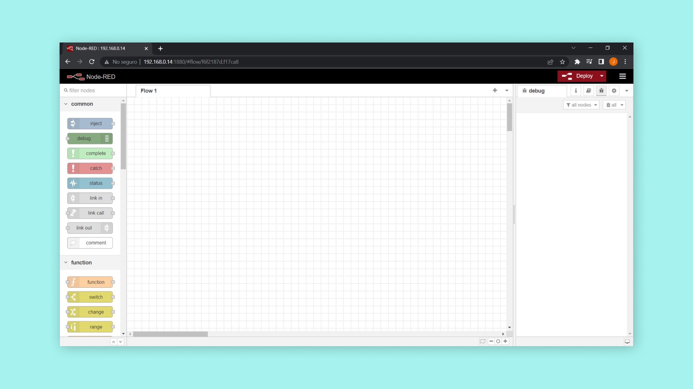

Node-RED desktop is a GUI that lets us work with Node-RED flows graphically. We can test Node-RED  by connecting to the local MQTT broker we set up before using a Node-RED flow. In the `Nodes` section located in the left part of the browser, search for `network` and choose the `mqtt in` node and drop it in the workspace; we will use this node to connect to the local MQTT broker of the X8. To change the node's properties, double-click on it and define the following properties:

- **Server**: `your-portenta-ip:1883`
- **Action**: `Subscribe to single topic`
- **Topic**: `test`
- **QoS**: `0`
- **Output**: `auto-detect (string or buffer)`
- **Name**: `MQTT Broker X8` 

Now, search for the `change` node and drop it in the workspace; we will use this node to change the data format from the MQTT broker (string to number). To change the node's properties, double-click on it and define the following properties:

- **Name**: `String to Number`
- **Set**: `msg.payload`
- **To the value**: `$number(payload)`

Now, let's search for the `debug` node and drop it in the workspace; we will use this node to check if Node-RED is getting data from the `test` topic and if Node-RED is formatting the data correctly. Define the name of the node as `debug` and then connect the nodes as shown in the image below:


After connecting the nodes, we must deploy the Node-RED application by selecting the "Deploy" button on the browser's superior right side. We should see a "Successfully deployed" message if everything is ok, as shown in the image below:

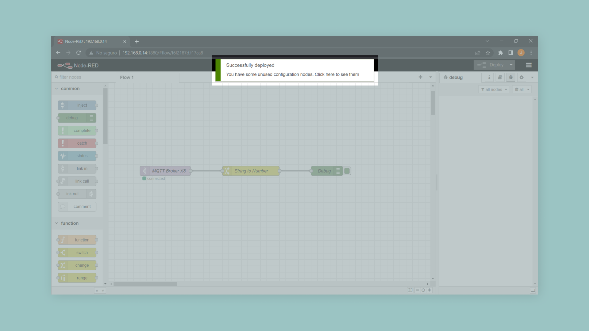

Let's use the MQTT client described before to test the MQTT broker integration with Node-RED. Just beneath the "Deploy" button, look for an **icon with a bug**; **Node-RED's debug interface** is open by clicking on the bug icon. Now we can start sending messages to the local MQTT broker in the X8 and see them deployed in the debug interface of Node-RED. With the MQTT client, let's subscribe first to the `test` topic and then publish any value to the topic, as shown in the image below:


We should now see data in the debug interface of Node-RED, as shown in the image below:

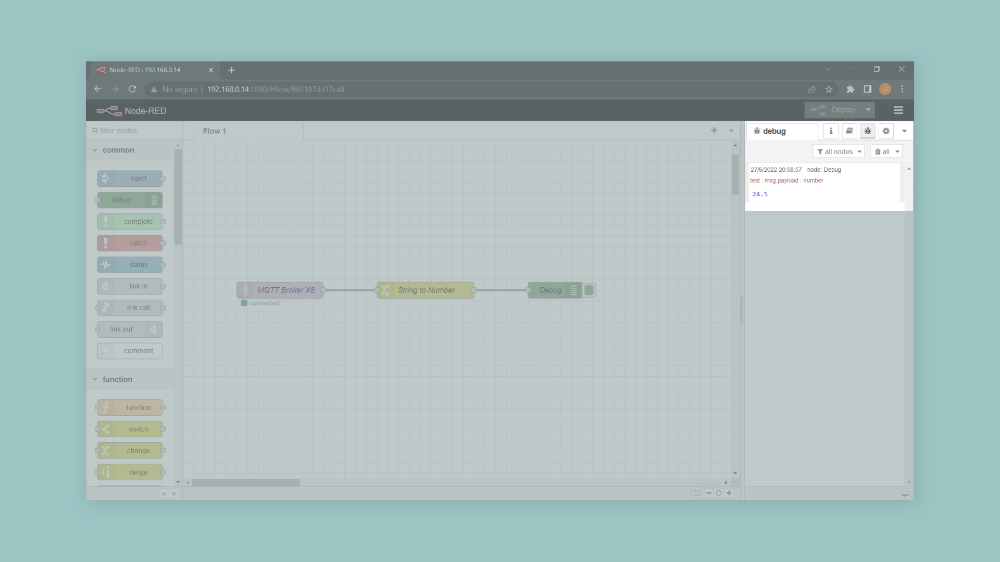

Success! We can now configure now InfluxDB.

## Installing InfluxDB

InfluxDB is an open-source, high-performance, time series database; with InfluxDB data can be written and read in real-time, and data can be processed in the background for extract, transform and load (ETL) purposes or for monitoring and alerting purposes. User dashboards for visualizing and exploring data can also be set up. 

The simplest form to run InfluxDB with Docker is by using the following command:

```
docker run --detach --name influxdb -p 8086:8086 influxdb:2.2.0 
```

This command will run an InfluxDB container **locally** in our Portenta X8 board. Let's dissect the command:

- `--detach`: no terminal session is attached to the container
- `--name`: the container name 
- `-p 1880:1880`: InfluxDB local port `8086` connects to the exposed internal port `8086`

The container should now be running in the background; let's test the local instance of InfluxDB!

### Testing InfluxDB

For testing the local instance of InfluxDB we are going to use its desktop and also Node-RED. Let's browse to `http://{your-portenta-ip}:8086`; this will open the InfluxDB desktop as shown in the image below:

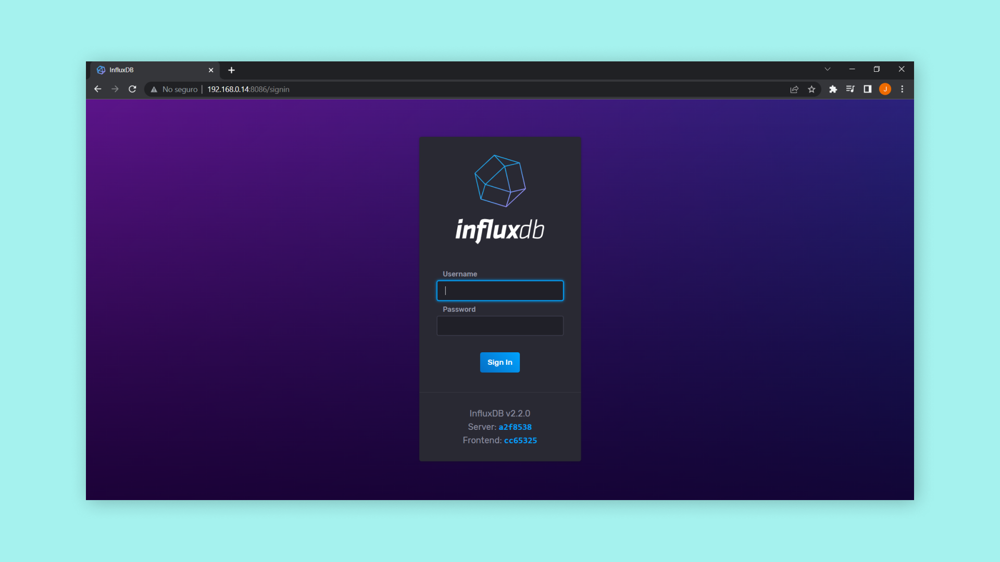

InfluxDB desktop is a GUI that lets us work with InfluxDB graphically. 

***The first time you enter the InfluxDB desktop, a username and a password must be set up.***

After setting up a username and a password, we are going to be redirected to the "Getting Started" page, as shown in the image below:


In this example, we will send data from the MQTT broker to InfluxDB using Node-RED; Node-RED will act as a bridge between the MQTT broker and InfluxDB. Let's go to "Data" we are going to be redirected to the "Load Data" page, as shown in the image below: 

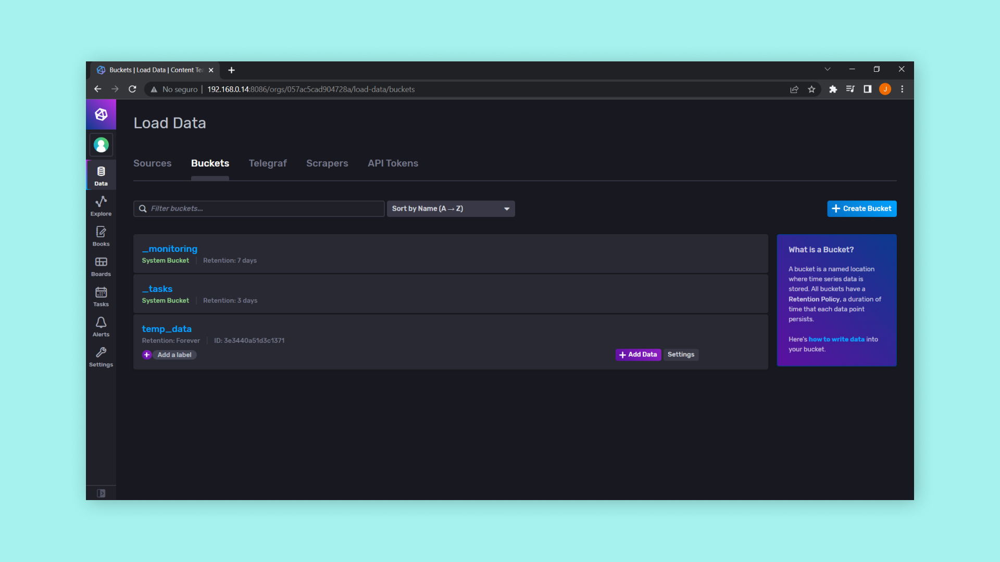

Select "Buckets" and click in the "Create Bucket" button. This will create a new database where data from the MQTT broker will be saved. For this example, let's create a new bucket called `test`; now, we should see the bucket on the InfluxDB desktop:

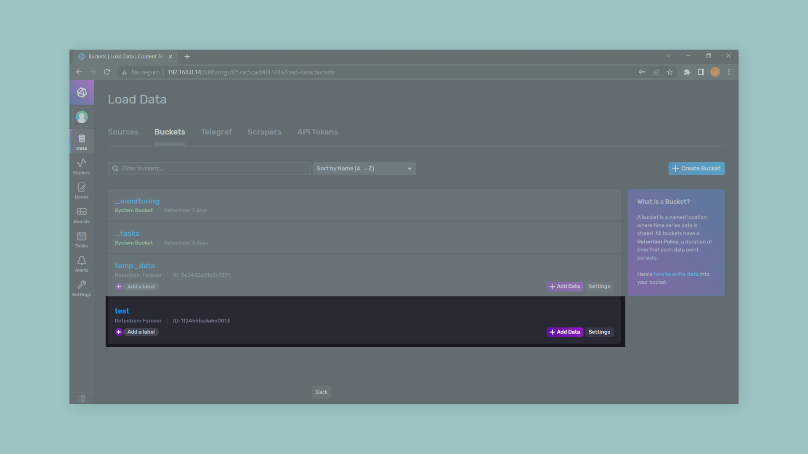

InfluxDB is now ready to receive data; let's send it using an MQTT client and Node-RED. We must first set up Node-RED by installing custom InfluxDB nodes; click on the menu icon on the top right corner of the browser, then click on the "Manage palette" option. This will open a tab where we can see all the palettes/nodes installed in the Node-RED instance running on our X8 board. Click on the "Install" option and search for "InfluxDB"; install the nodes from InfluxDB. Now we should see the InfluxDB nodes installed in our Node-RED instance, as shown in the image below:


Now, search for the `influxdb out` node and drop it in the workspace; we will use this node to send information from the MQTT client to the `test` bucket on InfluxDB. To change the node's properties, double-click on it and define the following properties:

- **Name**: `InfluxDB Bucket`
- **Organization**: Your organization name is defined in InfluxDB
- **Bucket**: `test`
- **Measurement**: `counter` (the name of the measurement you want to record)
- **Time Precision**: Milliseconds (ms)

In the **Server** option, define the following properties:

- **Name**: `Portenta X8`
- **Version**: `2.0`
- **URL**: `http://{your-portenta-ip}:8086`
- **Token**: the one provided by InfluxDB

Now, connect the nodes as shown in the image below:

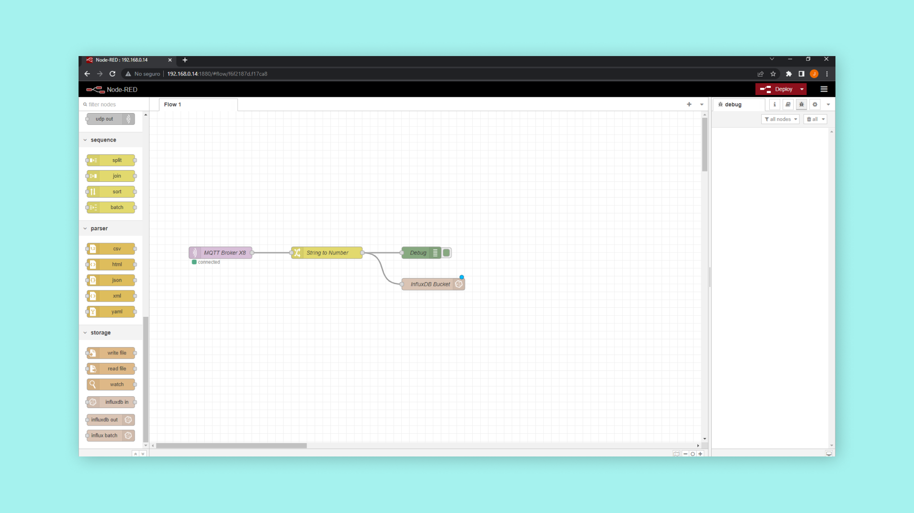

Let's use the MQTT client described before to test the MQTT broker integration with Node-RED and InfluxDB. Remember to first deploy the flow in Node-RED and to subscribe to the `test` topic and publish any value in the MQTT client. Now, go to Data Explorer on the InfluxDB desktop; you should now see data from the MQTT client, as shown in the image below:


Success! We can now configure now Grafana.

## Installing Grafana

Grafana is an open-source, multi-platform data analytics and interactive data visualization solution. Grafana can connect with basically every possible data source, such as InfluxDB.

The simplest form to run Grafana with Docker is by using the following command:

```
docker run -d --name=grafana -p 3000:3000 grafana/grafana
```

This command will run a Grafana container **locally** in our Portenta X8 board. Let's dissect the command:

- `-d`: no terminal session is attached to the container
- `--name`: the container name 
- `-p 3000:3000`: Grafana local port `3000` connects to the exposed internal port `3000`

The container should now be running in the background; let's test the local instance of Grafana!

### Testing Grafana

Before we can visualize data in Grafana, we must add a data source; we will add the InfluxDB bucket we created before as a data source. Select the cog icon on the side menu and then click on "Data Sources":

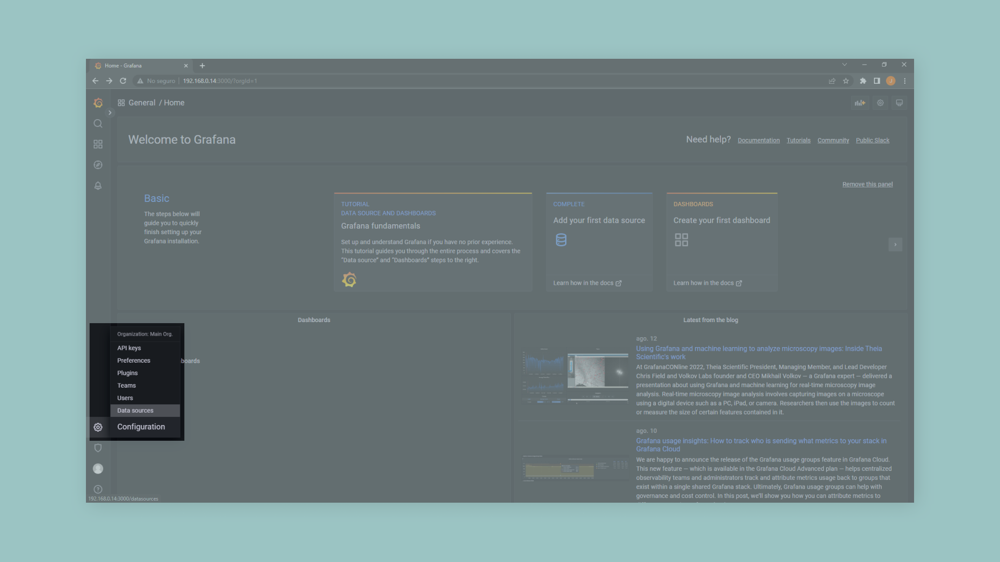

On the "Data Sources" page, select InfluxDB; this will take you to a configuration page:


In the configuration page, enter the following information related to the data bucket we created before on InfluxDB:

- **Name**: `Test Bucket`
- **Query Language**: Flux
- **URL**: `http://{your-portenta-ip}:8086`
- **User**: Your defined username in InfluxDB
- **Password**: Your defined username password in InfluxDB
- **Organization**: Your defined organization name in InfluxDB
- **Token**: the one provided by InfluxDB

Leave the rest of the options as default. Click on the "Save & Test" button; we should see two green messages in the Grafana GUI telling us that the data source was configured correctly, as shown in the image below:

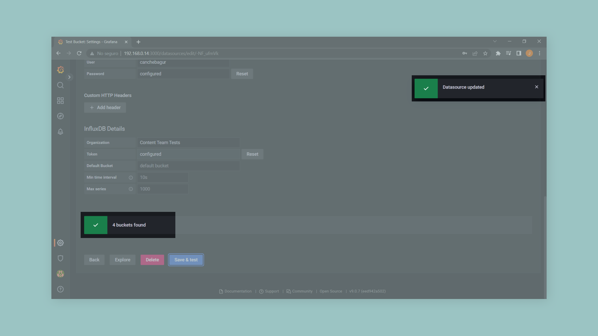

Now, let's go to the InfluxDB desktop. Go to "Data" and select the test bucket we created before; in the bucket data explorer, in the query editor, select the `test` bucket, then in `_measurement` select counter, in `_field` select value, and `WINDOW PERIOD` select last as shown in the image below:

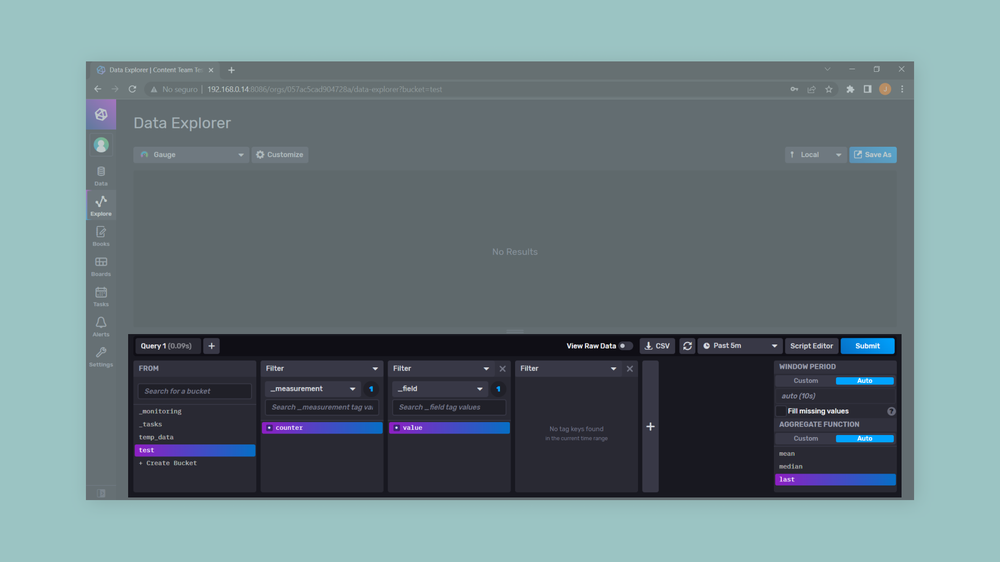

Now, click on "Script Editor" and copy the generated script by InfluxDB; we are going to use this script in Grafana to retrieve information from the `test` bucket, as shown in the image below:

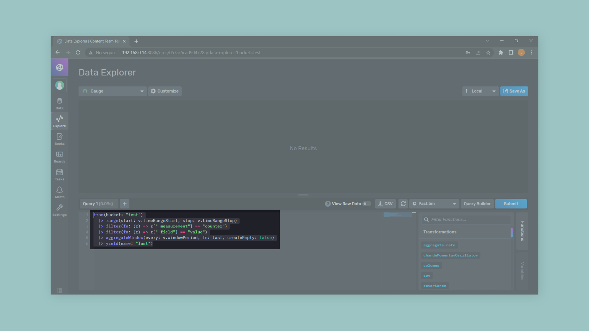

Now, in the Grafana GUI, create a new dashboard and add a new panel; in the configuration page, select as "Data source" the bucket we configured before, `Test Bucket`:

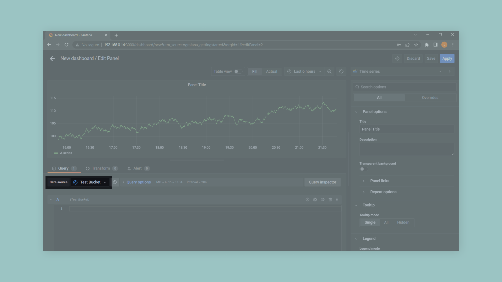

In the "Query inspector," paste the script we generated before with InfluxDB. You should now see data from the tests made earlier with the MQTT client: 


Let's change how data is visualized. Select "Visualizations" and then search for "Gauge" and select it. Now we should visualize data as a gauge in Grafana:

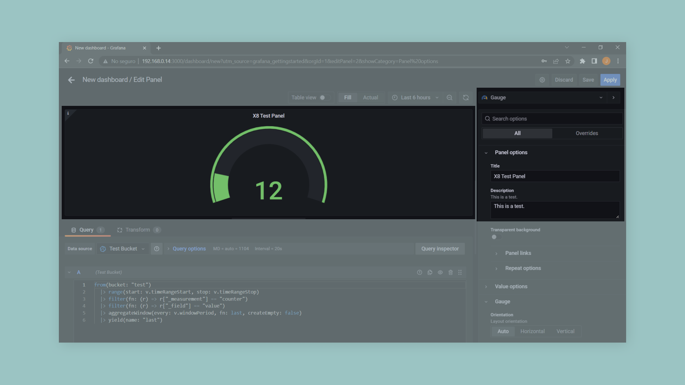

We can change the panel options, such as their title and description. Click on apply; we can now use the MQTT client described before to test the MQTT broker integration with Node-RED, InfluxDB, and Grafana. Remember first to deploy the flow in Node-RED, subscribe to the test topic, and publish any value in the MQTT client. Also, remember to change the dashboard time range and its refresh rate. 

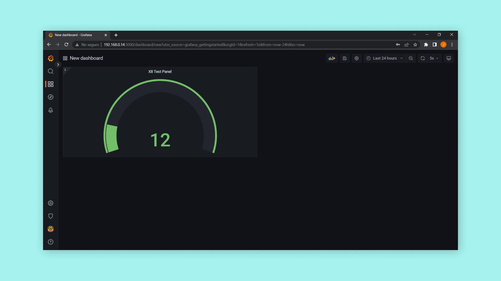

## Sending Data Using the MKR WiFi 1010 Board

Now, it is time to test our entire data logging application. We will use an [MKR WiFi 1010](https://store.arduino.cc/products/arduino-mkr-wifi-1010); this board will periodically send the value of a counter to the Grafana dashboard via the local MQTT broker deployed in the X8.

First, let's ensure we have the require core for the MKR WiFi 1010 installed, the **Arduino SAMD boards (32-bits ARM Cortex M0+)**. Please, refer to [this guide](https://docs.arduino.cc/learn/starting-guide/cores) if you are not familiar with the installation of additional cores in the Arduino IDE. We also need to install the libraries we will use to send data from the MKR WiFi 1010 board to the data logging application via MQTT. Go to **Tools > Manage libraries...**, search for **ArduinoMqttClient** and **WiFiNINA** and install the latest available version of both libraries.

Now, let's open a new sketch and create a new header file called `arduino_secrets.h` in a separate tab; to create a separate tab in the Arduino IDE, click the arrow symbol underneath the Serial Monitor symbol, then click on the "New tab" option. In this header file, we are going to store our Wi-Fi credentials:

```arduino
#define SECRET_SSID "your-ssid"
#define SECRET_PASS "your-password"
```

Now, let's program the following sketch in the MKR WiFi 1010 board:

```arduino
#include <ArduinoMqttClient.h>
#include <WiFiNINA.h>
#include "arduino_secrets.h"

// Wi-Fi information
char ssid[] = SECRET_SSID;        // Your network SSID, stored in the arduino_secrets.h file
char pass[] = SECRET_PASS;        // Your network password, stored in the arduino_secrets.h file
WiFiClient wifiClient;
MqttClient mqttClient(wifiClient);

// MQTT broker information

const char broker[] = "your-portenta-ip";
int        port     = 1883;
const char topic[]  = "test";

// Interval for sending messages (in milliseconds) to the MQTT broker
const long interval = 5000;
unsigned long previousMillis = 0;

// Data to send to the MQTT broker
int count = 0;

void setup() {
  Serial.begin(9600);
  while (!Serial) {
    ; // Wait for serial port to connect, needed for native USB port only
  }

  // Attempt to connect to the defined Wi-Fi network
  Serial.print("- Attempting to connect to WPA SSID: ");
  Serial.println(ssid);

  while (WiFi.begin(ssid, pass) != WL_CONNECTED) {
    // Connection attempt failed, retry again
    Serial.print(".");
    delay(5000);
  }

  Serial.println("- You're connected to the network!");
  Serial.println();
  
  // Attempt to connect to the defined Wi-Fi network
  Serial.print("- Attempting to connect to the MQTT broker: ");
  Serial.println(broker);

  // Connection attempt to the MQTT broker failed
  if (!mqttClient.connect(broker, port)) {
    Serial.println("- MQTT connection failed!");
    Serial.print("- Error code: ");
    Serial.println(mqttClient.connectError());

    while (1);
  }

  Serial.println("- You're connected to the MQTT broker!");
  Serial.println();
}

void loop() {
  // Keep the board connected to the MQTT broker
  mqttClient.poll();

  unsigned long currentMillis = millis();

  if (currentMillis - previousMillis >= interval) {
    // Send the gathered data to an specific topic of the MQTT broker
    previousMillis = currentMillis;
    Serial.print("- Sending message to topic: ");
    Serial.println(topic);
    Serial.print("- ");
    Serial.println(count);
    mqttClient.beginMessage(topic);
    mqttClient.print(count);
    mqttClient.endMessage();
    Serial.println();

    // Update data value    
    count++;
  }
}
```

The sketch shown above connects the MKR WiFi 1010 to the local MQTT broker of the X8 and periodically sends the value of a counter to the topic `test`. 

***Please read [this tutorial](https://docs.arduino.cc/tutorials/mkr-wifi-1010/mqtt-device-to-device#programming-the-publisher) for more in-depth information about MQTT and the MKR WiFi 1010 board.***

If everything is ok, we should see the following in the Serial monitor of the Arduino IDE :


Check out now the Grafana dashboard we configured earlier; we should see data coming from the MKR WiFi 1010 board. 

## Conclusion

In this tutorial, we went through the installation, configuration, and testing of four standard building blocks of Internet-connected data-logging devices and applications. Such blocks are an MQTT broker (Mosquitto), Node-RED, InfluxDB, and Grafana. All this runs locally in the Portenta X8 board and can process data sent from an MKR WiFi 1010 board for a complete data-logging application. With this, we can further scale up your IoT development within a single Portenta X8 of the size of the palm of your hand.

### Next Steps

- What about controlling your house or office and making it domotic?
- Do you have a sensor network that needs to be connected to the Internet to visualize sensor information?

You can use a [Portenta X8](https://store.arduino.cc/products/portenta-x8) board and the IoT-Quartet tutorial for developing this and more projects.