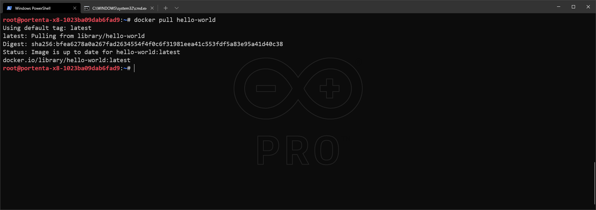

## Overview

[Docker](http://docker.com) Is a platform full of applications, called containers as they are an isolated solution and don't depend on your environment.

You can download, install, use and share applications in the form of containers. The page where you can find all the available containers is hub.docker.com

In this tutorial we will show step-by-step how to install, run and remove the [Hello-World Container](https://hub.docker.com/_/hello-world)

## Goals

- List the installed and running containers
- Install a container
- Run a container manually
- Uninstall a container

### Required Hardware and Software

- [Arduino Portenta X8](https://store.arduino.cc/products/portenta-x8)
- USB-C cable (either USB-C to USB-A or USB-C to USB-C)
- Wi-Fi Access Point with Internet Access
- ADB or SSH. [Check how to connect to your Portenta X8](docs.arduino.cc/tutorials/portenta-x8/out-of-the-box#controlling-portenta-x8-through-the-terminal)

## Using Docker

The Docker CLI is already built-in your Portenta X8 by default you can check the tool is installed by typing
```sh
docker -v
```

***To use this tool, first of all you will need to connect to your device, check [how to connect using adb/ssh](/tutorials/portenta-x8/out-of-the-box#controlling-portenta-x8-through-the-terminal).***

You can check Docker reference documentation, which cover deeply all the features of the tool at [https://docs.docker.com/](docs.docker.com).

The following steps shows how to install, run and uninstall the "Hello World" container.

### Install a container

You will need to find your Docker container, on its Docker hub page it will show you how to install the desired container.

https://hub.docker.com/_/hello-world

```sh
docker pull hello-world
```



### Run the installed container

```sh
docker run hello-world
```


***To be able to see your container with `docker ps -a` you will need to run it atleast once with `docker run`***

### Listing the installed packages
List the installed containers introducing: 
```sh 
docker ps -a
```


Keep in mind that you will need to get the `CONTAINER ID` to uninstall the container afterwards.

If you didn't run your container you can also check if its correctly installed by using 
```sh
docker images
```


### Uninstall a container

First get the Container ID from the container list.

Then use the remove (`rm`) command 
```sh
docker container rm <CONTAINER ID>
```

In this case we run `docker ps -a` and I copied the `CONTAINER_ID` which is `c44ba77b65cb`.

***`CONTAINER_ID` change its value every time you re-install them***


If you run `docker images` again you will see that the container is not showing up anymore.

## Conclusion

In this tutorial you learned how to install a container onto your device, run it and manage it.

### Next Steps

- Now that you have the base of the workflow to use [Docker](https://docker.com), go to its docs page and make sure you understand all the features.
- Look for a container from [Docker hub](http://hub.docker.com), install it and make your own application out of it.
- Create a container to run your custom made application.